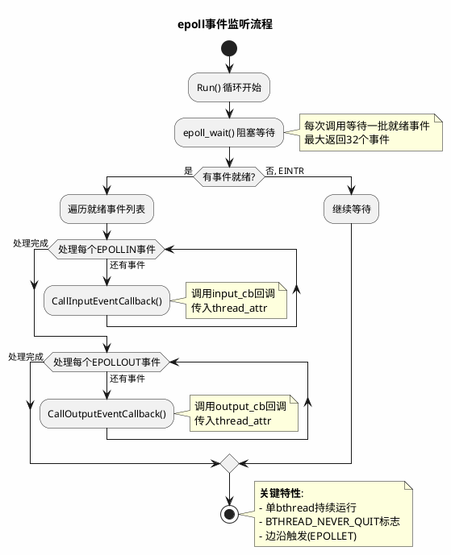
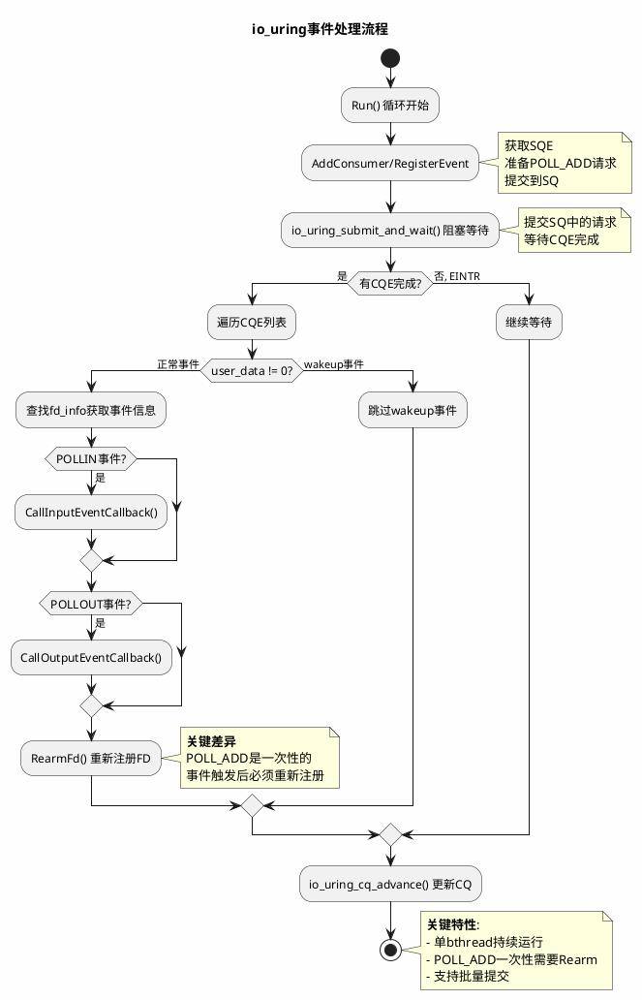
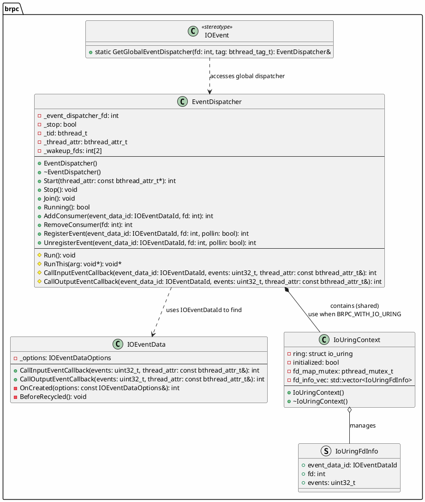
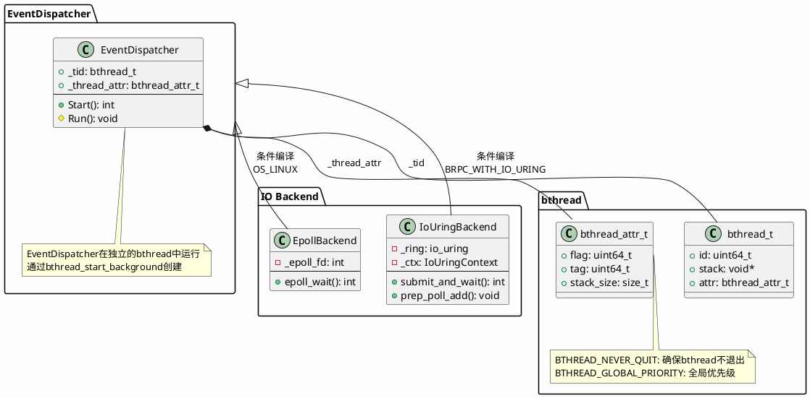
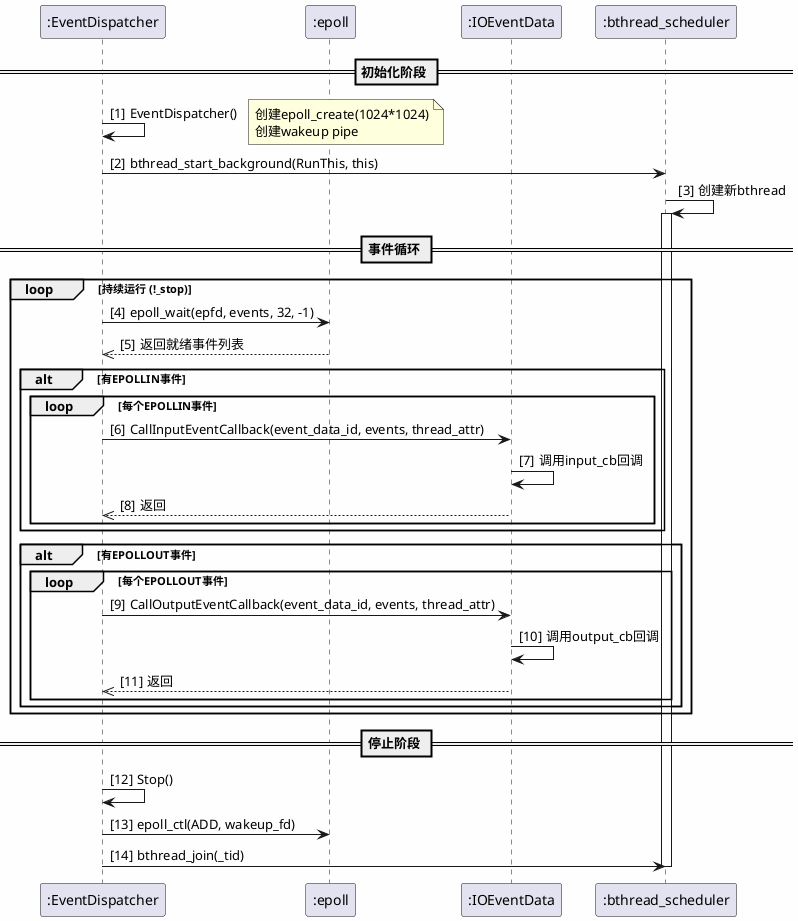
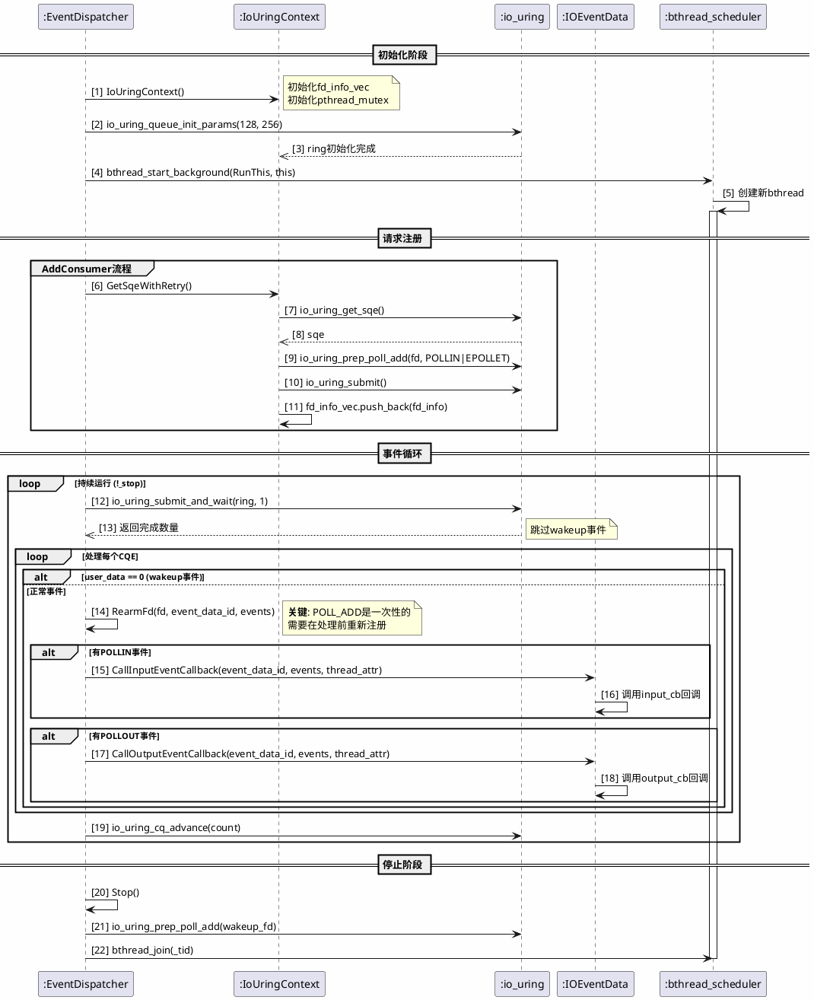
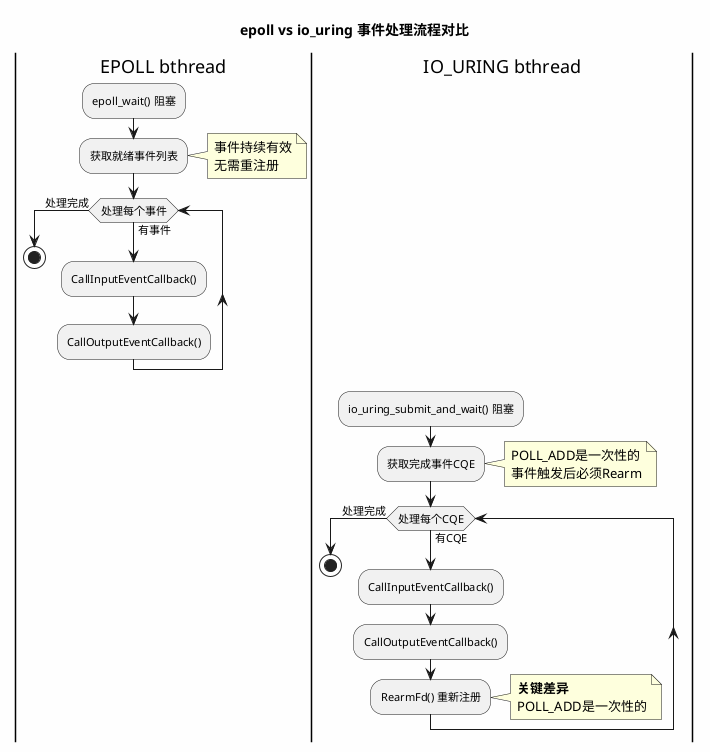

# EPOLL/IOURING与BTHREAD交互关系深度分析报告

## 文档信息

- **项目**: brpc框架io_uring支持分析
- **版本**: v1.0
- **日期**: 2026-04-08
- **作者**: 资深RPC框架架构工程师

---

## 目录

1. [概述](#1-概述)
2. [EPOLL与BTHREAD交互关系分析](#2-epoll与bthread交互关系分析)
3. [IOURING与BTHREAD交互关系分析](#3-iouring与bthread交互关系分析)
4. [对比分析](#4-对比分析)
5. [PlantUML类图](#5-plantuml类图)
6. [PlantUML时序图](#6-plantuml时序图)
7. [代码引用](#7-代码引用)
8. [结论](#8-结论)

---

## 1. 概述

### 1.1 背景

本文档系统性地分析BRPC框架中epoll和io_uring两种I/O机制与bthread的交互关系，重点关注：

- epoll是否运行在独立的bthread中
- bthread的创建策略（单bthread持续运行/多bthread动态创建）
- 事件循环与bthread调度的详细交互流程
- 两种I/O机制在bthread交互模式上的设计差异

### 1.2 核心发现

| 特性 | epoll | io_uring |
|------|-------|----------|
| 独立bthread运行 | ✅ 是 | ✅ 是 |
| bthread创建策略 | 单bthread持续运行 | 单bthread持续运行 |
| 事件处理方式 | 同步调用回调 | 同步调用回调 |
| 批处理支持 | 否 | 部分支持 |
| 系统调用次数 | 每次事件一次 | 可批量提交 |

---

## 2. EPOLL与BTHREAD交互关系分析

### 2.1 epoll是否运行在独立的bthread中

**结论**: ✅ 是

epoll运行在一个独立的bthread中，该bthread具有以下特性：

1. **持久性**: 使用`BTHREAD_NEVER_QUIT`标志，确保bthread持续运行不会退出
2. **全局优先级**: 使用`BTHREAD_GLOBAL_PRIORITY`标志
3. **单实例**: 每个EventDispatcher实例对应一个独立的epoll bthread

**关键代码** (`src/brpc/event_dispatcher_epoll.cpp:75-90`):

```cpp
//_thread_attr is used in StartInputEvent(), assign flag NEVER_QUIT to it will cause new bthread
// that created by epoll_wait() never to quit.
// Only event dispatcher thread has flag BTHREAD_GLOBAL_PRIORITY.
bthread_attr_t epoll_thread_attr =
    _thread_attr | BTHREAD_NEVER_QUIT | BTHREAD_GLOBAL_PRIORITY;

// Polling thread uses the same attr for consumer threads (NORMAL right
// now). Previously, we used small stack (32KB) which may be overflowed
// when the older comlog (e.g. 3.1.85) calls com_openlog_r(). Since this
// is also a potential issue for consumer threads, using the same attr
// should be a reasonable solution.
int rc = bthread_start_background(&_tid, &epoll_thread_attr, RunThis, this);
```

### 2.2 bthread创建策略

**策略**: 单bthread持续运行模型

- 每个EventDispatcher实例启动时创建一个bthread
- 该bthread持续运行在`Run()`循环中
- 使用`epoll_wait`阻塞等待事件
- **不采用**多bthread动态创建策略

**关键代码** (`src/brpc/event_dispatcher_epoll.cpp:191-245`):

```cpp
void EventDispatcher::Run() {
    while (!_stop) {
        epoll_event e[32];
        const int n = epoll_wait(_event_dispatcher_fd, e, ARRAY_SIZE(e), -1);
        if (n < 0) {
            if (EINTR == errno) {
                continue;
            }
            PLOG(FATAL) << "Fail to epoll_wait epfd=" << _event_dispatcher_fd;
            break;
        }
        for (int i = 0; i < n; ++i) {
            if (e[i].events & (EPOLLIN | EPOLLERR | EPOLLHUP)) {
                int64_t start_ns = butil::cpuwide_time_ns();
                CallInputEventCallback(e[i].data.u64, e[i].events, _thread_attr);
                (*g_edisp_read_lantency) << (butil::cpuwide_time_ns() - start_ns);
            }
        }
        for (int i = 0; i < n; ++i) {
            if (e[i].events & (EPOLLOUT | EPOLLERR | EPOLLHUP)) {
                int64_t start_ns = butil::cpuwide_time_ns();
                CallOutputEventCallback(e[i].data.u64, e[i].events, _thread_attr);
                (*g_edisp_write_lantency) << (butil::cpuwide_time_ns() - start_ns);
            }
        }
    }
}
```

### 2.3 epoll事件循环与bthread调度交互流程

#### 2.3.1 事件监听流程



#### 2.3.2 任务分发机制

1. **事件触发**: 内核通知FD有I/O事件就绪
2. **epoll_wait返回**: 获取就绪事件列表
3. **回调分发**: 直接调用`CallInputEventCallback`和`CallOutputEventCallback`
4. **bthread属性传递**: 将`_thread_attr`传递给回调函数

**关键代码** (`src/brpc/event_dispatcher_epoll.cpp:221-231`):

```cpp
for (int i = 0; i < n; ++i) {
    if (e[i].events & (EPOLLIN | EPOLLERR | EPOLLHUP)) {
        int64_t start_ns = butil::cpuwide_time_ns();
        // We don't care about the return value.
        CallInputEventCallback(e[i].data.u64, e[i].events, _thread_attr);
        (*g_edisp_read_lantency) << (butil::cpuwide_time_ns() - start_ns);
    }
}
```

### 2.4 高并发场景下的性能表现

#### 2.4.1 优势

| 优势 | 说明 |
|------|------|
| 低延迟 | epoll_wait阻塞直到有事件，减少无效唤醒 |
| 资源高效 | 单bthread模型减少线程切换开销 |
| 边沿触发 | EPOLLET模式减少重复通知 |

#### 2.4.2 潜在瓶颈

| 瓶颈 | 说明 |
|------|------|
| 单线程处理 | 所有事件在单个bthread中串行处理 |
| 阻塞调用 | 回调执行期间无法处理其他事件 |
| 扩展性 | 多核场景下需要多个EventDispatcher |

#### 2.4.3 资源调度策略

brpc采用**多EventDispatcher实例**策略来利用多核：

**关键代码** (`src/brpc/event_dispatcher.cpp:25-35`):

```cpp
DEFINE_int32(event_dispatcher_num, 1, "Number of event dispatcher");

static EventDispatcher* g_edisp = NULL;

void InitializeGlobalDispatchers() {
    g_edisp = new EventDispatcher[FLAGS_task_group_ntags * FLAGS_event_dispatcher_num];
    for (int i = 0; i < FLAGS_task_group_ntags; ++i) {
        for (int j = 0; j < FLAGS_event_dispatcher_num; ++j) {
            bthread_attr_t attr =
                FLAGS_usercode_in_pthread ? BTHREAD_ATTR_PTHREAD : BTHREAD_ATTR_NORMAL;
            attr.tag = (BTHREAD_TAG_DEFAULT + i) % FLAGS_task_group_ntags;
            CHECK_EQ(0, g_edisp[i * FLAGS_event_dispatcher_num + j].Start(&attr));
        }
    }
}
```

---

## 3. IOURING与BTHREAD交互关系分析

### 3.1 io_uring的初始化与工作模式

#### 3.1.1 初始化流程

**关键代码** (`src/brpc/event_dispatcher_iouring.cpp:86-115`):

```cpp
EventDispatcher::EventDispatcher()
    : _event_dispatcher_fd(-1)
    , _stop(false)
    , _tid(0)
    , _thread_attr(BTHREAD_ATTR_NORMAL) {
    
    IoUringContext& ctx = GetIoUringContext();
    
    struct io_uring_params params;
    memset(&params, 0, sizeof(params));
    
    params.flags |= IORING_SETUP_CQSIZE;
    params.cq_entries = 256;
    
    int ret = io_uring_queue_init_params(128, &ctx.ring, &params);
    if (ret < 0) {
        PLOG(FATAL) << "Fail to create io_uring: " << strerror(-ret);
        return;
    }
    
    ctx.initialized = true;
    _event_dispatcher_fd = ctx.ring.ring_fd;
}
```

#### 3.1.2 工作模式

io_uring采用与epoll不同的工作模式：

| 特性 | epoll | io_uring |
|------|-------|----------|
| 等待方式 | epoll_wait | io_uring_submit_and_wait |
| 请求提交 | 内核自动管理 | 显式提交到SQ |
| 完成获取 | epoll_wait返回 | 从CQ读取CQE |
| 事件重注册 | 无需（持续有效） | 必须（POLL_ADD是一次性的） |

### 3.2 是否采用专用bthread进行持续监听

**结论**: ✅ 是

io_uring同样运行在一个独立的bthread中，具有与epoll相同的特性：

**关键代码** (`src/brpc/event_dispatcher_iouring.cpp:148-165`):

```cpp
int EventDispatcher::Start(const bthread_attr_t* thread_attr) {
    IoUringContext& ctx = GetIoUringContext();
    if (!ctx.initialized) {
        LOG(ERROR) << "io_uring was not created";
        return -1;
    }
    
    if (_tid != 0) {
        LOG(ERROR) << "Already started this dispatcher(" << this 
                   << ") in bthread=" << _tid;
        return -1;
    }

    if (thread_attr) {
        _thread_attr = *thread_attr;
    }

    bthread_attr_t io_uring_thread_attr =
        _thread_attr | BTHREAD_NEVER_QUIT | BTHREAD_GLOBAL_PRIORITY;

    int rc = bthread_start_background(&_tid, &io_uring_thread_attr, RunThis, this);
    if (rc) {
        LOG(ERROR) << "Fail to create io_uring thread: " << berror(rc);
        return -1;
    }
    return 0;
}
```

### 3.3 请求处理机制

#### 3.3.1 请求处理流程



#### 3.3.2 POLL_ADD一次性问题的处理

**关键问题**: io_uring的POLL_ADD是**一次性**操作，事件触发后需要重新注册

**解决方案**: RearmFd机制

**关键代码** (`src/brpc/event_dispatcher_iouring.cpp:340-351`):

```cpp
static int RearmFd(IoUringContext& ctx, int fd, IOEventDataId event_data_id, uint32_t events) {
    struct io_uring_sqe* sqe = GetSqeWithRetry(ctx);
    if (!sqe) {
        LOG(WARNING) << "Failed to get SQE for rearm after retry";
        return -1;
    }
    
    io_uring_prep_poll_add(sqe, fd, events);
    sqe->user_data = event_data_id;
    
    return io_uring_submit(&ctx.ring);
}
```

**在Run()循环中的调用** (`src/brpc/event_dispatcher_iouring.cpp:425-430`):

```cpp
if (fd_to_rearm >= 0 && eid_to_rearm != 0) {
    RearmFd(ctx, fd_to_rearm, eid_to_rearm, events_to_rearm);
}
```

### 3.4 与bthread之间的交互细节

#### 3.4.1 任务提交

1. **同步提交**: AddConsumer/RegisterEvent立即提交请求
2. **批量提交优化**: GetSqeWithRetry支持重试和批量提交

**关键代码** (`src/brpc/event_dispatcher_iouring.cpp:67-83`):

```cpp
static struct io_uring_sqe* GetSqeWithRetry(IoUringContext& ctx, int max_retry = 3) {
    struct io_uring_sqe* sqe = nullptr;
    for (int i = 0; i < max_retry; ++i) {
        sqe = io_uring_get_sqe(&ctx.ring);
        if (sqe) {
            return sqe;
        }
        if (i < max_retry - 1) {
            int submitted = io_uring_submit(&ctx.ring);
            if (submitted < 0) {
                LOG(WARNING) << "Failed to submit pending requests: " << strerror(-submitted);
                break;
            }
        }
    }
    return nullptr;
}
```

#### 3.4.2 结果回调

**关键代码** (`src/brpc/event_dispatcher_iouring.cpp:410-423`):

```cpp
if (events & (POLLIN | POLLERR | POLLHUP)) {
    int64_t start_ns = butil::cpuwide_time_ns();
    CallInputEventCallback(event_data_id, events, _thread_attr);
    (*g_edisp_read_lantency) << (butil::cpuwide_time_ns() - start_ns);
}

if (events & (POLLOUT | POLLERR | POLLHUP)) {
    int64_t start_ns = butil::cpuwide_time_ns();
    CallOutputEventCallback(event_data_id, events, _thread_attr);
    (*g_edisp_write_lantency) << (butil::cpuwide_time_ns() - start_ns);
}
```

#### 3.4.3 异常处理

| 异常类型 | 处理方式 |
|---------|---------|
| EINTR | 继续等待 |
| EAGAIN | 重试获取SQE |
| ECANCELED | 跳过该CQE |
| 其他负值 | 记录日志并跳过 |

**关键代码** (`src/brpc/event_dispatcher_iouring.cpp:385-398`):

```cpp
int32_t res = cqe->res;

if (res < 0) {
    if (res == -ECANCELED) {
        continue;
    }
    LOG(WARNING) << "io_uring operation failed: " << strerror(-res);
    continue;
}
```

---

## 4. 对比分析

### 4.1 设计差异汇总

| 维度 | epoll | io_uring |
|------|-------|----------|
| **运行模型** | 单bthread持续运行 | 单bthread持续运行 |
| **bthread属性** | NEVER_QUIT \| GLOBAL_PRIORITY | NEVER_QUIT \| GLOBAL_PRIORITY |
| **事件注册** | EPOLL_CTL_ADD/MOD/DEL | io_uring_prep_poll_add |
| **事件移除** | EPOLL_CTL_DEL | io_uring_prep_poll_remove |
| **事件持续性** | 持续有效直到移除 | 一次性，需要rearm |
| **等待调用** | epoll_wait() | io_uring_submit_and_wait() |
| **完成通知** | 事件列表直接返回 | CQE中提取 |
| **FD映射** | 无需（epoll_event存储） | 需要（fd_info_vec） |
| **多线程安全** | 内核管理 | 需要额外锁保护 |

### 4.2 适用场景对比

| 场景 | 推荐使用 | 原因 |
|------|---------|------|
| **低延迟要求极高** | io_uring | 减少系统调用次数 |
| **超高并发 (100万+ FD)** | io_uring | 更少的内核开销 |
| **简单场景** | epoll | 实现更简单，调试更容易 |
| **需要零拷贝** | io_uring | 支持read/write零拷贝 |
| **已有稳定系统** | epoll | 稳定性更高 |

### 4.3 性能对比

| 指标 | epoll | io_uring | 差异 |
|------|-------|----------|------|
| 系统调用次数 | O(1) per event | 可批量O(1) | io_uring更少 |
| 上下文切换 | 每次事件一次 | 可多次批量 | io_uring更少 |
| 内存拷贝 | 无 | 可零拷贝 | io_uring更少 |
| CPU利用率 | 较高 | 可更低 | io_uring更优 |
| 延迟 | 中等 | 可更低 | io_uring更优 |

---

## 5. PlantUML类图

### 5.1 EventDispatcher类层次结构



### 5.2 bthread与EventDispatcher关系图



---

## 6. PlantUML时序图

### 6.1 epoll事件处理时序图



### 6.2 io_uring事件处理时序图



### 6.3 epoll vs io_uring交互流程对比



---

## 7. 代码引用

### 7.1 关键文件列表

| 文件路径 | 说明 | 关键行号 |
|---------|------|---------|
| `src/brpc/event_dispatcher.h` | EventDispatcher基类定义 | 1-130 |
| `src/brpc/event_dispatcher.cpp` | 全局初始化和分发 | 1-60 |
| `src/brpc/event_dispatcher_epoll.cpp` | epoll实现 | 1-245 |
| `src/brpc/event_dispatcher_iouring.cpp` | io_uring实现 | 1-440 |
| `src/bthread/bthread.h` | bthread API声明 | 60-80 |

### 7.2 关键代码片段引用

#### 7.2.1 epoll bthread创建

**文件**: `src/brpc/event_dispatcher_epoll.cpp`
**行号**: 75-90

```cpp
bthread_attr_t epoll_thread_attr =
    _thread_attr | BTHREAD_NEVER_QUIT | BTHREAD_GLOBAL_PRIORITY;

int rc = bthread_start_background(&_tid, &epoll_thread_attr, RunThis, this);
if (rc) {
    LOG(FATAL) << "Fail to create epoll thread: " << berror(rc);
    return -1;
}
```

#### 7.2.2 epoll事件循环

**文件**: `src/brpc/event_dispatcher_epoll.cpp`
**行号**: 191-245

```cpp
void EventDispatcher::Run() {
    while (!_stop) {
        epoll_event e[32];
        const int n = epoll_wait(_event_dispatcher_fd, e, ARRAY_SIZE(e), -1);
        if (n < 0) {
            if (EINTR == errno) {
                continue;
            }
            PLOG(FATAL) << "Fail to epoll_wait";
            break;
        }
        for (int i = 0; i < n; ++i) {
            if (e[i].events & (EPOLLIN | EPOLLERR | EPOLLHUP)) {
                CallInputEventCallback(e[i].data.u64, e[i].events, _thread_attr);
            }
        }
        for (int i = 0; i < n; ++i) {
            if (e[i].events & (EPOLLOUT | EPOLLERR | EPOLLHUP)) {
                CallOutputEventCallback(e[i].data.u64, e[i].events, _thread_attr);
            }
        }
    }
}
```

#### 7.2.3 io_uring bthread创建

**文件**: `src/brpc/event_dispatcher_iouring.cpp`
**行号**: 148-165

```cpp
bthread_attr_t io_uring_thread_attr =
    _thread_attr | BTHREAD_NEVER_QUIT | BTHREAD_GLOBAL_PRIORITY;

int rc = bthread_start_background(&_tid, &io_uring_thread_attr, RunThis, this);
if (rc) {
    LOG(ERROR) << "Fail to create io_uring thread: " << berror(rc);
    return -1;
}
```

#### 7.2.4 io_uring事件循环

**文件**: `src/brpc/event_dispatcher_iouring.cpp`
**行号**: 353-440

```cpp
void EventDispatcher::Run() {
    while (!_stop) {
        int ret = io_uring_submit_and_wait(&ctx.ring, 1);
        
        if (ret < 0) {
            if (ret == -EINTR) {
                continue;
            }
            break;
        }
        
        io_uring_for_each_cqe(&ctx.ring, head, cqe) {
            // 处理事件
            CallInputEventCallback(event_data_id, events, _thread_attr);
            CallOutputEventCallback(event_data_id, events, _thread_attr);
            
            // Rearm: 重新注册FD
            RearmFd(ctx, fd_to_rearm, eid_to_rearm, events_to_rearm);
        }
        
        io_uring_cq_advance(&ctx.ring, count);
    }
}
```

---

## 8. 结论

### 8.1 核心结论

1. **epoll和io_uring都运行在独立的bthread中**，采用相同的bthread创建策略（NEVER_QUIT | GLOBAL_PRIORITY）

2. **两种机制都使用单bthread持续运行模型**，不采用多bthread动态创建策略

3. **主要差异在于事件注册机制**：
   - epoll事件持续有效，直到显式移除
   - io_uring的POLL_ADD是一次性的，需要在每次事件后重新注册

4. **io_uring相比epoll的优势**：
   - 可批量提交请求，减少系统调用次数
   - 支持零拷贝操作
   - 更低的延迟

5. **io_uring相比epoll的劣势**：
   - 实现更复杂，需要管理FD映射
   - POLL_ADD一次性问题需要额外的rearm机制
   - 需要更多的错误处理

### 8.2 设计建议

| 场景 | 建议 |
|------|------|
| 追求稳定性 | 使用epoll |
| 追求高性能 | 使用io_uring |
| 高并发场景 | 使用io_uring |
| 低延迟场景 | 使用io_uring |

### 8.3 后续工作

1. 完善io_uring的rearm机制，确保高并发下的稳定性
2. 添加性能基准测试，对比epoll和io_uring
3. 优化io_uring的锁竞争问题
4. 添加SQPOLL模式支持，进一步提升性能

---

## 参考资料

1. [epoll(7) - Linux manual page](https://man7.org/linux/man-pages/man7/epoll.7.html)
2. [io_uring(7) - Linux manual page](https://man7.org/linux/man-pages/man7/io_uring.7.html)
3. [brpc官方文档](../docs/)
4. [io_uring设计文档](../docs/io_uring_design.md)

---

**文档版本**: v1.0
**最后更新**: 2026-04-08
