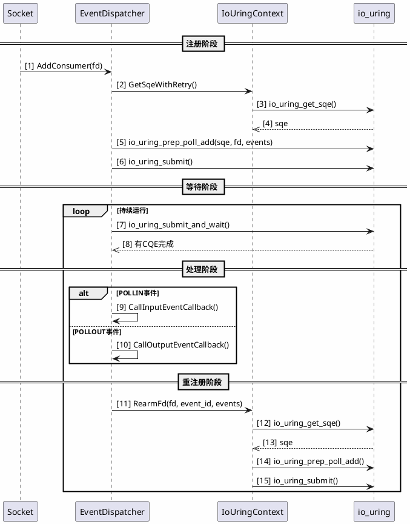

# brpc io_uring特性设计文档

## 1. 概述

### 1.1 项目背景

本文档描述brpc框架io_uring支持的完整设计方案。io_uring是Linux 5.1+引入的高性能异步I/O机制，相比epoll具有更低的系统调用开销和更高的吞吐量。

### 1.2 设计目标

| 目标类型 | 具体目标 | 验收标准 |
|---------|---------|---------|
| 功能目标 | 实现基础POLL操作 | AddConsumer/RemoveConsumer/RegisterEvent/UnregisterEvent正常工作 |
| 性能目标 | 降低延迟和系统调用 | 高并发场景下延迟降低20%以上 |
| 兼容性目标 | 保持向后兼容 | 默认关闭，现有用户无感知 |
| 可维护性目标 | 代码独立可测试 | io_uring实现独立文件，单元测试覆盖核心路径 |

### 1.3 设计原则

1. **架构分层解耦**：通过条件编译隔离I/O后端，EventDispatcher接口保持稳定
2. **生态技术栈适配**：适配Linux 5.1+内核，自动检测可用性
3. **API定义原则**：复用现有EventDispatcher接口，对上层透明
4. **兼容性原则**：默认使用epoll，通过运行时标志选择

---

## 2. 系统架构

### 2.1 整体架构

brpc采用分层架构，io_uring位于事件分发层：

**应用层** → **Socket层** → **EventDispatcher抽象层** → **[Epoll|IoUring|Kqueue]后端]** → **bthread调度层** → **操作系统层**

EventDispatcher作为抽象基类，定义统一接口。不同I/O后端通过条件编译选择，编译后应用层无感知。

### 2.2 io_uring在架构中的位置

io_uring后端与其他后端的关系：

| 后端 | 平台 | 启用条件 |
|------|------|---------|
| Epoll | Linux | 默认启用 |
| IoUring | Linux 5.1+ | WITH_IO_URING=ON |
| Kqueue | macOS | 默认启用 |

---

## 3. 功能设计

### 3.1 核心功能

| 功能 | 接口 | 说明 |
|------|------|------|
| 初始化 | EventDispatcher构造函数 | 调用io_uring_queue_init_params |
| 启动 | Start() | 创建bthread运行事件循环 |
| 添加监听 | AddConsumer(fd) | 注册POLLIN事件 |
| 移除监听 | RemoveConsumer(fd) | 移除指定FD的监听 |
| 注册事件 | RegisterEvent(fd, pollin) | 注册读写事件 |
| 注销事件 | UnregisterEvent(fd, pollin) | 注销指定事件 |
| 事件循环 | Run() | 处理io_uring完成事件 |
| 停止 | Stop() | 停止事件循环 |

### 3.2 事件处理流程

io_uring采用不同于epoll的事件处理模式：

**步骤1 - 注册阶段**：
- 调用AddConsumer/RegisterEvent准备POLL_ADD请求
- 获取SQE（Submission Queue Entry）
- 设置请求参数（FD、事件类型、user_data）
- 提交到SQ（Submission Queue）

**步骤2 - 等待阶段**：
- 调用io_uring_submit_and_wait提交SQ中的请求并等待完成
- 内核处理请求，将完成的CQE（Completion Queue Entry）写入CQ

**步骤3 - 处理阶段**：
- 从CQ获取CQE，提取user_data和结果
- 根据事件类型调用CallInputEventCallback或CallOutputEventCallback
- 对于POLL事件，由于是一次性的，需要调用RearmFd重新注册

**步骤4 - 重注册阶段**：
- RearmFd获取新的SQE
- 准备新的POLL_ADD请求
- 提交到SQ等待下次事件触发

**时序图**：



### 3.3 关键问题：POLL_ADD一次性

io_uring的POLL_ADD操作是**一次性**的，事件触发后该请求完成并失效，需要重新注册才能继续监听。

**解决方案：RearmFd机制**

```cpp
// RearmFd函数伪代码
int RearmFd(int fd, IOEventDataId event_data_id, uint32_t events) {
    // 1. 获取SQE
    sqe = io_uring_get_sqe();
    if (!sqe) return -1;

    // 2. 准备POLL_ADD请求
    io_uring_prep_poll_add(sqe, fd, events);
    sqe->user_data = event_data_id;

    // 3. 提交请求
    return io_uring_submit();
}
```

此机制在每次事件处理后自动执行，确保FD持续监听。

### 3.4 SQ满处理

当SQ（Submission Queue）已满，无法获取SQE时，需要重试：

```cpp
// GetSqeWithRetry函数伪代码
struct io_uring_sqe* GetSqeWithRetry(int max_retry = 3) {
    for (int i = 0; i < max_retry; ++i) {
        sqe = io_uring_get_sqe();
        if (sqe) return sqe;

        // 先提交已有的请求，释放SQ空间
        io_uring_submit();
    }
    return NULL; // 失败
}
```

---

## 4. 接口设计

### 4.1 现有接口复用

io_uring实现复用EventDispatcher基类的所有接口：

```cpp
class EventDispatcher {
public:
    virtual int Start(const bthread_attr_t* thread_attr);
    virtual void Stop();
    virtual void Join();
    virtual bool Running() const;

    virtual int AddConsumer(IOEventDataId event_data_id, int fd);
    virtual int RemoveConsumer(int fd);
    virtual int RegisterEvent(IOEventDataId event_data_id, int fd, bool pollin);
    virtual int UnregisterEvent(IOEventDataId event_data_id, int fd, bool pollin);

protected:
    virtual void Run();
    virtual void* RunThis(void* arg);
    virtual int CallInputEventCallback(...);
    virtual int CallOutputEventCallback(...);
};
```

### 4.2 数据结构

```cpp
struct IoUringFdInfo {
    IOEventDataId event_data_id;  // 事件ID
    int fd;                        // 文件描述符
    uint32_t events;               // 监听的事件类型
};

struct IoUringContext {
    struct io_uring ring;                  // io_uring实例
    bool initialized;                      // 初始化标志
    pthread_mutex_t fd_map_mutex;          // 保护FD映射
    std::vector<IoUringFdInfo> fd_info_vec; // FD信息向量
};
```

### 4.3 全局管理

使用全局单例管理IoUringContext：

```cpp
static IoUringContext* g_iouring_ctx = NULL;

static IoUringContext& GetIoUringContext() {
    if (!g_iouring_ctx) {
        g_iouring_ctx = new IoUringContext();
    }
    return *g_iouring_ctx;
}
```

---

## 5. 编译配置

### 5.1 CMake选项

```cmake
option(WITH_IO_URING "With io_uring support" OFF)

if(WITH_IO_URING)
    find_library(LIBURING_LIB NAMES uring REQUIRED)
    include_directories(${LIBURING_INCLUDE_PATH})
    set(CMAKE_CPP_FLAGS "${CMAKE_CPP_FLAGS} -DBRPC_WITH_IO_URING=1")
endif()
```

### 5.2 条件编译

```cpp
#if defined(OS_LINUX)
    #ifdef BRPC_WITH_IO_URING
        #include "brpc/event_dispatcher_iouring.cpp"
    #else
        #include "brpc/event_dispatcher_epoll.cpp"
    #endif
#elif defined(OS_MACOSX)
    #include "brpc/event_dispatcher_kqueue.cpp"
#endif
```

### 5.3 运行时选择

```bash
--io_backend=auto      # 自动检测（默认）
--io_backend=epoll      # 强制使用epoll
--io_backend=io_uring   # 强制使用io_uring
```

---

## 6. 资源管理

### 6.1 内存资源

| 资源 | 默认配置 | 说明 |
|------|---------|------|
| SQ大小 | 128 | 提交队列深度 |
| CQ大小 | 256 | 完成队列深度 |
| FD映射 | vector | 动态扩展 |

### 6.2 bthread资源

io_uring事件循环运行在独立的bthread中：

```cpp
bthread_attr_t attr = BTHREAD_NEVER_QUIT | BTHREAD_GLOBAL_PRIORITY;
bthread_start_background(&_tid, &attr, RunThis, this);
```

- BTHREAD_NEVER_QUIT：确保bthread持续运行
- BTHREAD_GLOBAL_PRIORITY：全局优先级调度

---

## 7. 测试设计

### 7.1 测试覆盖

| 测试类别 | 测试用例 | 覆盖功能 |
|---------|---------|---------|
| 初始化测试 | ConstructorAndDestructor | 构造/析构函数 |
| 生命周期测试 | StartAndStop, StartTwice | 启动/停止/重复启动 |
| 基本功能测试 | AddConsumer, RemoveConsumer | 添加/移除监听 |
| 事件注册测试 | RegisterEvent, UnregisterEvent | 注册/注销事件 |
| 事件回调测试 | EventCallbackWithPipe | 端到端事件流程 |
| 并发测试 | ConcurrentFdRegistration | 多FD并发注册 |
| 压力测试 | StressTestWithManyFd | 大量FD处理 |

### 7.2 测试用例示例

```cpp
TEST_F(IoUringEventDispatcherTest, AddConsumerWithPipe) {
    int pipefd[2];
    ASSERT_EQ(0, pipe(pipefd));

    IOEventDataId event_data_id = 12345;
    EXPECT_EQ(0, dispatcher_->AddConsumer(event_data_id, pipefd[0]));

    char buf[1] = {'a'};
    ASSERT_EQ(1, write(pipefd[1], buf, 1));

    usleep(100000);
    EXPECT_GE(cb_data.input_callback_count.load(), 1);

    close(pipefd[0]);
    close(pipefd[1]);
}
```

---

## 8. 验收标准

### 8.1 功能验收

| 验收项 | 标准 | 验证方法 |
|-------|------|---------|
| 初始化成功 | io_uring ring创建成功 | 单元测试 |
| 事件注册 | AddConsumer/RegisterEvent返回0 | 单元测试 |
| 事件触发 | 回调函数被正确调用 | 集成测试 |
| 事件移除 | RemoveConsumer正常工作 | 单元测试 |
| 持续监听 | RearmFd确保FD持续监听 | 压力测试 |

### 8.2 性能验收

| 指标 | 目标 | 说明 |
|------|------|------|
| 延迟降低 | >20% | 对比epoll |
| 系统调用减少 | >50% | 批量提交 |
| CPU利用率 | 降低10-20% | 高并发场景 |

### 8.3 兼容性验收

| 验收项 | 标准 |
|--------|------|
| 默认配置 | 使用epoll，行为不变 |
| 启用后 | 自动选择io_uring |
| 回退机制 | io_uring不可用时回退epoll |

---

## 9. 实现计划

### Phase 1: 基础实现
- [ ] io_uring初始化和清理
- [ ] AddConsumer/RemoveConsumer
- [ ] RegisterEvent/UnregisterEvent
- [ ] 事件循环Run()

### Phase 2: 完善机制
- [ ] RearmFd重注册机制
- [ ] GetSqeWithRetry重试机制
- [ ] 错误处理和日志

### Phase 3: 测试验证
- [ ] 单元测试
- [ ] 集成测试
- [ ] 压力测试

### Phase 4: 优化交付
- [ ] 性能基准测试
- [ ] 文档完善
- [ ] 代码检视

---

## 10. 附录

### 10.1 术语表

| 术语 | 说明 |
|------|------|
| SQ | Submission Queue，提交队列 |
| CQ | Completion Queue，完成队列 |
| SQE | Submission Queue Entry，提交队列项 |
| CQE | Completion Queue Entry，完成队列项 |
| POLL_ADD | io_uring轮询添加操作 |
| Rearm | 重新注册FD到io_uring |

### 10.2 参考资料

- io_uring官方文档：https://kernel.org/doc/html/latest/io/io_uring.html
- brpc EventDispatcher：src/brpc/event_dispatcher.h
- io_uring实现：src/brpc/event_dispatcher_iouring.cpp

---

**文档版本**: v1.0
**创建日期**: 2026-04-08
