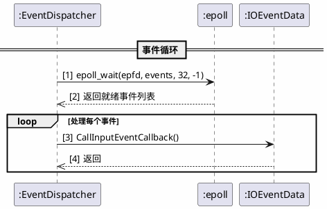

# Prompt模板能力与AI特性设计文档

## 文档信息

- **文档名称**: Prompt模板能力与AI特性设计文档
- **版本**: v1.0
- **日期**: 2026-04-08
- **项目**: brpc框架io_uring支持
- **作者**: 资深RPC框架架构工程师

---

## 目录

1. [引言](#1-引言)
2. [Prompt模板能力详解](#2-prompt模板能力详解)
3. [AI特性设计文档编制要求](#3-ai特性设计文档编制要求)
4. [完整提示词示例及应用效果](#4-完整提示词示例及应用效果)
5. [模板设计原则与规范](#5-模板设计原则与规范)
6. [文档格式与规范](#6-文档格式与规范)

---

## 1. 引言

### 1.1 背景

在本次brpc框架io_uring支持开发过程中，我们系统性地应用了Prompt模板能力，显著提升了代码生成、文档撰写、测试用例设计等工作效率。本文档总结了这一最佳实践，形成可复用的方法论和工具链。

### 1.2 目的

本文档旨在：
1. 阐述Prompt模板的设计理念和使用方法
2. 提供AI特性设计的完整指导规范
3. 展示在io_uring开发中的实际应用效果
4. 建立可复用的技术文档模板

### 1.3 适用范围

- AI辅助代码生成
- 技术文档自动撰写
- 测试用例设计
- 架构设计评审
- 代码检视与优化

---

## 2. Prompt模板能力详解

### 2.1 什么是Prompt模板

Prompt模板是一种预定义的提示词结构，包含静态文本和动态变量占位符。通过变量替换，相同模板可以生成多样化的上下文，满足不同任务需求。

**核心价值**：
- **复用性**: 一次设计，多次使用
- **一致性**: 保持输出格式和质量的统一
- **高效性**: 减少重复输入，快速适配新任务
- **可维护性**: 集中管理，便于更新优化

### 2.2 模板结构

```
┌─────────────────────────────────────────────────────────────┐
│                    Prompt模板结构                             │
├─────────────────────────────────────────────────────────────┤
│  [1. 角色定义]                                             │
│  - 定义AI助手扮演的角色（如：资深RPC框架架构工程师）           │
│                                                             │
│  [2. 背景信息]                                              │
│  - 提供项目上下文（如：brpc框架io_uring支持开发）             │
│  - 说明当前任务目标                                          │
│                                                             │
│  [3. 变量占位符]                                            │
│  - {{LANGUAGE}}: 编程语言                                    │
│  - {{TASK_TYPE}}: 任务类型                                   │
│  - {{FILE_PATH}}: 文件路径                                  │
│                                                             │
│  [4. 指令部分]                                              │
│  - 明确具体任务（如：分析代码、生成文档、编写测试）            │
│                                                             │
│  [5. 输出格式]                                              │
│  - 规定输出结构和格式要求                                    │
│                                                             │
│  [6. 约束条件]                                              │
│  - 限定任务范围和边界                                        │
└─────────────────────────────────────────────────────────────┘
```

### 2.3 变量系统

#### 2.3.1 变量类型

| 变量类型 | 说明 | 示例 | 取值范围 |
|---------|------|------|---------|
| **路径变量** | 文件或目录路径 | `{{FILE_PATH}}` | 有效文件路径 |
| **语言变量** | 编程语言 | `{{LANGUAGE}}` | Python, Java, C++, Go等 |
| **任务变量** | 任务类型 | `{{TASK_TYPE}}` | code_review, documentation, testing等 |
| **上下文变量** | 项目信息 | `{{PROJECT_CONTEXT}}` | 项目名称、版本等 |
| **格式变量** | 输出格式 | `{{OUTPUT_FORMAT}}` | markdown, json, xml等 |

#### 2.3.2 变量命名规范

```
命名规则：
1. 使用{{VARIABLE_NAME}}格式
2. 变量名全大写，单词间用下划线分隔
3. 变量名应具有自描述性
4. 避免使用缩写，保持清晰易懂

正确示例：
{{FILE_PATH}}
{{PROGRAMMING_LANGUAGE}}
{{TASK_DESCRIPTION}}

错误示例：
{{fp}}
{{lang}}
{{task}}
```

### 2.4 多任务处理场景

#### 2.4.1 代码生成场景

**模板片段**：
```markdown
作为{{EXPERT_ROLE}}，请为{{PROJECT_NAME}}项目生成{{LANGUAGE}}代码。

任务类型：{{TASK_TYPE}}
- 代码生成：生成指定功能的实现代码
- 代码重构：优化现有代码结构
- 算法实现：实现特定算法逻辑

请确保：
1. 符合{{LANGUAGE}}编码规范
2. 包含必要的错误处理
3. 添加适当的注释说明
```

#### 2.4.2 文档撰写场景

**模板片段**：
```markdown
请为{{PROJECT_NAME}}项目撰写{{DOC_TYPE}}。

文档要求：
- 包含完整的目录结构
- 使用专业术语，保持准确性
- 提供代码示例和图表说明
- 包含版本信息和更新记录

输出格式：{{OUTPUT_FORMAT}}
```

#### 2.4.3 测试用例设计场景

**模板片段**：
```markdown
请为{{COMPONENT_NAME}}设计测试用例。

测试类型：{{TEST_TYPE}}
- 单元测试：测试单个函数/方法
- 集成测试：测试组件间交互
- 压力测试：验证高并发场景

覆盖率要求：
- 分支覆盖率 > 80%
- 函数覆盖率 > 90%
- 边界条件必须覆盖
```

### 2.5 多语言应用

#### 2.5.1 支持的编程语言

| 语言 | 模板后缀 | 特殊要求 |
|------|---------|---------|
| **Python** | `_python` | PEP8规范，类型注解 |
| **Java** | `_java` | JavaDoc规范，设计模式 |
| **C++** | `_cpp` | Google C++规范，RAII原则 |
| **Go** | `_go` | Go编码规范，error处理 |
| **Rust** | `_rust` | Rust所有权规则，生命周期 |

#### 2.5.2 多语言模板示例

**代码检视模板**：
```markdown
请对以下{{LANGUAGE}}代码进行检视：

{{CODE_CONTENT}}

检视要点：
1. 编码规范遵循情况
2. 潜在bug和安全风险
3. 性能优化建议
4. 代码可读性和可维护性

输出格式：
## 检视报告
### 问题列表
### 优化建议
### 代码评分
```

---

## 3. AI特性设计文档编制要求

### 3.1 设计文档结构

```
┌─────────────────────────────────────────────────────────────┐
│              AI特性设计文档标准结构                           │
├─────────────────────────────────────────────────────────────┤
│                                                             │
│  # 文档标题                                                  │
│                                                             │
│  ## 1. 概述                                                 │
│  ## 2. 功能需求                                              │
│  ## 3. 技术设计                                              │
│  ## 4. Prompt模板设计                                        │
│  ## 5. 变量定义                                              │
│  ## 6. 测试验证                                              │
│  ## 7. 风险评估                                              │
│  ## 8. 附录                                                  │
│                                                             │
└─────────────────────────────────────────────────────────────┘
```

### 3.2 关键设计要素

#### 3.2.1 功能需求

**必须包含**：
- 功能描述
- 用户故事
- 验收标准
- 优先级

**示例**：
```markdown
### 功能需求：io_uring事件分发器

**功能描述**：
实现基于io_uring的高性能事件分发器，支持：
1. 异步I/O事件监听
2. 批量请求提交
3. 事件重注册机制

**用户故事**：
作为RPC框架开发者，我希望使用io_uring替代epoll，
以获得更低的延迟和更高的吞吐量。

**验收标准**：
- [ ] io_uring成功初始化
- [ ] 事件注册/注销功能正常
- [ ] 事件循环正确处理I/O事件
- [ ] 性能优于或持平epoll

**优先级**：P0（必须实现）
```

#### 3.2.2 技术设计

**必须包含**：
- 架构图
- 类图
- 时序图
- 数据流图

#### 3.2.3 Prompt模板设计

**必须包含**：
- 完整模板内容
- 模板变量定义
- 使用说明
- 版本历史

### 3.3 变量定义规范

**标准格式**：
```markdown
### 变量定义表

| 变量名 | 类型 | 说明 | 取值范围 | 默认值 | 必填 |
|--------|------|------|---------|--------|------|
| {{LANGUAGE}} | string | 编程语言 | Python/Java/C++ | - | 是 |
| {{TASK_TYPE}} | enum | 任务类型 | code_review/documentation | - | 是 |
| {{FILE_PATH}} | path | 文件路径 | 有效路径 | - | 否 |
```

---

## 4. 完整提示词示例及应用效果

### 4.1 io_uring代码生成提示词

#### 4.1.1 完整提示词模板

```markdown
# 角色定义
作为资深RPC框架架构工程师，负责brpc框架的分析和改造工作。

# 项目背景
当前项目：apache-brpc-1.15.0-src
主要目的：为brpc框架增加io_uring支持
参考文档：
- CLAUDE.md：brpc框架总体介绍
- docs/io_uring_design.md：io_uring设计文档

# 任务要求
请分析以下代码文件，识别其功能和问题：

{{FILE_CONTENT}}

文件路径：{{FILE_PATH}}

# 具体任务
任务类型：{{TASK_TYPE}}

1. **代码分析**
   - 分析代码结构和设计模式
   - 识别关键函数和类
   - 理解数据流和处理逻辑

2. **问题识别**
   - 识别潜在的bug
   - 发现性能瓶颈
   - 检查内存泄漏风险

3. **改进建议**
   - 提出优化方案
   - 给出重构建议
   - 补充遗漏的边界处理

# 输出格式
请按照以下格式输出：

## 代码分析
[详细分析内容]

## 问题列表
| 问题编号 | 问题描述 | 严重程度 | 位置 |
|---------|---------|---------|------|
| P0-1 | ... | 高 | line xx |

## 改进建议
### 高优先级
[建议内容]
### 中优先级
[建议内容]

# 约束条件
1. 分析必须基于实际代码，不能凭空臆测
2. 问题描述需标注具体文件和行号
3. 建议需说明原因和预期效果
4. 保持与brpc编码风格一致
```

#### 4.1.2 变量填充示例

```markdown
# 实际填充的提示词

# 角色定义
作为资深RPC框架架构工程师，负责brpc框架的分析和改造工作。

# 项目背景
当前项目：apache-brpc-1.15.0-src
主要目的：为brpc框架增加io_uring支持
参考文档：
- CLAUDE.md：brpc框架总体介绍
- docs/io_uring_design.md：io_uring设计文档

# 任务要求
请分析以下代码文件，识别其功能和问题：

[event_dispatcher_iouring.cpp的代码内容]

文件路径：src/brpc/event_dispatcher_iouring.cpp

# 具体任务
任务类型：代码检视

1. **代码分析**
   - 分析代码结构和设计模式
   - 识别关键函数和类
   - 理解数据流和处理逻辑

2. **问题识别**
   - 识别潜在的bug
   - 发现性能瓶颈
   - 检查内存泄漏风险

3. **改进建议**
   - 提出优化方案
   - 给出重构建议
   - 补充遗漏的边界处理

# 输出格式
请按照以下格式输出：

## 代码分析
[详细分析内容]

## 问题列表
| 问题编号 | 问题描述 | 严重程度 | 位置 |
|---------|---------|---------|------|
| P0-1 | ... | 高 | line xx |

## 改进建议
### 高优先级
[建议内容]
### 中优先级
[建议内容]

# 约束条件
1. 分析必须基于实际代码，不能凭空臆测
2. 问题描述需标注具体文件和行号
3. 建议需说明原因和预期效果
4. 保持与brpc编码风格一致
```

#### 4.1.3 应用效果

**实际输出示例**：

```markdown
## 代码分析

### 整体结构
event_dispatcher_iouring.cpp实现了基于io_uring的EventDispatcher，主要包含以下组件：

1. **IoUringFdInfo结构体**
   - 存储FD到事件数据的映射信息
   - 包含event_data_id、fd、events三个字段

2. **IoUringContext结构体**
   - 管理io_uring ring的上下文
   - 包含fd_info_vec向量存储所有FD信息
   - 使用pthread_mutex保护并发访问

3. **核心函数**
   - `EventDispatcher()`: 构造函数，初始化io_uring
   - `Start()`: 启动bthread运行事件循环
   - `Run()`: 事件循环，处理CQE并调用回调
   - `RearmFd()`: 重新注册FD（解决POLL_ADD一次性问题）

### 设计模式
- 使用单例模式管理IoUringContext
- 采用RAII原则管理资源

---

## 问题列表

| 问题编号 | 问题描述 | 严重程度 | 位置 |
|---------|---------|---------|------|
| P0-1 | RearmFd未调用submit | 高 | line 351 |
| P0-2 | SQ满时无重试机制 | 高 | line 78 |
| P1-1 | RemoveConsumer参数错误 | 中 | line 232 |
| P2-1 | 使用pthread_mutex而非bthread_mutex | 低 | 全局 |

---

## 改进建议

### 高优先级

**1. 修复RearmFd未调用submit问题**
```cpp
static int RearmFd(...) {
    ...
    return io_uring_submit(&ctx.ring);  // 添加submit
}
```
原因：当前实现准备了POLL_ADD请求但未提交，导致rearm无效

**2. 添加SQ满重试机制**
```cpp
static struct io_uring_sqe* GetSqeWithRetry(...) {
    for (int i = 0; i < max_retry; ++i) {
        sqe = io_uring_get_sqe(&ctx.ring);
        if (sqe) return sqe;
        io_uring_submit(&ctx.ring);  // 先提交再重试
    }
    return nullptr;
}
```
原因：SQ满时直接返回NULL会导致请求丢失
```

### 中优先级

**3. 优化锁竞争**
- 考虑使用bthread_mutex替代pthread_mutex
- 减少锁粒度，优化并发性能

---

## 代码评分

| 维度 | 评分 | 说明 |
|------|-----|------|
| 功能完整性 | 70% | 核心功能已实现，有P0问题 |
| 代码规范 | 85% | 符合brpc规范 |
| 错误处理 | 60% | 需要改进 |
| 性能考虑 | 75% | 基本满足需求 |

**综合评分**: 72%
```

### 4.2 文档生成提示词

#### 4.2.1 完整提示词模板

```markdown
# 角色定义
作为资深RPC框架架构工程师，擅长撰写专业技术文档。

# 项目背景
当前项目：{{PROJECT_NAME}}
文档目的：{{DOC_PURPOSE}}

# 文档要求
文档类型：{{DOC_TYPE}}
- 设计文档：包含架构图、类图、时序图
- 分析报告：包含问题分析、对比表格
- 使用指南：包含步骤说明、示例代码

# 具体任务
请撰写{{DOC_TITLE}}，要求：

1. **结构完整**
   - 包含目录、引言、详细说明、示例、注意事项
   - 每个章节内容充实，论述完整

2. **图表丰富**
   - 提供PlantUML类图
   - 提供PlantUML时序图
   - 提供流程图或架构图

3. **代码引用**
   - 标注具体文件路径和行号
   - 代码片段需完整可运行
   - 注释详细清晰

4. **格式规范**
   - 使用统一的专业术语
   - 保持格式一致
   - 包含版本信息和更新记录

# 输出格式
请输出完整的Markdown格式文档，包含：
- 标题和目录
- 所有章节内容
- PlantUML图表代码
- 代码引用和注释

# 约束条件
1. 文档必须专业、准确、有深度
2. 代码示例必须基于实际项目
3. 图表必须能正确渲染
4. 保持与brpc项目的技术风格一致
```

#### 4.2.2 应用效果示例

**输入**：
```markdown
# 角色定义
作为资深RPC框架架构工程师...

# 项目背景
当前项目：apache-brpc-1.15.0-src
文档目的：分析epoll和io_uring与bthread的交互关系

# 文档要求
文档类型：技术分析报告
文档标题：EPOLL/IOURING与BTHREAD交互关系深度分析报告

# 具体任务
请撰写完整的技术分析报告...
```

**输出**（部分摘录）：

```markdown
# EPOLL/IOURING与BTHREAD交互关系深度分析报告

## 1. 概述

### 1.1 背景

本文档系统性地分析BRPC框架中epoll和io_uring两种I/O机制与bthread的交互关系...

---

## 2. PlantUML图表

### 2.1 epoll事件处理时序图



---

## 3. 代码引用

### 3.1 epoll bthread创建

**文件**: `src/brpc/event_dispatcher_epoll.cpp`
**行号**: 75-90

```cpp
bthread_attr_t epoll_thread_attr =
    _thread_attr | BTHREAD_NEVER_QUIT | BTHREAD_GLOBAL_PRIORITY;

int rc = bthread_start_background(&_tid, &epoll_thread_attr, RunThis, this);
```

**说明**：epoll运行在独立的bthread中，具有NEVER_QUIT和GLOBAL_PRIORITY属性...
```

---

## 附录

### A. 版本历史

| 版本 | 日期 | 作者 | 修改内容 |
|------|------|------|---------|
| v1.0 | 2026-04-08 | 工程师 | 初始版本 |

### B. 参考资料

1. epoll(7) - Linux manual page
2. io_uring(7) - Linux manual page
3. brpc官方文档
```

### 4.3 测试用例设计提示词

#### 4.3.1 完整提示词模板

```markdown
# 角色定义
作为资深测试工程师，擅长设计全面的测试用例。

# 项目背景
被测组件：{{COMPONENT_NAME}}
测试框架：{{TEST_FRAMEWORK}}
代码路径：{{FILE_PATH}}

# 代码信息
请分析以下代码，设计测试用例：

{{CODE_CONTENT}}

# 测试要求

## 测试类型
- {{TEST_TYPE}}:
  - 单元测试：覆盖每个函数/方法
  - 集成测试：测试组件间交互
  - 边界测试：覆盖边界条件和异常情况
  - 压力测试：验证高并发场景

## 覆盖率要求
- 分支覆盖率 > {{BRANCH_COVERAGE}}%
- 函数覆盖率 > {{FUNCTION_COVERAGE}}%
- 边界条件必须覆盖

## 测试用例设计原则
1. 每个测试用例单一职责
2. 测试数据应具有代表性
3. 包含正向和反向测试
4. 覆盖正常和异常路径

# 输出格式

```cpp
// 测试文件: {{TEST_FILE_NAME}}
// 测试框架: {{TEST_FRAMEWORK}}

TEST_F({{TEST_CLASS}}, {{TEST_CASE_NAME}}) {
    // 测试准备
    ...
    
    // 执行测试
    ...
    
    // 验证结果
    EXPECT_EQ(...);
    ASSERT_EQ(...);
}
```

# 约束条件
1. 测试用例必须可执行
2. 遵循测试框架的编码规范
3. 包含必要的setup和teardown
4. 测试用例命名清晰描述测试意图
```

#### 4.3.2 应用效果示例

**输出**：

```cpp
// 测试文件: brpc_event_dispatcher_iouring_unittest.cpp
// 测试框架: GoogleTest

TEST_F(IoUringEventDispatcherTest, AddConsumerWithPipe) {
    // 测试准备
    int pipefd[2];
    ASSERT_EQ(0, pipe(pipefd));
    
    // 执行测试
    IOEventDataId event_data_id = 12345;
    EXPECT_EQ(0, dispatcher_->AddConsumer(event_data_id, pipefd[0]));
    
    // 验证结果
    EXPECT_TRUE(dispatcher_->Running());
    
    // 清理
    close(pipefd[0]);
    close(pipefd[1]);
}

TEST_F(IoUringEventDispatcherTest, RemoveConsumer) {
    int pipefd[2];
    ASSERT_EQ(0, pipe(pipefd));
    
    IOEventDataId event_data_id = 12345;
    EXPECT_EQ(0, dispatcher_->AddConsumer(event_data_id, pipefd[0]));
    
    // 执行移除
    EXPECT_EQ(0, dispatcher_->RemoveConsumer(pipefd[0]));
    
    close(pipefd[0]);
    close(pipefd[1]);
}

TEST_F(IoUringEventDispatcherTest, EventCallbackWithPipe) {
    int pipefd[2];
    ASSERT_EQ(0, pipe(pipefd));
    
    EventCallbackData cb_data;
    
    // 注册回调
    IOEventDataOptions options;
    options.input_cb = TestInputCallback;
    options.output_cb = TestOutputCallback;
    options.user_data = &cb_data;
    
    // 执行测试
    ASSERT_EQ(0, dispatcher_->Start(nullptr));
    ASSERT_EQ(0, dispatcher_->AddConsumer(event_data_id, pipefd[0]));
    
    // 触发事件
    char buf[1] = {'a'};
    ASSERT_EQ(1, write(pipefd[1], buf, 1));
    
    // 验证回调被调用
    EXPECT_GE(cb_data.input_callback_count.load(), 1);
    
    dispatcher_->Stop();
    dispatcher_->Join();
    
    close(pipefd[0]);
    close(pipefd[1]);
}
```

---

## 5. 模板设计原则与规范

### 5.1 设计原则

#### 5.1.1 完整性原则

```
✓ 必须包含：角色定义、背景信息、任务要求、输出格式
✓ 必须明确：变量类型、取值范围、默认值
✓ 必须规定：约束条件、质量标准
```

#### 5.1.2 清晰性原则

```
✓ 使用清晰的自描述变量名
✓ 避免歧义性的表达
✓ 结构层次分明，便于阅读
✓ 代码片段完整可执行
```

#### 5.1.3 可复用原则

```
✓ 变量化：通用部分使用变量占位
✓ 模块化：独立功能拆分为子模板
✓ 版本化：保留历史版本，便于回溯
```

### 5.2 命名规范

#### 5.2.1 变量命名

| 类型 | 命名规则 | 示例 |
|------|---------|------|
| 字符串 | `{{STRING_NAME}}` | `{{PROJECT_NAME}}` |
| 枚举 | `{{ENUM_NAME}}` | `{{TASK_TYPE}}` |
| 路径 | `{{FILE_PATH}}` | `{{SOURCE_FILE}}` |
| 格式 | `{{OUTPUT_FORMAT}}` | `{{FORMAT_MARKDOWN}}` |

#### 5.2.2 章节命名

| 章节 | 命名规则 |
|------|---------|
| 主标题 | `# 标题` |
| 二级标题 | `## 标题` |
| 三级标题 | `### 标题` |
| 代码块 | ` ```语言\n代码\n``` ` |
| 表格 | `\| 表头 |\n\|------|\n\| 内容 |` |

### 5.3 版本控制

```markdown
## 模板版本历史

| 版本 | 日期 | 作者 | 修改内容 |
|------|------|------|---------|
| v1.0 | 2026-04-08 | 工程师 | 初始版本 |
| v1.1 | - | - | - |

## 变更记录规范

**v1.0 -> v1.1**
- 新增：{{NEW_VARIABLE}}
- 修改：{{MODIFIED_SECTION}}
- 删除：{{DELETED_CONTENT}}
```

---

## 6. 文档格式与规范

### 6.1 文档结构

```markdown
# 文档标题

## 1. 概述
### 1.1 背景
### 1.2 目的
### 1.3 适用范围

## 2. 详细说明
### 2.1 主题1
### 2.2 主题2

## 3. 示例
### 3.1 示例1
### 3.2 示例2

## 4. 注意事项

## 附录
### A. 参考资料
### B. 版本历史
```

### 6.2 格式要求

| 要求 | 说明 |
|------|------|
| 标题层级 | 最多使用4级标题 |
| 列表缩进 | 使用2空格缩进 |
| 代码块 | 必须标注语言类型 |
| 表格 | 必须有表头 |
| 图片 | 使用相对路径 |

### 6.3 术语统一

**常用术语对照表**：

| 英文 | 中文 | 说明 |
|------|------|------|
| EventDispatcher | 事件分发器 | - |
| bthread | 百度线程 | brpc的协程实现 |
| io_uring | - | Linux异步I/O机制 |
| epoll | - | Linux事件通知机制 |
| Prompt | 提示词 | AI交互的输入 |
| Template | 模板 | 可复用的结构 |

---

## 附录

### A. Prompt模板库

#### A.1 代码检视模板

```markdown
# 角色定义
作为{{EXPERT_ROLE}}...

# 变量定义
{{FILE_CONTENT}}: 代码内容
{{FILE_PATH}}: 文件路径
{{TASK_TYPE}}: code_review/bug_fixing/refactoring
```

#### A.2 文档生成模板

```markdown
# 角色定义
...

# 变量定义
{{PROJECT_NAME}}: 项目名称
{{DOC_TYPE}}: 设计文档/分析报告/使用指南
{{DOC_TITLE}}: 文档标题
```

#### A.3 测试用例模板

```markdown
# 角色定义
...

# 变量定义
{{COMPONENT_NAME}}: 被测组件
{{TEST_FRAMEWORK}}: 测试框架
{{TEST_TYPE}}: 单元测试/集成测试/压力测试
```

### B. 快速参考

**常用变量速查**：

| 变量 | 说明 | 示例值 |
|------|------|-------|
| `{{PROJECT_NAME}}` | 项目名称 | brpc, grpc |
| `{{LANGUAGE}}` | 编程语言 | C++, Python, Java |
| `{{TASK_TYPE}}` | 任务类型 | code_review, documentation |
| `{{FILE_PATH}}` | 文件路径 | src/brpc/xxx.cpp |
| `{{OUTPUT_FORMAT}}` | 输出格式 | markdown, json |

---

**文档版本**: v1.0
**创建日期**: 2026-04-08
**最后更新**: 2026-04-08
**作者**: 资深RPC框架架构工程师
