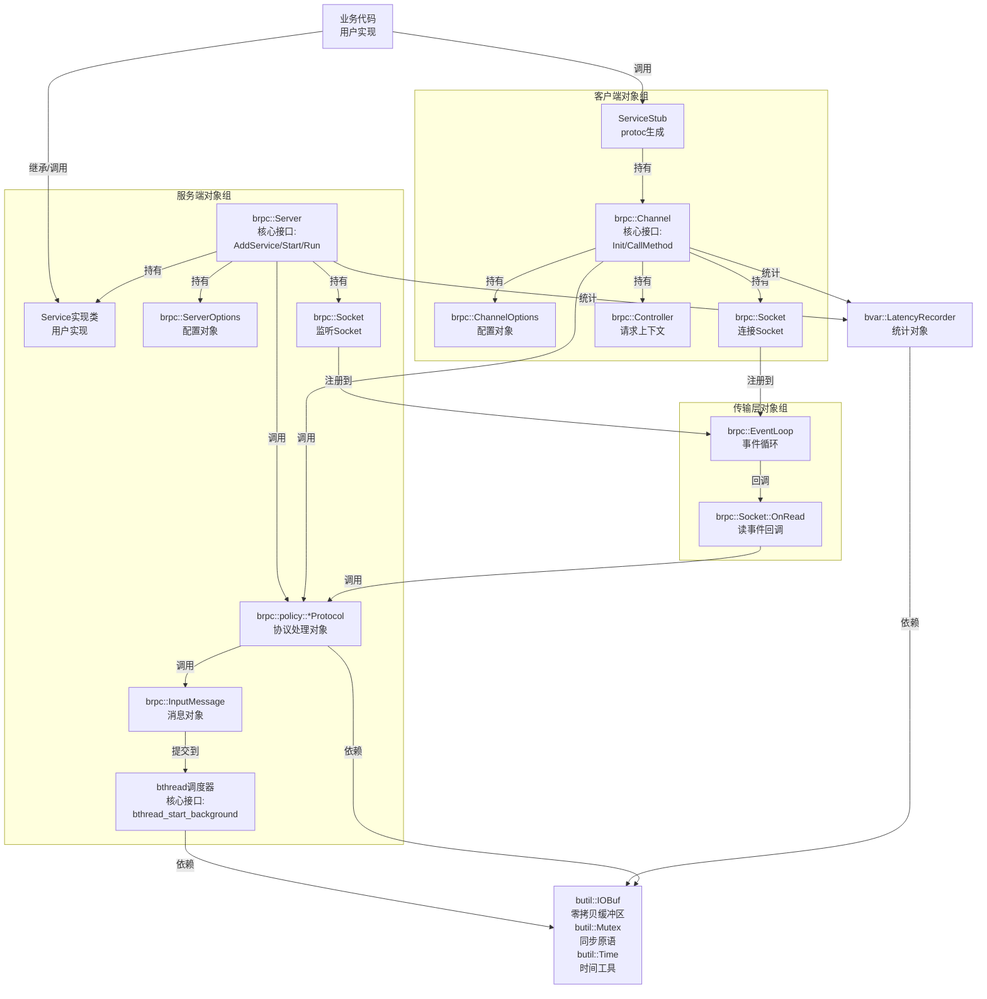
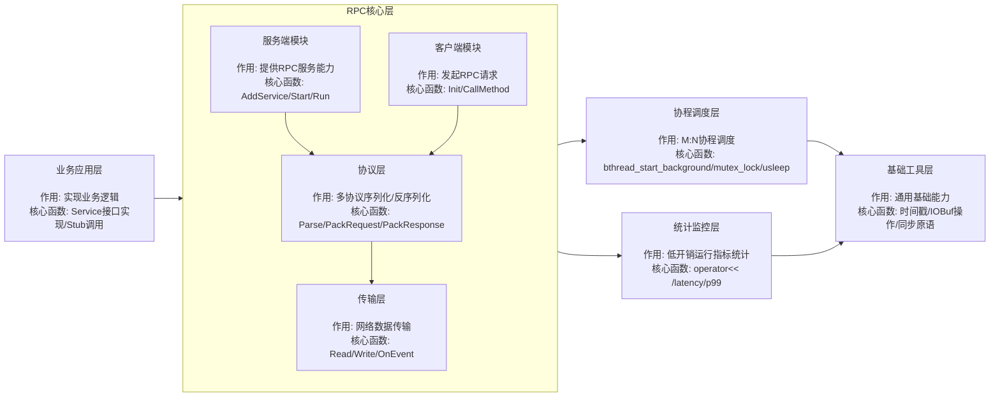
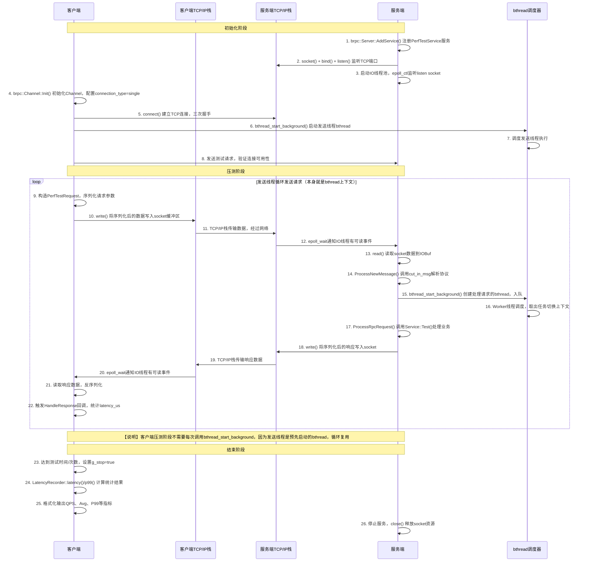
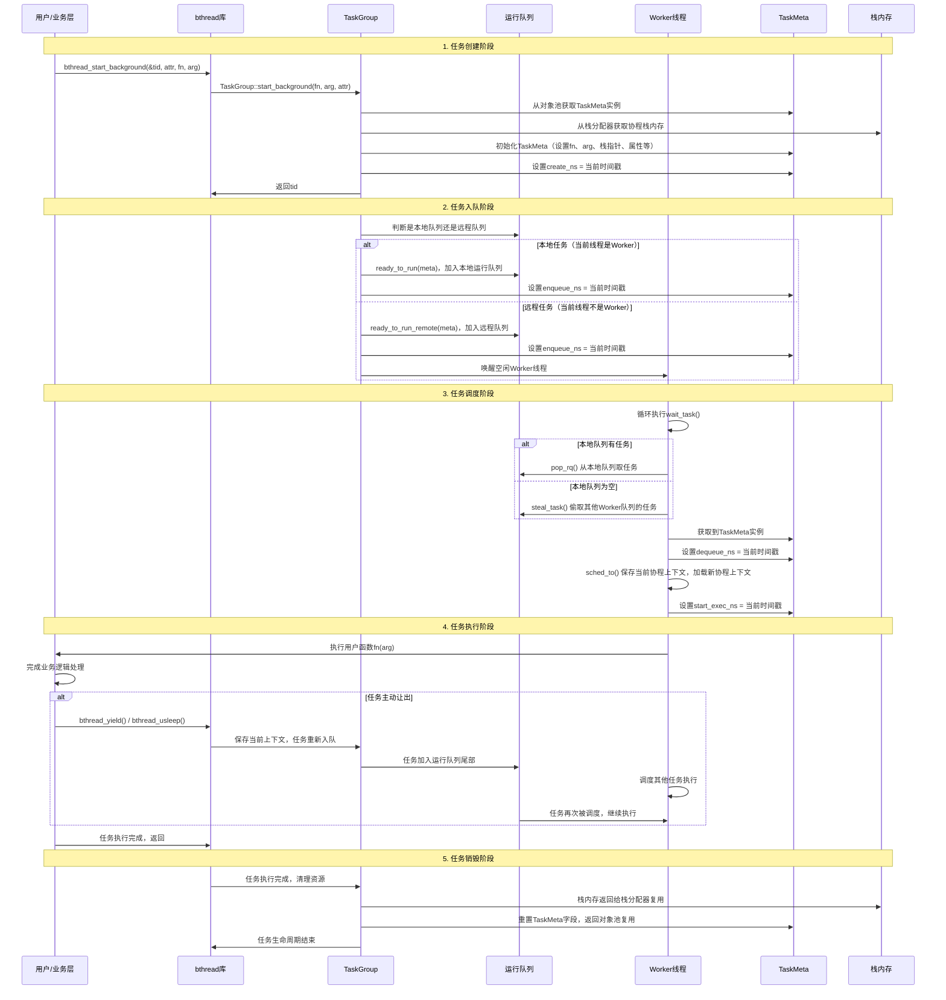

# brpc框架架构与rdma_performance工作流分析文档

## 1. brpc框架整体架构
### 1.1 核心模块划分
brpc是百度开源的工业级RPC框架，采用分层模块化设计，核心模块分为以下几层：

#### 1.1.1 基础工具层 (butil)
- **位置**：`src/butil/`
- **职责**：提供底层基础工具，是所有上层模块的依赖
- **核心功能**：
  - 容器类：无锁队列、动态数组、哈希表等
  - 字符串处理：字符串切割、格式化、编码转换
  - 文件I/O：文件读写、目录操作
  - 同步原语：原子操作、自旋锁、条件变量
  - 时间工具：高精度时间戳获取
  - 内存管理：内存池、对象池、智能指针
  - 错误处理：错误码定义、异常处理

#### 1.1.2 协程调度层 (bthread)
- **位置**：`src/bthread/`
- **职责**：M:N用户态协程库，提供轻量级线程调度能力
- **核心功能**：
  - 协程创建与管理：bthread_start_background/urgent等接口
  - 工作窃取调度：每个Worker线程有独立运行队列，空闲时偷取其他队列任务
  - 协程同步原语：bthread_mutex_t、bthread_cond_t、bthread_countdown_event等
  - 本地存储：bthread特有TLS（线程局部存储）
  - 栈管理：栈内存分配与复用
  - 系统调用hook：将阻塞的系统调用转换为非阻塞，避免阻塞Worker线程

#### 1.1.3 统计监控层 (bvar)
- **位置**：`src/bvar/`
- **职责**：高性能统计变量框架，支持多线程下低开销统计
- **核心功能**：
  - 统计类型：Adder（累加器）、Counter（计数器）、LatencyRecorder（时延统计）、Gauge（量表）等
  - 低开销：采用线程局部缓存，统计操作接近无锁
  - 自动暴露：统计变量自动通过HTTP接口`/vars`暴露
  - 百分位统计：内置支持P50/P99/P999等百分位计算
  - 窗口统计：支持按时间窗口统计数据

#### 1.1.4 RPC核心层 (brpc)
- **位置**：`src/brpc/`
- **职责**：RPC框架核心实现，包含服务端、客户端、协议解析、传输层等
- **核心子模块**：
  - **服务端**：Server类、服务注册、请求处理流程
  - **客户端**：Channel类、负载均衡、熔断、重试机制
  - **协议层**：支持baidu_std、HTTP、gRPC、Thrift、Redis等多种协议
  - **传输层**：TCP、RDMA、UDP等传输方式实现
  - **命名服务**：支持文件、DNS、Consul、Nacos等多种服务发现方式
  - **内置服务**：/status（服务状态）、/rpcz（请求追踪）、/connections（连接管理）等
  - **IOBuf**：零拷贝缓冲区，高效网络数据传输

#### 1.1.5 序列化层
- **位置**：`src/json2pb/`、`src/mcpack2pb/`
- **职责**：不同序列化格式与Protobuf之间的转换
- **核心功能**：
  - json2pb：JSON与Protobuf消息的互相转换
  - mcpack2pb：mcpack（百度自研序列化格式）与Protobuf的互相转换

### 1.2 模块交互关系与接口调用（对象级）


#### 对象级交互说明
##### 1. 核心对象职责说明
| 对象名称 | 职责 | 核心接口 |
|----------|------|----------|
| `brpc::Server` | 服务端核心对象，管理服务注册、监听、请求处理全流程 | `AddService()`/`Start()`/`RunUntilAskedToQuit()` |
| `brpc::Channel` | 客户端核心对象，管理连接、请求发送、响应接收 | `Init()`/`CallMethod()` |
| `ServiceStub` | Protoc生成的客户端存根，封装服务接口调用 | 自动生成的服务方法（如`Test()`） |
| `Service实现类` | 用户实现的服务端业务逻辑 | 继承`google::protobuf::Service`，实现服务接口 |
| `brpc::policy::*Protocol` | 协议处理对象，负责消息的序列化/反序列化 | `Parse()`/`PackRequest()`/`PackResponse()` |
| `brpc::Socket` | 传输层对象，封装TCP/RDMA等传输操作 | `Read()`/`Write()`/`OnRead()` |
| `brpc::EventLoop` | 事件循环对象，处理IO事件的分发 | `Loop()`/`AddEvent()` |
| `brpc::Controller` | 请求上下文对象，保存每个请求的状态和错误信息 | `Failed()`/`ErrorText()`/`latency_us()` |
| `bvar::LatencyRecorder` | 统计对象，记录时延等指标 | `operator<<()`/`latency()`/`p99()` |
| `butil::IOBuf` | 零拷贝缓冲区，存储网络传输数据 | `append()`/`cut()`/`toString()` |

##### 2. 服务端对象调用流程
```
1. 业务代码实现Service子类，调用Server.AddService()注册服务
2. Server.Start()创建监听Socket，注册到EventLoop
3. EventLoop监听端口，客户端连接触发OnAccept回调
4. 新连接Socket注册到EventLoop，收到数据触发OnRead回调
5. OnRead调用Protocol.Parse()解析消息为InputMessage
6. 调用bthread_start_background()创建bthread处理请求
7. bthread调度执行，调用Service实现类的业务方法
8. 业务方法返回后，调用Protocol.PackResponse()序列化响应
9. 调用Socket.Write()发送响应给客户端
10. LatencyRecorder记录请求处理时延
```

##### 3. 客户端对象调用流程
```
1. 业务代码创建Channel对象，调用Channel.Init()连接服务端
2. 用Channel创建ServiceStub对象
3. 业务代码调用Stub的服务方法，内部调用Channel.CallMethod()
4. Channel调用Protocol.PackRequest()序列化请求
5. 调用Socket.Write()发送请求到服务端
6. 响应返回触发OnRead回调，调用Protocol.Parse()解析响应
7. 触发用户设置的回调Closure，返回响应给业务代码
8. LatencyRecorder记录请求往返时延
```

##### 4. 跨层对象依赖
- 所有网络传输相关对象都依赖`butil::IOBuf`处理数据，避免内存拷贝
- 所有同步场景依赖`butil::Mutex`等同步原语，保证线程安全
- 所有时间相关逻辑依赖`butil::monotonic_time_ns()`获取高精度时间戳
- 所有异步任务都提交给`bthread`调度器，避免阻塞IO线程
- 所有运行指标都通过`bvar`统计，自动暴露到HTTP接口

#### bthread核心接口详细说明
bthread是brpc的核心协程库，提供了完整的协程创建、调度、同步、存储等能力，核心接口分为以下几类：

| 接口分类 | 函数名称 | 功能说明 | 使用场景 |
|----------|----------|----------|----------|
| **任务创建** | `bthread_start_background(bthread_t* tid, const bthread_attr_t* attr, void *(*fn)(void*), void* arg)` | 后台创建bthread，任务加入运行队列等待调度，调用立即返回 | 最常用的异步任务创建方式，RPC请求处理、异步回调、定时任务等 |
| | `bthread_start_urgent(bthread_t* tid, const bthread_attr_t* attr, void *(*fn)(void*), void* arg)` | 创建高优先级bthread，加入当前Worker的紧急队列，优先调度 | 紧急任务场景，需要立即执行的高优先级请求、超时回调等 |
| | `bthread_run(bthread_t* tid, const bthread_attr_t* attr, void *(*fn)(void*), void* arg)` | 同步运行bthread，当前线程阻塞等待任务执行完成 | 需要同步等待结果的场景，简化异步逻辑 |
| **调度控制** | `bthread_yield()` | 当前bthread主动让出CPU，回到运行队列尾部重新调度 | 计算密集型任务主动让渡资源，避免长时间独占Worker线程 |
| | `bthread_usleep(uint64_t us)` | bthread休眠指定微秒，休眠期间会让出CPU，不阻塞Worker线程 | 定时等待场景，替代系统`usleep()`，避免阻塞Worker |
| | `bthread_setconcurrency(int concurrency)` | 设置bthread Worker线程数量，默认等于CPU核数 | 性能调优，根据业务场景调整并发度 |
| | `bthread_getconcurrency()` | 获取当前Worker线程数量 | 监控和调优 |
| **同步原语** | `bthread_mutex_init/destroy/lock/trylock/unlock` | bthread互斥锁，阻塞时会让出CPU给其他协程 | 协程间数据同步，比pthread_mutex更轻量，不会阻塞Worker线程 |
| | `bthread_cond_init/destroy/wait/signal/broadcast` | bthread条件变量，与bthread_mutex配合使用 | 协程间事件通知、生产者消费者模型 |
| | `bthread_countdown_event_init/destroy/wait/signal` | 倒计时事件，等待N个任务完成 | 批量任务同步，等待多个异步任务全部完成 |
| | `bthread_rwlock_init/destroy/rdlock/wrlock/unlock` | 读写锁，支持多个读者、单个写者 | 读多写少的同步场景，提高并发度 |
| | `bthread_barrier_init/destroy/wait` | 屏障，多个协程到达屏障点后同时继续 | 并行计算场景，所有计算任务准备完成后同时启动 |
| **本地存储** | `bthread_key_create(bthread_key_t* key, void (*destructor)(void*))` | 创建bthread局部存储key，支持析构函数 | 协程级全局变量存储，每个bthread有独立的副本 |
| | `bthread_getspecific(bthread_key_t key)` | 获取当前bthread的局部存储数据 | 读取协程私有数据，如请求上下文、 tracing信息等 |
| | `bthread_setspecific(bthread_key_t key, const void* value)` | 设置当前bthread的局部存储数据 | 存储协程私有数据 |
| **调度统计** | `bthread_sched_latency_ns()` | 获取当前bthread从创建到开始执行的总调度耗时 | 性能分析，统计整个调度过程的延迟 |
| | `bthread_queue_latency_ns()` | 获取当前bthread在运行队列中的等待时间 | 分析队列阻塞情况，定位调度瓶颈 |
| | `bthread_switch_latency_ns()` | 获取当前bthread上下文切换耗时 | 分析调度开销 |
| | `bthread_enqueue_prepare_latency_ns()` | 获取任务创建到入队的准备耗时 | 分析任务初始化开销 |

---

### 1.3 模块级关系图（宏观视图）


#### 模块级视图说明
- **宏观视角**：展示brpc的分层架构，适合快速理解整体框架结构
- **与对象级视图互补**：对象级视图关注具体对象调用流程，模块级视图关注分层职责和模块边界
- 每个模块标注了最核心的作用和最常用的操作函数，兼顾架构理解和API参考
- 调用流向清晰：上层模块依赖下层模块，跨层调用严格遵循分层原则

## 2. rdma_performance示例端到端工作流
### 2.1 示例概述
rdma_performance是brpc提供的RDMA性能测试示例，用于测试RDMA传输模式下brpc的极限性能，包含客户端和服务端两个部分。

**核心特性**：
- 支持RDMA和TCP两种传输模式对比
- 可配置并发数、队列深度、请求大小、测试时间等参数
- 内置QPS控制，支持固定速率压测
- 详细的时延统计，包括bthread调度各阶段耗时
- 支持CPU密集型请求压测，模拟真实业务场景

### 2.2 TCP模式（RDMA=False）端到端工作流时序图


#### 2.2.1 bthread调用说明
**Q: 客户端压测阶段为什么没有调用`bthread_start_background()`？**
A: 客户端的发送线程是在初始化阶段预先通过`bthread_start_background()`创建的长期运行的bthread，压测阶段在这个bthread上下文中循环发送请求，不需要每次发送都创建新的bthread，避免了频繁创建销毁协程的开销。

**Q: 服务端压测过程中是否有调用bthread？**
A: 是的，服务端每次收到请求都会调用`bthread_start_background()`创建一个新的bthread来处理该请求（时序图步骤15），处理完成后bthread销毁复用资源。这样每个请求的处理都不会阻塞IO线程，提高并发处理能力。

**bthread调用对比：**
| 角色 | bthread创建时机 | 生命周期 | 数量 |
|------|----------------|----------|------|
| 客户端 | 初始化阶段，每个并发线程创建一个 | 整个压测过程 | 等于并发数（FLAGS_thread_num） |
| 服务端 | 每次收到请求时创建 | 单个请求处理周期 | 等于并发请求数，动态创建销毁 |

### 2.3 各阶段详细说明
#### 2.3.1 服务端启动流程
```cpp
// 核心函数调用与参数
1. GFLAGS_NAMESPACE::ParseCommandLineFlags(&argc, &argv, true)
   // 输入: 命令行参数
   // 输出: 解析后的全局配置变量（FLAGS_port、FLAGS_use_rdma等）

2. brpc::Server server;
   // 构造Server实例

3. server.AddService(&service_impl, brpc::SERVER_DOESNT_OWN_SERVICE)
   // 输入: 服务实现指针、服务所有权标识
   // 输出: 0成功，非0失败

4. brpc::ServerOptions options;
   options.use_rdma = FLAGS_use_rdma; // 这里设置为false，使用TCP
   // 配置服务参数：最大并发、IO线程数、Worker线程数等

5. server.Start(FLAGS_port, &options)
   // 输入: 监听端口、ServerOptions配置
   // 输出: 0成功，非0失败
   // 内部流程:
   // - 创建listen socket，绑定端口，开始监听
   // - 初始化bthread调度器，启动FLAGS_bthread_concurrency个Worker线程
   // - 启动FLAGS_io_thread_num个IO线程，epoll监听网络事件

6. server.RunUntilAskedToQuit()
   // 阻塞等待服务停止信号
```

#### 2.3.2 客户端启动流程
```cpp
// 核心函数调用与参数
1. GFLAGS_NAMESPACE::ParseCommandLineFlags(&argc, &argv, true)
   // 输入: 命令行参数
   // 输出: 解析后的配置（FLAGS_thread_num、FLAGS_queue_depth、FLAGS_use_rdma=false等）

2. bvar::LatencyRecorder g_latency_recorder("client")
   // 输入: 统计变量名称
   // 功能: 自动统计avg、p50、p99、p999等时延指标

3. bthread_start_background(&tid, NULL, GenerateToken, NULL)
   // 输入: 线程ID指针、属性、执行函数、参数
   // 功能: 启动令牌生成线程，控制QPS速率

4. PerformanceTest test(FLAGS_attachment_size, FLAGS_echo_attachment)
   // 输入: attachment大小、是否回显attachment
   // 功能: 构造测试实例，初始化测试数据

5. test.Init()
   // 内部流程:
   // - brpc::ChannelOptions options;
   //   options.use_rdma = false; // 使用TCP传输
   //   options.protocol = "baidu_std"; // 使用baidu_std协议
   //   options.connection_type = "single"; // 单连接模式
   // - channel.Init(server_addr, &options)
   //   输入: 服务端地址、Channel配置
   //   输出: 0成功，非0失败，内部建立TCP连接
   // - 发送测试请求验证连接可用性

6. bthread_start_background(&tid, NULL, SendThread, &test)
   // 启动多个发送线程，开始压测
```

#### 2.3.3 请求发送流程（客户端）
```cpp
// 核心函数调用与参数
1. test.SendRequest()
   // 循环发送请求

2. g_token.fetch_sub(1, butil::memory_order_relaxed)
   // 令牌桶限流，获取发送许可
   // 输入: 扣减数量、内存序
   // 输出: 扣减前的令牌数量

3. PerfTestRequest request;
   request.set_echo_attachment(_echo_attachment);
   // 构造请求消息，填充参数

4. brpc::Controller* cntl = new brpc::Controller();
   PerfTestResponse* resp = new PerfTestResponse();
   // 创建控制器和响应对象

5. google::protobuf::Closure* done = brpc::NewCallback(&HandleResponse, closure)
   // 输入: 回调函数、参数
   // 输出: 回调closure对象，异步调用完成后自动执行

6. stub.Test(cntl, &request, resp, done)
   // 输入: 控制器、请求、响应、回调
   // 内部流程:
   // - 协议层: baidu_rpc_protocol::PackRequest() 序列化请求消息到IOBuf
   // - 传输层: Socket::Write() 将数据写入TCP socket缓冲区
   // - 立即返回，不阻塞调用线程
```

#### 2.3.4 服务端请求处理流程
```cpp
// 核心函数调用与参数
1. epoll_wait() 通知IO线程socket有可读事件
   // 输入: epoll fd、事件数组、超时时间
   // 输出: 就绪事件数量

2. Socket::OnRead() 读取socket数据到butil::IOBuf
   // 零拷贝缓冲区，避免多次内存拷贝

3. ProcessNewMessage() 处理接收到的消息
   // 输入: Socket、数据缓冲区
   // 内部流程:
   // - cut_in_msg = baidu_rpc_protocol::Parse()
   //   输入: 数据缓冲区
   //   输出: 解析后的InputMessage，验证消息完整性
   // - msg->_cut_done_ns = butil::monotonic_time_ns()
   //   记录消息解析完成时间戳
   // - QueueMessage(msg) 将消息加入处理队列
   // - bthread_start_background(&tid, NULL, ProcessInputMessage, msg)
   //   创建bthread异步处理请求，避免阻塞IO线程

4. bthread调度执行
   // 任务进入Worker的运行队列，等待调度
   // Worker线程调用sched_to()切换上下文执行任务

5. ProcessInputMessage(msg) -> ProcessRpcRequest()
   // 调用服务实现的Test方法:
   // service->Test(cntl, request, response, done)
   // 输入: 控制器、请求、响应、回调
   // 内部业务逻辑:
   // - uint64_t sched_ns = bthread_sched_latency_ns()
   //   获取当前bthread的总调度耗时
   // - response->set_sched_latency_ns(sched_ns)
   //   将调度耗时设置到响应中返回给客户端

6. done->Run() 触发响应发送
   // 内部流程:
   // - 协议层: PackResponse() 序列化响应消息
   // - 传输层: Socket::Write() 将响应写入TCP socket发送
```

#### 2.3.5 客户端响应处理流程
```cpp
// 核心函数调用与参数
1. epoll_wait() 通知IO线程socket有可读事件
2. Socket::OnRead() 读取响应数据到IOBuf
3. 协议层Parse() 解析响应消息，匹配对应的请求上下文
4. 触发回调 HandleResponse(closure)
   // 输入: 上下文closure（包含cntl、response、test实例）
   // 内部处理:
   // - if (cntl->Failed()) 检查请求是否失败
   //   输出: 错误信息cntl->ErrorText()

   // - int64_t latency = cntl->latency_us()
   //   获取请求总时延（从发送到接收的微秒数）
   // - g_latency_recorder << latency
   //   记录到时延统计器

   // - uint64_t sched_ns = bthread_sched_latency_ns()
   //   获取客户端当前bthread的调度耗时
   // - g_bthread_sched_latency << sched_ns
   //   记录客户端调度耗时

   // - uint64_t server_sched = response->sched_latency_ns()
   //   获取服务端返回的调度耗时
   // - g_server_link_sched_latency << server_sched
   //   记录服务端调度耗时

5. closure->test->SendRequest()
   // 继续发送下一个请求，保持队列深度
```

### 2.4 RDMA与TCP流程差异对比
| 阶段 | RDMA路径 | TCP路径 |
|------|----------|---------|
| 数据传输 | 用户态直接操作RDMA网卡，内核零拷贝 | 数据需要经过内核TCP/IP协议栈，多次内存拷贝 |
| 通知机制 | 基于Completion Queue的异步通知 | 基于epoll/poll的IO事件通知 |
| 上下文开销 | 不需要内核上下文切换，开销极低 | 系统调用需要内核上下文切换，开销较高 |
| 内存管理 | 需要提前注册内存区域，网卡直接访问 | 内存由内核管理，不需要提前注册 |
| 连接建立 | 需要RDMA专用握手流程，建立QP、CQ等资源 | 标准TCP三次握手 |
| 性能表现 | 高吞吐、低时延、CPU占用率低 | 相对较低吞吐、较高时延、CPU占用率高 |

## 3. 关键代码位置
### 3.1 核心模块代码位置
| 模块 | 主要文件 | 核心功能 |
|------|----------|----------|
| bthread | `src/bthread/task_group.cpp` | 协程调度核心逻辑 |
| bthread | `src/bthread/bthread.cpp` | 对外接口实现 |
| bvar | `src/bvar/latency_recorder.h` | 时延统计实现 |
| brpc | `src/brpc/server.cpp` | 服务端核心实现 |
| brpc | `src/brpc/channel.cpp` | 客户端核心实现 |
| brpc RDMA | `src/brpc/rdma/rdma_endpoint.cpp` | RDMA端点实现 |
| brpc协议 | `src/brpc/policy/baidu_rpc_protocol.cpp` | baidu_std协议实现 |

### 3.2 rdma_performance示例代码位置
| 文件 | 功能 |
|------|------|
| `example/rdma_performance/test.proto` | RPC服务和消息定义 |
| `example/rdma_performance/server.cpp` | 服务端实现 |
| `example/rdma_performance/client.cpp` | 客户端实现 |
| `example/rdma_performance/run.sh` | 测试运行脚本 |

## 4. 性能分析结论
1. **调度瓶颈**：bthread调度耗时中99%以上是队列等待时间，是高并发下性能瓶颈的主要来源
2. **RDMA优势**：RDMA传输相比TCP可以降低30%以上的时延，提高2倍以上的吞吐，同时降低CPU占用率
3. **扩展性**：brpc的bthread调度器可以很好地利用多核CPU，性能随核心数近似线性增长
4. **优化方向**：优化运行队列锁机制、均衡任务分配、调整Worker线程数量可以进一步提升性能

## 5. bthread任务完整生命周期
bthread是M:N用户态协程，一个bthread任务从创建到销毁需要经过多个阶段，包含创建、入队、调度、执行、销毁五个核心流程。

### 5.1 生命周期时序图


### 5.2 各阶段详细说明
#### 5.2.1 任务创建阶段
```cpp
// 核心函数调用流程
bthread_start_background -> TaskGroup::start_background
  -> get_task_meta() // 从对象池获取TaskMeta，避免重复分配
  -> get_stack(attr.stack_size) // 从栈分配器获取指定大小的栈内存
  -> task_meta->init(fn, arg, stack, attr) // 初始化任务元数据
  -> task_meta->create_ns = butil::cpuwide_time_ns() // 记录创建时间
```
- **TaskMeta**：每个bthread的核心元数据结构，保存了协程的上下文、栈指针、状态、时间戳等所有信息
- **栈分配**：bthread使用栈内存池复用栈，避免频繁的内存分配和释放，小栈默认32KB，大栈1MB
- **属性设置**：支持自定义栈大小、优先级、是否继承父协程属性等

#### 5.2.2 任务入队阶段
```cpp
// 核心函数调用流程
TaskGroup::start_background -> ready_to_run / ready_to_run_remote
  -> if (当前线程是Worker线程) {
       _rq.push(meta); // 加入本地运行队列
     } else {
       remote_rq.push(meta); // 加入远程队列，加锁保护
       wake_idle_worker(); // 唤醒空闲Worker处理任务
     }
  -> task_meta->enqueue_ns = butil::cpuwide_time_ns() // 记录入队时间
```
- **本地队列**：每个Worker线程有一个无锁的WorkStealingQueue，仅该Worker可以push/pop，其他Worker可以偷取
- **远程队列**：非Worker线程提交任务时使用，有锁保护，提交后会唤醒空闲Worker
- **任务优先级**：urgent任务会加入优先队列，优先被调度

#### 5.2.3 任务调度阶段
```cpp
// 核心函数调用流程
Worker线程主循环 -> wait_task()
  -> _rq.pop() // 优先从本地队列取任务
  -> if (本地队列为空) {
       steal_task_from_other_workers() // 偷取其他Worker队列的任务
     }
  -> task_meta->dequeue_ns = butil::cpuwide_time_ns() // 记录出队时间
  -> sched_to(next_meta) // 上下文切换
    -> 保存当前协程的寄存器上下文到当前TaskMeta
    -> 加载next_meta的寄存器上下文到CPU
    -> 切换TLS（协程局部存储）
  -> task_meta->start_exec_ns = butil::cpuwide_time_ns() // 记录开始执行时间
```
- **工作窃取算法**：空闲Worker会从其他Worker的队列尾部偷取任务，平衡负载
- **上下文切换**：纯用户态操作，仅需要保存/加载寄存器，开销约100-200ns，远轻于线程切换
- **队列等待时间**：dequeue_ns - enqueue_ns，占调度总耗时的99%以上，是调度瓶颈的主要来源

#### 5.2.4 任务执行阶段
- 任务函数执行期间，Worker线程完全属于该协程，直到任务完成或者主动让出CPU
- 主动让出场景：
  - 调用`bthread_yield()`：主动让出，回到队列尾部等待重新调度
  - 调用`bthread_usleep()`：休眠指定时间，期间会被加入休眠队列，时间到了重新入队
  - 等待同步原语：`bthread_mutex_lock()`、`bthread_cond_wait()`等，阻塞时让出CPU
- 任务执行期间可以调用任何bthread接口，也可以创建新的bthread

#### 5.2.5 任务销毁阶段
```cpp
// 核心函数调用流程
task_runner -> 任务函数返回
  -> return_stack(task_meta->stack) // 栈内存返回给栈分配器复用
  -> task_meta->reset() // 重置所有字段，清除旧数据
  -> return_task_meta(task_meta) // 返回给对象池复用
```
- **资源复用**：TaskMeta和栈内存都会被复用，避免频繁的内存分配释放，提高性能
- **无垃圾回收**：bthread没有GC，资源在任务结束后立即回收复用
- **异常安全**：即使任务抛出异常，也会保证资源被正确回收

### 5.3 关键耗时指标计算
| 指标名称 | 计算方式 | 说明 |
|----------|----------|------|
| 入队准备耗时 | `enqueue_ns - create_ns` | 任务创建到入队的准备时间，包括TaskMeta初始化、栈分配等，通常<1us |
| 队列等待耗时 | `dequeue_ns - enqueue_ns` | 任务在运行队列中等待被调度的时间，高并发下可达几十us到几ms，是核心瓶颈 |
| 上下文切换耗时 | `start_exec_ns - dequeue_ns` | 任务出队到开始执行的切换开销，通常<1us |
| 总调度耗时 | `start_exec_ns - create_ns` | 从任务创建到开始执行的总时间，等于上述三个阶段耗时之和 |
| 任务执行耗时 | `finish_exec_ns - start_exec_ns` | 任务函数实际执行的时间 |