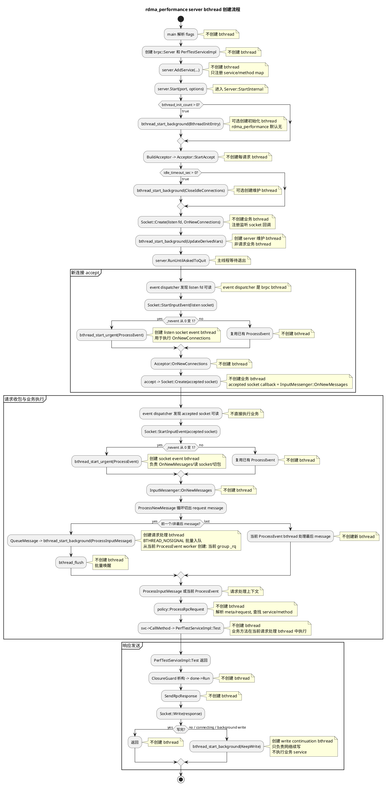

# brpc Channel 与 Server 业务 bthread 流程分析

## 背景与范围

本文从业务 bthread 创建与执行上下文出发，梳理 `src/brpc/channel.cpp` 作为 client 入口、`src/brpc/controller.cpp` 作为 client RPC 生命周期管理、`src/brpc/server.cpp` 作为 server 入口、`src/brpc/socket.cpp` 和 `src/brpc/input_messenger.cpp` 作为 server 收包与消息投递路径时的主流程差异。

分析范围默认是 `use_rdma=false` 的 TCP/RPC 主路径，并以默认配置 `usercode_in_coroutine=false`、`usercode_in_pthread=false` 为主。RDMA、协程内联执行、用户代码放入 pthread 执行池等路径只在注意事项中说明。

需要先明确一个边界：`channel.cpp` 和 `server.cpp` 都不是所有 bthread 创建点的唯一所在。client 侧响应回调、取消回调、部分重试错误处理相关 bthread 主要在 `controller.cpp` 中创建；server 侧每个请求的处理 bthread 主要在 `socket.cpp` 和 `input_messenger.cpp` 中创建，`server.cpp` 主要负责服务注册、监听、acceptor 初始化和 server 生命周期管理。

## 涉及源码与 bthread 创建点总览

| 文件 | 角色 | 主要 bthread 创建点 | 说明 |
|---|---|---|---|
| `channel.cpp` | client RPC 发起入口 | 通常不为每次 RPC 创建发送 bthread | 在调用方上下文准备 `Controller`、序列化 request、进入 `IssueRPC()` |
| `controller.cpp` | client RPC 生命周期管理 | `RunEndRPC`、`RunOnCancelThread`、重试错误处理辅助 bthread | 管理异步完成、取消回调、retry/backup/timeout 后续动作；正常 response 通常原地 `EndRPC` |
| `socket.cpp` | client/server 共享 socket 层 | `ProcessEvent`、`KeepWrite`、SSL connect continuation | 把 fd 事件转成读事件处理 bthread，把未完成写转成后台续写 bthread |
| `input_messenger.cpp` | client/server 共享消息解析与投递 | `ProcessInputMessage` | 把已切出的协议消息投递到协议处理函数 |
| `server.cpp` | server 生命周期入口 | `BthreadInitEntry`、`UpdateDerivedVars` | 维护类 bthread，不是每请求业务 bthread |
| `acceptor.cpp` | server 连接接入 | `CloseIdleConnections` | 维护 idle connection，不是每请求业务 bthread |
| `example/rdma_performance/client.cpp` | benchmark client | `GenerateToken`、`RunClosedLoopWorker`、`RunOpenLoopWorker` | benchmark 自己创建的发压 bthread |
| `example/rdma_performance/server.cpp` | benchmark server | 不直接创建每请求 bthread | 只注册 `PerfTestServiceImpl`，业务方法由 brpc 请求处理 bthread 调用 |

其中，client 和 server 都会使用 `socket.cpp` / `input_messenger.cpp` 的收包路径。差异在于：client 收到的是 response，最终进入 `Controller` 完成路径；server 收到的是 request，最终进入 `ProcessRpcRequest()` 并调用用户 service method。

## client 侧主流程

### Channel 初始化

client 侧以 `Channel` 作为 RPC 发起入口。典型初始化路径如下：

```text
Channel::Init(...)
  -> Channel::InitChannelOptions(...)
  -> Channel::InitSingle(...) 或 Channel::Init(ns_url, lb_name, ...)
```

`InitChannelOptions()` 负责确定协议、连接类型、序列化函数、打包函数、负载均衡相关选项等。它不会为业务请求创建 bthread。

`InitSingle()` 用于固定目标 server 地址的场景。它会计算 `ChannelSignature`，然后通过：

```text
SocketMapInsert(SocketMapKey(server_addr, signature), ...)
```

拿到或创建 client 侧主 socket。这个阶段建立的是 channel 到 socket 管理结构的关系，不是一次 RPC 请求，也不会为每次业务调用创建 bthread。

如果使用 naming service 和 load balancer，`Channel::Init(ns_url, lb_name, ...)` 会创建 `LoadBalancerWithNaming`，后续每次 RPC 在 `Controller::IssueRPC()` 中选择具体目标 server。

### RPC 发起

业务代码调用 stub 方法后，最终进入：

```text
Channel::CallMethod(...)
  -> Controller 初始化
  -> 序列化 request
  -> 设置 timeout / backup request timer
  -> Controller::IssueRPC(...)
```

`Channel::CallMethod()` 的核心职责是把一次 RPC 的调用状态写入 `Controller`，包括：

- 协议和方法信息
- retry、timeout、backup request 配置
- request/response/done callback
- single server 或 load balancer 信息
- request 序列化结果

这段逻辑通常运行在调用方上下文中。如果调用方本身是 bthread，例如 benchmark worker bthread，那么 `CallMethod()` 就在该 worker bthread 中执行。`channel.cpp` 不会因为发起一次普通 RPC 而额外创建一个“业务发送 bthread”。

`Controller::IssueRPC()` 负责真正选择发送目标并写 socket：

```text
Controller::IssueRPC(...)
  -> single server: Socket::Address(_single_server_id)
  -> lb: _lb->SelectServer(...)
  -> connection_type 分支
       single: 使用选中的 socket
       pooled: GetPooledSocket(...)
       short: GetShortSocket(...)
  -> pack request
  -> Socket::Write(...)
```

client 侧的负载均衡和连接选择发生在 `IssueRPC()`，而不是 server 侧。`connection_type=single` 使用选中的主 socket；`pooled` 会从主 socket 派生或获取 pooled socket；`short` 会获取短连接 socket。

### client 响应完成与用户回调

响应到达 client 后，也会走 `socket.cpp` / `input_messenger.cpp` 的收包和解析路径，随后进入协议处理函数，最终回到 `Controller::OnVersionedRPCReturned()`。

典型异步完成路径如下：

```text
response message
  -> Socket::StartInputEvent(...)
  -> Socket::ProcessEvent(...)
  -> InputMessenger::OnNewMessages(...)
  -> InputMessenger::ProcessNewMessage(...)
  -> ProcessInputMessage(...)
  -> ProcessRpcResponse(...)
  -> Controller::OnVersionedRPCReturned(...)
  -> Controller::EndRPC(...)        # 正常 response 通常原地执行
  -> Controller::RunEndRPC(...)     # 特殊错误/取消路径可选新 bthread
  -> done->Run()
```

正常收到 response 时，`ProcessRpcResponse()` 通过 `ControllerPrivateAccessor::OnResponse()` 调用 `OnVersionedRPCReturned(info, false, saved_error)`，其中 `new_bthread=false`。因此 benchmark 的 `HandleResponse()` 通常在当前 response 处理 bthread 中原地执行，也就是 `ProcessInputMessage` bthread 或最后一个 message 所在的 `ProcessEvent` bthread。

当 `new_bthread=true` 且 `usercode_in_coroutine=false` 时，`Controller::OnVersionedRPCReturned()` 才会通过 `bthread_start_background()` 创建 `RunEndRPC` bthread。典型场景包括发送前失败的异步回调、部分 socket failure / retry 辅助路径等。这个 bthread 的职责是执行 `EndRPC()`，最终运行用户传入的 `done->Run()` 回调。

`Controller::OnVersionedRPCReturned()` 不只是简单执行回调，它还负责处理 retry、backup request、timeout、取消等状态收敛：

- 如果当前错误命中 retry policy，可能直接在当前上下文中重新调用 `IssueRPC()` 发起下一次尝试。
- 如果命中 backup request，可能重新设置 timeout timer，并再次调用 `IssueRPC()`。
- 如果进入最终完成阶段，正常 response 路径原地 `EndRPC()`，特殊错误/取消路径可能创建 `RunEndRPC` bthread。
- 如果 response 处理路径不适合阻塞当前 bthread，`Controller::HandleSocketFailed()` 中带 retry policy 的错误处理会用 `bthread_start_background()` 创建一个辅助 bthread 执行 `OnVersionedRPCReturned()`，避免 retry policy 阻塞当前处理线程。

因此 client 侧有两个容易混淆的业务上下文：

| 上下文 | 创建者 | 主要职责 |
|---|---|---|
| RPC 发起上下文 | 用户代码或 benchmark worker | 调用 stub，进入 `Channel::CallMethod()`，执行序列化和 `IssueRPC()` |
| RPC 正常完成回调上下文 | `ProcessRpcResponse()` / `Controller::OnVersionedRPCReturned()` | 原地执行 `EndRPC()` / `done->Run()` |
| RPC 特殊完成回调 bthread | `Controller::OnVersionedRPCReturned()` | 创建 `RunEndRPC()` 后执行 `EndRPC()` / `done->Run()` |
| RPC 取消回调 bthread | `Controller::RunOnCancel()` | socket 失败触发取消时，以 urgent bthread 执行用户 cancel callback |
| RPC retry 辅助 bthread | `Controller::HandleSocketFailed()` | 在可能阻塞的 retry policy 场景中异步执行 `OnVersionedRPCReturned()` |

同步 RPC 的调用方会在 `Channel::CallMethod()` 内等待 RPC 完成；异步 RPC 则由完成路径执行 callback。

### client 侧 bthread 创建流程

client 侧完整 bthread 创建链路可以拆成发送、收包、完成三个阶段：

```text
用户/benchmark bthread
  -> Channel::CallMethod
  -> Controller::IssueRPC
  -> Socket::Write
       -> 快路径：当前 bthread 直接写一次
       -> 慢路径：KeepWrite bthread 续写
```

```text
event dispatcher
  -> Socket::StartInputEvent
       -> ProcessEvent bthread
  -> InputMessenger::OnNewMessages
  -> ProcessNewMessage
       -> QueueMessage 创建 ProcessInputMessage bthread
       -> 或最后一个 message 在当前 ProcessEvent bthread 中处理
  -> ProcessRpcResponse
  -> Controller::OnVersionedRPCReturned
       -> 正常 response：当前 bthread 直接 EndRPC
       -> 特殊错误/取消：可创建 RunEndRPC bthread
```

需要注意，client 的 event dispatcher 只负责 fd 事件派发，`ProcessEvent` / `ProcessInputMessage` 负责 response 解析和协议处理。对于 `rdma_performance` 的正常成功响应，用户 callback `HandleResponse()` 通常就在当前 response 处理 bthread 中执行，不是最初发请求的 worker bthread。

## rdma_performance client 的 bthread 创建流程

`example/rdma_performance/client.cpp` 在 brpc client 框架之上又增加了一层 benchmark 发压模型。它自己显式创建的 bthread 只有两类：

| bthread | 创建位置 | 创建条件 | 主要职责 |
|---|---|---|---|
| `GenerateToken` | `Test()` | `expected_qps > 0` | 周期性补充全局 token，实现目标 QPS 限速 |
| worker bthread | `Test()` | 每个 `thread_num` 创建一个 | 执行 `RunClosedLoopWorker` 或 `RunOpenLoopWorker` 发起 RPC |

### 初始化阶段

client 启动后先做这些工作：

```text
main
  -> 可选 brpc::rdma::GlobalRdmaInitializeOrDie()
  -> brpc::StartDummyServerAt(dummy_port)
  -> 解析 servers
  -> Test(thread_num, attachment_size)
```

`StartDummyServerAt()` 会启动 brpc 内部 dummy server，用于暴露 bvar 等内建能力。它属于 brpc 辅助服务，不是 benchmark 发压 worker。

`Test()` 内部先创建连接槽位：

```text
Test
  -> InitConnectionSlots(connection_num)
       -> 为每个 ConnectionSlot 创建 brpc::Channel
       -> 设置 use_rdma / protocol / connection_type / timeout / connection_group
       -> 每个 slot 做一次同步 warmup RPC
```

warmup RPC 的 `done == NULL`，因此它是同步调用。调用线程是当前主流程线程，不是 worker bthread。warmup 的作用是验证 slot 可用，并把部分连接建立、协议初始化成本移出正式压测区间。

`ConnectionSlot` 不是 bthread。它只是 benchmark 层对一个 `Channel` 及其统计计数的封装。是否对应独立 TCP 连接取决于 `connection_type`、server 地址和 `unique_connection_group`，不是由 bthread 数决定。

### closed_loop worker

`closed_loop` 模式下，每个 worker bthread 执行：

```text
RunClosedLoopWorker
  -> 记录 worker start_time
  -> 初始循环 queue_depth 次
       -> SendRequest(worker)
  -> return
```

这里容易误解：`RunClosedLoopWorker()` 初始发出 `queue_depth` 个异步 RPC 后就返回，worker bthread 本身不长期循环等待响应。后续持续发压依赖响应 callback：

```text
RPC response
  -> brpc response 处理路径
  -> Controller::EndRPC 或特殊路径 RunEndRPC
  -> done->Run()
  -> HandleResponse(closure)
       -> 统计 latency / QPS / failed / timeout
       -> closed_loop 下再次 SendRequest(worker)
```

也就是说，`closed_loop` 的“收到一个响应再补一个请求”并不是原始 worker bthread 在循环里做的，而是在 brpc 完成回调执行 `HandleResponse()` 时完成的。正常 response 路径下，回调所在上下文通常是当前 response 处理 bthread；发送前失败、取消或部分错误路径才可能由 `RunEndRPC` 新 bthread 执行。

因此，在当前 benchmark 中：

- `thread_num` 决定初始创建多少个 worker bthread。
- `queue_depth` 决定每个 worker 初始发出多少个异步 RPC。
- 稳态补发动作发生在响应回调上下文中，正常情况是 response 处理 bthread，而不是初始发送 worker bthread。
- `Worker` 对象会被 callback 持续引用，用来访问 attachment、stop 标志和 start time。

### open_loop worker

`open_loop` 模式下，每个 worker bthread 执行持续发送循环：

```text
RunOpenLoopWorker
  -> 记录 worker start_time
  -> while !g_stop && !worker->stop
       -> 检查测试时间 / request budget
       -> 如果 g_inflight >= max_inflight，bthread_usleep(50)
       -> 否则 SendRequest(worker)
```

与 `closed_loop` 的区别是，`open_loop` 不依赖“完成一个响应再补一个请求”来驱动发送。worker bthread 会主动持续尝试发送，直到达到全局 inflight 上限或测试停止。

响应回来后仍然会执行 `HandleResponse()`，但在 `open_loop` 中它只负责释放 inflight、记录统计和判断停止，不会在 callback 中补发下一次请求。

### SendRequest 与回调对象

`SendRequest(worker)` 是 benchmark client 发起异步 RPC 的核心函数：

```text
SendRequest
  -> TryAcquireRequestPermit
       -> 检查 stop/time/budget/token
  -> PickConnectionSlot
       -> round-robin 选择一个 ConnectionSlot
  -> new Controller / Response / RespClosure
  -> NewCallback(&HandleResponse, closure)
  -> PerfTestService_Stub(channel).Test(cntl, request, response, done)
  -> g_inflight++
```

这里创建的是 C++ callback 对象和 RPC 生命周期对象，不是 benchmark 自己创建新的 bthread。真正的网络写和完成回调仍然进入 brpc 框架路径：

```text
SendRequest
  -> stub.Test
  -> Channel::CallMethod
  -> Controller::IssueRPC
  -> Socket::Write
  -> response 到达后 Controller::OnVersionedRPCReturned
  -> EndRPC 或特殊路径 RunEndRPC
  -> HandleResponse
```

`PickConnectionSlot()` 使用全局 `g_rr_index.fetch_add()` 做 round-robin。它决定请求使用哪个 `Channel`，但不决定请求在哪个 bthread 上执行。发送动作发生在当前调用 `SendRequest()` 的 bthread 中：closed-loop 初始阶段是 worker bthread，后续补发阶段通常是 response 处理 bthread；open-loop 阶段主要是 worker bthread。

### rdma_performance client 完整链路

把 benchmark 和 brpc 框架合在一起，client 侧完整 bthread 流程如下：

```text
main thread
  -> Test
  -> InitConnectionSlots
       -> warmup 同步 RPC
  -> 可选 bthread_start_background(GenerateToken)
  -> bthread_start_background(RunClosedLoopWorker / RunOpenLoopWorker) * thread_num
```

```text
closed_loop 初始发送：
worker bthread
  -> RunClosedLoopWorker
  -> SendRequest * queue_depth
  -> stub.Test
  -> Channel::CallMethod
  -> Controller::IssueRPC
  -> Socket::Write
```

```text
closed_loop 稳态补发：
response event bthread / 特殊路径 RunEndRPC bthread
  -> ProcessRpcResponse
  -> Controller::EndRPC
  -> HandleResponse
  -> SendRequest
  -> 下一次 stub.Test
```

```text
open_loop 持续发送：
worker bthread
  -> RunOpenLoopWorker while loop
  -> 检查 g_inflight / token / budget / stop
  -> SendRequest
```

```text
open_loop 响应完成：
response event bthread / 特殊路径 RunEndRPC bthread
  -> HandleResponse
  -> g_inflight--
  -> 记录统计
  -> 不补发，继续发送由 worker loop 负责
```

这解释了为什么在 `closed_loop` 中，响应回调 bthread 对继续发压非常关键；而在 `open_loop` 中，worker bthread 的持续循环才是主要发压来源。

## server 侧主流程

### 服务注册

server 侧业务服务通过 `Server::AddService()` 注册，内部进入：

```text
Server::AddService(...)
  -> Server::AddServiceInternal(...)
  -> 写入 _method_map / _service_map / _fullname_service_map
```

`AddServiceInternal()` 的核心职责是把 protobuf service、method、restful mapping、method status 等元数据注册到 server 内部 map 中，供后续请求按 service/method 查找。它不为请求创建 bthread，也不执行业务方法。

### Server 启动

`Server::StartInternal()` 负责 server 生命周期初始化：

```text
Server::StartInternal(...)
  -> InitializeOnce()
  -> copy_and_fill_server_options(...)
  -> 初始化 TLS / keytable pool / SSL / RDMA 可选资源
  -> BuildAcceptor()
  -> Acceptor::StartAccept(...)
  -> 可选启动内置服务端口
  -> 启动派生变量更新 bthread
```

其中可能创建的 bthread 包括：

| bthread | 创建位置 | 作用 | 是否是请求业务 bthread |
|---|---|---|---|
| `BthreadInitEntry` | `Server::StartInternal()` | 执行用户配置的 bthread init 函数 | 否 |
| `UpdateDerivedVars` | `Server::StartInternal()` | 更新 server 派生统计变量 | 否 |
| `CloseIdleConnections` | `Acceptor::StartAccept()` | 定期关闭 idle connection | 否 |

这些是 server 生命周期或维护类 bthread，不是每个 RPC 请求的业务处理 bthread。

### 连接接入

server 监听 fd 会被包装成一个 socket，监听 socket 的事件回调是：

```text
Acceptor::OnNewConnections
```

当有新连接到来时，流程如下：

```text
event dispatcher
  -> Socket::ProcessEvent(...)
  -> Acceptor::OnNewConnections(...)
  -> accept(...)
  -> Socket::Create(...)
  -> accepted socket 的 on_edge_triggered_events = InputMessenger::OnNewMessages
```

`Acceptor::StartAccept()` 只是创建监听 socket，并把监听 socket 的边缘触发事件回调设置成 `OnNewConnections`。真正 accept 新连接发生在监听 socket 收到事件后，由 socket/event 机制触发。

每个新 accept 出来的连接会被创建成一个新的 socket。对于 TCP RPC 路径，这个 accepted socket 的读事件回调会设置为：

```text
InputMessenger::OnNewMessages
```

### 请求收包与 message bthread

server 端收到请求数据后，关键链路是：

```text
event dispatcher
  -> Socket::StartInputEvent(...)
  -> bthread_start_urgent(ProcessEvent)
  -> Socket::ProcessEvent(...)
  -> InputMessenger::OnNewMessages(...)
  -> InputMessenger::ProcessNewMessage(...)
  -> QueueMessage(...)
  -> ProcessInputMessage(...)
```

`Socket::StartInputEvent()` 在 socket 有新读事件且当前没有事件处理 bthread 时，会创建 `ProcessEvent` bthread。这个 bthread 调用 socket 上注册的 `_on_edge_triggered_events`，对 accepted RPC socket 来说就是 `InputMessenger::OnNewMessages()`。

`Socket::StartInputEvent()` 的创建条件是 `_nevent.fetch_add(...) == 0`。这表示同一个 socket 当前没有正在运行的事件处理 bthread 时，才会为它创建新的 `ProcessEvent`。如果该 socket 已经有 `ProcessEvent` 在处理，新的事件只会增加事件计数，当前处理 bthread 后续通过 `MoreReadEvents()` 继续消费。

默认路径下，`ProcessEvent` 使用 `bthread_start_urgent()` 创建；RDMA 或 `usercode_in_coroutine` 会改变该行为：

- `usercode_in_coroutine=true` 时直接调用 `ProcessEvent()`，不新建 bthread。
- RDMA 特定 flag 下可能使用 background bthread。
- 普通 TCP 路径下是 urgent bthread，用于尽快响应 socket 读事件。

`InputMessenger::OnNewMessages()` 在 `ProcessEvent` bthread 中执行，负责从 socket 读取字节流、切分消息并调用 `ProcessNewMessage()`。

`ProcessNewMessage()` 的批处理策略很关键：

- 它会循环从 socket read buffer 中切出多个完整消息。
- 对于前一个已经切出的 `last_msg`，会调用 `QueueMessage()` 投递出去。
- `QueueMessage()` 默认通过 `bthread_start_background()` 创建 `ProcessInputMessage` bthread。
- 为减少调度开销，这些 bthread 使用 `BTHREAD_NOSIGNAL`，最后通过 `bthread_flush()` 批量唤醒。
- 最后一个消息通常保留在当前 `ProcessEvent` bthread 中处理，避免所有消息都额外创建 bthread。

`QueueMessage()` 创建 `ProcessInputMessage` 时会继承当前 bthread tag，并设置 `keytable_pool`，使请求处理 bthread 可以使用 server 配置的 thread local 数据池。默认属性是 `BTHREAD_ATTR_NORMAL | BTHREAD_NOSIGNAL`，如果 `usercode_in_pthread=true` 则使用 `BTHREAD_ATTR_PTHREAD | BTHREAD_NOSIGNAL`。

`BTHREAD_NOSIGNAL` 的含义是创建后不立即逐个唤醒调度器，而是在一批消息投递完成后统一 `bthread_flush()`。这解释了为什么批量收包时，server 会先在同一个 `ProcessEvent` bthread 中切出多个 message，再把部分 message 批量投递为多个 `ProcessInputMessage` bthread。

这也是 server 侧“业务 bthread”最核心的创建位置。严格说，server 每个请求的业务方法不是由 `server.cpp` 直接创建 bthread 执行，而是由 socket/input messenger 路径创建或复用请求处理 bthread。

### RPC 分发与业务方法执行

`ProcessInputMessage()` 只做一件事：

```text
msg->_process(msg)
```

对于 baidu_std 协议，请求处理函数是 `ProcessRpcRequest()`。主流程如下：

```text
ProcessInputMessage(...)
  -> policy::ProcessRpcRequest(...)
  -> ParsePbFromIOBuf(RpcMeta)
  -> 创建 Controller
  -> 查找 service/method
  -> 反序列化 request
  -> 创建 done = SendRpcResponse callback
  -> svc->CallMethod(method, cntl, request, response, done)
```

默认 `usercode_in_pthread=false` 时，`ProcessRpcRequest()` 会直接调用：

```text
svc->CallMethod(...)
```

这意味着业务方法运行在当前请求处理 bthread 中。这个 bthread 可能是：

- `QueueMessage()` 创建的 `ProcessInputMessage` bthread。
- 当前 `ProcessEvent` bthread，通常对应批量解析中的最后一个消息。

`server.cpp` 在业务方法调用前不会再创建一个“专用业务 bthread”。业务 bthread 的来源是收包和消息处理框架。

### 响应发送

业务方法完成后执行 `done->Run()`，最终进入：

```text
SendRpcResponse(...)
  -> 序列化 response
  -> Socket::Write(...)
```

`SendRpcResponse()` 负责打包响应并写回 client。它本身不固定创建新 bthread。

`Socket::Write()` 在 client 请求发送和 server 响应发送两侧都共用。它会先尝试在当前 bthread 中直接写一次。如果当前连接还在建立、SSL 写可能阻塞、配置要求后台写、或者一次写没有完成，则会通过 `bthread_start_background()` 创建 `KeepWrite` bthread 继续写。

### server 侧 bthread 创建流程

server 侧完整 bthread 创建链路可以按生命周期、连接、请求、响应分成四段：

```text
Server::StartInternal
  -> 可选 BthreadInitEntry bthread
  -> 可选 UpdateDerivedVars bthread
  -> Acceptor::StartAccept
       -> 可选 CloseIdleConnections bthread
```

这些 bthread 负责初始化、统计和连接维护，不直接执行业务 RPC。

```text
监听 socket 可读
  -> event dispatcher
  -> Socket::StartInputEvent
       -> ProcessEvent bthread
  -> Acceptor::OnNewConnections
  -> accept
  -> Socket::Create accepted socket
       -> accepted socket callback = InputMessenger::OnNewMessages
```

这一段负责接入 TCP 连接，不处理具体业务请求。

```text
accepted socket 可读
  -> event dispatcher
  -> Socket::StartInputEvent
       -> ProcessEvent bthread
  -> InputMessenger::OnNewMessages
  -> ProcessNewMessage
       -> QueueMessage 创建 ProcessInputMessage bthread
       -> 或最后一个 message 留在当前 ProcessEvent bthread
  -> ProcessInputMessage
  -> ProcessRpcRequest
  -> svc->CallMethod
```

这一段才是 server 业务请求 bthread 的主路径。业务 service method 默认就在 `ProcessInputMessage` bthread 或当前 `ProcessEvent` bthread 中执行。

```text
service method 完成
  -> done->Run
  -> SendRpcResponse
  -> Socket::Write
       -> 快路径：当前业务 bthread 直接写一次
       -> 慢路径：KeepWrite bthread 续写
```

响应发送不创建新的业务 bthread；`KeepWrite` 只负责网络写续传。

## rdma_performance server 的 bthread 创建流程

`example/rdma_performance/server.cpp` 本身非常薄，只做三件事：

```text
main
  -> 创建 brpc::Server
  -> 创建 PerfTestServiceImpl
  -> server.AddService(&perf_test_service_impl, SERVER_DOESNT_OWN_SERVICE)
  -> 设置 ServerOptions.use_rdma
  -> server.Start(port, &options)
  -> server.RunUntilAskedToQuit()
```

这个示例 server 不显式调用 `bthread_start_background()` 创建业务 worker。它把 `PerfTestServiceImpl` 注册给 brpc 后，请求处理完全由 brpc server 框架驱动。

### 业务方法执行上下文

`PerfTestServiceImpl::Test()` 的调用路径是：

```text
accepted socket 可读
  -> Socket::StartInputEvent
  -> ProcessEvent bthread
  -> InputMessenger::OnNewMessages
  -> ProcessNewMessage
  -> QueueMessage / ProcessInputMessage
  -> policy::ProcessRpcRequest
  -> svc->CallMethod
  -> PerfTestServiceImpl::Test
```

因此 `PerfTestServiceImpl::Test()` 默认运行在 brpc 的请求处理 bthread 中，而不是示例 server 自己创建的线程或 bthread 中。这个请求处理 bthread 可能是：

- `QueueMessage()` 创建的 `ProcessInputMessage` bthread。
- 当前 `ProcessEvent` bthread，通常是批量解析时最后一个 message 的处理路径。

### PerfTestServiceImpl::Test 做了什么

`PerfTestServiceImpl::Test()` 的逻辑很轻：

```text
PerfTestServiceImpl::Test
  -> ClosureGuard done_guard(done)
  -> 周期性读取 process_cpu_usage，写入 response.cpu_usage
  -> 如果 echo_attachment=true
       -> response_attachment append request_attachment
  -> 函数返回
  -> ClosureGuard 析构，执行 done->Run()
  -> SendRpcResponse
  -> Socket::Write(response)
```

`ClosureGuard done_guard(done)` 是这里的关键：业务方法返回时，`done_guard` 析构会自动执行 brpc 提供的 `done` callback。这个 callback 对应 `SendRpcResponse()`，负责发送响应。

因此，server 示例没有在 `Test()` 中手动调用 `done->Run()`，也没有创建新的响应 bthread。响应发送通常仍然发生在当前业务请求 bthread 中，除非 `Socket::Write()` 进入 `KeepWrite` 慢路径。

### rdma_performance server 完整链路

把示例 server 和 brpc 框架合在一起，server 侧完整 bthread 流程如下：

```text
main thread
  -> server.AddService
  -> server.Start
       -> Server::StartInternal
       -> Acceptor::StartAccept
       -> 创建监听 socket
  -> server.RunUntilAskedToQuit
```

```text
新连接：
event dispatcher
  -> Socket::StartInputEvent
  -> ProcessEvent bthread
  -> Acceptor::OnNewConnections
  -> accept
  -> Socket::Create accepted socket
```

```text
请求处理：
event dispatcher
  -> Socket::StartInputEvent
  -> ProcessEvent bthread
  -> InputMessenger::OnNewMessages
  -> ProcessNewMessage
  -> QueueMessage 创建 ProcessInputMessage bthread
  -> ProcessRpcRequest
  -> PerfTestServiceImpl::Test
```

```text
响应发送：
PerfTestServiceImpl::Test 返回
  -> ClosureGuard 执行 done->Run
  -> SendRpcResponse
  -> Socket::Write
       -> 快路径：当前请求处理 bthread 写 response
       -> 慢路径：KeepWrite bthread 续写
```

### 与 benchmark 火焰图的关系

在这个示例中，server 业务逻辑非常轻，`PerfTestServiceImpl::Test()` 主要做 CPU 采样和可选 attachment echo。CPU 火焰图中大量时间出现在 `ProcessEvent`、`ProcessInputMessage`、`ProcessRpcRequest`、`SendRpcResponse`、`Socket::Write`、bthread 调度等路径，是符合模型的。

如果看到 server 侧 `steal_task`、`wait_task` 或调度相关占比很高，不能简单理解成业务方法创建了太多 bthread。更准确的解释是：请求处理 bthread 由 `socket/input_messenger` 批量创建和调度，业务逻辑很短，worker 执行完一个请求后很快回到调度器寻找下一个 ready task。

## TaskGroup 入队与调度语义

理解 bthread 是否可能调度不均衡，需要区分“在哪里创建 bthread”和“最终由哪个 TaskGroup 执行 bthread”。

`bthread_start_background()` 的核心规则如下：

- 如果当前线程已有 `bthread::tls_task_group`，并且 attr tag 与当前 group tag 兼容，则调用当前 `TaskGroup::start_background<false>()`。
- `start_background<false>()` 创建 `TaskMeta` 后调用 `ready_to_run()`，把新 bthread 推入当前 TaskGroup 的本地 `_rq`。
- 如果当前线程没有 `tls_task_group`，或者 tag 不兼容，则通过 `TaskControl::choose_one_group(tag)` 选择一个 TaskGroup，再调用 `start_background<true>()`。
- `start_background<true>()` 会调用 `ready_to_run_remote()`，把新 bthread 推入目标 TaskGroup 的 `_remote_rq`。
- `BTHREAD_NOSIGNAL` 场景会先批量入队，不逐个唤醒 worker，最后通过 `bthread_flush()` 唤醒。

`bthread_start_urgent()` 的规则类似，但在已有兼容 `tls_task_group` 时走 foreground/urgent 路径，用于更快调度，例如 `Socket::StartInputEvent()` 创建 `ProcessEvent`。

因此，“在当前 group 创建的 bthread 是否一定在当前 group 执行”的答案是：不一定。

- 从已有 worker bthread 创建并且 tag 兼容时，新 bthread 会优先进入当前 TaskGroup 的本地 `_rq`。
- 但本地 `_rq` 中的 ready task 可以被其他 TaskGroup 通过 `steal_task()` 窃取，所以最终执行者不一定是创建者所在 group。
- 从非 worker 线程创建时，brpc 会先 `choose_one_group(tag)`，再把任务放入该 group 的 `_remote_rq`，等待该 group 或调度器唤醒后处理。
- `_remote_rq` 主要承接“外部线程或其他 group 投递到这个 group 的任务”；`_rq` 是当前 group 的本地 ready 队列。
- `steal_task` 多只能说明某些 worker 在尝试从其他 group 找 ready task；它可能来自任务执行太快、任务分布不均、批量投递集中、连接事件集中到少数 group、或业务逻辑太轻等因素，不能单独证明一定存在严重不均衡。

## PlantUML: rdma_performance client bthread 创建流程

下面流程图标注了每一步是否创建 bthread，以及创建后通常进入哪个队列。正常成功响应下，`HandleResponse()` 不在最初发送的 worker bthread 中执行，而是在 response 处理 bthread 中执行。

```plantuml
@startuml
title rdma_performance client bthread 创建流程

start
:main 解析 flags;
note right: 不创建 bthread

if (use_rdma?) then (true)
  :GlobalRdmaInitializeOrDie;
  note right: 不创建 bthread
endif

:StartDummyServerAt(dummy_port);
note right: 可能启动 brpc 内部服务相关 bthread\n不是 benchmark worker

:解析 servers;
note right: 不创建 bthread

:Test(thread_num, attachment_size);
note right: 不创建 bthread

:InitConnectionSlots(connection_num);
note right: 不创建 benchmark bthread

repeat
  :创建 Channel;
  note right: 不创建 bthread
  :warmup 同步 RPC, done == NULL;
  note right: 不创建 callback bthread\n可能触发 Socket::Write/KeepWrite
repeat while (more slots?)

if (expected_qps > 0?) then (true)
  :bthread_start_background(GenerateToken);
  note right
    创建 bthread
    调用点通常是 main/non-worker
    choose_one_group(tag) -> remote_rq
  end note
endif

repeat
  if (load_mode == closed_loop?) then (true)
    :bthread_start_background(RunClosedLoopWorker);
  else (open_loop)
    :bthread_start_background(RunOpenLoopWorker);
  endif
  note right
    创建 worker bthread
    调用点通常是 main/non-worker
    choose_one_group(tag) -> remote_rq
  end note
repeat while (created < thread_num?)

partition "closed_loop 初始发送" {
  :RunClosedLoopWorker 执行;
  note right: 已在 worker bthread 中
  repeat
    :SendRequest(worker);
    note right: 不创建 bthread\n创建 Controller/Response/RespClosure/callback 对象
    :PickConnectionSlot round-robin;
    note right: 不创建 bthread
    :stub.Test -> Channel::CallMethod;
    note right: 不创建 bthread\n在当前 worker bthread 发起
    :Controller::IssueRPC;
    note right: 不创建 bthread
    :Socket::Write(request);
    if (写完?) then (yes)
      :返回;
      note right: 不创建 bthread
    else (no / connecting / background write)
      :bthread_start_background(KeepWrite);
      note right
        创建 bthread
        若从 worker 调用且 tag 兼容: 当前 group _rq
        但后续可能被其他 group steal
      end note
    endif
  repeat while (sent < queue_depth?)
  :RunClosedLoopWorker return;
}

partition "open_loop 持续发送" {
  :RunOpenLoopWorker while loop;
  note right: 已在 worker bthread 中
  if (inflight >= max_inflight?) then (true)
    :bthread_usleep(50);
    note right: 不创建 bthread\n当前 bthread 让出/睡眠
  else (false)
    :SendRequest(worker);
    note right: 不创建 bthread\n后续同 Socket::Write 规则
  endif
}

partition "response 收包与回调" {
  :event dispatcher 收到 client socket 可读;
  note right: event dispatcher 自身是 brpc bthread
  :Socket::StartInputEvent;
  if (_nevent 从 0 变 1?) then (yes)
    :bthread_start_urgent(ProcessEvent);
    note right
      创建 socket event bthread
      通常从 event dispatcher bthread 创建
      优先当前 group/urgent 路径
      最终仍可能被调度迁移或 steal
    end note
  else (no)
    :复用已有 ProcessEvent;
    note right: 不创建 bthread
  endif

  :InputMessenger::OnNewMessages;
  note right: 不创建 bthread
  :ProcessNewMessage 切分 response;
  if (非最后一个 message?) then (yes)
    :QueueMessage -> bthread_start_background(ProcessInputMessage);
    note right
      创建 response message bthread
      BTHREAD_NOSIGNAL 批量入队
      从当前 worker 创建: 当前 group _rq
    end note
    :bthread_flush;
    note right: 不创建 bthread\n只唤醒已批量入队任务
  else (last)
    :当前 ProcessEvent bthread 处理;
    note right: 不创建新 bthread
  endif

  :ProcessRpcResponse;
  note right: 不创建 bthread
  :ControllerPrivateAccessor::OnResponse(new_bthread=false);
  note right: 不创建 RunEndRPC
  :Controller::EndRPC -> done->Run -> HandleResponse;
  note right
    正常响应: 原地执行 callback
    不在最初发送 worker 中
    在 response 处理 bthread 中
  end note

  if (closed_loop?) then (true)
    :HandleResponse 调用 SendRequest 补发;
    note right
      不创建 benchmark worker
      下一次发送发生在当前 response bthread
    end note
  else (open_loop)
    :HandleResponse 只统计并 g_inflight--;
    note right: 不补发
  endif
}

partition "特殊错误/取消路径" {
  if (发送前失败或取消?) then (yes)
    :OnVersionedRPCReturned(new_bthread=true);
    :bthread_start_background(RunEndRPC);
    note right
      创建完成回调 bthread
      执行 EndRPC / done->Run / HandleResponse
    end note
  endif
}

stop
@enduml
```



## PlantUML: rdma_performance server bthread 创建流程

server 示例本身不创建每请求业务 bthread。`PerfTestServiceImpl::Test()` 由 brpc 的请求处理 bthread 调用。



## 业务 bthread 创建链路汇总

| 类型 | 创建位置 | 典型函数 | 主要职责 | 是否执行业务代码 |
|---|---|---|---|---|
| client 发起方 bthread | 用户代码或 benchmark | worker -> stub -> `Channel::CallMethod` | 发起 RPC、序列化、选择连接、写请求 | 是，执行用户发起逻辑 |
| client 正常完成回调上下文 | `input_messenger.cpp` / `controller.cpp` | `ProcessInputMessage` -> `ProcessRpcResponse` -> `EndRPC` | 结束 RPC、运行 `done->Run()` | 是，执行用户 callback |
| client 特殊完成回调 bthread | `controller.cpp` | `OnVersionedRPCReturned` -> `RunEndRPC` | 发送前失败、取消等路径结束 RPC、运行 `done->Run()` | 是，执行用户 callback |
| client 取消回调 bthread | `controller.cpp` | `RunOnCancel` -> `RunOnCancelThread` | socket 失败时执行 cancel callback | 是，执行用户 cancel callback |
| client retry 辅助 bthread | `controller.cpp` | `HandleSocketFailed` -> lambda -> `OnVersionedRPCReturned` | 避免 retry policy 阻塞当前 bthread | 可能，最终可能进入用户 callback |
| event dispatcher bthread | `event_dispatcher.cpp` | `EventDispatcher::Run` | epoll/kqueue 等待和派发 fd 事件 | 否 |
| socket event bthread | `socket.cpp` | `StartInputEvent` -> `ProcessEvent` | 执行 socket 读事件回调 | 可能，最后一个消息可能在此处理 |
| server message bthread | `input_messenger.cpp` | `QueueMessage` -> `ProcessInputMessage` | 处理单个 RPC message | 是，通常执行 server service 方法 |
| write continuation bthread | `socket.cpp` | `Socket::StartWrite` -> `KeepWrite` | 后台续写未完成的数据 | 否，主要是网络写 |
| server 维护 bthread | `server.cpp` / `acceptor.cpp` | `UpdateDerivedVars`、`CloseIdleConnections` | 维护统计或 idle 连接 | 否 |
| benchmark token bthread | `rdma_performance/client.cpp` | `GenerateToken` | 为 `expected_qps` 补充发送 token | 否 |
| benchmark worker bthread | `rdma_performance/client.cpp` | `RunClosedLoopWorker` / `RunOpenLoopWorker` | 发起压测 RPC | 是，执行 benchmark 发压逻辑 |
| benchmark server service | `rdma_performance/server.cpp` | `PerfTestServiceImpl::Test` | 处理压测 RPC 业务逻辑 | 是，但由 brpc 请求处理 bthread 调用 |

## client 与 server 的本质差异

| 维度 | client: `channel.cpp` 主导 | server: `server.cpp` 主导 |
|---|---|---|
| 角色 | 主动发起 RPC | 被动监听并接收 RPC |
| 初始化目标 | 构造 channel、协议、连接类型、目标 server 或 LB | 注册 service、启动监听端口、初始化 acceptor |
| 连接选择 | 每次 RPC 在 `IssueRPC()` 中选择 server/socket | accept 新 TCP 连接后创建 accepted socket |
| 负载均衡 | client 侧完成，`_lb->SelectServer()` | server 侧不做 client 请求的负载均衡 |
| 请求业务上下文 | 调用方 bthread 执行 `CallMethod()` 和 `IssueRPC()` | `ProcessInputMessage` 或 `ProcessEvent` bthread 执行业务方法 |
| callback bthread | 正常 response 回调通常原地执行；特殊错误路径可创建 `RunEndRPC` bthread | 业务完成后通过 done 进入 `SendRpcResponse()`，通常仍在业务 bthread |
| 主要 bthread 创建点 | `Controller::OnVersionedRPCReturned()` 创建完成回调 bthread | `Socket::StartInputEvent()`、`QueueMessage()` 创建请求处理相关 bthread |
| `channel.cpp` / `server.cpp` 自身职责 | `channel.cpp` 是 RPC 发起和连接选择入口 | `server.cpp` 是服务注册和监听生命周期入口 |
| 网络写 | `Socket::Write()` 发送 request | `Socket::Write()` 发送 response |

简化地说：

```text
client 侧：
用户/benchmark worker bthread
  -> Channel::CallMethod
  -> Controller::IssueRPC
  -> Socket::Write(request)
  -> 收到 response
  -> Controller::EndRPC 或特殊路径 RunEndRPC
  -> HandleResponse()
  -> closed_loop 下可能继续 SendRequest()
```

```text
server 侧：
event dispatcher
  -> Socket::ProcessEvent
  -> InputMessenger::OnNewMessages
  -> QueueMessage / ProcessInputMessage
  -> ProcessRpcRequest
  -> PerfTestServiceImpl::Test
  -> SendRpcResponse
  -> Socket::Write(response)
```

## 从业务 bthread 角度理解两端差异

client 侧业务 bthread 的核心是“谁发起 RPC”和“谁执行回调”。`Channel::CallMethod()` 不主动为每次请求创建发送 bthread，它在调用方上下文中完成请求准备和发送。异步响应回来后，正常 response 路径通常在 response 处理 bthread 中原地执行 `EndRPC()` 和用户回调；只有特殊错误/取消路径才可能创建 `RunEndRPC` bthread。

server 侧业务 bthread 的核心是“谁处理收到的 message”。`server.cpp` 只把业务 service 注册到 map，并启动 acceptor。真正让请求进入业务方法的是 `InputMessenger` 创建或复用的 `ProcessInputMessage` / `ProcessEvent` bthread。默认情况下，`ProcessRpcRequest()` 在这个请求处理 bthread 中直接调用 service 的 `CallMethod()`。

因此，不能把 `server.cpp` 理解为“每收到一个请求就创建一个业务 bthread 的地方”。更准确的说法是：

```text
server.cpp 注册业务能力和启动入口；
socket.cpp 把 fd 事件转成 ProcessEvent bthread；
input_messenger.cpp 把消息转成 ProcessInputMessage bthread；
baidu_rpc_protocol.cpp 在该 bthread 中分发到具体 service method。
```

## 注意事项

`FLAGS_usercode_in_coroutine=true` 时，部分原本会创建 bthread 的路径会改为直接调用，例如 `Socket::StartInputEvent()` 可直接执行 `ProcessEvent()`，`QueueMessage()` 也可能直接执行 `ProcessInputMessage()`。这会改变业务代码是否在新 bthread 中运行。

`FLAGS_usercode_in_pthread=true` 时，client 完成回调可能使用 `BTHREAD_ATTR_PTHREAD`，server 侧业务方法也可能通过用户代码 pthread 相关路径执行。此时本文的默认 bthread 执行链路需要按该 flag 重新分析。

`Socket::Write()` 不是单纯 syscall 包装。它先尝试在当前 bthread 中写，如果无法一次完成，会创建 `KeepWrite` bthread 续写。因此火焰图中看到 `KeepWrite` 或 socket 写相关 bthread，不代表业务代码在那里执行。

event dispatcher bthread 负责等待和派发 fd 事件，它不是业务 bthread。真正的 server 业务方法一般在 `ProcessInputMessage` bthread 或当前 `ProcessEvent` bthread 中执行。

RDMA 路径会替换部分 socket 事件回调，例如 accepted socket 的回调可能变成 RDMA endpoint 的数据处理函数。本文不展开 RDMA 分支。

## 结论

从 bthread 创建视角看，client 和 server 的核心区别不是“哪边创建 bthread 更多”，而是 bthread 的职责边界不同：

- client 侧 `channel.cpp` 负责在调用方上下文中发起 RPC，`controller.cpp` 负责在响应、失败、取消、重试收敛阶段创建必要的完成类 bthread。
- server 侧 `server.cpp` 负责注册服务和启动监听，`socket.cpp` 负责把 fd 事件转换成 `ProcessEvent` bthread，`input_messenger.cpp` 负责把协议消息转换成 `ProcessInputMessage` bthread，协议层再在该 bthread 中调用业务 service method。
- `socket.cpp` 和 `input_messenger.cpp` 是两端共享的网络事件与消息投递基础设施；区别在于 client 的消息最终完成 `Controller`，server 的消息最终进入 `ProcessRpcRequest()` 和用户 service。
- 在 `example/rdma_performance` 中，client 的 benchmark worker bthread 只负责发起压测请求；closed-loop 的稳态补发发生在 `HandleResponse()` 回调中，open-loop 的持续发送发生在 `RunOpenLoopWorker()` 循环中。
- 在 `example/rdma_performance` 中，server 示例不创建每请求业务 bthread；`PerfTestServiceImpl::Test()` 由 brpc 框架的 `ProcessInputMessage` / `ProcessEvent` 请求处理 bthread 调用。
