# brpc 框架运行原理、源码架构与端到端流程

> 本文代码基线：`89b2765ca51659494b2b2f5028fdd87aa3df5992`（`feat: add io_uring transport layer support`）。
>
> 本文描述的是当前 checkout 的实现，不保证与其他分支或未来版本完全一致。图均为 PlantUML 源码，可由 PlantUML、IDE 插件或 Markdown 渲染器直接生成。
>
> 若只讲 TCP/epoll 主链，可先阅读 [brpc TCP 运行机制精要](brpc_tcp_runtime_guide.md)；本文保留完整组件、专题和扩展分析。

## 0. 先建立一个正确的心智模型

brpc 不是“每个连接一个线程”或“每个 RPC 一个 pthread”的传统 RPC 框架。它把一次 RPC 拆成四个可以独立演进的平面：

1. **控制面**：`Channel`、命名服务、负载均衡、`SocketMap` 决定请求发往哪里、复用哪条连接。
2. **数据面**：协议函数表、`IOBuf`、`Socket`、`Transport` 决定数据如何序列化、切帧和传输。
3. **执行面**：`EventDispatcher` 把 I/O 就绪转成任务，bthread 调度器把大量任务复用到少量 worker pthread。
4. **完成面**：`Controller`、correlation id、timer、retry、Closure 把响应或错误准确交回原调用。

最重要的主链可以压缩成：

```text
客户端 Stub
  -> Channel/Controller
  -> 协议序列化与打包
  -> Socket/Transport
  -> 网络
  -> EventDispatcher 或 RDMA/io_uring completion
  -> InputMessenger 切帧
  -> 协议 process_request
  -> protobuf Service
  -> done/SendRpcResponse
  -> 原路返回
  -> correlation id 找回 Controller
  -> response/done 或唤醒同步调用者
```

其中：

- `Channel` 不是连接本身；它是调用配置和寻址入口。
- `Socket` 不只是 fd；它还是连接状态、写队列、协议偏好、认证、健康检查和错误传播的生命周期对象。
- `bthread_start_background()` 通常不创建 pthread，只创建一个 `TaskMeta` 并入队。
- `IOBuf::append(const IOBuf&)` 通常共享内存块，不复制 payload。
- RDMA、TCP、io_uring 复用上层协议和消息派发逻辑，分叉主要位于 `Transport` 以下。

## 1. 整体架构和组件

### 1.1 组件总图

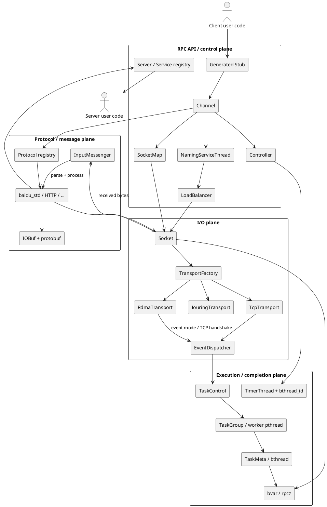

### 1.2 组件职责、关键对象和代码入口

| 层次 | 组件 | 主要职责 | 当前代码入口 |
|---|---|---|---|
| API | protobuf Stub | 将强类型方法调用转成 `RpcChannel::CallMethod` | `test.proto` 生成代码；框架入口是 `Channel::CallMethod` |
| 客户端控制 | `Channel` | 合并选项、序列化请求、配置 timeout、启动 RPC | `src/brpc/channel.cpp:179,332,446` |
| RPC 状态 | `Controller` | request/response attachment、错误、超时、重试、correlation id、Closure | `src/brpc/controller.cpp:606,883,1060,1286,1336` |
| 寻址 | Naming Service + LB | 把服务发现结果维护为 SocketId 集合并按策略选 server | `src/brpc/details/naming_service_thread.cpp`、`src/brpc/details/load_balancer_with_naming.cpp` |
| 连接复用 | `SocketMap` | 按 endpoint + ChannelSignature 共享主 Socket | `src/brpc/socket_map.cpp:100,233` |
| 服务端控制 | `Server` | service/method 注册、监听、并发限制、生命周期 | `src/brpc/server.cpp:826,1100,1355` |
| 接入 | `Acceptor` | 监听 fd 事件、accept 到 EAGAIN、创建连接 Socket | `src/brpc/acceptor.cpp:52,251` |
| 连接 | `Socket` | fd、引用生命周期、连接、读缓存、串行写队列、错误传播 | `src/brpc/socket.cpp:575,720,1611,1688,2075,2205` |
| I/O 抽象 | `Transport` | 为 TCP/RDMA/io_uring 统一读写、等待和消息排队接口 | `src/brpc/transport.h`、`src/brpc/transport_factory.cpp` |
| 事件 | `EventDispatcher` | epoll/kqueue 轮询，把 fd 事件转成 consumer bthread | `src/brpc/event_dispatcher.cpp`、`src/brpc/event_dispatcher_epoll.cpp:58,197` |
| 收包 | `InputMessenger` | 协议识别、切帧、认证、批量派发消息 | `src/brpc/input_messenger.cpp:105,206,324` |
| 协议 | `Protocol` 函数表 | parse、serialize、pack、process request/response | `src/brpc/protocol.h`、`src/brpc/global.cpp:420` |
| Buffer | `IOBuf` | 引用计数 block 链、零拷贝拼接/切分、readv/writev 适配 | `src/butil/iobuf.h:66`、`src/butil/iobuf.cpp:650,713,1044` |
| 调度 | `TaskControl` | 全局 worker、tag 分区、唤醒、跨组 work stealing | `src/bthread/task_control.cpp:90,213,528,564` |
| 调度 | `TaskGroup` | 每 worker 的本地/远端队列、上下文切换、任务回收 | `src/bthread/task_group.cpp:161,351,564,739,851` |
| 观测 | bvar/rpcz/builtin | 指标、延迟、连接、bthread、trace、pprof 页面 | `src/bvar`、`src/brpc/span.cpp`、`src/brpc/builtin` |

### 1.3 关键对象之间不是一一对应

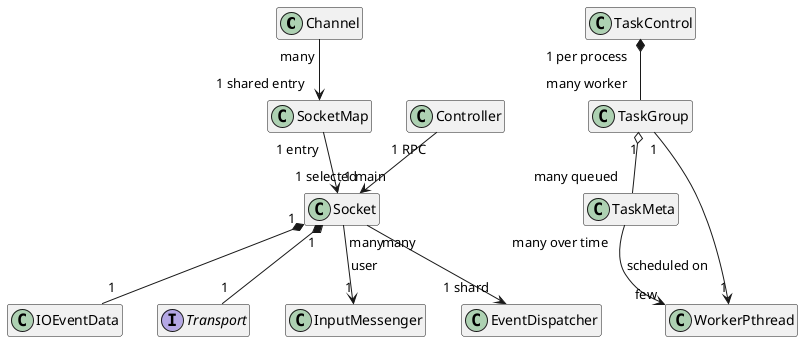

因此不能把以下概念混为一谈：

- 一个 `Channel` 不一定对应一条独占 TCP/RDMA 连接。
- 一个 `Socket` 不是一个线程。
- 一个 bthread 不是一个 pthread。
- 一个网络 read 可能切出多条 RPC；一条 RPC 也可能跨多个 read/CQE 才完整。
- 一个 RPC 在重试或 backup request 情况下可能对应多个 versioned call id。

## 2. 初始化和生命周期

### 2.1 全局初始化

`GlobalInitializeOrDie()` 由 `pthread_once` 保护。`global.cpp:328` 的初始化工作包括：

1. 忽略 `SIGPIPE`，初始化 SSL 和公共字符串。
2. 注册 bthread span 回调。
3. 注册 naming service 扩展，如 file/list/http/consul/discovery/nacos。
4. 注册 rr/wrr/random/la/consistent-hash 等负载均衡器。
5. 注册 gzip/zlib/snappy、CRC32C。
6. 注册每个协议的函数表。
7. 为全局 client-side `InputMessenger` 安装 response handler。

以 `baidu_std` 为例，注册的是一组函数指针：

```text
ParseRpcMessage
SerializeRpcRequest
PackRpcRequest
ProcessRpcRequest
ProcessRpcResponse
VerifyRpcRequest
```

这解释了 brpc 为何能让不同协议复用同一个 `Socket`、`InputMessenger` 和 bthread 执行框架。

### 2.2 Server 启动

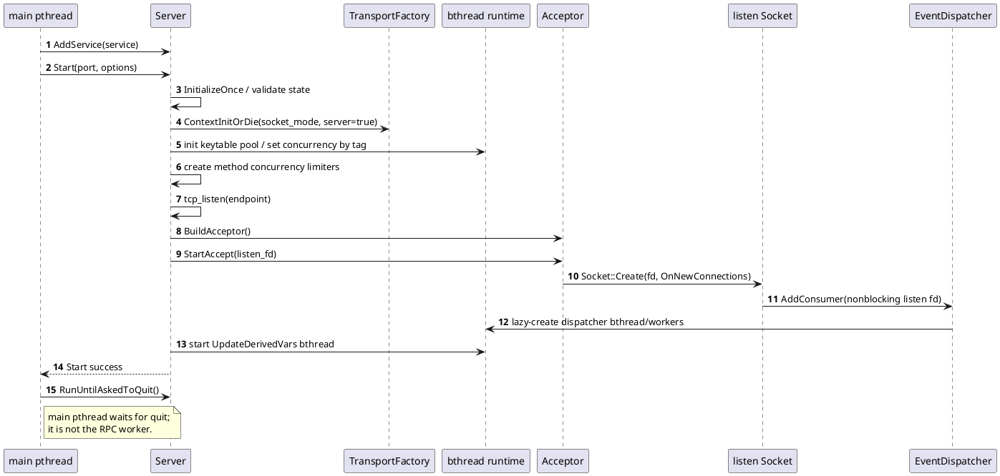

关键实现细节：

- `Server::StartInternal` 先初始化 transport context，再建立 listener；RDMA 模式会在这里初始化 HCA/内存池/poller。
- 监听 fd 也被包装成 `Socket`，回调是 `Acceptor::OnNewConnections`。
- `Acceptor::OnNewConnectionsUntilEAGAIN` 在 edge-trigger 语义下一直 accept 到 `EAGAIN`。
- 每个 accepted fd 再创建一个普通连接 `Socket`，继承 server 的 `socket_mode`、`bthread_tag` 和 keytable pool。
- `ServerOptions.num_threads` 控制 bthread worker concurrency，不是“给每个连接预建线程”。

### 2.3 Channel 初始化

直连模式的 `Channel::InitSingle`：

1. 解析并校验 protocol、connection type 和 transport 选项。
2. 计算 `ChannelSignature`。
3. 用 `endpoint + signature` 插入全局 `SocketMap`。
4. 如果已有健康且签名相同的主 Socket，则只增加引用计数。
5. 否则创建一个尚可未连接的主 Socket；真正 connect 可延迟到第一次写。

命名服务模式额外创建 `LoadBalancerWithNaming`，由 `NamingServiceThread` 持续把服务发现结果转成 SocketId 增删事件，LB 在每次 RPC 中选择目标。

## 3. 客户端一次 RPC 的完整路径

### 3.1 `Channel::CallMethod` 的状态机

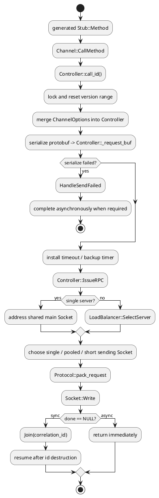

逐步解释：

1. 生成的 protobuf Stub 只是调用其 `RpcChannel`，即 `Channel::CallMethod`。
2. `Controller::call_id()` 用 `bthread_id_create2` 创建 correlation id，并绑定 `HandleSocketFailed`。
3. `CallMethod` 按 `2 + max_retry` 扩展版本范围。base id 用于取消/超时，`base+1` 是首发，之后版本对应 retry。
4. Channel 选项只在 Controller 没显式设置时生效，包括 timeout、backup request、connection type。
5. 协议的 `serialize_request` 把 protobuf body 写入 `Controller::_request_buf`。
6. timeout 由全局 bthread timer thread 维护；到期时调用 `bthread_id_error(cid, ERPCTIMEDOUT)`，不是创建一个睡眠线程。
7. `IssueRPC` 选择目标 Socket、处理认证和 connection type，再调用协议 `pack_request`。
8. `Socket::Write` 首先在当前 bthread/pthread 中尝试快写；只有连接未完成、部分写、EAGAIN、SSL 或显式后台写时才需要后续 `KeepWrite` bthread。
9. 同步调用通过 `Join(cid)` 挂起当前 bthread；异步调用保存 `done` 后直接返回。

### 3.2 baidu_std 的线格式和数据形态

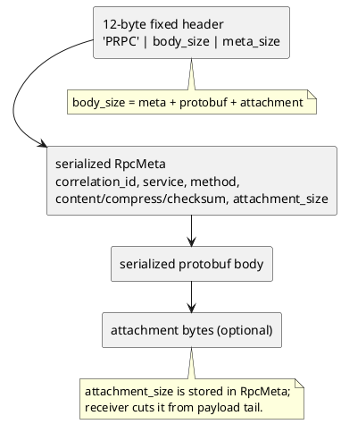

`ParseRpcMessage` 先检查 12 字节头：

- magic 必须是 `PRPC`；
- `body_size` 不能超过 `max_body_size`；
- 输入不足时返回 `PARSE_ERROR_NOT_ENOUGH_DATA`，保留数据等待下次 read；
- 完整后从 `_read_buf` 中把 meta 和 payload `cutn` 出来。

`IOBuf` 让这一步多数是引用操作：

- `append(const IOBuf&)` 增加 block 引用；
- `cutn(IOBuf*)` 移动完整 `BlockRef` 或拆成两个 offset/length 引用；
- `pop_front` 只移动 offset；
- TCP 最终用 iovec/writev 将多个 block 写入内核；
- RDMA 最终将 block 转成带 lkey 的 SGE。

“零拷贝”需要分层理解：引用拼装无 payload memcpy，不等于 TCP 从用户态到内核不拷贝；RDMA 注册内存才允许 NIC DMA 直接访问用户 block。

## 4. 服务端从 fd 事件到业务方法

### 4.1 TCP/epoll 基线路径

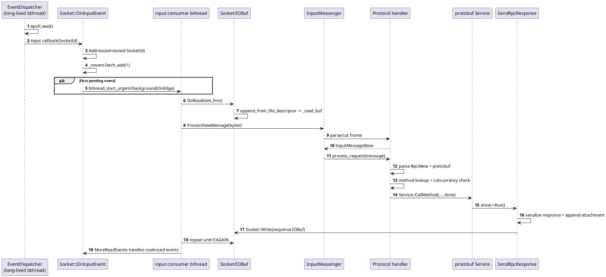

执行上下文要点：

- `EventDispatcher` 自身是带 `BTHREAD_NEVER_QUIT | BTHREAD_GLOBAL_PRIORITY` 的长期 bthread。
- dispatcher 不直接做协议解析；`Socket::OnInputEvent` 通过 transport 创建 consumer bthread。
- `_nevent` 合并同一 Socket 在消费期间到达的事件，避免无限创建 reader bthread。
- `InputMessenger::OnNewMessages` 按历史平均消息大小估计本次 read，大约是 `avg_msg_size * 16`，再受上下限约束。
- edge-trigger 下必须持续读到 EAGAIN，之后通过 `MoreReadEvents` 检查处理期间是否又有事件。

### 4.2 同一次 read 中有多条消息时

`InputMessenger::ProcessNewMessage` 有一个重要的批处理优化：

1. 在当前 consumer bthread 中连续切出所有完整帧。
2. 前面的消息用 `BTHREAD_NOSIGNAL` 创建 `ProcessInputMessage` bthread，但暂不逐个唤醒 worker。
3. 最后一条消息保存在 `InputMessageClosure` 中。
4. TCP 和非 polling RDMA 通常让最后一条在当前 consumer bthread 的 closure 析构时直接执行。
5. 统一 `bthread_flush()`，一次唤醒批量任务。
6. polling RDMA 会把最后一条也排到新 bthread，防止业务同步操作阻塞 poller。

因此“服务端是否每条 RPC 都创建 bthread”没有单一答案：它取决于 transport、polling 模式、一个批次里切出几条消息，以及 `usercode_in_coroutine/usercode_in_pthread` 选项。

### 4.3 业务方法和响应

`ProcessRpcRequest` 的主要步骤是：

1. 从 `MostCommonMessage::meta` 反序列化 `RpcMeta`。
2. 创建 server-side `Controller`，填入 peer/local address、protocol、trace、收到时间。
3. 检查 Server 状态、全局 max_concurrency、方法 concurrency limiter 和连接 overcrowded 状态。
4. 按 service name + method name 查找 `MethodProperty`。
5. 按 `attachment_size` 把 payload 前部切成 protobuf body，尾部 swap 到 `request_attachment`。
6. 从 message factory 取得 request/response 对象并反序列化请求。
7. 创建绑定 `SendRpcResponse` 的 done Closure。
8. 调用生成的 protobuf `Service::CallMethod`。
9. 用户同步完成时 `ClosureGuard` 触发 done；异步服务可以保存 done，在未来任意时刻调用。
10. `SendRpcResponse` 序列化响应、构造相同 PRPC 帧、写回原 Socket，并释放并发额度和请求资源。

## 5. 响应、超时、重试和完成语义

### 5.1 正常响应

客户端 `ProcessRpcResponse`：

1. 解析 response `RpcMeta`。
2. 用 meta 中的 versioned correlation id 执行 `bthread_id_lock`，得到原 `Controller*`。
3. 如果 id 已超时、已被其他版本完成或已销毁，响应被视为迟到响应并丢弃。
4. 根据 `attachment_size` 切分 response body/attachment。
5. 反序列化到用户传入的 response protobuf。
6. `ControllerPrivateAccessor::OnResponse` 进入重试判定或 `EndRPC`。
7. `EndRPC` 删除 timeout timer、回收/失效连接、反馈熔断器与 LB，然后运行异步 done 或销毁 id 唤醒同步 Join。

### 5.2 竞态由 correlation id 仲裁

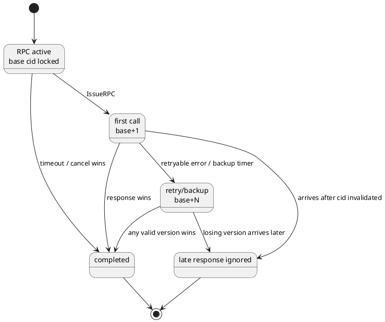

### 5.3 同步与异步的区别

| 类型 | 调用点行为 | 完成点行为 |
|---|---|---|
| 同步，`done == NULL` | `Channel::CallMethod` 在 `Join(cid)` 挂起；若当前是普通 bthread，会让出 worker | `EndRPC` 销毁/解锁 id，Join 被唤醒 |
| 异步，`done != NULL` | 发起后立即返回 | 通常在 response processing bthread 上运行 done |
| 需要隔离的异步完成 | 立即返回 | `OnVersionedRPCReturned` 可创建 `RunEndRPC` bthread，避免 inline 回调死锁或 pthread user-code 模式问题 |

用户必须保证异步 RPC 的 Controller、request、response 和 Closure 生命周期覆盖 RPC 完成。

## 6. bthread 的实现原理

### 6.1 先区分四个层次

bthread 是用户态 M:N 调度器，不是“每次 RPC 创建一个轻量 pthread”。一次普通 bthread 创建只产生逻辑任务；真正承载它执行的是已经存在的 worker pthread。

| 层次 | 关键对象 | 数量和作用域 | 职责 |
|---|---|---|---|
| 全局调度器 | `TaskControl` | 进程级，首次使用 bthread 时惰性创建 | 管理 worker、tag、ParkingLot、全局 priority queue 和跨组窃取 |
| worker 执行器 | pthread + `TaskGroup` | 通常一对一 | 保存本地 WSQ、remote queue、main/idle context，执行调度循环 |
| 逻辑任务 | `TaskMeta` | 每个存活 bthread 一个，从 ResourcePool 取得 | 保存 tid、fn/arg、attr、栈、TLS、sleep/wait 状态和统计 |
| 用户态栈 | `ContextualStack` | 普通 bthread 首次运行时惰性取得，可复用 | 保存寄存器和调用栈，供 `jump_stack` 切换 |

关键入口：

- `src/bthread/bthread.cpp:269`：非 worker 调用的选组和 remote 入队入口。
- `src/bthread/bthread.cpp:330`：`bthread_start_urgent`。
- `src/bthread/bthread.cpp:344`：`bthread_start_background`。
- `src/bthread/task_group.cpp:494`：foreground/urgent 创建。
- `src/bthread/task_group.cpp:564`：background 创建。
- `src/bthread/task_group.cpp:739`：真正的上下文切换 `sched_to`。
- `src/bthread/task_control.cpp:528`：同 tag work stealing。

### 6.2 worker、TaskGroup 和 TaskMeta 的关系

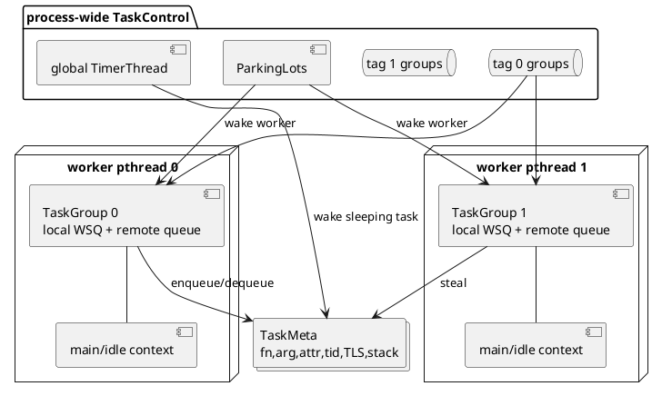

`get_or_new_task_control()` 通过锁和原子指针惰性创建 `TaskControl`，初始并发来自 `bthread_min_concurrency` 或 `bthread_concurrency`。`TaskControl` 创建配置数量的 worker pthread。每个 worker 在 `src/bthread/task_control.cpp:90-136` 中：

1. 创建一个 `TaskGroup`。
2. 注册到指定 tag 的 group 数组。
3. 把 `tls_task_group` 指向这个 group。
4. 进入 `run_main_task()`。
5. 无任务时停在 ParkingLot；有任务时从队列取任务或执行 work stealing。

每个 `TaskGroup` 自己还有一个特殊 main `TaskMeta` 和 main stack，代表 worker 的调度/idle 上下文。普通任务无处可运行时回到 main task；worker 不是销毁后重建。

`TaskMeta` 的主要字段见 `src/bthread/task_meta.h:67-153`：

| 字段 | 含义 |
|---|---|
| `tid`、`version_butex` | 逻辑任务标识和 ABA 防护；同时是 join 等待对象 |
| `fn`、`arg` | 用户入口函数和参数 |
| `attr` | stack type、flags、keytable pool、tag、name |
| `stack` | 可为空；首次真正运行时才分配/复用 |
| `current_waiter`、`current_sleep` | 当前 butex waiter 或 timer id，供 interrupt/stop 使用 |
| `stop`、`interrupted` | 协作式停止/中断状态，不是强制杀线程 |
| `local_storage` | bthread TLS 的持久副本 |
| `stat` | CPU 时间、上下文切换次数等 |

### 6.3 一次 background 创建的逐步过程

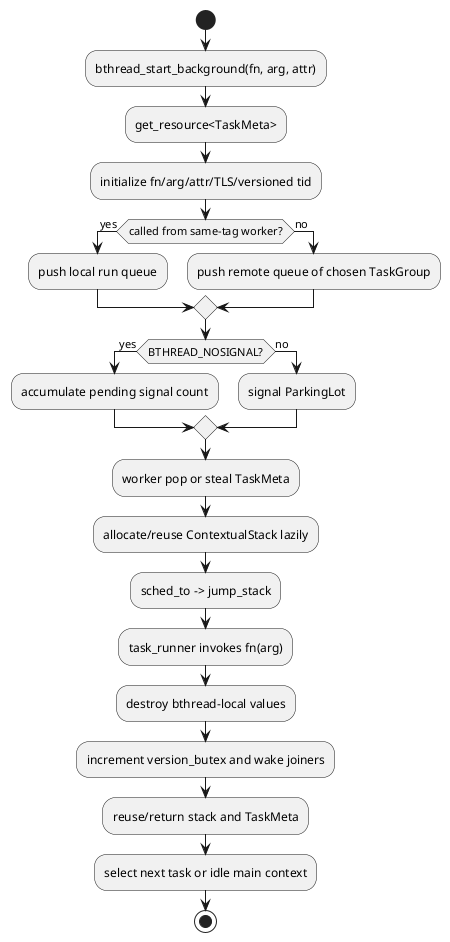

以 `bthread_start_background(&tid, &attr, fn, arg)` 为例：

1. `bthread.cpp:344-356` 读取当前 pthread 的 `tls_task_group`。
2. 如果调用者正运行在同 tag worker 上，调用 `start_background<false>`，目标是当前 group 的本地队列。
3. 如果调用者不是 worker，或者 attr 指定了另一 tag，先取得全局 `TaskControl`，在对应 tag 中选择一个 group，再调用 `start_background<true>`。
4. `task_group.cpp:571-598` 从 ResourcePool 取得一个可复用 `TaskMeta`，重置 sleep/stop/interrupted 状态，写入 fn、arg、attr、TLS 初值和统计。
5. `tid = make_tid(*version_butex, slot)`：高 32 位是版本，低 32 位是 ResourcePool slot。slot 复用时版本已变化，所以旧 tid 不会指向新任务。
6. 此时不要求已有用户态栈；`m->stack` 必须为 NULL。
7. 本地创建走 `ready_to_run()`，非 worker/跨组创建走 `ready_to_run_remote()`。
8. 非 NOSIGNAL 创建会调用 `TaskControl::signal_task()` 唤醒 ParkingLot 中的 worker；一次调用最多唤醒 2 个，避免惊群。
9. worker 取到 tid 后，若 `TaskMeta::stack == NULL`，才按 stack type 获取 `ContextualStack`，然后 `sched_to()`。

因此“创建成功”只表示 TaskMeta 已初始化且可调度，不表示用户函数已经开始执行。打开 `--show_bthread_creation_in_vars` 后，框架会记录创建到首次运行的 pending time。

### 6.4 local queue、remote queue 与唤醒

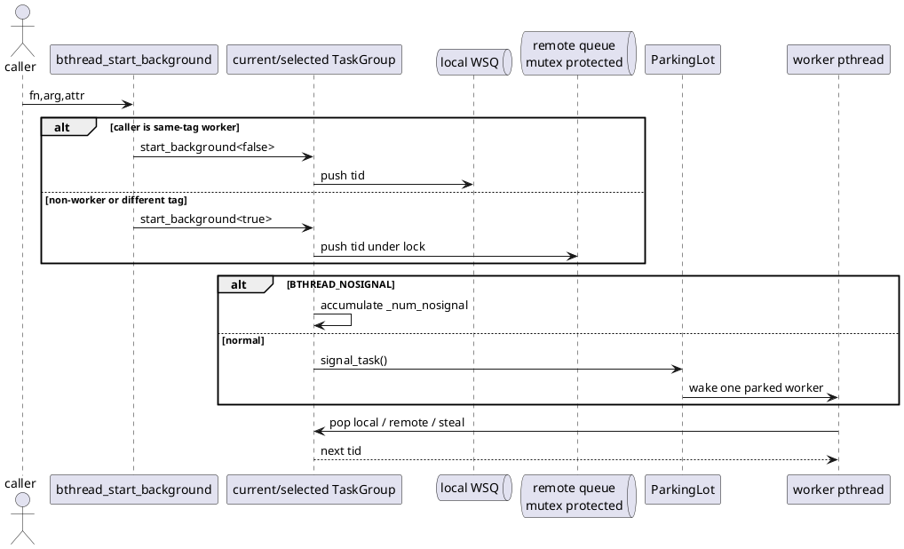

两种队列不是同义重复：

- `_rq` 是 owner worker 优化的 work-stealing queue。owner 从一端 pop，其他 worker 从另一端 steal。
- `_remote_rq` 允许非 owner pthread 安全投递，push 需要锁；本组 worker和其他窃取者都可 pop。
- 非 worker 连续创建 NOSIGNAL 任务时，`tls_task_group_nosignal` 会记住第一次选择的 group，使批任务集中进入同一 remote queue；`bthread_flush()` 才统一 signal。
- 队列满并不意味着丢任务；remote push 会 flush、报限频错误并重试，但这已经是严重背压信号。

### 6.5 worker 如何选择下一个任务

`TaskGroup::run_main_task()` 的循环是 `wait_task -> sched_to -> task_runner`。调度优先关系可归纳为：

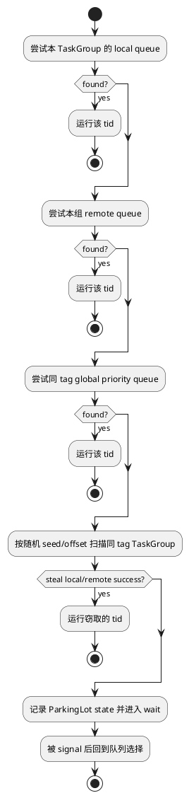

这里有三个重要结论：

1. `TaskControl` 是全局协调器，不是一条中央 runnable queue；主要任务仍分布在各 `TaskGroup`。
2. work stealing 只扫描当前 tag 的 group，任务不会自动跨 tag 执行。
3. `BTHREAD_GLOBAL_PRIORITY` 使用 tag 内的 priority queue；EventDispatcher 会使用该标志，但派生的 Socket consumer bthread 会清掉它，避免普通请求长期压制其他任务。

### 6.6 background、urgent、NOSIGNAL 和 pthread stack

- `bthread_start_background`：新任务排队，当前 bthread 继续运行。
- `bthread_start_urgent`：同 tag 普通 bthread 中，把当前任务安排回队并立即 `sched_to` 新任务；这是一种调度优先，不是 OS 实时优先级。
- `BTHREAD_NOSIGNAL`：只入队，不立即唤醒 worker；适合批量建任务。
- `bthread_flush`：一次发出累计信号。
- `BTHREAD_ATTR_PTHREAD`：任务直接使用 worker pthread 的 main stack。此类任务中的阻塞式 bthread API会阻塞 pthread，且 urgent 创建不会强行切走当前 pthread-stack 任务。
- tag：限制 worker/group/steal 范围；Server、EventDispatcher、RDMA poller 可用它形成调度隔离域。

| flag/属性 | 直接效果 | 常见误解 |
|---|---|---|
| `BTHREAD_NOSIGNAL` | 延迟 worker 唤醒，不延迟入队 | 不是“先缓存在调用者，flush 才创建” |
| `BTHREAD_NEVER_QUIT` | 标识长期框架任务 | 不是无限重试或不可 stop |
| `BTHREAD_INHERIT_SPAN` | 创建/继承 rpcz parent span | 不是继承全部 TLS |
| `BTHREAD_GLOBAL_PRIORITY` | 进入 tag 的全局优先队列 | 不是跨 tag 抢占 |
| `attr.tag` | 选择 worker 调度域 | tag 不是连接或 RPC 会话 id |
| `attr.keytable_pool` | 为该任务提供可借用 TLS KeyTable | 不是把当前任务 TLS 复制给子任务 |

### 6.7 栈获取、切换与结束任务的栈复用

普通 background 创建阶段不分配栈。worker 真正要运行它时：

1. 若目标 TaskMeta 无栈，按 `attr.stack_type` 从栈池获取 `ContextualStack`。
2. 获取失败或要求 pthread stack 时，退化/选择 main stack。
3. `sched_to()` 保存当前 bthread 状态并切换 `_cur_meta`。
4. `jump_stack(cur, next)` 保存/恢复寄存器和栈指针。
5. 首次进入新栈时落到 `task_runner()`，执行 `m->fn(m->arg)`。

结束任务有额外优化：`ending_sched()` 先找下一个 runnable task；如果它还没有栈且 stack type 相同，可把刚结束任务的栈直接移交给下一任务。这样避免 `return_stack -> get_stack` 的往返。

### 6.8 `sched_to()` 到底保存什么

`TaskGroup::sched_to` 在 `jump_stack` 前后处理：

- 把 worker TLS 镜像 `tls_bls` 保存到当前 `TaskMeta::local_storage`，再装入下一个任务的副本；
- 把当前 `errno` 和 `tls_unique_user_ptr` 保留在当前调用栈，任务恢复后还原；
- CPU 时间和切换次数；
- tracer 的 JUMPING/RUNNING 状态；
- ASan fiber hook；
- 结束任务的延迟资源回收。

`jump_stack()` 返回的位置不一定仍在原来的 worker：任务可能被窃取后在另一个 `TaskGroup` 恢复，所以代码会重新读取 `tls_task_group`。这也是不能把原 worker 指针长期缓存到普通局部状态之外的原因。

### 6.9 sleep、yield、butex 和 join 如何让出 worker

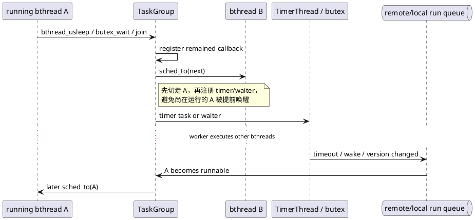

- `bthread_usleep(0)` 等价于 yield；正数延时在切走以后才向全局 TimerThread 注册。
- timer 到期回调运行在非 worker 线程中，因此把原 TaskMeta 投递到某个同 tag group 的 remote queue。
- butex 是 bthread 可感知的等待原语；等待者从 runnable 队列消失，wake 后重新入队。
- `bthread_join(tid)` 读取 tid 中的 expected version，在 `TaskMeta::version_butex` 上等待；目标结束递增版本并 wake，join 再用 acquire fence 保证看到目标任务的写入。
- 如果当前是 `BTHREAD_ATTR_PTHREAD` 任务或普通 pthread，某些 API 会走系统阻塞路径，无法释放 worker。

### 6.10 stop/interrupt 是协作式的

`bthread_stop(tid)` 先设置 `stop`，再进入 interrupt：

1. 校验 tid version，避免作用到已复用的 TaskMeta。
2. 将 `interrupted=true`。
3. 如果目标睡眠，取得并取消 `current_sleep` timer，重新把任务入队。
4. 如果目标在 butex 上等待，尝试从 waiter 队列摘除并重新入队。
5. 如果目标正在运行，不能抢占杀死它；标志保留到下一次可中断阻塞或由用户代码检查 `bthread_stopped()`。

所以 bthread 调度是协作式的。长时间纯计算、不 yield、不进入 bthread 同步原语的用户函数会持续占用一个 worker。

### 6.11 任务退出、TLS 析构和资源回收顺序

`task_runner()` 的退出顺序非常讲究：

1. 用户函数返回，或 `bthread_exit` 抛出的内部 `ExitException` 被捕获。
2. 若继承 span，执行 bthread-end span callback。
3. 在 tid 失效之前归还/析构 KeyTable；析构函数产生的副作用必须先对 joiner 可见。
4. 清理 rpcz parent span。
5. 在 `version_lock` 下递增 `version_butex`，使旧 tid 失效。
6. wake 所有 joiner。
7. 减少活跃 bthread 计数。
8. 用 remained callback 延迟归还刚离开的 stack 和 TaskMeta；不能在仍运行于该栈时释放它。
9. `ending_sched()` 直接选择下一个任务，或回到 main/idle context。

这解释了为什么 TaskMeta/stack 的“销毁”通常是回池复用，而不是每次调用 `delete/free`。

## 7. IOBuf 的设计原理和工作机制

### 7.1 为什么不用一块连续 `std::string`

RPC 数据会经历协议头拼接、protobuf 序列化、attachment 追加、切帧、拆 body/attachment 和网络 scatter/gather。若每一步都要求连续内存，就会反复扩容和 memcpy。IOBuf 的目标是：

- 用共享引用完成拼接、切分和传递；
- 在小消息上避免额外堆分配；
- 直接适配 protobuf ZeroCopyStream、readv/writev、RDMA SGE；
- 让 payload 生命周期由引用计数覆盖异步 I/O。

IOBuf 是 thread-compatible，不是 thread-safe：不同线程操作不同 IOBuf 安全；多个线程并发修改同一个 IOBuf 不安全。

### 7.2 Block、BlockRef、SmallView 和 BigView

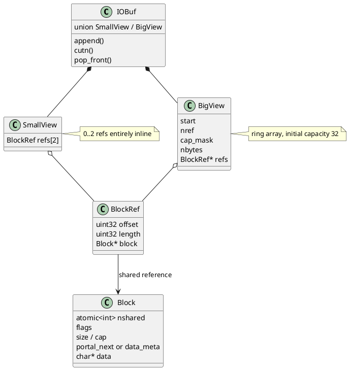

源码入口是 `src/butil/iobuf.h:59-107` 和 `src/butil/iobuf_inl.h:463-578`。

- `Block` 是实际字节存储和原子引用计数单位。
- `BlockRef` 只是某个 Block 的 `[offset, offset+length)` 视图。
- 最多两个 ref 时放在 IOBuf 对象内的 `SmallView`，无需 ref-array 堆分配。
- 第三个不连续 ref 到来时升级为 `BigView`；其 refs 是环形数组，初始容量 32，满后翻倍。
- ref 数减少到 2 时降级回 SmallView并释放 refs 数组。
- 新 ref 与尾 ref 指向同一 Block 且物理相邻时会合并，减少引用计数和 iovec 数量。

默认 block 总分配尺寸是 8192 字节，包含 Block 头；`SetDefaultBlockSize()` 要求 4096 的整数倍。普通 Block 的头和 data 位于同一次分配中，提升局部性。

### 7.3 引用计数和所有权

`Block::nshared` 使用原子引用计数：

- 复制 IOBuf、`append(const IOBuf&)` 或构造共享子区间会 `inc_ref()`。
- move append/完整 ref 的 `cutn(IOBuf*)` 转移现有引用，不增加计数。
- ref 被 pop/clear 时 `dec_ref()`。
- 最后一个普通引用释放时调用当前 `blockmem_deallocate`。
- user-data Block 最后一个引用释放时调用用户提供的 deleter。

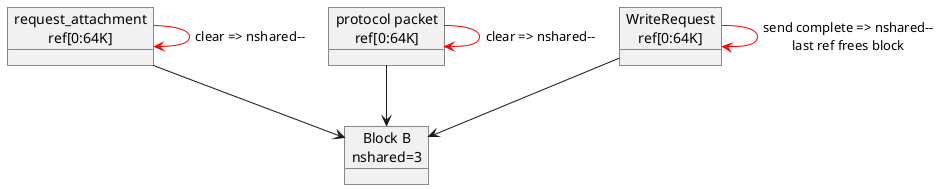

异步 Socket/RDMA 写必须让 WriteRequest 持有 IOBuf 引用直到写完/completion；不能因为应用层 Controller 已经返回就提前释放底层字节。

### 7.4 常见操作到底复制不复制

| 操作 | payload 是否复制 | 主要动作 |
|---|---|---|
| `append(const IOBuf&)` | 否 | 复制 BlockRef、增加 Block 引用计数 |
| `append(Movable)` | 否 | swap 或移动 BlockRef，清空源 IOBuf |
| `append_to(IOBuf*)` | 否 | 为指定区间创建共享 BlockRef |
| `cutn(IOBuf*)` | 否 | 完整 ref 直接移动；半截 ref 共享并推进原 offset |
| `pop_front/pop_back` | 否 | 推进 offset/length 或释放 ref |
| `append(void*, n)` | 是 | memcpy 到 TLS block 的空闲尾部 |
| `cutn(void*)` / `copy_to(void*)` | 是 | 按 ref 分段 memcpy 到连续目标 |
| `to_string` / `append_to(string*)` | 是 | flatten 成连续 string |
| `append_user_data` | 否 | 外部内存包装为特殊 Block，生命周期交给 deleter |

“零拷贝”只意味着 IOBuf 操作没有复制 payload，不意味着整个网络路径完全没有复制。

### 7.5 IOPortal 如何接收，IOBuf 如何发送

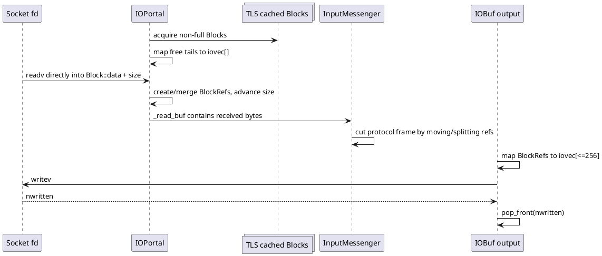

接收路径 `IOPortal::pappend_from_file_descriptor()` 最多准备 64 段空闲 block 尾部，`readv` 直接填入最终 block。发送路径最多把 256 个 ref 映射为栈上 iovec；256 而不是系统常见 IOV_MAX=1024，是为了控制小 bthread 栈的占用。

普通 TCP 中：

- 避免了“碎片 IOBuf -> 连续用户缓冲”的 flatten copy；
- `writev` 仍把用户内存复制进内核 socket buffer；
- 接收仍由内核复制到用户态 block。

RDMA 中注册的 block 可进一步直接映射为 SGE，让 NIC DMA 访问用户内存；但未注册 block、SGE 数量/窗口限制或协议实现仍可能触发拷贝/合并。

### 7.6 protobuf ZeroCopyStream 的作用

`IOBufAsZeroCopyOutputStream::Next()` 把当前 block 的可写尾部直接交给 protobuf 序列化器；protobuf 写完后用 `BackUp(count)` 退回未使用字节。于是 protobuf body 直接形成 IOBuf 的 BlockRef，而不是：

```text
protobuf -> 临时连续 string -> memcpy -> IOBuf
```

反序列化侧 `IOBufAsZeroCopyInputStream` 逐个暴露 BlockRef 的连续片段。这里的 zero-copy 指 protobuf 与 IOBuf 之间不额外 flatten；解析字段本身仍会创建/写入 protobuf 对象。

### 7.7 IOBuf 的 pthread TLS block cache

`src/butil/iobuf.cpp:266-395` 定义 `static __thread TLSData g_tls_data`，每个 OS pthread 缓存非满 Block：

1. `share_tls_block()` 让频繁的小 append 继续写当前非满 block。
2. `acquire_tls_block()` 把一个 block 从 cache 链摘下，供 IOPortal/Builder独占填充。
3. `release_tls_block()` 把非满 block 归还当前 pthread cache。
4. cache 软上限默认为 8 个 block；开启 IOBuf profiler 时为 0。
5. 第一次使用时注册 `thread_atexit(remove_tls_block_chain)`。

这份 TLS 不会跟随 bthread 切换。bthread 从 worker 0 迁移到 worker 1 后，后续 append 使用 worker 1 的 block cache。这是安全的，因为 cache 只负责分配/复用 Block，Block 自身用原子引用计数管理跨线程生命周期；但它不能保存请求级业务状态。

### 7.8 性能和正确性注意事项

- ref 太碎会增加 BigView 扩容、引用计数、iovec/SGE 和系统调用处理成本；“没有 payload copy”不等于没有成本。
- 大量单字节 `push_back/append` 应改用 `IOBufAppender`、`IOBufBuilder` 或 ZeroCopyOutputStream，减少 ref 管理。
- `fetch(n)` 只有首段连续且足够长时才零复制返回内部指针，否则复制到 aux buffer；返回指针在修改 IOBuf 后可能失效。
- `unsafe_assign(Area, data)` 要求 reserve 后没有从前部 cut/pop、也没有共享底层块，否则可能修改所有共享者。
- `append_user_data` 的 deleter 必须与内存来源匹配，且数据在最后一个 BlockRef 释放前必须保持有效。
- 观察 `/vars/iobuf_block_count`、`iobuf_block_memory`、`iobuf_newbigview_second`、`iobuf_block_count_hit_tls_threshold` 和 IOBuf profiler，区分 payload 容量、碎片与 cache 压力（注册点见 `src/brpc/global.cpp:220-230`）。

## 8. TLS：pthread TLS、bthread TLS 与 Server TLS

### 8.1 “TLS”在这套代码里至少有四种含义

| 名称 | API/对象 | 绑定对象 | 是否随 bthread 迁移 | 用途 |
|---|---|---|---|---|
| 原生 pthread TLS | `__thread`、C++ `thread_local` | OS pthread | 否 | worker 内部快路径、allocator/cache |
| bthread TLS | `bthread_key_create/getspecific/setspecific` | 逻辑 bthread 的 KeyTable | 是 | 需要逻辑任务隔离的状态 |
| IOBuf block TLS cache | `g_tls_data` | OS pthread | 否 | Block 分配复用，不保存请求状态 |
| brpc Server thread-local data | `brpc::thread_local_data()` + keytable pool | 可在请求 bthread 间复用的业务对象 | 通过 pool 复用，不固定到单个 bthread | 避免每个 RPC 创建昂贵对象 |

最危险的误用是：在普通 bthread 业务代码中直接用 C++ `thread_local` 保存“当前请求”。不同 bthread 会在同一 worker 上交替运行，一个 bthread 也可能迁移到另一个 worker，因此既可能串数据，也可能突然看到另一份值。

### 8.2 bthread TLS 的双层表示

`LocalStorage` 目前包含 `keytable`、`assigned_data` 和 `rpcz_parent_span`。它同时存在于两个位置：

- `TaskMeta::local_storage`：属于逻辑 bthread 的持久副本。
- worker pthread 的 `tls_bls`：当前正在运行任务的快速访问镜像。

```plantuml
@startuml
skinparam shadowing false
node "worker pthread" {
  object "tls_bls\ncurrent mirror" as TLS
  component "TaskGroup::sched_to" as S
}
object "TaskMeta A\nlocal_storage=A" as A
object "TaskMeta B\nlocal_storage=B" as B

A --> S : current task
B --> S : next task
S -> A : A.local_storage = tls_bls
S -> TLS : tls_bls = B.local_storage
S -> B : jump_stack to B
note bottom of TLS
运行期间 tls_bls 是真值；
切出时才回写 TaskMeta
end note
@enduml
```

对应代码是 `src/bthread/task_group.cpp:72-83` 和 `:774-833`。因此访问 TLS 必须走公开 API或 `tls_bls`，不能在运行中直接相信 `TaskMeta::local_storage` 总是最新。

### 8.3 key 和两级 KeyTable

`bthread_key_t = {index, version}`。KeyTable 使用稀疏两级表：

- 一级 31 个 `SubKeyTable*`。
- 每个二级表 32 个 data 槽，按需分配。
- 最多 992 个 key。
- 每个槽也记录 key version。

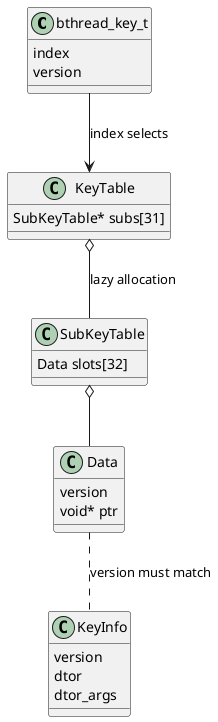

`bthread_key_delete()` 不遍历所有任务清数据，也不调用析构；它递增全局 KeyInfo version 并回收 index。旧 key/旧槽因 version 不匹配而不可见，避免 ABA。删除 key 前，应用仍负责处理正在运行任务中的相关数据。

### 8.4 getspecific/setspecific 和析构语义

- `bthread_setspecific()`：当前没有 KeyTable 时创建新表；如果当前是 bthread，同时写入 `current_task()->local_storage.keytable`；若是普通 pthread，则注册 thread_atexit cleanup。
- `bthread_getspecific()`：有表直接按 index/version 查；没有表且 attr 带 keytable pool 时，尝试借一张预热表。
- 子表只有第一次写入对应 index 范围时才分配。
- 任务结束时，若没有 pool，删除 KeyTable 并执行非空槽的 dtor。
- dtor 可能再次 `setspecific()`，所以与 pthread 一样最多执行 `PTHREAD_DESTRUCTOR_ITERATIONS` 轮。每次调用 dtor 前先把槽置 NULL，防止重复处理旧值。

任务结束必须先处理 TLS，再递增 `version_butex` 唤醒 joiner；否则 join 返回后可能仍看不到 TLS 析构产生的副作用。

### 8.5 keytable pool 为什么存在

短 RPC bthread 若第一次访问 TLS 都 new KeyTable、结束时又析构，成本明显。Server 的 keytable pool 使用两级缓存：

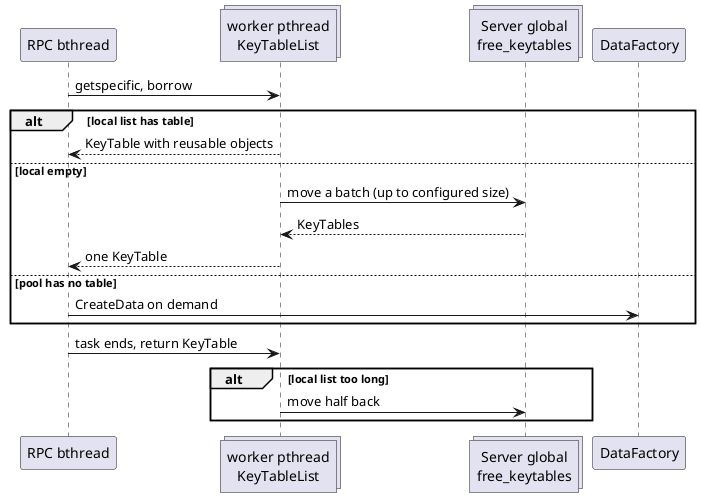

默认优先从当前 worker pthread 的 `ThreadLocal<KeyTableList>` 借用；本地为空时，从 Server 全局 free list 批量搬入；本地列表超过 `key_table_list_size` 时把一半移回全局。

归还到 pool 时不会清除业务对象，因此后续 bthread 会拿到并复用它。对象通常具有 worker 局部性，但全局 free list 允许它迁移；业务对象不能假设永远属于固定 pthread。

### 8.6 `brpc::thread_local_data()` 的完整路径

1. `Server::StartInternal` 总是创建 `_keytable_pool`。
2. 配置 `ServerOptions::thread_local_data_factory` 时，创建带 `DestroyServerTLS` 的 bthread key。
3. `reserved_thread_local_data > 0` 时，启动前预建若干 KeyTable 和业务对象。
4. Acceptor/Socket 把 pool 放入连接和 transport 上下文。
5. TCP、RDMA、io_uring 的 `QueueMessage()` 创建 `ProcessInputMessage` bthread 时，把 `_socket->keytable_pool()` 写入 attr。
6. baidu_std 等协议在进入业务方法前调用 `bthread_assign_data(&server->thread_local_options())`，标识当前请求属于哪个 Server。
7. `brpc::thread_local_data()` 从 `assigned_data` 取得 factory/key，调用 `bthread_getspecific()`；没有对象时 `CreateData()` 并 setspecific。
8. 请求 bthread 结束后，整张 KeyTable 返回 pool，业务对象保留给后续请求。
9. `Server::Join()` 销毁 pool，确保在用户可能 delete key 之前执行对象析构，然后删除 TLS key。

这里“thread-local”更准确的理解是“搜索/处理线程可复用的上下文对象”。它不是每个 RPC 的 session data；请求独占状态应放 Controller/request context 或 `session_local_data`，不能写进可复用 TLS 后不重置。

### 8.7 span、assigned_data 与继承边界

`LocalStorage` 不只有 KeyTable：

- `assigned_data` 是 brpc 私有的快速槽，Server 用它指向 `ThreadLocalOptions`。
- `rpcz_parent_span` 保存父 span 的弱引用包装。
- `BTHREAD_INHERIT_SPAN` 只通过回调创建/继承 span 状态，不会复制整个 KeyTable。

新 bthread 的 `local_storage` 默认清零。除明确的 span 逻辑外，不要假定子 bthread 自动继承父 bthread 的自定义 TLS。

### 8.8 TLS 使用准则和排障

- 请求级逻辑隔离：使用 bthread key 或显式上下文传参，不使用 C++ `thread_local`。
- 分配器、统计 fast path、IOBuf block cache：可使用 pthread TLS，但必须接受 bthread 迁移后换 cache。
- Server 中可重用的解析器/压缩器/临时工作区：适合 `thread_local_data_factory`，每次 RPC 使用前重置状态。
- 与连接/会话绑定的数据：使用 session-local/Socket/Controller 机制，不要误放 thread-local data。
- 析构器中允许再次 setspecific，但应避免循环重建导致达到析构轮数上限。
- 可观察 `/vars/bthread_key_count`、`bthread_keytable_count`、`bthread_keytable_memory`，以及 keytable pool free 数；持续增长通常说明 key 数量、短任务首次分配或 pool 生命周期异常。
- 若同一请求在迁移后状态变化，先检查是否误用了原生 `thread_local`；若跨请求串数据，检查复用对象是否在每次调用前正确 reset。

## 9. Socket、I/O 和连接模型

### 9.1 Socket 写路径

`Socket::_write_head` 是一个多生产者串行化入口：

1. 每次 `Write` 创建 `WriteRequest`，保存 IOBuf、等待 id、pipelined count 等。
2. `exchange` 后若已有 writer，只把自己链接到写队列并返回。
3. 获得写权的调用者先尝试在当前执行流写一次。
4. 写完则直接归还 request；部分写/EAGAIN/SSL/后台模式则启动 `KeepWrite` bthread。
5. `KeepWrite` 每次最多把 256 个 request 的 IOBuf 组成批量数组。
6. TCP 走 `cut_multiple_into_file_descriptor`；RDMA 走 SGE/WR；无窗口时等待对应的 writable 通知。
7. send completion 或写完后才释放相关 BlockRef，保证数据生命周期。

### 9.2 连接类型

| connection_type | 语义 | 适用特点 |
|---|---|---|
| `single` | 多个并发 RPC 复用一条长连接，用 correlation id 区分响应 | baidu_std 默认常见模式；吞吐高 |
| `pooled` | 每次从连接池借一条，RPC 完成后归还 | 不支持同连接多路复用的协议 |
| `short` | 每次调用建立短连接，结束后关闭 | 成本高，主要用于兼容或特殊隔离 |

`rdma_performance` 默认是 `single`。这里的 `thread_num` 并不直接等于连接数：示例每个 `PerformanceTest` 创建一个 Channel，不同 Channel 通常因 SocketMap key/signature 相同而可能共享主 Socket；但具体复用还受 ChannelSignature、生命周期和实现选项影响。压测解读必须同时观察实际 `/connections`。

### 9.3 三种 transport 的边界

| Transport | 触发方式 | 读写核心 | 上层共同路径 |
|---|---|---|---|
| TCP | epoll/kqueue readiness | read/readv、writev，EAGAIN 后等待 EPOLLOUT | Socket、IOBuf、InputMessenger、Protocol、Controller |
| RDMA | verbs completion event 或主动 polling | RC QP、CQ、注册内存 SGE、SEND_WITH_IMM | 完成后仍把字节放入 Socket `_read_buf` 并调用 InputMessenger |
| io_uring | SQE/CQE | `IouringEndpoint` 提交异步 read/write，可用注册 buffer | 仍复用 Socket/协议/业务派发；不是替换整个 brpc |

io_uring 和 RDMA 都是可选 transport，不改变 protobuf Service 或 `Channel::CallMethod` 的编程模型。当前提交的 io_uring 入口是 `src/brpc/iouring_transport.cpp` 和 `src/brpc/iouring/iouring_endpoint.cpp`；本文重点示例是 RDMA，因此不展开其全部 ring 状态机。

## 10. RDMA transport 的实现原理

### 10.1 RDMA 在 brpc 中的位置

brpc 的 RDMA 不是绕过 RPC 框架重新设计一套协议，而是替换 Socket 下方的数据搬运机制：

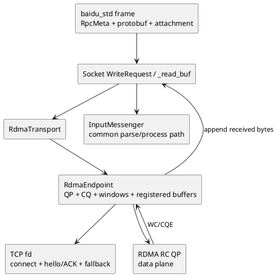

TCP fd 在 RDMA 模式中仍有三个作用：

1. 建立最初的客户端/服务端连接。
2. 交换 RDMA hello 和最终 ACK。
3. 任一方不支持或资源准备失败时，在同一 Socket 上回退到 TCP。

### 10.2 全局初始化和注册内存

`rdma::GlobalRdmaInitializeOrDie` 由 `pthread_once` 保护，主要执行：

1. 动态加载 ibverbs 并调用 `ibv_fork_init`。
2. 选择 active HCA、port、GID，创建 Protection Domain。
3. 查询设备最大 SGE。
4. 初始化 RDMA block pool，把区域注册为 MR。
5. 修改 IOBuf 默认 block allocator，让之后创建的普通 IOBuf block 来自注册池。
6. 预创建一定数量的 QP/CQ resource，降低建连抖动。
7. 把 HCA async fd 包装成 Socket，由 EventDispatcher 处理设备异步事件。
8. 若启用 polling，为每个 bthread tag 初始化 poller group。

因此初始化顺序很重要：在 `GlobalRdmaInitializeOrDie()` 之前分配的普通 IOBuf block 通常没有 lkey。自有内存必须通过 `RegisterMemoryForRdma` 注册，或先复制到已注册 IOBuf block。

### 10.3 TCP 上的 RDMA 协商

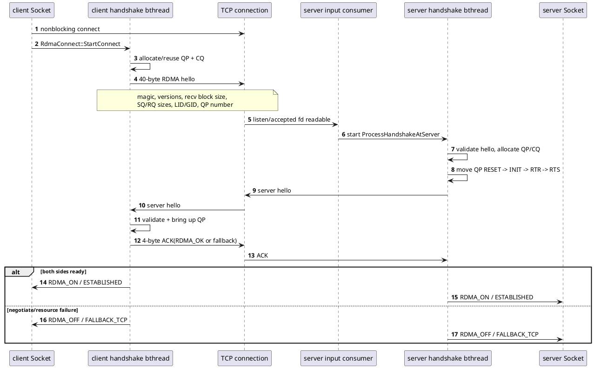

client 握手由每条新 RDMA 连接的 `RdmaProcessHandshakeAtClient` bthread 执行；server 在第一次看到 `RDMA` magic 时创建 `RdmaProcessHandshakeAtServer` bthread。握手 read 遇到 EAGAIN 时等待 `_read_butex`，fd 新事件会唤醒它，而不是忙轮询。

### 10.4 发送路径：IOBuf block 到 SGE/WR

`RdmaEndpoint::CutFromIOBufList`：

1. 读取本地 SQ 和对端 RQ 两个窗口；任一为 0 就返回 EAGAIN 或停止本批发送。
2. 遍历 Socket 写队列中的 IOBuf BlockRef。
3. 为每个 block 找 lkey，生成 `ibv_sge {addr, length, lkey}`。
4. 单个 WR 同时受设备 `max_sge` 和对端 receive block size 限制。
5. 把相同 BlockRef `cutn` 到 `_sbuf[_sq_current]`，使内存在 DMA 完成前保持存活。
6. 提交 `IBV_WR_SEND_WITH_IMM`；immediate data 携带新 post 的 RQ 数量，作为流控 ACK。
7. 减少 `_remote_rq_window_size` 和 `_sq_window_size`。
8. 不是每个 WR 都请求 signaled/solicited completion；按窗口比例和累计字节批量触发，降低 CQE/中断成本。

SEND completion 到达后，根据 `wc.wr_id` 清理一批 `_sbuf`，恢复 SQ window，并通过 `Socket::WakeAsEpollOut()` 唤醒因窗口不足而等待的 `KeepWrite`。

### 10.5 接收路径：预投递 buffer 到统一消息管线

每个 endpoint 预先向 RQ post 注册内存块。RECV completion 的处理是：

1. `ibv_poll_cq` 得到 `ibv_wc`。
2. 对大于 `rdma_zerocopy_min_size` 的消息，把对应 `_rbuf` BlockRef 直接 `cutn` 到 `Socket::_read_buf`。
3. 小消息复制到 `_read_buf`，避免为很小的数据长期占用大注册块。
4. 立即补投一个 recv WR。
5. 用 immediate data 更新对端窗口，用 `SendAck` 通知本端新增的 RQ 空间。
6. 同一轮多个 WC 的字节数先累加，最后只调用一次 `InputMessenger::ProcessNewMessage`。
7. 从此继续走 baidu_std 切帧、protobuf 解析和业务派发，和 TCP 共用上层实现。

### 10.6 event 与 polling 两种完成模式

| 模式 | CQ 组织 | 谁调用 `PollCq` | 业务消息如何隔离 |
|---|---|---|---|
| event，默认 | send CQ + recv CQ + completion channel | completion channel fd 进入 EventDispatcher，再创建 input consumer bthread | 同一批最后消息可在 consumer bthread inline；其他消息创建 NOSIGNAL bthread |
| polling | send/recv 共用 polling CQ | 每个 tag 的长期 `RdmaPolling` bthread/PTHREAD 循环所有 CQ SocketId | 默认所有消息，包括最后一条，都创建 `ProcessInputMessage` bthread，防止业务阻塞 poller |

event 模式使用 one-shot CQ notification。实现先 drain recv/send CQ，再重新 arm，随后再 poll 一轮，避免 CQE 恰好在“最后一次 poll”和“重新 arm”之间到达而丢失唤醒。

## 11. `example/rdma_performance` 端到端分析

### 11.1 示例的业务定义

`test.proto`：

```protobuf
message PerfTestRequest {
    required bool echo_attachment = 1;
}

message PerfTestResponse {
    required string cpu_usage = 1;
}

service PerfTestService {
    rpc Test(PerfTestRequest) returns (PerfTestResponse);
}
```

大负载不在 protobuf message 中，而在 `Controller::request_attachment()` 中。请求 protobuf 只控制 server 是否把 attachment 引用追加到 response attachment。

默认关键参数：

| flag | 默认值 | 含义 |
|---|---:|---|
| `use_rdma` | true | 两端选择 `SOCKET_MODE_RDMA`；false 走 TCP |
| `protocol` | baidu_std | 使用 PRPC 帧和 correlation id |
| `connection_type` | single | 复用长连接 |
| `thread_num` | 0 | 0 表示 sweep 1、2、4...`max_thread_num` |
| `queue_depth` | 1 | 每个 PerformanceTest 维持多少条异步 lane |
| `attachment_size` | -1 | 小于 0 时 sweep 1、4、16...1024 bytes |
| `echo_attachment` | false | server 是否回显 attachment |
| `expected_qps` | 0 | 大于 0 时启用 token bthread 限速 |

这里的 `thread_num` 是历史命名。它实际控制 `PerformanceTest` 实例和启动器 bthread 的数量，不保证等于 worker pthread、连接数或并行 CPU 数。

### 11.2 构建与运行前提

这个示例整体位于 `#ifdef BRPC_WITH_RDMA` 内，CMake 也会查找 `infiniband/verbs.h` 和 `libibverbs`。因此即使运行时指定 `--use_rdma=false`，示例本身仍要求链接一个启用了 RDMA 的 brpc 构建。

典型运行顺序如下；实际库路径以本机 brpc 输出目录为准：

```bash
cd example/rdma_performance
mkdir -p build && cd build
cmake ..
cmake --build . -j

./server --use_rdma=true --port=8002
./client --use_rdma=true \
  --servers=127.0.0.1:8002 \
  --thread_num=4 --queue_depth=8 \
  --attachment_size=1024 --echo_attachment=true
```

TCP A/B 时两端必须同时改为 `--use_rdma=false`。启动后应先从日志确认 RDMA 没有 fallback，再解释 RDMA 结果。

### 11.3 client/server 启动时序

```plantuml
@startuml
skinparam shadowing false
autonumber
participant "server main" as SM
participant "brpc Server" as BS
participant "client main" as CM
participant "RDMA globals" as RG
participant "PerformanceTest" as PT
participant Channel
participant "client/server handshake" as HS
participant "bthread runtime" as BT

SM -> BS : AddService(PerfTestServiceImpl)
SM -> BS : Start(port, socket_mode)
BS -> BS : listen + Acceptor + transport context
SM -> BS : RunUntilAskedToQuit

CM -> RG : GlobalRdmaInitializeOrDie (if use_rdma)
CM -> CM : StartDummyServerAt(dummy_port)
loop k in thread_num
  CM -> PT : new(attachment_size)
  PT -> PT : malloc random source
  PT -> PT : IOBuf.append(source) copies into registered block
  PT -> Channel : Init(server, options)
  PT -> Channel : warmup synchronous Test
  Channel -> HS : delayed TCP connect + RDMA handshake
  HS --> Channel : connection/QP ready or TCP fallback
  Channel --> PT : warmup response
end
opt expected_qps > 0
  CM -> BT : start GenerateToken bthread
end
loop k in thread_num
  CM -> BT : start RunTest bthread
end
@enduml
```

两个常被忽略的事实：

- 构造 attachment 时，`_attachment.append(_addr, size)` 是一次复制；随机源 `_addr` 不是直接作为 IOBuf block 使用。
- RDMA 全局初始化发生在构造 PerformanceTest 之前，因此复制的目标 IOBuf block 来自已注册内存池。

### 11.4 压测不是持续发送线程，而是固定在途闭环

`PerformanceTest::RunTest` 只做：

```text
for i in [0, queue_depth):
    SendRequest()
return
```

每次 `HandleResponse` 成功后再次 `SendRequest()`，形成 lane：

```plantuml
@startuml
skinparam shadowing false
state "RunTest bthread" as Start
state "lane 1 RPC in flight" as L1
state "lane 2 RPC in flight" as L2
state "... lane Q" as LQ
state "response callback" as CB
state "stopped" as Stop

[*] --> Start
Start --> L1 : SendRequest
Start --> L2 : SendRequest
Start --> LQ : queue_depth times
Start --> [*] : launcher bthread exits
L1 --> CB : response/error
L2 --> CB : response/error
LQ --> CB : response/error
CB --> L1 : next SendRequest if running
CB --> Stop : time/iteration/error condition
Stop --> [*]
@enduml
```

因此理想稳态在途请求约为：

```text
inflight ~= thread_num * queue_depth
```

回调处理、请求构造和下一次发送发生在 response processing 的 bthread 上，而不是原 `RunTest` bthread 上。

### 11.5 单次请求的数据变化

以下假设 `attachment_size=N`、`echo_attachment=true`、默认 baidu_std：

| 阶段 | 逻辑对象 | 数据形态 | 是否复制 payload |
|---|---|---|---|
| 构造测试实例 | `_addr` | N 字节随机连续内存 | 生成数据 |
| 构造 attachment | `_attachment` | IOBuf BlockRef 链 | 从 `_addr` 复制一次 |
| `SendRequest` | request protobuf | `echo_attachment=true`，通常是很小的 varint body | protobuf 序列化时写入新 IOBuf |
| request attachment | Controller IOBuf | `append(_attachment)` 后共享 block | 不复制 N 字节 |
| `SerializeRpcRequest` | `_request_buf` | protobuf wire bytes | 写入 IOBuf |
| `PackRpcRequest` | packet IOBuf | PRPC header + RpcMeta + body + N 字节 attachment | IOBuf 引用拼接，通常不复制附件 |
| RDMA send | SGE list | 每个注册 block -> addr/len/lkey | NIC 从注册 block DMA |
| server receive | pre-posted `_rbuf` | NIC 写入注册 receive block | DMA 写入 |
| server `_read_buf` | IOBuf | 大消息移动 receive BlockRef；小消息可能复制 | 取决于 zerocopy threshold |
| protocol cut | meta/body/attachment IOBuf | attachment 从 payload 尾部 swap 出来 | 引用/所有权移动 |
| protobuf request | `PerfTestRequest` | 反序列化后的 bool | 小 body 解析 |
| echo | response attachment | append request attachment，共享 receive block | 不复制 N 字节 |
| response frame | packet IOBuf | header/meta/cpu_usage body/echo attachment | 引用拼接 |
| client receive | `_read_buf` | RDMA receive block 或 TCP read block | 取决于 transport/threshold |
| response parse | response + attachment | cpu_usage 反序列化，attachment swap 到 Controller | 引用/解析 |
| callback | metrics | 记录 latency、请求字节数和 CPU 字符串 | 示例不校验回显内容 |

### 11.6 单次请求的完整 RDMA 时序

```plantuml
@startuml
skinparam shadowing false
autonumber
participant "callback or RunTest bthread" as C
participant "Channel/Controller" as CH
participant "client Socket/RdmaEndpoint" as CE
participant "client NIC" as CN
participant "server NIC" as SN
participant "server PollCq" as SP
participant "InputMessenger" as IM
participant "ProcessInputMessage bthread\nor event consumer" as PB
participant "PerfTestServiceImpl" as SVC
participant "server Socket/RdmaEndpoint" as SE
participant "client PollCq" as CP

C -> C : create Controller/Response/request
C -> C : request_attachment.append(_attachment)
C -> CH : Stub::Test(..., done)
CH -> CH : cid + serialize + timeout timer
CH -> CH : pack PRPC frame
CH -> CE : Socket::Write(IOBuf)
CE -> CE : BlockRefs -> SGE, keep refs in _sbuf
CE -> CN : ibv_post_send(SEND_WITH_IMM)
CN -> SN : RC transport DMA
SN -> SP : RECV WC/CQE
SP -> SP : rbuf -> server Socket::_read_buf
SP -> IM : ProcessNewMessage(aggregated bytes)
IM -> IM : cut PRPC frame
alt RDMA polling
  IM -> PB : NOSIGNAL bthread + flush
else event mode and last message
  IM -> PB : execute in current consumer bthread
end
PB -> PB : ProcessRpcRequest / parse protobuf
PB -> SVC : Test(request, response, done)
SVC -> SVC : set cpu_usage
SVC -> SVC : response_attachment.append(request_attachment)
SVC -> PB : ClosureGuard -> done->Run
PB -> SE : SendRpcResponse -> Socket::Write
SE -> SN : response SGE/WR
SN -> CN : RC transport DMA
CN -> CP : client RECV WC/CQE
CP -> IM : ProcessNewMessage
IM -> PB : ProcessRpcResponse
PB -> CH : lock correlation id / deserialize
CH -> C : EndRPC -> HandleResponse
C -> C : record metrics; SendRequest again
@enduml
```

### 11.7 单次请求的 TCP 分叉

当两端 `use_rdma=false`，从 protobuf 到 PRPC packet 的所有步骤不变。差异只有：

1. 不初始化 HCA/MR/QP/CQ，也不执行 RDMA hello。
2. `TcpTransport::CutFromIOBuf(List)` 使用 writev 风格系统调用。
3. server/client 的 fd readiness 由 epoll EventDispatcher 驱动。
4. `Socket::DoRead` 将内核数据读入 IOBuf block。
5. `InputMessenger` 之后的切帧、业务方法、correlation id 和 callback 完全复用。

#### 11.7.1 固定场景：1KB attachment 的纯 TCP 单请求

下面固定分析两端 `use_rdma=false`、`echo_attachment=true`、`attachment_size=1024`、默认 `baidu_std`、无压缩、无 SSL、`max_retry=0` 的一条正式异步请求。`PerformanceTest::Init()` 中的同步 warmup 虽然设置了 `echo_attachment=true`，但没有向 Controller 追加 attachment；它先完成 TCP 建连，本图从随后 `RunTest -> SendRequest()` 发出的首条正式请求开始。

这里的“1KB 数据包”准确含义是 **1024 字节 attachment**，不是 1024 字节 PRPC 帧，也不是一个 TCP segment。请求 protobuf 本身只有两字节，PRPC header 和动态 RpcMeta 还会增加额外长度；TCP 只提供有序字节流，一次 RPC 可能跨多个 TCP segment/read，也可能与其他 RPC 一起被一次 read 取回。

```plantuml
@startuml
title rdma_performance：use_rdma=false、echo_attachment=true、attachment_size=1024

skinparam shadowing false
skinparam responseMessageBelowArrow true
skinparam sequenceMessageAlign center
skinparam maxMessageSize 58
skinparam defaultFontName "Noto Sans CJK SC"
skinparam defaultFontSize 12
skinparam ArrowFontSize 11
skinparam NoteFontSize 11

box "Client process" #E3F2FD
participant "client main /\nRunTest or callback bthread" as C
participant "Channel + baidu_std\nserialize / pack" as CP
participant "client Socket\nTcpTransport + InputMessenger" as CS
participant "client input consumer\nProcessRpcResponse + EndRPC" as CB
end box

participant "TCP byte stream\nkernel socket buffers" as TCP

box "Server process" #E8F5E9
participant "server Socket\nTcpTransport + InputMessenger" as SS
participant "server input consumer /\nProcessInputMessage bthread" as SB
participant "PerfTestServiceImpl" as SVC
end box

note over C,CS #FFF8E1
  前置 warmup：Init() 同步调用，request 中 echo_attachment=true，
  但 attachment 为空；TCP 连接已在正式计时前建立。
end note

C -> C : 1. main pthread: malloc(1024) + fast_rand_bytes\n_attachment.append(_addr, 1024)
note right of C #FCE4EC
  _addr[1024] -> IOBuf BlockA
  发生一次 1024B 用户态复制。
end note

C -> C : 2. RunTest bthread: SendRequest()\nrequest.echo_attachment=true\nrequest_attachment.append(_attachment)
note right of C #F3E5F5
  request protobuf 对象：bool=true
  Controller attachment：BlockRef -> BlockA
  append(IOBuf) 只增加引用，不复制 1024B。
end note

C -> CP : 3. Stub::Test(..., done)，异步调用
CP -> CP : SerializeRpcRequest\ntrue -> protobuf bytes 08 01
CP -> CP : PackRpcRequest\nheader + RpcMeta + body + attachment refs
note over CP,CS #E0F2F1
  request frame：
  [12B PRPC header][Mreq RpcMeta][2B: 08 01][1024B attachment]
  header.body_size = Mreq + 1026
  frame total = 1038 + Mreq
  Mreq 随 correlation id、service/method name 等字段变化。
end note

CP -> CS : 4. Socket::Write(request IOBuf)\nWriteRequest 持有 frame BlockRefs
alt 首次 writev 完整写入
  CS -> TCP : 5a. BlockRefs -> iovec[] -> writev
else 部分写或 EAGAIN
  CS -> CS : 5b. pop 已写前缀\n创建 KeepWrite bthread
  CS -> CS : WaitEpollOut，挂起 KeepWrite TaskMeta
  TCP --> CS : EPOLLOUT 唤醒
  CS -> TCP : KeepWrite 继续 writev
end
note over CS,TCP #FCE4EC
  writev 将用户态 IOBuf 字节复制到内核 send buffer。
  IOBuf 引用一直保留到相应 WriteRequest 写完。
end note

TCP -> SS : 6. 有序 TCP 字节到达\nEventDispatcher::epoll_wait -> EPOLLIN
note over TCP #FFF8E1
  PRPC frame 与 TCP segment/read 没有一一对应关系。
  分段、合并由 MSS、拥塞、缓冲区和调度时机决定。
end note

SS -> SB : 7. OnInputEvent 合并 _nevent\n创建 input consumer bthread
SB -> SS : DoRead -> IOPortal::readv
SS -> TCP : readv(fd, writable block tails)
TCP --> SS : bytes copied into server BlockS
SS --> SB : Socket::_read_buf
loop 直到 12 + body_size 字节完整
  SB -> SB : ParseRpcMessage\n不完整则保留 _read_buf，等待下一次 read
end

SB -> SB : 8a. cut 12B header、Mreq meta、1026B payload
alt 当前 read batch 的唯一/最后一条完整消息
  SB -> SB : InputMessageClosure 析构\n当前 input consumer 内联处理
else 当前 read batch 的前序消息
  SB -> SB : QueueMessage(BTHREAD_NOSIGNAL)\n创建 ProcessInputMessage TaskMeta
  SB -> SB : bthread_flush() 批量唤醒 worker
end
SB -> SB : 8b. ProcessRpcRequest\ncut 2B request body；swap 余下 1024B attachment\nprotobuf 08 01 -> echo_attachment=true
note right of SB #F3E5F5
  request object：bool=true
  request_attachment：BlockRef -> server BlockS
  cut/swap 转移引用，不复制 1024B。
end note

SB -> SVC : 9. Service::CallMethod -> Test()
SVC -> SVC : set_cpu_usage(...)\nresponse_attachment.append(request_attachment)
note right of SVC #F3E5F5
  server request_attachment 与 response_attachment
  此时共享同一组 BlockS payload。
end note
SVC --> SB : ClosureGuard 析构 -> done->Run()

SB -> SB : 10. SerializeResponse + PackRpcResponse
note right of SB #E0F2F1
  response frame：
  [12B header][Mresp RpcMeta][P bytes cpu_usage][1024B attachment]
  frame total = 1036 + Mresp + P
  通常 cpu_usage=""，P=2（0A 00）；
  周期采样时 P 随字符串长度变化。
end note

SB -> SS : Socket::Write(response IOBuf)
SS -> TCP : 11. BlockRefs -> iovec[] -> writev\n部分写时同样转 KeepWrite
note over SS,TCP #FCE4EC
  server BlockS -> kernel send buffer：发生 TCP 写复制。
  写完后 response frame 释放对 BlockS 的持有。
end note

TCP -> CS : response bytes 到达\nclient EventDispatcher::epoll_wait -> EPOLLIN
CS -> CB : OnInputEvent -> client input consumer bthread
CB -> CS : DoRead -> IOPortal::readv
CS -> TCP : readv(fd, new client block tails)
TCP --> CS : bytes copied into client BlockC
CS --> CB : client Socket::_read_buf

CB -> CB : 12. ParseRpcMessage + ProcessRpcResponse\ncut response body；swap 1024B attachment\nlock correlation id -> EndRPC
note right of CB #F3E5F5
  response protobuf：cpu_usage string
  response_attachment：BlockRef -> client BlockC
  BlockC 与原请求 BlockA、server BlockS 均不是同一物理内存。
end note

CB -> C : HandleResponse(Controller, Response)
C -> C : 记录 latency 和 request_attachment().size()=1024\n未校验 response_attachment 内容；继续 SendRequest()

note over C,CB #FFF8E1
  单条/最后 response 通常在 client input consumer 内联完成；
  若是 read batch 的前序消息，则同样走
  BTHREAD_NOSIGNAL ProcessInputMessage + bthread_flush。
end note
@enduml
```

逐阶段的数据形态和复制/所有权变化如下。表中的 BlockA、BlockS、BlockC 分别代表客户端原始 attachment、服务端 TCP 接收和客户端 TCP 接收产生的 IOBuf block，它们是三组不同的物理内存。

| 阶段 | 执行上下文 | 输入形态 | 处理 | 输出形态 | 复制/所有权 |
|---|---|---|---|---|---|
| 1. 初始化 attachment | `Test()` 所在 main pthread | `_addr[1024]` 随机连续内存 | `_attachment.append(_addr, 1024)` | 长生命周期 `_attachment`，引用 BlockA | 从 `_addr` 向 BlockA 复制一次 1024B |
| 2. 构造单次调用 | 首条请求为 `RunTest` bthread；后续请求为 response callback 所在 bthread | `PerfTestRequest{true}`、`_attachment` | 创建 Controller/Response/Closure；attachment `append(IOBuf)` | request 对象 + Controller 中指向 BlockA 的 BlockRef | 只增加引用，不复制 1024B |
| 3. protobuf 序列化 | 当前调用 bthread | request 对象 | `SerializeRpcRequest` | 两字节 request body：`08 01` | 只写两字节 protobuf 数据 |
| 4. PRPC 打包 | 当前调用 bthread | RpcMeta、2B body、1024B attachment | `PackRpcRequest` 生成 header/meta并追加 body、attachment | `12 + Mreq + 2 + 1024` 字节逻辑帧 | header/meta/body 写入 IOBuf；attachment 引用拼装 |
| 5. client TCP 发送 | 当前调用 bthread；部分写后为 `KeepWrite` bthread | packet IOBuf BlockRefs | 生成 `iovec[]` 并 `writev`；按 `nw` pop 已写前缀 | 内核 send buffer 中的 TCP 字节流 | 用户态到内核复制；WriteRequest 在写完前持有 refs |
| 6. server TCP 接收 | EventDispatcher 触发的 input consumer bthread | 内核 receive buffer 中的若干字节 | `readv` 直接写入 IOPortal block tail | server `_read_buf`，引用 BlockS | 内核到用户态复制；可能多次 read 才形成完整帧 |
| 7. PRPC 切帧 | server input consumer bthread | 完整 `12 + body_size` 字节 | 校验 `PRPC`/长度，cut meta 和 payload | `msg->meta` + `msg->payload(2+1024)` | 主要是 BlockRef 移动/拆分 |
| 8. request 还原 | 当前 input consumer；批次前序消息可能是新 `ProcessInputMessage` bthread | RpcMeta + 1026B payload | cut 前 2B 反序列化；swap 剩余 1024B | `PerfTestRequest{true}` + request attachment BlockS | protobuf 小 body 解析；attachment 不复制 |
| 9. Service 回显 | 同一 request-processing bthread | request/response 对象、request attachment BlockS | 设置 `cpu_usage`；response attachment append request attachment | response 对象 + 同样引用 BlockS 的 response attachment | 只共享引用，不复制 1024B |
| 10. response 打包 | 同一 bthread，`ClosureGuard -> done->Run()` | response body、RpcMeta、BlockS refs | `PackRpcResponse` 组装响应帧 | `12 + Mresp + P + 1024` 字节逻辑帧 | body/meta 写入 IOBuf；attachment refs 移入响应帧 |
| 11. response TCP 往返 | server 当前 bthread/`KeepWrite`，随后 client input consumer | response IOBuf | server writev -> TCP -> client readv | client `_read_buf`，引用新的 BlockC | server 用户态到内核、client 内核到用户态各发生一次复制 |
| 12. client 完成 | client input consumer 或 `ProcessInputMessage` bthread | RpcMeta + `P+1024` payload | cut body、swap attachment、反序列化、cid lock、`EndRPC` | Response 对象 + response attachment BlockC | attachment 仅切分/换所有权；callback 不校验回显内容 |

对应代码关系：

- `example/rdma_performance/client.cpp:79-91,135-190`：构造 `_attachment`、发请求、处理 response 和接续下一条 lane。
- `example/rdma_performance/server.cpp:40-61`：设置 `cpu_usage` 并通过 IOBuf 引用回显 attachment。
- `src/brpc/policy/baidu_rpc_protocol.cpp:68-100,568-825,911-1000,1045-1132`：PRPC header/meta、request/response 拆分和 attachment swap。
- `src/brpc/socket.cpp:1688-1890,2075-2135`、`src/brpc/tcp_transport.cpp:48-105`：写快路径、KeepWrite、writev/readv 和消息任务创建。
- `src/brpc/input_messenger.cpp:181-390`、`src/butil/iobuf.cpp:969-1016,1044-1066,1496-1555`：最后消息内联、NOSIGNAL/flush、BlockRef 拼装和 IOPortal readv。

这使 `--use_rdma=false` 成为很有价值的 A/B 基线：它隔离 transport 成本，而保持协议、业务和压测模型相同。

### 11.8 bthread 何时创建，何时只是复用当前任务

#### client 侧

| 时机 | bthread | 数量/条件 | 说明 |
|---|---|---|---|
| 全局 EventDispatcher 初始化 | `EventDispatcher::RunThis` | 每 tag × `event_dispatcher_num` | 长期任务；承载 epoll wait |
| Dummy Server 启动 | server 内部任务 | 至少 derived vars 等 | 主要用于暴露 bvar/内置服务 |
| RDMA 新连接 | `RdmaProcessHandshakeAtClient` | 每个实际新连接 1 个 | warmup 时发生，握手结束退出 |
| 限 QPS | `GenerateToken` | 每次 `Test` 尝试 1 个 | 周期 sleep，补 token |
| 开始一轮压测 | `RunTest` | `thread_num` 个 | 只发初始 queue_depth，随后退出 |
| 收到 response | input consumer | 每个 input event/batch | TCP/RDMA event 由 transport 创建 |
| response message | `ProcessInputMessage` | 批次多消息时除最后外；polling RDMA 最后一条也创建 | 解析 response 并可能直接运行 callback |
| 写不完 | `KeepWrite` | 每 Socket 同一时刻至多一个 writer 主链 | 处理 EAGAIN/窗口/部分写 |
| retry/隔离 completion | retry lambda / `RunEndRPC` | 只在特定错误/配置路径 | 普通成功异步回调通常不额外创建 |
| 测试清理 | `DeleteTest` | `thread_num` 个 | 异步删除测试实例 |

#### server 侧

| 时机 | bthread | 数量/条件 | 说明 |
|---|---|---|---|
| EventDispatcher | `RunThis` | 每 tag × dispatcher 数 | 长期 I/O 轮询任务 |
| accept/read event | transport consumer | 按事件按需创建并由 `_nevent` 合并 | accept/read 到 EAGAIN |
| RDMA 新连接 | `RdmaProcessHandshakeAtServer` | 每个实际 RDMA 连接 1 个 | hello/QP/ACK 后退出 |
| RDMA polling | `RdmaPolling` | 每 tag × `rdma_poller_num` | 长期轮询任务，可选 pthread stack |
| RPC 业务 | `ProcessInputMessage` | 依批处理和 polling 规则 | 执行 `ProcessRpcRequest` 和业务方法 |
| 响应写不完 | `KeepWrite` | 按 Socket 按需 | 等待 SQ/RQ window 或 EPOLLOUT |
| idle connection cleanup | `CloseIdleConnections` | idle timeout > 0 时 1 个 | 周期扫描连接 |

“创建 bthread”仍不等于创建 pthread。上述大部分只申请 `TaskMeta`，由已经存在的 worker pthread 调度。

以一条 client lane 为单位，实际的调度接力如下：

```plantuml
@startuml
skinparam shadowing false
participant "main pthread\nTest()" as Main
queue "selected TaskGroup\nremote queue" as RQ
participant "worker / RunTest bthread" as Run
participant "Socket + RDMA/TCP" as Net
participant "input consumer or\nProcessInputMessage bthread" as Input
participant "HandleResponse" as CB

Main -> RQ : start RunTest from non-worker
RQ -> Run : worker wakes, pop/steal TaskMeta
loop queue_depth times
  Run -> Net : SendRequest, async RPC
end
Run -> Run : return; TaskMeta/stack reclaimed
... response arrives ...
Net -> Input : input event/CQ -> parse response
Input -> CB : correlation id -> done->Run()
CB -> Net : SendRequest for same lane
CB --> Input : return
Input -> Input : finish message task
... next response creates/reuses another input task ...
@enduml
```

逐步映射到调度器：

1. `Test()` 位于 main pthread，`client.cpp:245-246` 创建 `RunTest` 时没有 `tls_task_group`，所以走 `start_from_non_worker()`，TaskMeta 进入所选 group 的 remote queue并 signal worker。
2. worker pop/steal 后才为 `RunTest` 准备栈。`RunTest` 在同一个 bthread 中调用 `SendRequest()` `queue_depth` 次；`Channel::CallMethod` 是异步调用，不为每次发送创建业务 bthread。
3. 初始请求发完后 `RunTest` 立即返回，版本递增、joiner 可见，TaskMeta/stack 回池；固定在途链并不由这个 bthread 常驻维持。
4. response 到来后，input consumer 切帧。同一 read/CQ 批次的非最后消息通过 transport 以 `BTHREAD_NOSIGNAL` 创建 `ProcessInputMessage`，最后 `bthread_flush()` 一次唤醒；TCP/非 polling RDMA 的最后一条可在当前 consumer bthread 内联处理，polling RDMA 强制另起业务 bthread，避免 poller 被同步原语挂起。
5. `ProcessRpcResponse -> EndRPC` 在当前消息执行流中运行 `HandleResponse()`。回调直接调用下一次 `SendRequest()`，没有重新创建 `RunTest`；新 RPC 的序列化、选 Socket 和写快路径都发生在这个 response-processing bthread 上。
6. 回调返回后当前消息任务结束。下一次 response 可能由另一个 worker 上的另一个 TaskMeta 处理，因此 `_iterations/_stop` 不能依赖“同一 lane 总在同一线程”来获得同步保证。

server 侧同理：`ProcessInputMessage` bthread 内完成 baidu_std 解析、示例 `PerfTestServiceImpl::Test()` 和 `done->Run()`；该示例业务方法不异步保存 done，所以通常在同一个 bthread 中组装响应并进入 Socket 写快路径。只有部分写、RDMA 窗口不足等情况才把后续发送接力给 `KeepWrite`。

### 11.9 当前示例的代码级注意事项

这些问题不改变框架原理，但会影响 benchmark 结果或长时间运行：

1. **`RespClosure` 泄漏**：`brpc::NewCallback` 会自删除 Closure 包装器，但不会删除作为参数绑定的裸 `RespClosure*`。`HandleResponse` 删除 Controller 和 Response，却没有 `delete closure`。
2. **多 lane 状态竞争**：`queue_depth > 1` 时同一 `PerformanceTest` 的多个回调可能并发修改 `_iterations` 和 `_stop`；它们不是原子状态，`volatile` 不提供线程同步。
3. **多轮限速状态未重置**：`Test()` 结束设置全局 `g_stop=true`，下一轮 sweep 前没有恢复 false；后续 `GenerateToken` 会立即退出。
4. **回显未校验**：client 只统计 request attachment 长度，没有校验 `response_attachment()` 的长度或内容。`echo_attachment=true` 测到的是回传开销，不是数据正确性验证。
5. **吞吐口径只计请求字节**：`g_total_bytes` 累加 request attachment 大小；开启 echo 后没有把响应字节计入分子，因此不是双向链路总吞吐。
6. **`thread_num` 不等于连接数**：Channel 可通过 SocketMap 共享主 Socket，必须结合 `/connections` 或 Socket bvar 验证实际连接扇出。
7. **闭环模型会受延迟限制**：固定 inflight 下，理论 QPS 近似 `inflight / latency`；若要压满 transport，需同时考察 queue_depth、连接数和 worker concurrency。

## 12. 重要补充：并发控制、内存、可观测性和排障

### 12.1 并发有四个不同维度

| 维度 | 控制项/对象 | 限制的是什么 |
|---|---|---|
| bthread worker concurrency | `bthread_concurrency`、`ServerOptions.num_threads`、tag | 同时可运行 bthread 的 worker pthread 容量 |
| server RPC concurrency | Server/method `ConcurrencyLimiter` | 已进入 server/方法的请求数 |
| network inflight | queue_depth、连接多路复用、SQ/RQ window | 尚未完成的网络/RPC 数 |
| Socket backpressure | unwritten bytes、overcrowded、EPOLLOUT/RDMA window | 写队列能否继续接收数据 |

增加 worker 数不一定增加连接或 inflight；增加 queue_depth 也不一定解决 CPU 饱和。调优前必须先确认瓶颈属于哪一层。

### 12.2 所有权和生命周期

brpc 大量使用 versioned id 和引用持有来避免异步竞态：

- SocketId 的 version 防止 fd/slot 复用后旧事件访问新 Socket。
- correlation id 的 version 防止旧 retry response 完成新一轮调用。
- RDMA `_sbuf` 在 SEND completion 前持有 IOBuf block。
- server `Controller` 持有 receiving Socket 到 response 完成。
- `InputMessageBase` 在排入 bthread 后转移所有权，处理完成后归还对象池。
- 用户异步 service 必须负责最终调用 done；否则 Controller、消息和 server concurrency 额度会长期占用。

### 12.3 建议的观测点

| 目标 | 建议观测 |
|---|---|
| worker 是否饱和 | `bthread_worker_usage`、`bthread_count`、`bthread_group_status`、切换/信号速率 |
| RPC 延迟分解 | client `LatencyRecorder`、rpcz span 的 send/received/parse/callback 时间 |
| 连接和写阻塞 | `/connections`、Socket unwritten/overcrowded、`nkeepwrite`、wait epollout |
| 服务端过载 | Server/method concurrency、ELIMIT、EOVERCROWDED、方法 latency/QPS |
| 协议/消息异常 | unknown protocol、max_body_size、protobuf initialization/parse error |
| RDMA 状态 | endpoint debug 的 state、SQ/RQ window、unsignaled、CQ/poller 指标和 fallback 日志 |
| 内存 | IOBuf block pool、RDMA MR pool、attachment 大小、未完成 RPC 数 |

### 12.4 一条实用的分层排障路线

```plantuml
@startuml
skinparam shadowing false
start
:确认业务错误码/超时/ELIMIT;
if (请求是否到 server?) then (no)
  :检查 naming/LB/Socket 可用性;
  :检查 connect/handshake/fallback;
  :检查写队列和 transport window;
else (yes)
  :检查 InputMessenger parse 和协议 meta;
  if (是否进入业务方法?) then (no)
    :检查 service/method lookup;
    :检查 concurrency/overcrowded/auth;
  else (yes)
    :检查业务 done 是否执行;
    :检查 response serialize/write;
  endif
endif
:客户端检查 correlation id 是否已超时或被其他版本完成;
:用 rpcz/bvar/连接指标定位耗时层;
stop
@enduml
```

### 12.5 性能分析不能只看平均延迟

对 `rdma_performance` 至少同时记录：

- QPS、P50/P90/P99/P999 latency；
- client/server CPU 和每核利用率；
- worker usage、bthread 创建/切换/信号速率；
- 实际连接数和每连接 inflight；
- TCP `KeepWrite`/EPOLLOUT 等待，或 RDMA SQ/RQ window/CQE 数；
- attachment size、echo 开关；
- polling/event 模式及 `rdma_poller_num`；
- 是否发生 RDMA fallback；
- warmup 是否完成且未计入结果。

建议用以下 A/B 矩阵区分收益来源：

| 组别 | transport | attachment | queue_depth | 目的 |
|---|---|---:|---:|---|
| A | TCP | 小 | 1 | 协议/调度基线 |
| B | RDMA event | 小 | 1 | 比较固定 transport 开销 |
| C | TCP | 大 | 多档 | 观察 copy/writev 和闭环限制 |
| D | RDMA event | 大 | 多档 | 观察 registered buffer 和 window |
| E | RDMA polling | 大 | 多档 | 观察中断减少与 poller CPU 占用 |
| F | RDMA polling + echo | 大 | 多档 | 双向数据面压力 |

## 13. 运行时总时序总结

```plantuml
@startuml
skinparam shadowing false
autonumber
actor Client
participant Stub
participant "Channel + Controller" as CC
participant "Naming/LB/SocketMap" as NL
participant "Socket + Transport" as CT
participant "I/O completion" as IO
participant InputMessenger as IM
participant "Protocol process" as PP
participant "Server Service" as SS
participant "done / response" as DR

Client -> Stub : typed RPC(request, response, done)
Stub -> CC : CallMethod
CC -> CC : cid, options, serialize, timer
CC -> NL : select/address Socket
NL --> CC : versioned SocketId
CC -> CT : pack + Write(IOBuf)
CT -> IO : TCP writev / RDMA WR / io_uring SQE
IO -> IO : network transfer
IO -> CT : readiness / WC / CQE
CT -> IM : bytes in Socket::_read_buf
IM -> IM : protocol detect + frame cut
IM -> PP : ProcessInputMessage
PP -> PP : meta/protobuf/attachment parse
PP -> SS : Service::CallMethod
SS -> DR : done->Run
DR -> CT : serialize + Socket::Write
CT -> IO : response transfer
IO -> IM : client-side bytes
IM -> PP : ProcessRpcResponse
PP -> CC : lock cid, deserialize, EndRPC
alt asynchronous
  CC -> Client : done->Run
else synchronous
  CC -> Client : destroy cid, wake Join
end
@enduml
```

这个总图中，几乎每条箭头都可能保持在同一 bthread，也可能跨到另一个 bthread；跨越点主要是：

- fd/CQ event -> input consumer；
- batch 中前 N-1 条消息 -> `ProcessInputMessage`；
- RDMA polling -> 所有业务消息；
- EAGAIN/部分写 -> `KeepWrite`；
- timeout/retry/用户代码隔离 -> completion bthread；
- 同步 Join/butex/sleep -> 当前 bthread 挂起后由别的 worker 继续。

## 14. 真实微服务业务中的 brpc 使用方式

前面的章节从框架内部解释了一次 RPC 如何运行。本章换成业务开发者视角：一个真实微服务进程通常既是 **Server**，接收网关或上游服务的请求；又是多个下游服务的 **Client**，通过长生命周期 Channel 发起 RPC。业务代码日常接触的主要是 `Server`、生成的 Service/Stub、`Channel`、`Controller`、`ClosureGuard`、protobuf message、IOBuf attachment 和 bvar，而不是直接操作 `Socket`、`InputMessenger`、`EventDispatcher` 或 `TaskGroup`。

### 14.1 业务进程中的组件摆放

```plantuml
@startuml
skinparam shadowing false
left to right direction

actor "上游服务 / API Gateway" as Upstream
cloud "服务注册与发现" as Registry
node "当前微服务进程" as Process {
  component "brpc::Server" as Server
  component "生成的 Service\n业务 ServiceImpl" as Service
  component "领域逻辑\n缓存 / DB / 任务编排" as Domain
  component "下游 Client 封装\nChannel + generated Stub" as Clients
  component "bvar 指标\nrpcz / builtin services" as Observe
  component "bthread runtime\nIOBuf / Socket / Protocol" as Runtime

  Server --> Service : 分派入站 RPC
  Service --> Domain : 参数校验和业务计算
  Domain --> Clients : 调用依赖服务
  Server --> Runtime
  Clients --> Runtime
  Service --> Observe : QPS / latency / error
}

node "下游服务集群 A" as A
node "下游服务集群 B" as B
actor "监控 / 运维系统" as Ops

Upstream --> Server : protobuf RPC / HTTP
Registry --> Clients : endpoint 变化
Clients --> A : naming + LB 后发 RPC
Clients --> B : naming + LB 后发 RPC
Ops --> Observe : internal_port 上访问
@enduml
```

业务工程通常再包一层自己的 `InventoryClient`、`UserClient` 或 `DownstreamClients`，集中完成 Channel 初始化、服务发现地址、负载均衡、超时、重试、认证和指标命名。这个封装是业务工程结构，不是 brpc 强制要求的框架类。

一个典型进程启动顺序是：

1. 加载端口、注册中心地址、超时、重试、TLS、限流等配置；
2. 初始化所有下游 `Channel`，构造或绑定生成的 Stub；
3. 初始化数据库、缓存和业务依赖；
4. 构造 `ServiceImpl`，通过 `Server::AddService()` 注册；
5. 设置 `ServerOptions`，调用 `Server::Start()`；
6. 注册服务或放开 readiness 流量；
7. 运行期间处理入站 RPC、调用下游并暴露指标；
8. 退出时先摘流量，再执行 `Server::Stop()` 和 `Server::Join()`。

### 14.2 对象应该活多久

| 对象 | 推荐生命周期 | 是否可跨请求共享 | 业务责任 |
|---|---|---|---|
| `brpc::Server` | 进程级 | 是，通常一个监听端口一个 Server | 注册 Service、监听端口、管理退出 |
| `ServiceImpl` | 至少覆盖 `Server::Start()` 到 `Join()` | 是，方法会被多个 bthread 并发调用 | 实现接口；保护自身可变共享状态 |
| `brpc::Channel` | 进程级或配置版本级 | 是，线程安全 | 持有寻址、LB、连接策略和默认调用选项 |
| generated Stub | 进程级或按调用临时构造 | 是，普通 generated Stub 可共享 | 把强类型方法转成 `Channel::CallMethod()` |
| `brpc::Controller` | 单次 RPC | 否 | 保存该次调用的超时、错误、附件、地址和耗时 |
| request / response | 单次 RPC | 否 | protobuf 业务数据；异步调用时必须满足生命周期要求 |
| client `done` | 单次异步 RPC | 否 | 由调用方创建，RPC 完成时由框架调用 |
| server `done` | 单次入站 RPC | 否 | 由框架创建，Service 调用它发送响应 |
| bvar | 进程级、模块级或方法级 | 是 | 聚合请求量、错误量、延迟等指标 |
| `thread_local_data()` 对象 | Server keytable pool 复用期 | 不应被跨请求长期持有 | 复用昂贵但可清理的临时业务对象 |

最常见的错误是每次请求都创建和初始化 Channel。Channel 初始化不仅是填几个字段，它还关联 naming service、load balancer、SocketMap 和健康检查状态。把它做成请求级对象会破坏连接复用，并制造无谓的发现、建连和析构开销。

Service 的 ownership 也必须明确：

- `SERVER_DOESNT_OWN_SERVICE`：Service 由业务持有，必须保证其活到 `Server::Join()` 完成；
- `SERVER_OWNS_SERVICE`：Server 析构时删除 Service，适合明确把所有权转交给 Server 的场景；
- Server 运行期间不能随意 `AddService()` 或 `RemoveService()`。

### 14.3 从 IDL 到服务端实现

大多数 protobuf 微服务从 proto2 IDL 开始，并开启 generic services：

```proto
syntax = "proto2";
package order;
option cc_generic_services = true;

message GetOrderRequest {
  required int64 order_id = 1;
}

message GetOrderResponse {
  optional string status = 1;
}

service OrderService {
  rpc GetOrder(GetOrderRequest) returns (GetOrderResponse);
}
```

protoc 生成 `OrderService` 和 `OrderService_Stub`。服务端继承生成的 Service，普通同步处理骨架如下：

```cpp
class OrderServiceImpl : public order::OrderService {
public:
    void GetOrder(google::protobuf::RpcController* cntl_base,
                  const order::GetOrderRequest* request,
                  order::GetOrderResponse* response,
                  google::protobuf::Closure* done) override {
        brpc::ClosureGuard done_guard(done);
        auto* cntl = static_cast<brpc::Controller*>(cntl_base);

        if (!request->has_order_id() || request->order_id() <= 0) {
            cntl->SetFailed(EINVAL, "invalid order_id");
            return;
        }

        // 调用领域逻辑或下游服务，并填写 response。
        response->set_status("CREATED");

        // 大块、无需进入 protobuf 的数据可放 response_attachment。
        // cntl->response_attachment().append(...);
    }
};
```

`ClosureGuard` 的价值不是语法简洁，而是保证所有正常 return 和错误 return 都执行一次 `done->Run()`。server-side `done` 一旦执行，就进入响应序列化和发送流程；不能遗漏，也不能执行两次。

Server 启动骨架通常是：

```cpp
brpc::Server server;
OrderServiceImpl order_service;

if (server.AddService(&order_service,
                      brpc::SERVER_DOESNT_OWN_SERVICE) != 0) {
    return -1;
}

brpc::ServerOptions options;
options.internal_port = internal_port;     // 仅内网访问管理接口
options.max_concurrency = max_concurrency; // 整数上限；也可在配置层选择自适应策略

if (server.Start(service_port, &options) != 0) {
    return -1;
}
server.RunUntilAskedToQuit();
```

实际业务还经常配置：

- `ServerOptions::auth` 或 `interceptor`：认证、准入或统一前后处理；
- `max_concurrency` 和 `Server::MaxConcurrencyOf("pkg.Service.Method")`：全局及方法级并发保护；
- `internal_port`：隔离 `/status`、`/vars`、`/connections`、`/rpcz`、`/health`；
- `thread_local_data_factory`：复用不可并发共享、构造昂贵的解析器或业务临时对象；
- SSL、空闲连接超时和 transport/socket mode：由部署环境决定。

`ServerOptions::num_threads` 是共享 bthread worker pthread 数量的提示/基线，而 `max_concurrency` 是请求准入限制。两者不是同一个旋钮：前者影响执行资源，后者决定同时允许多少业务请求进入。

### 14.4 下游 Client 的初始化和复用

业务通常为每个“下游服务 + 隔离配置”建立一个 Channel。一个可复用的简化封装如下：

```cpp
class InventoryClient {
public:
    InventoryClient() : stub_(&channel_) {}

    int Init(const std::string& naming_url,
             const std::string& load_balancer,
             int timeout_ms,
             int max_retry) {
        brpc::ChannelOptions options;
        options.protocol = "baidu_std";
        options.connection_type = "single";
        options.timeout_ms = timeout_ms;
        options.max_retry = max_retry;
        options.enable_circuit_breaker = true;
        return channel_.Init(naming_url.c_str(),
                             load_balancer.c_str(), &options);
    }

    inventory::InventoryService_Stub* stub() { return &stub_; }

private:
    brpc::Channel channel_;
    inventory::InventoryService_Stub stub_;
};
```

`naming_url` 可以是单地址、静态 `list://`，也可以是仓库已注册的 file/http/Consul/Nacos/BNS 等命名服务 URL；具体可用项取决于构建和部署环境。集群 Channel 通常同时传入 `rr`、`wrr`、`random`、`wr`、`la` 或一致性哈希类 LB。业务不需要自己监听注册中心变化并创建 fd：命名服务更新 endpoint 集合，LB 在每次调用时从当前可用 Socket 中选择。

实践上应把以下选项做成显式配置，避免依赖可能随版本变化的默认值：

- `connect_timeout_ms`：建连阶段预算；
- `timeout_ms`：一次 RPC 的总预算；
- `max_retry`：最大重试次数；
- `backup_request_ms`：尾延迟触发的备份请求；
- `protocol`、`connection_type`、`socket_mode`；
- `enable_circuit_breaker`、`hc_option`；
- SSL、认证、retry policy、`connection_group` 等隔离项。

Channel 的 options 在初始化后应视为固定配置。单次请求的差异用 Controller 覆盖，而不是运行中反复改 Channel。

### 14.5 最典型的级联调用：服务 A 调用服务 B

```plantuml
@startuml
skinparam shadowing false
autonumber
actor Upstream
participant "A: Server/InputMessenger" as AS
participant "A: OrderServiceImpl\nrequest bthread" as AService
participant "A: B-Stub + Channel" as AClient
participant "A: Socket/I/O" as AIO
participant "B: Server" as BS
participant "B: ServiceImpl" as BService

Upstream -> AS : GetOrder(request)
AS -> AService : 调用 Service 方法
activate AService
AService -> AService : ClosureGuard(done)\n校验参数和业务状态
AService -> AClient : 构造单次 Controller\n设置 timeout/retry/context
AClient -> AIO : 异步发送下游 RPC
AService -> AService : 同步调用等待结果\n当前 bthread 挂起，worker 可运行其他任务
deactivate AService
AIO -> BS : 网络请求
BS -> BService : 执行业务方法
BService --> BS : done->Run + response
BS --> AIO : 网络响应
AIO -> AService : correlation id 完成调用\n唤醒原 bthread，可能换 worker
activate AService
alt B 调用成功
  AService -> AService : 读取 response\n组合 A 的 response
else B 调用失败/超时
  AService -> AService : cntl->SetFailed(error_code, text)
end
AService -> AS : ClosureGuard 析构 -> done->Run
deactivate AService
AS --> Upstream : A 的 response/error
@enduml
```

`example/cascade_echo_c++/server.cpp` 就是这个模式：全局长生命周期 Channel 在 Server 启动前初始化；Service 方法内构造下游 Stub、request、response 和 `brpc::Controller cntl2(cntl->inheritable())`；下游失败时用 `cntl->SetFailed(cntl2.ErrorCode(), ...)` 把错误传播给上游。

这里有几个容易混淆的执行细节：

1. A 的 Service 方法已经运行在一个 brpc 请求处理 bthread 中；调用下游 Stub 不等于固定再创建一条“业务线程”。
2. 同步下游 RPC 会挂起 **当前 bthread**，通常不会占住承载它的 worker pthread；响应到达后，该 bthread 被重新放回可运行队列，可能由另一个 worker 恢复。
3. 网络读事件、消息批量拆分、协议处理和 completion 是否复用当前 bthread 或创建新 bthread，取决于 transport 和批处理路径，不能按“一次 RPC 一条 pthread”理解。
4. 如果业务在 Service 内执行阻塞文件 I/O、不可协作的第三方同步调用，或持有 `pthread_mutex` 等待下游同步 RPC，worker pthread 仍可能真的被占住。
5. `cntl->inheritable()` 用来继承可传播的请求/session 上下文，便于 `CLOG*` 等日志串联；下游 timeout 仍应按剩余业务预算显式计算和设置，不能假设自动传播 deadline。

### 14.6 同步、异步和 fan-out 三种调用模式

| 模式 | 常见场景 | request/response/Controller 生命周期 | 当前 bthread 行为 |
|---|---|---|---|
| 同步，`done == NULL` | 简单依赖、顺序编排 | 可放当前栈，返回后读取结果 | 等待期间挂起；worker 可调度其他 bthread |
| 异步，传入 `done` | 降低串行等待、事件驱动编排 | Controller、response 和 callback 数据必须活到 done；为统一安全可让 callback 同时持有 request | 发起后立即返回，完成时运行 done |
| 半同步 fan-out | 同时请求多个独立依赖，再统一合并 | 每路拥有独立 Controller/response；发起前保存 call id | 全部发出后逐个 `Join()` |
| `ParallelChannel` | 固定 fan-out、请求映射和结果合并 | 由 Channel 组合层管理子调用 | 框架并行访问 sub channels |

同步调用最简单：

```cpp
inventory::GetRequest request;
inventory::GetResponse response;
brpc::Controller cntl;

cntl.set_timeout_ms(downstream_timeout_ms);
cntl.set_max_retry(idempotent ? configured_retry : 0);
inventory_client.stub()->Get(&cntl, &request, &response, nullptr);

if (cntl.Failed()) {
    // 记录 ErrorCode/ErrorText/retried_count/remote_side，并转换业务错误。
}
```

异步调用中，不能把栈上的 Controller 或 response 传出去后立即返回。一个稳妥的 ownership 方式是让自删除 Closure 持有整组对象：

```cpp
struct GetDone : google::protobuf::Closure {
    inventory::GetRequest request;
    inventory::GetResponse response;
    brpc::Controller cntl;

    void Run() override {
        if (cntl.Failed()) {
            // 记录或通知上层失败。
        } else {
            // 消费 response。
        }
        delete this;
    }
};

auto* done = new GetDone;
done->request.set_item_id(item_id);
done->cntl.set_timeout_ms(downstream_timeout_ms);
inventory_client.stub()->Get(
    &done->cntl, &done->request, &done->response, done);
```

如果 Service 自身要异步返回，必须 `done_guard.release()` 转移 server-side done 的执行责任，并让异步上下文最终恰好调用一次 `done->Run()`。Server session-local data 可活到 done，但 `brpc::thread_local_data()` 只应在当前 Service 回调执行范围内使用，不能在异步 done 中假设仍是同一对象。

fan-out 的关键规则是 **发起 RPC 前保存 call id**：

```cpp
brpc::Controller c1;
brpc::Controller c2;
ServiceAResponse r1;
ServiceBResponse r2;

const brpc::CallId id1 = c1.call_id();
const brpc::CallId id2 = c2.call_id();
stub_a.Query(&c1, &req_a, &r1, brpc::DoNothing());
stub_b.Query(&c2, &req_b, &r2, brpc::DoNothing());

brpc::Join(id1);
brpc::Join(id2);
```

取消也是同一规则：先保存 id，再调用全局 `brpc::StartCancel(id)`。取消是异步的，done 仍会执行；取消后不能立刻删除 Controller 等资源。不要使用 protobuf 基类留下的 `Controller::StartCancel()` 作为安全取消方式。

### 14.7 Controller 是业务最常用的单次调用接口

Controller 的接口可以按阶段分组理解：

| 阶段 | 常用接口 | 作用 |
|---|---|---|
| client 调用前 | `set_timeout_ms()`、`set_max_retry()` | 覆盖 Channel 的单次超时和重试 |
| client 调用前 | `set_log_id()`、`set_request_id()`/`inheritable()` | 串联上下文和日志 |
| client 调用前 | `set_request_code()` | 为一致性哈希 LB 提供路由 key |
| client 调用前 | `request_attachment()` | 放不进入 protobuf 序列化的大块或自定义数据 |
| client 完成后 | `Failed()`、`ErrorCode()`、`ErrorText()` | 判断 transport、超时、限流或业务失败 |
| client 完成后 | `retried_count()`、`latency_us()` | 记录重试和端到端耗时 |
| client 完成后 | `remote_side()`、`local_side()` | 定位实际选中的节点和本地地址 |
| client 完成后 | `response_attachment()` | 读取服务端附件/HTTP body |
| server 处理中 | `SetFailed()` | 返回带错误码/文本的 RPC 失败 |
| server 处理中 | `request_attachment()`、`response_attachment()` | 接收/发送附件 |
| HTTP 场景 | `http_request()`、`http_response()` | 操作 URI、header、status code 等 HTTP 元数据 |

不要复用一个 Controller 发多个并发 RPC。它内部保存 correlation id、定时器、选中 Socket、retry 状态、response attachment 和完成状态，是严格的单次调用对象。

### 14.8 服务治理能力如何落到业务配置

| 目标 | 常用 brpc 能力 | 真实业务中的注意点 |
|---|---|---|
| 服务发现 | `Channel::Init(naming_url, lb, options)` | Channel 长生命周期；注册中心异常时要观测上次有效节点集 |
| 负载均衡 | rr/wrr/random/wr/la/consistent hash | 一致性哈希需要在调用前设置 `request_code` |
| 超时 | Channel 默认 + Controller 单次覆盖 | 按整条调用链分配预算，不能让每一跳都使用上游完整 timeout |
| 重试 | `max_retry`、retry policy | 只对幂等或有去重机制的操作开启；重试会增加尾部流量 |
| 备份请求 | `backup_request_ms` | 原请求不会因此在服务端自动取消，容量评估要计入双发流量 |
| 熔断 | `enable_circuit_breaker` | 熔断状态和连接可能被多个共享 Channel 使用；必要时用 `connection_group` 隔离 |
| 健康检查 | `hc_option`、Socket health check | transport 可连接不等于业务 ready，可配置应用层 HTTP health path |
| 服务端过载保护 | `max_concurrency`、`MaxConcurrencyOf()` | 超限请求在进入业务方法前失败，调用方应识别并按策略退避 |
| 认证和传输安全 | Authenticator、SSL options、interceptor | 证书、密钥和鉴权结果不应写入普通业务日志 |
| 连接隔离 | connection type、`connection_group` | 为不同流量等级或租户隔离连接/熔断状态，而不是盲目增加 Channel |

重试、backup request 和上层业务重放会叠加。假设一个入口请求 fan-out 到 5 个下游，每个下游允许两次额外 retry，再叠加 backup request，最坏放大倍数远大于入口 QPS。生产设计必须把幂等性、总预算和流量放大一起评审。

### 14.9 业务代码中的并发、IOBuf 和 TLS

ServiceImpl 是共享对象，同一方法会被多个请求 bthread 并发调用。真实业务应遵守：

- 无状态 ServiceImpl 最简单；共享缓存或统计对象必须自行保证并发安全；
- 在 bthread 上优先使用 bthread-aware 的 mutex、condition variable、butex、sleep 等协作原语；
- 不要在持有 `pthread_mutex` 时执行同步 RPC，这会把逻辑等待放大成线程和锁依赖；
- 不可避免的长时间阻塞系统调用或第三方库调用，应放到受控 pthread 池或专门执行域，不要无限占用共享 bthread worker；
- CPU 密集计算仍会真实消耗 worker CPU，bthread 只能降低等待成本，不能创造算力。

protobuf 字段适合结构化业务数据；IOBuf attachment 适合文件块、压缩包、自定义二进制 body 等大块数据：

```cpp
// client
cntl.request_attachment().append(binary_payload);

// server
const butil::IOBuf& input = cntl->request_attachment();
cntl->response_attachment().append(input);  // IOBuf 间通常共享 BlockRef
```

附件不经过 protobuf message 的字段序列化，但仍受协议 framing、网络传输和生命周期规则约束。“IOBuf 零拷贝”主要指用户态的引用级拼接、切分和 readv/writev 适配，不代表普通 TCP 穿越内核和网卡时完全没有复制。

TLS 选择要按语义，而不是按名字：

- 请求上下文：放在 request/Controller/显式 context 中，最容易推理；
- 逻辑 bthread 私有：使用 `bthread_key_*`；
- Server 内复用昂贵对象：使用 `thread_local_data_factory` + `brpc::thread_local_data()`，并在每次请求前重置业务状态；
- C++ `thread_local`/`__thread`：绑定 worker pthread，不随 bthread 迁移，不能保存逻辑请求身份。

### 14.10 可观测性和线上排障

业务通常至少暴露以下指标：

- 每个接口的请求数、成功数、错误码分布；
- 总延迟与下游延迟的 P50/P90/P99/P999；
- 下游 retry、backup、timeout、熔断和选址失败数；
- 当前业务并发数、被并发限制拒绝数；
- payload/attachment 大小分布；
- bthread worker usage、连接数、Socket 状态、CPU 和内存。

常见实现是 `bvar::Adder` 计数，`bvar::LatencyRecorder` 同时记录延迟/QPS/次数，再通过 `/vars` 采集。框架内置页面的分工是：

| 页面 | 主要用途 |
|---|---|
| `/status` | 查看已注册 Service、Method 和 Server 基本状态 |
| `/vars` | 查看业务 bvar 和框架运行指标 |
| `/connections` | 查看连接、endpoint、熔断和错误状态 |
| `/rpcz` | 查看采样的单次 RPC 时间线和上下文，适合定位慢请求 |
| `/flags` | 查看可见 gflags；生产修改权限必须严格受控 |
| `/health` | 存活/健康探测，可通过 `HealthReporter` 定制 |

这些接口应放在仅允许监控和运维网络访问的 `internal_port`，不应直接暴露到公网或普通业务入口。若进程只有 brpc Client、没有业务 Server，可按仓库文档使用 DummyServer 暴露 bvar 和 builtin services。

排障时不要只看一条错误日志。先在入口方法的 bvar 确认流量和耗时，再用 `/rpcz` 定位慢在哪一跳，用 `/connections` 检查具体下游节点和熔断状态，最后才进入 Socket/transport/bthread 指标。这样能把“业务慢”“下游慢”“没有可用节点”“本地 worker 饱和”分开。

### 14.11 上线、摘流量和优雅退出

```plantuml
@startuml
skinparam shadowing false
start
:加载配置和初始化依赖;
:初始化下游 Channel;
:AddService + Server::Start;
:健康检查通过;
:注册服务 / 放开流量;
:正常处理 RPC;
if (收到退出信号?) then (yes)
  :从注册中心摘除或关闭 readiness;
  :等待前端停止分发新流量;
  :Server::Stop();
  note right
    停止接收新的连接/请求，
    不等待在途请求结束
  end note
  :Server::Join();
  note right
    等待正在处理的请求完成；
    退出期间的新请求得到 ELOGOFF
  end note
  :释放 Service、Channel 和业务依赖;
  stop
else (no)
  :继续服务;
endif
@enduml
```

服务注册/摘除通常由业务基础设施、sidecar 或 SDK 完成，并不是 `Server::Stop()` 自动操作注册中心。顺序上的目标是：先不再获得新流量，再让 brpc 停止接收，最后等待在途请求完成。若进程包含多个 Server，可以先依次 Stop，再依次 Join，使等待时间接近最慢 Server 的 drain 时间，而不是各自串行等待。

### 14.12 高频 API 分层速查

| 使用频率 | 组件或接口 | 谁会调用 |
|---|---|---|
| 几乎每个 protobuf 服务 | proto generated Service/Stub、`Server::AddService/Start`、`Channel::Init` | 服务启动和 Client 封装 |
| 几乎每个 RPC | request/response、`Controller`、`ClosureGuard`、Stub 方法 | ServiceImpl 或业务编排层 |
| 大多数生产服务 | timeout/retry、naming/LB、`SetFailed`、bvar、builtin services | 基础库封装和业务代码 |
| 常见级联服务 | `inheritable()`、同步/异步调用、`call_id/Join`、下游错误转换 | ServiceImpl/编排层 |
| 大数据或 HTTP | request/response attachment、HTTP Controller API、ProgressiveAttachment | 网关、文件和媒体服务 |
| 特殊并行/分片 | Parallel/Selective/Partition Channel | 聚合、机房互备和分库逻辑 |
| 长会话 | Streaming RPC | 推送、增量交换、流式处理 |
| 性能特化 | RDMA、io_uring、socket mode、tag | 平台和性能工程，而非普通方法代码 |
| 业务通常不直接调用 | `Socket`、`InputMessenger`、`EventDispatcher`、`TaskControl/TaskGroup` | brpc 内部实现；排障时阅读 |

### 14.13 按业务形态选能力

常规内部微服务优先使用 protobuf unary RPC、长生命周期 Channel、明确 timeout 和受控 retry。只有需求确实存在时再增加复杂度：

- **HTTP/REST 网关**：Service 仍由 Server 承载，使用 `http_request()`、`http_response()` 和 attachment 处理 header/body；无需 protobuf method 时可用 HTTP 风格映射。
- **大文件或持续响应**：使用 `ProgressiveAttachment`，不要先把整个文件 flatten 到一个大字符串。
- **双向或长时间数据交换**：使用 Streaming RPC 的 `StreamCreate/StreamWrite/StreamClose`。
- **多个依赖并行聚合**：简单场景用异步调用 + Join，固定映射/合并逻辑可用 `ParallelChannel`。
- **跨集群互备或 sub-channel 负载均衡**：使用 `SelectiveChannel`；注意其异步 request 生命周期有额外要求。
- **分库分片**：使用 `PartitionChannel` 或 `DynamicPartitionChannel`。
- **高带宽低延迟 transport**：在压测证明收益且部署条件满足后选择 RDMA/io_uring；上层 Service/Stub/Controller 编程模型基本不变。

本章的直接代码依据主要在：

- `example/echo_c++/client.cpp`、`example/echo_c++/server.cpp`、`example/echo_c++/echo.proto`；
- `example/cascade_echo_c++/server.cpp`；
- `example/auto_concurrency_limiter/server.cpp`；
- `example/http_c++/http_client.cpp`、`example/http_c++/http_server.cpp`；
- `src/brpc/channel.h`、`src/brpc/controller.h`、`src/brpc/server.h`；
- `docs/cn/client.md`、`docs/cn/server.md`、`docs/cn/builtin_service.md`、`docs/cn/combo_channel.md`、`docs/cn/streaming_rpc.md`。

## 15. TCP/epoll 全量运行总图

为了把前面分散在多张时序图、状态图和对象图中的内容放到同一个视野中，仓库提供了一张只展开 TCP/epoll 数据面的、可独立渲染的 PlantUML 总图。总图采用“端到端主链 + 局部子流程”，避免把每个内部对象都用跨区箭头连接：

- 源文件：[`brpc_complete_runtime_flow.puml`](brpc_complete_runtime_flow.puml)
- 推荐格式：SVG，便于搜索组件名和局部放大。

总图中的 5 个视图区如下：

| 视图区 | 内容 | 阅读重点 |
|---|---|---|
| 1 | 一次 RPC 的请求和响应主链 | 从业务 API 到 TCP，再到 Service 和 EndRPC |
| 2 | IOBuf 数据形态与所有权 | BlockRef、Block、引用拼装、readv/writev 边界 |
| 3 | Socket + TCP/epoll | 正常写、部分写/EPOLLOUT、EPOLLIN/readv 和消息派发 |
| 4 | bthread 生命周期 | TaskMeta 创建、入队、唤醒、窃取、切换、等待和回收 |
| 5 | 初始化、可靠性与退出 | Start/Stop/Join、timeout、retry、backup 和观测 |

推荐按以下顺序阅读这张图：

1. 只看第 1 区，沿蓝色请求链和绿色响应链建立端到端轮廓；
2. 进入第 3 区，分别展开 TCP 的发送和接收闭环；
3. 用第 2 区解释收发过程中 IOBuf 的数据形态和所有权；
4. 用第 4 区解释 input consumer、消息处理和 KeepWrite 如何成为可运行 bthread；
5. 最后查看第 5 区的异常完成与进程生命周期。

本机安装 PlantUML 后可直接生成 SVG：

```bash
plantuml -tsvg docs/cn/brpc_complete_runtime_flow.puml
```

使用 jar 时可提高超大图尺寸上限：

```bash
java -DPLANTUML_LIMIT_SIZE=16384 -jar plantuml.jar \
  -tsvg docs/cn/brpc_complete_runtime_flow.puml
```

图中保留 TCP/epoll 主链所需的核心运行时和公开治理组件，但会把同层对象聚合到一个节点中，例如把 Stub/Channel/Controller 合并为客户端控制面，把 Protocol 和 IOBuf 打包动作合并为数据转换节点。RDMA、io_uring 及其专属机制不在此图中；各协议适配器、naming service、LB 和 builtin Service 的详细实现仍以正文专题章节为准。

## 16. 推荐的源码阅读顺序

如果要继续深入，建议先打开第 15 节总图，再按一条请求的生命周期阅读源码，而不是按目录字母顺序阅读：

1. `example/rdma_performance/client.cpp`、`server.cpp`、`test.proto`：先理解用户视角。
2. `src/brpc/channel.cpp:446`：客户端入口。
3. `src/brpc/controller.cpp:1060`：选 Socket、打包和发送。
4. `src/brpc/policy/baidu_rpc_protocol.cpp:1015,1045`：序列化和 PRPC 线格式。
5. `src/brpc/socket.cpp:1688,1875`：写快路径和 KeepWrite。
6. `src/brpc/event_dispatcher_epoll.cpp:197`、`socket.cpp:2205`：I/O 事件如何转成任务。
7. `src/brpc/input_messenger.cpp:206,324`：读、切帧和批量派发。
8. `src/brpc/policy/baidu_rpc_protocol.cpp:568`：server 解析和业务调用。
9. `src/brpc/policy/baidu_rpc_protocol.cpp:273,911`：response 发送和 client completion。
10. `src/bthread/bthread.cpp:269,330,344`、`src/bthread/task_control.cpp:213,528`、`src/bthread/task_group.cpp:351,564,739`：TaskMeta 如何创建、入队、窃取和切换。
11. `src/butil/iobuf.h:66`、`src/butil/iobuf_inl.h:463`、`src/butil/iobuf.cpp:713,1044,1496,1916`：Block/BlockRef、引用级流转和 I/O 适配。
12. `src/bthread/key.cpp:56,153,329,570,626`、`src/brpc/server.cpp:923,1883`：bthread TLS、KeyTable pool 和 Server thread-local data。
13. `src/brpc/rdma/rdma_endpoint.cpp:427,575,798,972,1502`：把 TCP 数据面替换为 RDMA。

## 17. 术语速查

| 术语 | 在本文中的含义 |
|---|---|
| Stub | proto 生成的强类型客户端代理 |
| Channel | RPC 调用入口、选项和寻址抽象，不等于连接 |
| Controller | 单次 RPC 的状态机和用户可见控制对象 |
| Socket | versioned 连接生命周期与读写状态对象，不只是 fd |
| InputMessenger | 收包、协议识别、切帧、消息派发器 |
| Protocol | parse/serialize/pack/process 的可插拔函数表 |
| IOBuf | 引用计数 BlockRef 队列，可零拷贝拼接和切分 |
| Block / BlockRef | 实际共享字节存储 / 指向 Block 子区间的轻量视图 |
| bthread | 用户态 M:N 调度的逻辑任务 |
| TaskMeta | bthread 的 fn/arg/tid/attr/TLS/stack 元数据 |
| TaskGroup | 一个 worker pthread 的本地调度器和队列 |
| tag | worker/group/steal 和 I/O poller 的调度分区 |
| bthread TLS | 由 TaskMeta 持久化、调度时装入 worker `tls_bls` 的逻辑任务局部状态 |
| KeyTable pool | Server 为短请求 bthread 缓存并复用 TLS 表和业务对象的两级池 |
| correlation id | 将异步 response/error 唯一映射回 Controller 的 versioned id |
| QP | RDMA Queue Pair，包含 send/receive queue 状态 |
| CQ/WC | RDMA completion queue / work completion |
| MR/lkey | 注册内存区域及其本地访问 key |
| SGE/WR | scatter-gather element / work request |
| polling | 主动循环 poll CQ；不同于 completion channel 事件唤醒 |
| fallback | RDMA 协商失败后在已有 TCP Socket 上继续传输 |
| ServiceImpl | 业务继承 generated Service 后实现的方法对象，通常被并发调用 |
| naming service | 将逻辑服务名持续解析成 endpoint 集合的扩展组件 |
| bvar | 面向多线程低开销写入的统计变量，通过 `/vars` 暴露 |

## 18. 最终结论

brpc 的核心价值不是某一个 I/O API，而是把协议、连接、I/O、调度和完成语义解耦后再通过 versioned id 与引用生命周期严密地拼接起来：

- `Channel + Controller` 负责一次调用的控制状态；
- `Protocol + IOBuf` 负责数据形态；
- `Socket + Transport` 负责连接和搬运；
- `EventDispatcher/CQ + InputMessenger` 负责把字节变成消息；
- `TaskControl/TaskGroup` 负责让海量 TaskMeta 在有限 pthread 上排队、窃取、挂起和恢复；
- `TaskMeta::local_storage + KeyTable pool` 负责在任务迁移时维持逻辑 TLS，并在短 RPC 间复用昂贵业务对象；
- `done + correlation id + timer` 负责让任何正常、超时、重试或迟到响应最终只完成一次。

落到真实微服务业务，日常代码只需要稳定地管理三组边界：进程级的 `Server/ServiceImpl/Channel/Stub`，请求级的 `Controller/request/response/done`，以及治理级的 naming/LB/timeout/retry/限流/观测配置。底层 Socket、IOBuf、bthread 和 transport 的实现知识，主要用于做正确的生命周期设计、解释性能边界和在线排障，而不应泄漏成每个业务方法都要手工操纵的接口。

`rdma_performance` 正好贯穿这些层：随机附件进入注册 IOBuf，协议层以 PRPC 帧拼装，RDMA endpoint 转成 SGE/WR，server completion 把 receive block 交给 InputMessenger，业务通过 Closure 发送响应，client 再以 correlation id 找回 Controller，并由 callback 启动下一条闭环请求。理解这条链，就能把 brpc 的绝大多数性能与正确性问题定位到具体层次，而不是笼统归因于“网络”或“bthread”。
