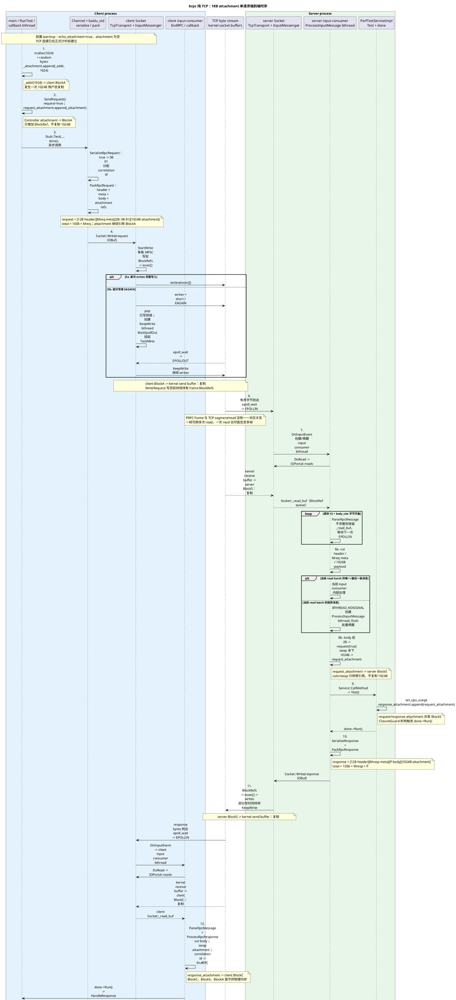
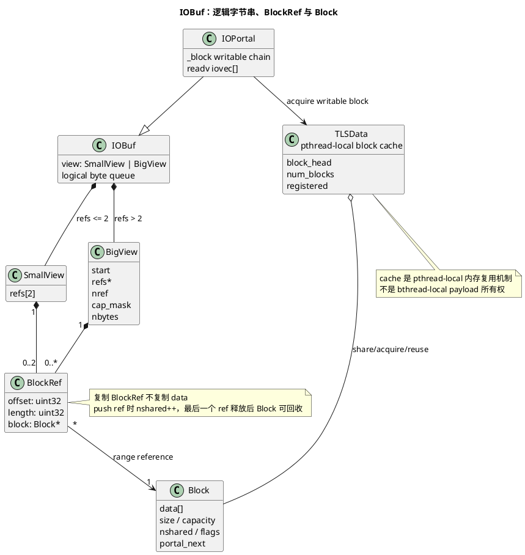
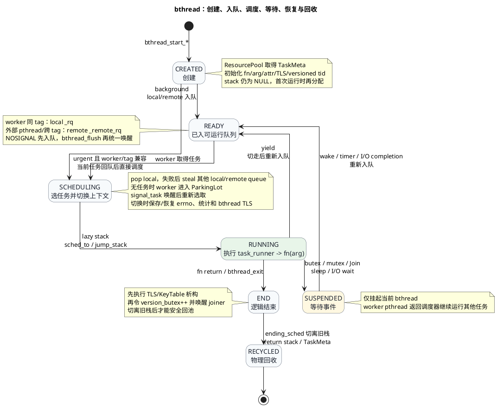
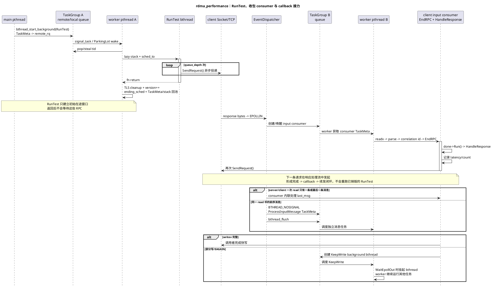
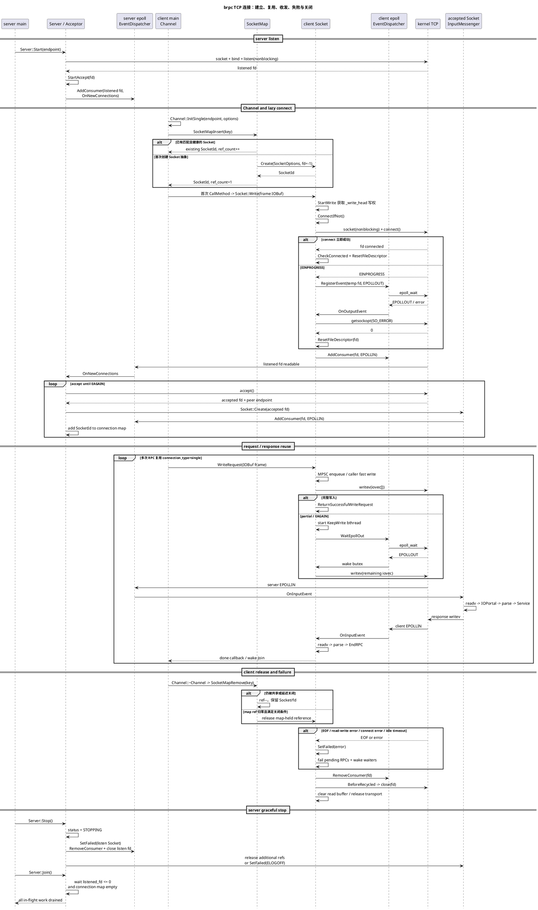

# brpc TCP 运行机制精要：RPC、IOBuf、bthread 与连接生命周期

> 代码基线：`89b2765ca51659494b2b2f5028fdd87aa3df5992`。
>
> 本文是 [brpc 框架运行原理、源码架构与端到端流程](brpc_runtime_architecture.md) 的精要版。
> 它只解释 TCP/epoll 路径，面向 30–45 分钟讲解和关键源码定位。

全文使用同一个场景：

- 示例：`example/rdma_performance`。
- client/server 均设置 `use_rdma=false`。
- `echo_attachment=true`，`attachment_size=1024`。
- 协议为默认 `baidu_std`，连接类型为 `single`。
- 无 SSL、无压缩、无重试，正式请求前的同步 warmup 已建立连接。

先记住五个结论：

1. `Channel` 是调用配置与寻址入口，不等于一条 TCP 连接。
2. `Socket` 是 fd、写队列、读缓冲区、事件和错误状态的生命周期对象。
3. `IOBuf` 的零拷贝主要发生在用户态引用拼装；普通 TCP `writev/readv` 仍跨内核边界复制。
4. 一个 bthread 通常只是 `TaskMeta + 用户态栈 + 调度状态`，不是一个 pthread。
5. 一次 RPC 是有边界的 PRPC 帧，但 TCP 只传输有序字节流，不保留 RPC 消息边界。

## 1. 一条 RPC 的端到端工作流程

### 1.1 贯穿全文的对象和数据

client 的 `PerformanceTest` 构造时执行：

```cpp
_addr = malloc(1024);
butil::fast_rand_bytes(_addr, 1024);
_attachment.append(_addr, 1024);
```

最后一行把连续内存复制到 client IOBuf 的 BlockA。
正式请求由 `RunTest()` 调用 `SendRequest()`：

```cpp
request.set_echo_attachment(true);
cntl->request_attachment().append(_attachment);
stub.Test(cntl, &request, response, done);
```

这里第二个 `append` 只复制 BlockRef 并增加 Block 引用计数，不复制 1024 字节。
request protobuf 的线格式固定为：

```text
08 01
```

即 field 1、varint wire type、值 true，共 2 字节。

请求 PRPC 帧为：

```text
[12B PRPC header][Mreq bytes RpcMeta][2B protobuf][1024B attachment]
总长度 = 1038 + Mreq
```

响应 PRPC 帧为：

```text
[12B PRPC header][Mresp bytes RpcMeta][P bytes cpu_usage protobuf][1024B attachment]
总长度 = 1036 + Mresp + P
```

`Mreq/Mresp` 随 correlation id、服务名、方法名等字段变化。
`P` 也动态变化；`cpu_usage=""` 时 protobuf 通常是 `0a 00`，即 2 字节。

### 1.2 图 1：端到端时序与数据形态

本图以完整资料的 [11.7.1 固定场景：1KB attachment 的纯 TCP 单请求](brpc_runtime_architecture.md#1171-固定场景1kb-attachment-的纯-tcp-单请求) 为事实基准；精要版只收敛参与者和说明文字，场景参数、帧长度、复制边界与 bthread 分支保持一致。



### 1.3 分阶段数据表

| 阶段 | 执行上下文 | 输入形态 | 关键处理 | 输出形态 | 复制/所有权 |
|---|---|---|---|---|---|
| 0 warmup | main pthread | request object，无 attachment | 同步 RPC，提前建连 | 可复用 Socket/fd | 不属于正式 1KB 请求 |
| 1 准备附件 | 构造线程 | `_addr[1024]` | `append(void*, 1024)` | BlockA + BlockRef | 复制 1024B |
| 2 发起调用 | RunTest bthread | request + BlockA | Controller 记录 attachment | Controller refs | ref++，不复制 |
| 3 序列化 | 调用者 bthread | protobuf object | 写 `08 01` | 2B request body | 序列化写入 |
| 4 协议打包 | 调用者 bthread | meta/body/attachment refs | PRPC header + IOBuf 拼接 | `1038 + Mreq` 帧 | header/meta/body 写入；attachment 共享 |
| 5 client 发送 | 调用者或 KeepWrite bthread | IOBuf BlockRefs | iovec + writev | kernel send buffer | 用户到内核复制 |
| 6 TCP 传输 | kernel | 有序字节流 | 分段、重组、拥塞控制 | server receive buffer | 不承诺 RPC 边界 |
| 7 server 接收 | input consumer bthread | kernel receive buffer | readv 到 IOPortal | BlockS refs | 内核到用户复制 |
| 8 切帧/解析 | input consumer/业务 bthread | PRPC IOBuf | cut meta/payload，解析 2B body | request object + BlockS attachment | attachment 移动引用 |
| 9 业务/回显 | 业务执行流 | request + BlockS | `Test()`，append attachment，done | response + BlockS refs | attachment ref++ |
| 10 server 发送 | 业务/KeepWrite bthread | response frame IOBuf | writev | kernel send buffer | 用户到内核复制 |
| 11 client 接收 | input consumer bthread | kernel receive buffer | readv、切帧、反序列化 | response + BlockC attachment | 内核到用户复制 |
| 12 完成 | input consumer/callback | correlation id + Controller | EndRPC、done、续发 | 下一条异步请求 | Controller/response 析构并释放 refs |

### 1.4 关键技术边界

- warmup request 设置 `echo_attachment=true`，但没有调用 `request_attachment().append()`。
- PRPC header 的 `body_size` 是 `meta + protobuf body + attachment` 的总长度。
- parser 在完整帧到达前返回 `PARSE_ERROR_NOT_ENOUGH_DATA`，已有字节留在 `_read_buf`。
- 同一次 read 可切出多条消息；前序消息可建 NOSIGNAL bthread，最后一条延后到 consumer 退出时执行。
- `ClosureGuard` 保证 `ServiceImpl::Test()` 无论正常返回还是提前返回都调用 server done。
- correlation id 同时用于正常响应、timeout 和错误完成之间的唯一完成仲裁。
- 示例会删除每次请求的 Controller/response，但没有删除 `new RespClosure`；这是 benchmark 示例的对象泄漏，不是框架要求。

### 1.5 关键源码入口

- 示例：`example/rdma_performance/client.cpp`、`example/rdma_performance/server.cpp`、`example/rdma_performance/test.proto`。
- client 主链：`src/brpc/channel.cpp::Channel::CallMethod`、`src/brpc/controller.cpp::Controller::IssueRPC`。
- 协议：`src/brpc/policy/baidu_rpc_protocol.cpp::PackRpcRequest`、`ParseRpcMessage`、`ProcessRpcRequest`。
- 完成：同文件的 response 解析，以及 `src/brpc/controller.cpp` 的 EndRPC 路径。

## 2. IOBuf 工作原理与典型调用

### 2.1 为什么 IOBuf 不是一块连续内存

网络程序经常执行“追加头部、拼 body、挂 attachment、切帧、转交所有权”。
若每一步都要求连续内存，就会反复分配和复制大 payload。

IOBuf 把逻辑字节串表示为 BlockRef 队列：

```text
IOBuf view
  -> BlockRef(offset, length, Block*)
  -> Block(data, size, capacity, nshared)
```

一个 IOBuf 最多两个引用时直接使用内嵌 `SmallView.refs[2]`；
引用更多时使用环形 `BigView`，保存动态 BlockRef 数组、起点、数量和总字节数。
TLS 只参与 Block 的分配与复用：每次 append/readv 使用当前 pthread 的 `g_tls_data`；
已经形成 BlockRef 的数据由引用计数持有，可以跨 bthread、worker 和线程转交。

### 2.2 图 2：IOBuf 对象结构



各结构的职责和生命周期如下：

| 数据结构 | 关键字段 | 职责与所有权 |
|---|---|---|
| `IOBuf` | `SmallView/BigView` union | 表示逻辑字节队列；不同对象可并发使用，同一对象不能被多线程并发修改 |
| `SmallView` | 内嵌 `refs[2]` | 保存最多两个非合并 BlockRef，避免为常见小 IOBuf 分配引用数组 |
| `BigView` | `start/refs/nref/cap_mask/nbytes` | 环形 BlockRef 数组；第三个不能合并的 ref 触发转换，容量从 32 起扩展 |
| `BlockRef` | `offset/length/block` | 描述 Block 中的一个逻辑区间；复制 ref 会 `nshared++`，相邻同 Block 区间可合并 |
| `Block` | `data/size/cap/nshared/flags/u` | 持有实际字节与原子引用计数；`u.portal_next` 可把空闲 Block 串成 TLS/IOPortal 链 |
| `TLSData` | `block_head/num_blocks/registered` | 每个 pthread 的非满 Block 缓存；`registered` 保证只注册一次 thread-atexit 清理 |
| `IOPortal` | IOBuf 基类 + `_block` | 从 TLS 摘取可写 Block，构造 `iovec[]` 接收；保留未用尾块以减少后续 read 的分配和 BlockRef 数 |

### 2.3 常用操作的复制矩阵

| 操作 | payload 是否复制 | 引用/所有权变化 | 与 TLS 的交互 |
|---|---:|---|---|
| `append(const IOBuf&)` | 否 | 复制 BlockRef，Block ref++ | 不取 TLS Block |
| `append(IOBuf::movable())` | 否 | 移动 refs，源变空 | 不取 TLS Block |
| `cutn(IOBuf*, n)` | 否 | 整 ref 移动；边界处拆 ref | 与 TLS cache 无关 |
| `swap(IOBuf&)` | 否 | 交换 view/refs | 与 TLS cache 无关 |
| `append(void*, n)` | 是 | 复制到可写 Block | `share_tls_block()` 借当前 pthread 的非满 Block |
| `cutn(void*, n)` | 是 | Block 字节复制到连续目标 | 不取 TLS Block |
| protobuf serialize | 通常是 | object 字段编码到 IOBuf | 输出流追加时可复用当前 pthread Block |
| protobuf parse | 解析/分配 | IOBuf 字节变 object 字段 | protobuf 对象分配不属于 IOBuf TLS |
| `writev` | 是 | 用户页数据进入 kernel send buffer | 只读取 refs，不归还 TLS |
| `readv` | 是 | kernel receive buffer 进入 IOPortal Block | `acquire_tls_block()` 从当前 pthread cache 摘取 Block |

因此，IOBuf 的准确说法是：

> 它避免用户态各层之间为了拼接、切分和转交大 payload 而复制，
> 但普通 TCP 并没有因此变成从业务内存到对端业务内存的全链路零拷贝。

### 2.4 图 3：1KB attachment 的引用与复制边界

```plantuml
@startuml
title 1KB attachment：BlockA -> BlockS -> BlockC
skinparam shadowing false
skinparam componentStyle rectangle
left to right direction
rectangle "client 原始连续内存\n_addr[1024]" as Raw
rectangle "client IOBuf BlockA\nshare_tls_block(current pthread)" as A
rectangle "Controller request_attachment\nBlockRef(A, 0, 1024)" as CA
rectangle "PRPC request IOBuf\nheader/meta/body refs + A ref" as FrameA
rectangle "client iovec[]" as IovA
rectangle "client kernel\nsend buffer" as KSendA
rectangle "TCP ordered\nbyte stream" as Wire
rectangle "server kernel\nreceive buffer" as KRecvS
rectangle "server IOPortal BlockS\nacquire_tls_block(server worker)" as S
rectangle "server request_attachment\nBlockRef(S attachment range)" as RS
rectangle "server response_attachment\nshared BlockRef(S range)" as RespS
rectangle "server kernel\nsend buffer" as KSendS
rectangle "client kernel\nreceive buffer" as KRecvC
rectangle "client IOPortal BlockC\nacquire_tls_block(client worker)" as C
rectangle "Controller response_attachment\nBlockRef(C attachment range)" as RC
Raw -[#red,bold]-> A : append(void*, 1024)\nCOPY
A -[#green,bold]-> CA : append(IOBuf)\nref++
CA -[#green,bold]-> FrameA : PackRpcRequest\nref++
FrameA -[#green,bold]-> IovA : map refs\nno payload copy
IovA -[#red,bold]-> KSendA : writev\nCOPY user -> kernel
KSendA --> Wire
Wire --> KRecvS
KRecvS -[#red,bold]-> S : readv\nCOPY kernel -> user
S -[#green,bold]-> RS : cutn + swap\nmove refs
RS -[#green,bold]-> RespS : append(IOBuf)\nref++
RespS -[#red,bold]-> KSendS : writev\nCOPY user -> kernel
KSendS --> KRecvC : TCP
KRecvC -[#red,bold]-> C : readv\nCOPY kernel -> user
C -[#green,bold]-> RC : cutn + swap\nmove refs
note bottom of A : TLS cache 只供应/回收 Block；BlockRef 决定数据生命周期\nBlockA、BlockS、BlockC 是不同物理内存
@enduml
```



### 2.5 典型调用：服务端如何把 payload 变成 attachment

以 `baidu_std` 的请求解析为例：

1. input consumer bthread 在 worker W 上运行，此时 `g_tls_data` 属于 W 的 pthread TLS。
2. IOPortal 用 `acquire_tls_block()` 从 W 的 cache 摘取非满 Block；cache 为空才创建 Block。
3. 它用 Block 尾部空间构造 `iovec[]`，`readv` 把内核字节复制进 Block。
4. 只为实际收到的范围创建 BlockRef；未使用的非满尾块继续挂在 IOPortal `_block` 链。
5. `ParseRpcMessage()` 检查 12B header 和完整帧长度，再用 `cutn(IOBuf*)` 切 meta/payload。
6. `ProcessRpcRequest()` 切出 protobuf body，并把剩余 1024B `swap` 给 request attachment。
7. 当 `_read_buf` 消费为空时，InputMessenger 调用 `return_cached_blocks()`，未用尾块进入当前 pthread TLS。

只有步骤 3 是 attachment 的内核到用户复制；步骤 5–6 主要调整 BlockRef。
TLS 优化的是 Block 分配/复用，不会额外复制、保存或拥有业务 payload。

### 2.6 引用计数与 Block 生命周期

- `_push_back_ref` 为共享 BlockRef 增加 Block 引用。
- `_move_back_ref` 转移 ref，不额外保留源所有权。
- IOBuf 析构或 `pop_front/clear` 释放 refs；最后一个引用消失后 Block 才可回收。

### 2.7 TLS 机制：pthread Block cache 与 bthread TLS

IOBuf 中的 TLS 是 Thread Local Storage，具体对象是 `static __thread TLSData g_tls_data`。它属于物理 pthread，保存非满 Block 链表、数量和清理注册状态。设计目标是让频繁的 append/readv 复用当前 worker 已分配的 Block，减少 malloc/free 和跨线程共享 allocator cache 的竞争；它不是请求级存储，也不保存 Controller 或 attachment。

一次缓存生命周期如下：

1. 当前 pthread 首次需要 Block 时初始化 `g_tls_data`，创建 Block，并用 `butil::thread_atexit()` 注册一次退出清理。
2. `append(void*, n)` 调用 `share_tls_block()`：借用 cache 头部但不摘链，IOBuf 建立 BlockRef 后通过引用计数共同持有。
3. IOPortal 调用 `acquire_tls_block()`：从 cache 摘下一个非满 Block，独占其尾部构造 readv 的 `iovec[]`。
4. read/切帧完成后，`release_tls_block_chain()` 将未使用的非满尾块放入当前 pthread cache；超出软上限则 dec_ref。
5. 每线程默认最多缓存 8 个 Block；启用 IOBuf profiler 时上限为 0；pthread 退出时 `remove_tls_block_chain()` 清空链表。

缓存归属和数据所有权是两回事。TLS 持有的是“可继续写入的 Block 缓存引用”，IOBuf/Controller 持有的是描述有效字节范围的 BlockRef。Block 即使离开原 worker 的 TLS，只要 cache、IOPortal 或任一 BlockRef 仍持有引用就不会释放；所有引用都 `dec_ref()` 后才回收实际内存。

bthread 可能在挂起后由另一个 worker 恢复，因此它下一次 append/readv 会访问新 worker 的 `g_tls_data`，未用 Block 也可能归还到当前而非最初 cache。IOBuf Block 没有线程亲和性，这种迁移是安全的。与此不同，bthread TLS 属于逻辑任务：`sched_to()` 把 `tls_bls` 保存到当前 `TaskMeta::local_storage`，再恢复目标 bthread 的数据。

两套 TLS 的边界如下：

| 机制 | 归属与内容 | 切换/销毁 |
|---|---|---|
| IOBuf `g_tls_data` | 物理 pthread；缓存可复用 Block | bthread 切换时不切换；pthread 退出清链 |
| bthread `tls_bls/TaskMeta::local_storage` | 逻辑 bthread；KeyTable、assigned data、span 等 | `sched_to()` 保存/恢复；bthread 结束执行析构 |

### 2.8 常见误区

- `append(IOBuf)` 不复制，不代表 `append(void*, n)` 也不复制。
- IOBuf 的 pthread TLS cache 不是 bthread TLS，也不保存 Controller attachment。
- bthread 迁移后不要求 Block 回到原 worker；引用计数使 Block 生命周期与 cache 归属解耦。
- `writev` 的 scatter/gather 避免用户态先合并，通常仍把数据复制进内核发送缓冲区。
- `readv` 能一次填多个 Block，通常仍从内核接收缓冲区复制到用户态。
- TCP 两端不共享 Block；服务端回显引用的是 BlockS，client 最终收到的是新 BlockC。
- protobuf 的“ZeroCopyStream”表示与 IOBuf block 直接配合，仍需把对象字段编码成 wire bytes。

### 2.9 关键源码入口

- 对象模型：`src/butil/iobuf.h::IOBuf::BlockRef/SmallView/BigView`。
- Block/TLSData：`src/butil/iobuf_inl.h::IOBuf::Block/TLSData`。
- 引用操作：`src/butil/iobuf.cpp::IOBuf::append`、`cutn`、`swap`。
- block cache：`src/butil/iobuf.cpp::share_tls_block/acquire_tls_block/release_tls_block_chain`。
- 接收：`src/butil/iobuf.cpp::IOPortal::pappend_from_file_descriptor`。
- 发送：`src/butil/iobuf.cpp::cut_multiple_into_file_descriptor`。
- bthread TLS 对照：`src/bthread/task_group.cpp::TaskGroup::sched_to/task_runner`。

## 3. bthread 创建、调度和销毁

### 3.1 四层对象

| 层次 | 作用 |
|---|---|
| worker pthread | 真正获得 CPU 时间，运行调度器和 bthread 栈 |
| `TaskControl` | 管理 worker/TaskGroup、tag、唤醒和 work stealing |
| `TaskGroup` | 一个 worker 的调度上下文，拥有 local/remote runnable queue |
| `TaskMeta` | 一个 bthread 的函数、参数、tid、属性、TLS、栈和状态 |

普通 background bthread 创建不等于创建 pthread。
它通常从 ResourcePool 取得 `TaskMeta` 并入队，已有或按并发度扩展的 worker 负责运行。

默认 runnable path 不是单一全局队列：

- worker 在本组创建普通任务时进入 local `_rq`。
- main pthread 等非 worker 创建任务时进入某组 `_remote_rq`。
- 空闲 worker 先取本地任务，再从其他 TaskGroup 的 local/remote queue 窃取。
- priority queue 是可选路径，默认不开启时不应把它描述成常规全局队列。

### 3.2 图 4：bthread 完整生命周期



#### 3.2.1 生命周期总览

一个 bthread 的生命周期由两个相互独立的部分组成：`TaskMeta` 表示逻辑任务，worker pthread 提供实际 CPU。创建 bthread 时通常不会创建 pthread，也不会马上分配用户态栈；框架先取得 TaskMeta，记录函数、参数、属性、TLS 和 versioned tid，再把它变成一个 READY 任务。其主状态可以概括为：

```text
CREATED -> READY -> SCHEDULING -> RUNNING
        -> { READY | SUSPENDED -> READY | END -> RECYCLED }
```

其中 urgent 且调用环境兼容时可以跳过 READY，直接由 CREATED 进入 SCHEDULING。

创建阶段首先判断调用者所在的执行环境。worker 内创建的 background 任务通常进入当前 TaskGroup 的 local queue，main pthread 等外部线程创建的任务进入某个 TaskGroup 的 remote queue；urgent 任务在条件允许时直接把控制权切给新任务。任务入队后，`signal_task()` 负责唤醒 ParkingLot 中的 worker；NOSIGNAL 只是把多次唤醒合并到 `bthread_flush()`，并没有省略入队或 TaskMeta 创建。

调度阶段从 worker 的 main/idle 栈开始。worker 先取得本地任务，本地为空时再从同 tag 的其他 TaskGroup 窃取；确实没有任务才在 ParkingLot 等待。选中 TaskMeta 后才延迟取得用户态栈，随后 `sched_to()` 保存当前 bthread 的 errno、统计和 TLS，恢复目标任务上下文并执行 `jump_stack()`。控制权进入 `task_runner()` 后，TaskMeta 中的 `fn(arg)` 才真正开始运行。

运行中的 bthread 不会永久绑定某个 worker。调用 yield 时，它在切走后重新进入 READY；等待 butex、mutex、Join、sleep 或 I/O 时，它从 runnable queue 消失并进入 SUSPENDED。此时旧 worker 立即返回调度器执行其他 bthread。Timer、butex wake 或 I/O completion 只需把同一个 TaskMeta 重新放回 runnable queue，它之后可能由另一个 worker 恢复；用户态栈和 bthread TLS 随 TaskMeta 保持，pthread-local IOBuf cache 则取决于恢复时所在的 worker。

用户函数返回只代表“逻辑执行结束”，还不能在当前栈上立即释放自己。`task_runner()` 先执行 TLS/KeyTable 析构，再递增 `version_butex` 使旧 tid 失效并唤醒 joiner；随后 `ending_sched()` 选择下一任务并切离旧栈。确认控制权已经位于其他栈之后，remained callback 才归还 ContextualStack 和 TaskMeta slot，这就是图中 END 与 RECYCLED 分开的原因。

在 `rdma_performance` 示例中，main pthread 创建 `RunTest` 后，它从 remote queue 被 worker 取走，发出初始异步请求便结束并回收；后续请求不是复活这个 bthread，而是由网络回包触发的 client input consumer 执行 `EndRPC -> HandleResponse -> SendRequest()`，形成新的调度接力。

#### 3.2.2 图中各阶段的源码动作

| 阶段 | 图中节点 | 关键实现与状态变化 |
|---|---|---|
| 1. API 分流 | CREATED | 检查 `tls_task_group` 和 tag；worker 同 tag 可走当前组，否则 `start_from_non_worker()` 选择目标 TaskGroup |
| 2. 申请任务元数据 | CREATED | ResourcePool 取得 TaskMeta slot；重置 stop/interrupted/sleep、fn/arg、attr、统计和 local storage，stack 保持 NULL |
| 3. 生成身份 | CREATED | `make_tid(*version_butex, slot)` 组合版本和槽位；TaskMeta 复用后 version 改变，旧 tid 不会误命中新任务 |
| 4. background 入队 | READY | worker 本地创建进入无锁 owner `_rq`；外部 pthread 或跨组创建进入 mutex 保护的 `_remote_rq` |
| 5. urgent 切换 | CREATED -> SCHEDULING | `start_foreground()` 把当前 bthread 通过 remained callback 放回队列，并立即 `sched_to()` 新任务；pthread-stack 调用不会这样抢占 |
| 6. 唤醒 worker | READY | 普通任务入队后 `signal_task()`；NOSIGNAL 只延后唤醒，任务已经在队列中，`bthread_flush()` 才批量 signal |
| 7. 等待任务 | SCHEDULING | worker 无任务时保存 ParkingLot state，睡眠前再次 steal；任务到达与入睡竞态不会使 runnable task 永久丢失 |
| 8. 选择任务 | SCHEDULING | 先从本地 `_rq` pop，再扫描同 tag 其他组的 `_rq/_remote_rq`；可选全局 priority 路径默认关闭 |
| 9. 准备栈 | SCHEDULING | TaskMeta 首次运行才 `get_stack()`；结束任务可把同类型栈直接交给 next task，失败或 pthread attr 使用 worker main stack |
| 10. 上下文切换 | SCHEDULING | `sched_to()` 保存 errno、CPU 统计和当前 `tls_bls`，恢复 next local storage，再通过 `jump_stack()` 切换 |
| 11. 执行入口 | RUNNING | 新栈进入 `task_runner()`，处理切栈后的 remained callback，再调用 `m->fn(m->arg)` |
| 12. 主动让出 | RUNNING -> READY | `yield()` 先登记“切走后重新入队”的 remained callback，再选择其他任务，避免把仍在运行的栈提前入队 |
| 13. 阻塞/睡眠 | SUSPENDED | butex/mutex/Join 登记 waiter；sleep 在切走后注册 TimerThread；当前 bthread 变为 SUSPENDED，worker 继续调度 |
| 14. 重新可运行 | SUSPENDED -> READY | butex wake、Timer 或 I/O completion 校验 TaskMeta/version 后调用 ready_to_run/remote，再次进入 READY |
| 15. 逻辑结束 | END | 用户函数返回后先执行 KeyTable/TLS/span 析构，再在 version lock 下 version++ 并唤醒 joiner |
| 16. 物理回收 | RECYCLED | `ending_sched()` 先切到下一个栈；之后 `_release_last_context` 才归还旧 stack 和 TaskMeta slot |

#### 3.2.3 关键细节和不变量

- background 的含义是“创建并入队后返回”，不保证新任务立即运行；urgent 只有在当前 worker/tag 可本地执行时才直接切换。
- `_remote_rq` 是有锁的有界队列；队列满时会先 flush 待唤醒任务并重试。普通调度不是所有线程竞争一个全局 runnable queue。
- `signal_task()` 负责唤醒 ParkingLot worker，并限制单次扩散的唤醒数量以减少惊群；队列是任务事实源，signal 只是调度提示。
- READY 表示 TaskMeta 已在某个 runnable queue；RUNNING 表示正占用一个 worker；SUSPENDED 表示等待条件成立且不在 runnable queue。
- remained callback 必须在完成栈切换后执行：yield 用它重新入队旧任务，sleep 用它安全注册 timer，退出用它释放已经离开的旧栈。
- `sched_to()` 不只切寄存器和栈，还切换 bthread local storage、维护 errno 与运行统计；同一 bthread 恢复时看到自己的 TLS。
- 普通 bthread 在 butex、sleep 或 `WaitEpollOut` 上等待时只挂起自身；原 worker pthread 回到调度器。原生 pthread/pthread-stack 路径才可能占住 OS 线程。
- `bthread_stop/interrupt` 是协作式通知：设置标志并唤醒 waiter/sleeper，不会在任意指令位置强制抢占或销毁正在运行的用户函数。
- TLS 析构必须早于 version++；joiner 观察到版本变化并通过 acquire fence 返回时，才能看到目标 bthread 析构及此前写入的结果。
- TaskMeta 和栈都可回池复用，但 versioned tid、引用的 waiter 状态和“切走后再回收”共同避免旧句柄与旧栈被并发误用。

### 3.3 创建：API 到 runnable queue

`bthread_start_background()` 的关键步骤：

1. 若调用者正在 worker 上且 tag 兼容，使用当前 `TaskGroup`。
2. 否则经 `TaskControl::choose_one_group(tag)` 选择目标组。
3. `TaskGroup::start_background` 从 ResourcePool 获取 TaskMeta/slot。
4. 重置 stop、interrupted、sleep、fn、arg、attr、local storage 和统计字段。
5. 组合 `*version_butex` 与 slot 生成 versioned `bthread_t`。
6. 本 worker 创建走 `ready_to_run()`；外部线程创建走 `ready_to_run_remote()`。
7. 非 NOSIGNAL 任务调用 `signal_task()` 唤醒 ParkingLot 中的 worker。

`RunTest` 是典型的 non-worker 创建：
main pthread 调用 `bthread_start_background(... RunTest ...)`，
任务进入选定 TaskGroup 的 remote queue，之后由 worker 获取并运行。

### 3.4 background、urgent、NOSIGNAL 与 pthread stack

| 模式 | 关键语义 |
|---|---|
| background | 入队后返回，不要求立即切到新任务 |
| urgent | worker 内可把当前任务放回队列并尽快切到新任务 |
| NOSIGNAL | 已入队但累计唤醒；`bthread_flush()` 批量 signal |
| pthread stack | 在 worker 主栈直接执行，不能享受普通用户态栈挂起方式 |

NOSIGNAL 不是“不入队”。
它减少的是频繁唤醒；任务仍是独立 TaskMeta，flush 后按正常队列调度。

### 3.5 worker 如何选任务和切栈

worker 主循环的选择顺序可概括为：

1. 从本 TaskGroup local `_rq` pop。
2. 若为空，调用 `TaskControl::steal_task()`。
3. steal 扫描同 tag 的其他组，尝试其 `_rq` 和 `_remote_rq`。
4. 若仍无任务，回到 TaskGroup main/idle 栈并进入 ParkingLot 等待。
5. 获得 TaskMeta 后，如 stack 为空则延迟获取对应类型的 ContextualStack。
6. `sched_to()` 保存当前统计、errno 和 bthread local storage。
7. 恢复 next TaskMeta 的 local storage，再执行 `jump_stack()`。
8. 新栈从 `task_runner()` 开始调用 `m->fn(m->arg)`。

结束任务与下一个任务栈类型相同时，`ending_sched()` 可直接转交当前栈，
避免先回池再取出的额外操作。

### 3.6 等待、恢复和“不阻塞 worker”

- `yield`：通过 remained callback 把当前 TaskMeta 放回 runnable queue，再调度其他任务。
- `butex/mutex/condition`：把当前 TaskMeta 登记为 waiter，切走；signal 时重新入队。
- `bthread_usleep`：切走后由 TimerThread 登记到期 callback，callback 将 TaskMeta 放入 remote queue。
- `Join`：等待目标 TaskMeta 的 `version_butex` 变化。
- I/O 等待：例如 KeepWrite 的 `WaitEpollOut` 在 butex 上挂起；EventDispatcher 收到 EPOLLOUT 后唤醒。

对普通 bthread，以上操作挂起的是当前 bthread 栈，worker 可立即调度别的任务。
如果调用发生在原生 pthread 或 pthread-stack bthread 上，则等待域不同，不能笼统说“都不占 worker”。

### 3.7 销毁和资源回收的严格顺序

用户函数返回后，`task_runner()`：

1. 记录任务结束和统计。
2. 归还/析构 KeyTable，执行 bthread TLS destructor。
3. 清理继承的 span 等 local storage。
4. 在 version lock 下递增 `version_butex`，使旧 tid 失效。
5. `butex_wake_except()` 唤醒所有 joiner。
6. 递减全局和 tag 下的 bthread 数量。
7. 把 `_release_last_context` 注册为切栈后的 remained callback。
8. `ending_sched()` 选择下一个任务并切走。
9. 已离开旧栈后，才 `return_stack()` 并把 TaskMeta slot 归还 ResourcePool。

“离开旧栈后再回收”很重要：当前仍在执行的栈不能释放自己。

### 3.8 图 5：示例中的调度接力



### 3.9 示例中会创建 bthread 的位置

- main 为每个 `PerformanceTest` 创建一个 `RunTest` background bthread。
- EventDispatcher 把可读事件转交 input consumer 执行流。
- 同一批的前序完整消息可创建 `ProcessInputMessage` NOSIGNAL bthread。
- client 或 server 写入不完整时创建 `KeepWrite` background bthread。
- idle timeout、timer、用户配置等还可能产生辅助任务，但不是单请求必经步骤。

### 3.10 关键源码入口

- API：`src/bthread/bthread.cpp::bthread_start_background/bthread_start_urgent`。
- 创建/调度/回收：`src/bthread/task_group.cpp`。
- worker、ParkingLot、steal：`src/bthread/task_control.cpp`。
- TaskMeta/version：`src/bthread/task_meta.h`。
- butex：`src/bthread/butex.cpp`。
- 消息任务：`src/brpc/input_messenger.cpp`、`src/brpc/tcp_transport.cpp::QueueMessage`。

## 4. TCP 网络接口、连接使用和关闭

### 4.1 server：listen 与 accept

`Server::Start()` 最终在 `StartInternal()` 中：

1. 创建非阻塞 listen fd。
2. 初始化 InputMessenger/Acceptor。
3. `Acceptor::StartAccept()` 用 listen fd 创建监听 Socket。
4. 监听 Socket 把 `OnNewConnections` 注册为边沿触发输入 callback。
5. epoll 返回监听 fd 可读后，循环 `accept()` 直到 EAGAIN。
6. 每个 accepted fd 创建独立 Socket，设置 remote side、user、tag 和输入事件。
7. accepted Socket 被加入 Acceptor 的连接 map，并开始接收 RPC。

### 4.2 client：Channel 初始化不等于立即 connect

`Channel::InitSingle()`：

1. 解析 ChannelOptions，计算协议/连接配置签名。
2. 构造 `SocketMapKey(endpoint, signature)`。
3. `SocketMapInsert()` 查找是否已有匹配且可用的 Socket。
4. 命中则增加 map 引用并返回同一个 SocketId。
5. 未命中则创建 client Socket 抽象；默认可以还没有有效 fd。

首次 `Socket::Write()` 才通过 `ConnectIfNot()` 延迟建连：

```text
socket() -> nonblocking -> connect()
  -> EINPROGRESS
  -> 注册 EPOLLOUT 和 connect timeout
  -> epoll_wait 返回
  -> getsockopt(SO_ERROR)
  -> ResetFileDescriptor(fd)
  -> 注册正常输入事件
  -> KeepWrite 发送排队请求
```

warmup 已完成时，正式 1KB 请求通常跳过这条 connect 分支，直接复用 fd。

### 4.3 使用连接：写路径

`Socket::StartWrite()` 使用 `_write_head.exchange(req)` 实现多生产者、单写者协调：

- 若旧 head 非空，说明已有写者；新请求链接到 MPSC 队列后返回。
- 若旧 head 为空，当前调用者取得写权。
- 已连接且非后台写时，调用者先执行一次快写。
- TCP transport 把 IOBuf BlockRefs 转换为 iovec，并最终调用 writev。
- 完整写完则释放 WriteRequest 与 IOBuf refs。
- 部分写或 EAGAIN 则启动 KeepWrite，统一排空当前和后续请求。
- KeepWrite 在无法前进时 `WaitEpollOut`，EPOLLOUT 到来后继续写剩余 refs。

这种设计既避免多个调用者同时操作 fd，也让争用请求自然形成批量写。

### 4.4 使用连接：读路径

```text
epoll_wait
  -> input event callback
  -> Socket::OnInputEvent / _nevent 合并
  -> TcpTransport::ProcessEvent
  -> InputMessenger::OnNewMessages
  -> Socket::DoRead
  -> IOPortal::append_from_file_descriptor
  -> readv
  -> _read_buf BlockRefs
  -> CutInputMessage / ParseRpcMessage
  -> ProcessInputMessage
```

EventDispatcher 本身只负责就绪通知。
真正的 read、切帧、协议处理和业务执行在被调度的 bthread 执行流中完成，
避免把可能挂起的业务逻辑直接放在 epoll 循环里。

### 4.5 数据跨系统调用前后的形态

| 边界 | 调用前 | 系统调用/动作 | 调用后 |
|---|---|---|---|
| client 发送 | IOBuf BlockRefs | 生成 iovec[] | 多段用户地址 |
| 用户到内核 | iovec[] | `writev(fd, iovec)` | kernel send buffer bytes |
| 网络 | send buffer | TCP | 对端 kernel receive buffer |
| server 接收 | receive buffer + 可写 Blocks | `readv(fd, iovec)` | IOPortal BlockRefs |
| server 回包 | response IOBuf refs | `writev` | kernel send buffer bytes |
| client 接收 | receive buffer + 可写 Blocks | `readv` | client 新 BlockRefs |

### 4.6 关闭与回收

client 正常对象释放：

- `Channel::~Channel()` 调用 `SocketMapRemove(key)`。
- SocketMap 引用计数减一，但共享 Channel 或 defer-close 策略可使 Socket/fd 继续存活。
- 因此“Channel 析构”不等价于“立刻 close TCP fd”。

连接异常关闭：

- EOF、不可恢复的 read/write/connect 错误或 idle timeout 调用 `Socket::SetFailed()`。
- SetFailed 让新的 Address/Write 失败，并唤醒等待者、传播在途请求错误。
- 引用归零后执行 `BeforeRecycled()`。
- `BeforeRecycled()` 从 EventDispatcher 移除 fd、close fd、释放 transport/user、清空 `_read_buf`。

server 优雅关闭：

- `Server::Stop()` 把状态改为 STOPPING，并调用 `Acceptor::StopAccept()`。
- 监听 Socket 被 SetFailed，不再接收新连接。
- streaming 类连接可直接 SetFailed；消息型连接主要释放 server 持有的额外引用，让在途 RPC 完成后自然回收。
- `Server::Join()` 等待监听 fd 已回收且 Acceptor connection map 为空。
- Join 之后再清理 server TLS/keytable 等依赖业务完成的资源。

### 4.7 图 6：连接建立、复用、收发与关闭



### 4.8 连接语义中最容易混淆的点

- `connection_type=single` 表示同一个逻辑 server Socket 的复用策略，不表示全进程永远只有一个 fd。
- 多个相同签名的 Channel 可通过 SocketMap 共享 SocketId 和物理连接。
- 连接建立是异步状态机；请求在 connect 期间由 WriteRequest 持有，成功后由 KeepWrite 继续。
- `EAGAIN` 不是连接失败，而是当前不能继续读/写；框架等待下一次 epoll readiness。
- EPOLLIN 只说明“现在值得读”，不说明“一条完整 RPC 已到达”。
- EPOLLOUT 只说明 socket 当前可写，不保证剩余整个 IOBuf 一次写完。
- SetFailed 是逻辑失败入口；实际 close 通常发生在引用归零后的回收阶段。
- `Stop()` 停止接受新工作，`Join()` 才等待已有连接和在途请求收敛。

### 4.9 关键源码入口与讲解顺序

建议按以下顺序打开源码：

1. `example/rdma_performance/client.cpp::Init/SendRequest/HandleResponse/RunTest`。
2. `src/brpc/channel.cpp::InitSingle/CallMethod`。
3. `src/brpc/socket_map.cpp::SocketMapInsert/SocketMapRemove` 及 `SocketMap::Insert/RemoveInternal`。
4. `src/brpc/policy/baidu_rpc_protocol.cpp::PackRpcRequest/ParseRpcMessage/ProcessRpcRequest`。
5. `src/brpc/socket.cpp::ConnectIfNot/StartWrite/KeepWrite/OnInputEvent/BeforeRecycled`。
6. `src/brpc/tcp_transport.cpp::CutFromIOBufList/WaitEpollOut/QueueMessage`。
7. `src/brpc/event_dispatcher_epoll.cpp::EventDispatcher::Run`。
8. `src/brpc/input_messenger.cpp::OnNewMessages/ProcessNewMessage`。
9. `example/rdma_performance/server.cpp::PerfTestServiceImpl::Test`。
10. `src/bthread/bthread.cpp`、`task_group.cpp`、`task_control.cpp`。
11. `src/butil/iobuf.h`、`src/butil/iobuf.cpp`。
12. `src/brpc/acceptor.cpp::StartAccept/StopAccept/Join` 和 `src/brpc/server.cpp::Stop/Join`。

用一句话收束整套机制：

> brpc 用 Channel/Controller 管理一次调用，用 IOBuf BlockRef 低成本组织用户态数据，
> 用 Socket/epoll 驱动 TCP 字节流，用 bthread 把 I/O、协议、业务和 callback 复用到 worker pthread，
> 再由 correlation id、引用计数和 Stop/Join 把请求完成、连接回收与进程生命周期闭环起来。
