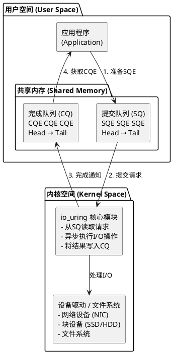
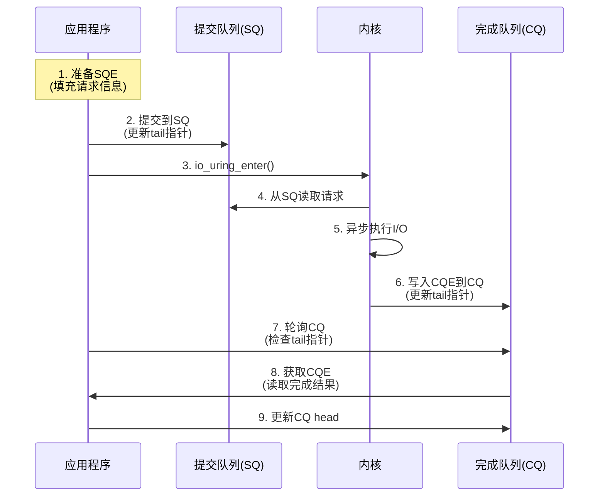
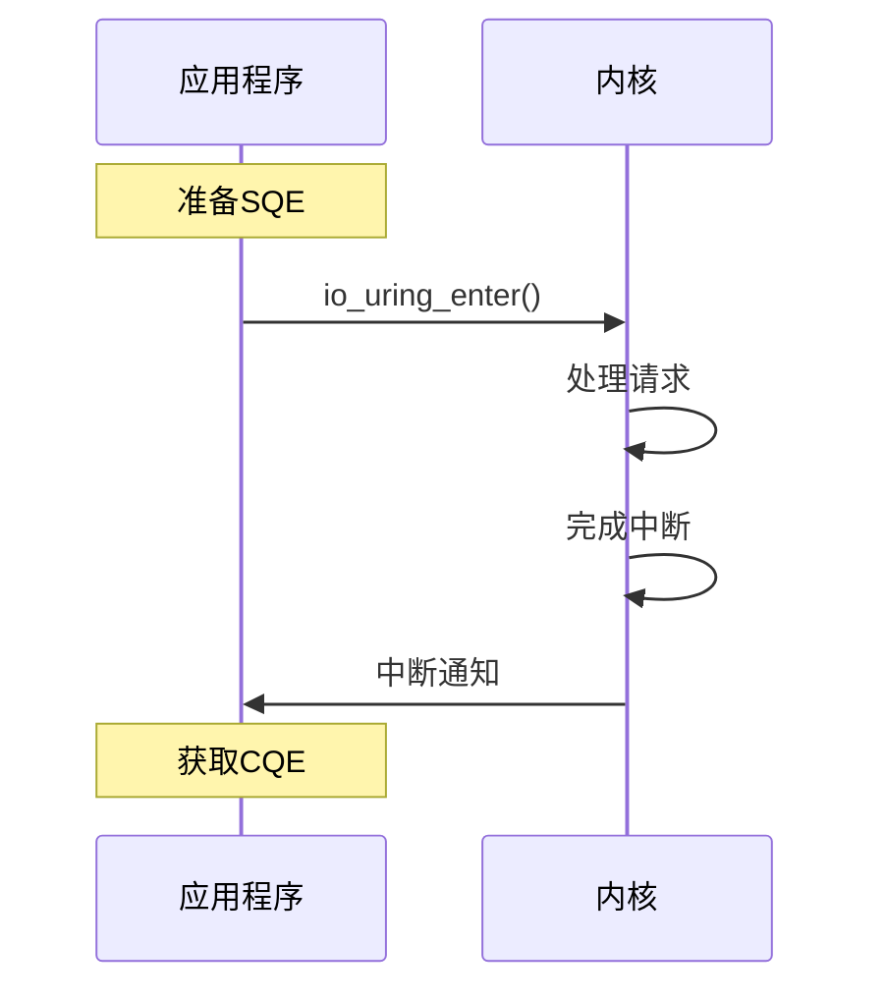
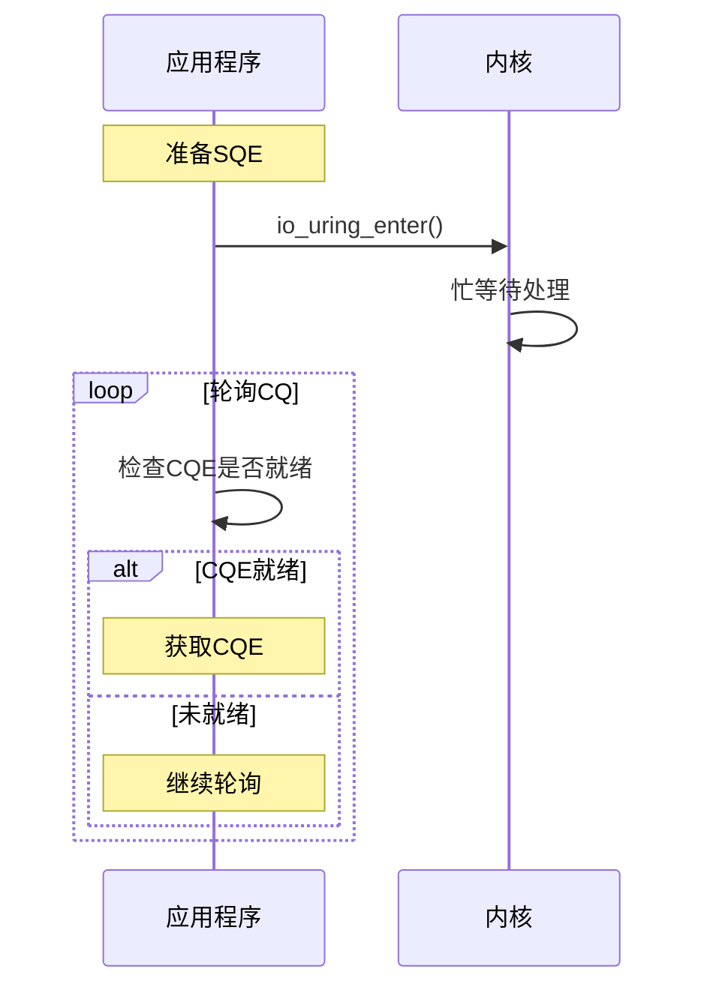
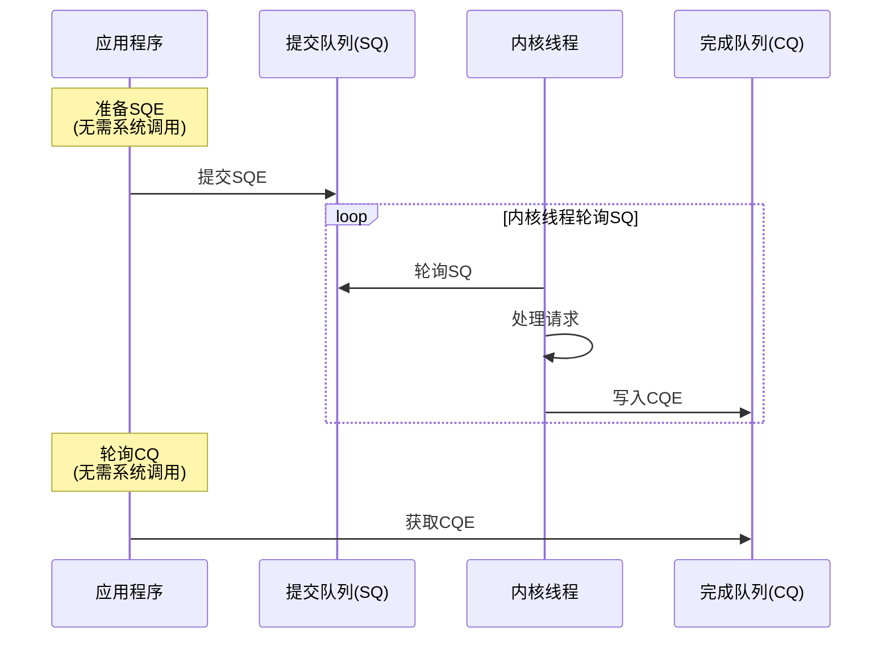
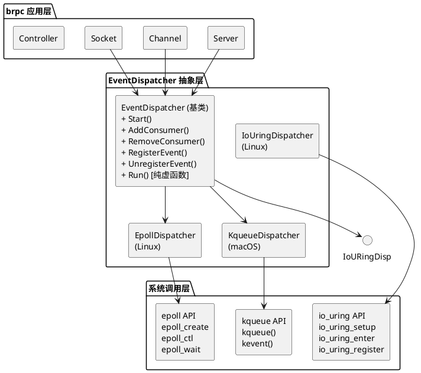
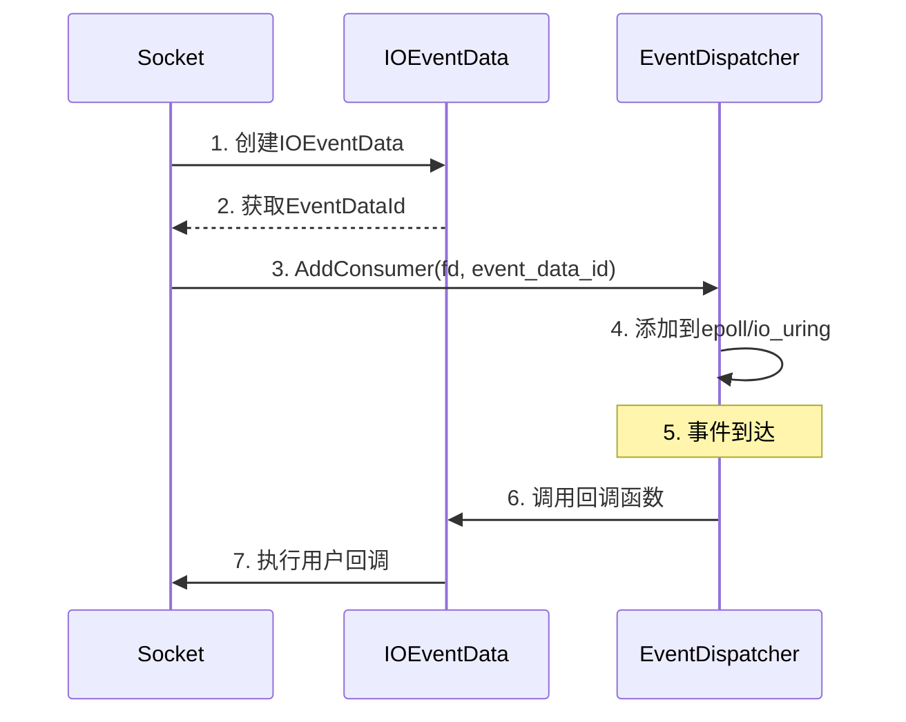
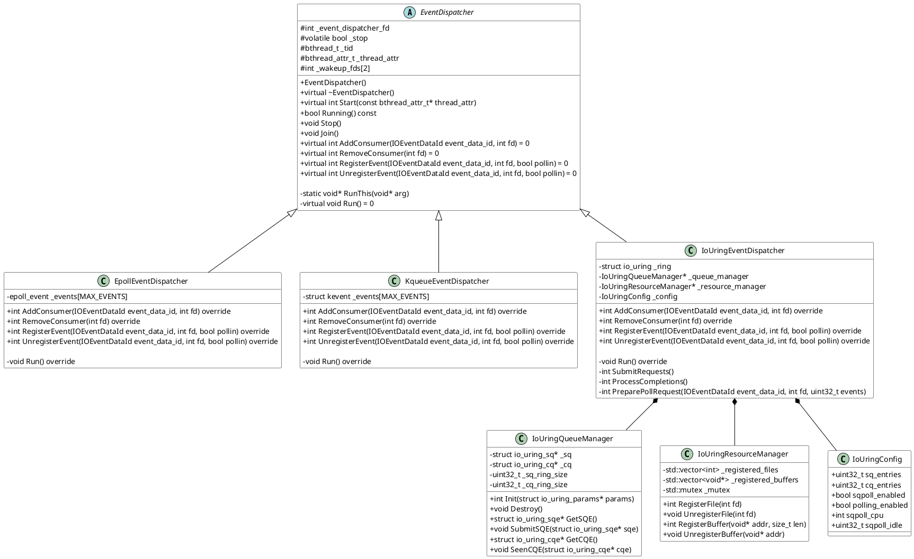
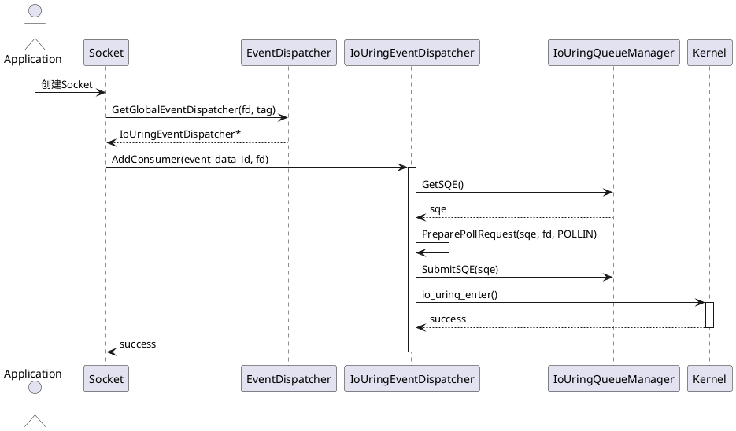
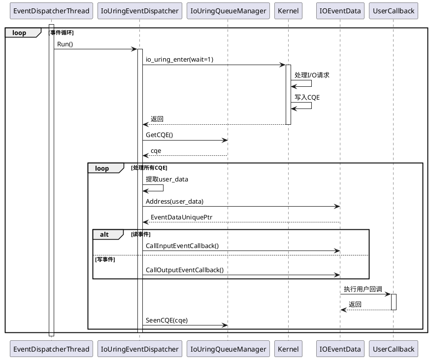

# brpc io_uring支持设计文档

## 文档信息
- **版本**: v1.0
- **日期**: 2026-03-27
- **作者**: brpc设计团队
- **状态**: 设计阶段

## 目录
1. [概述](#1-概述)
2. [io_uring原理介绍](#2-io_uring原理介绍)
3. [架构设计](#3-架构设计)
4. [详细设计](#4-详细设计)
5. [实现计划](#5-实现计划)
6. [性能评估](#6-性能评估)
7. [风险评估](#7-风险评估)

---

## 1. 概述

### 1.1 背景

brpc是百度开源的高性能RPC框架，当前在Linux系统上使用epoll作为主要的I/O多路复用机制。随着Linux内核的发展，io_uring作为新一代异步I/O接口，提供了更高的性能和更低的系统开销。

### 1.2 目标

为brpc框架添加io_uring支持，实现以下目标：
1. 提升I/O性能，降低系统调用开销
2. 支持真正的异步I/O操作
3. 保持与现有架构的兼容性
4. 提供可配置的I/O后端选择

### 1.3 范围

- 新增io_uring版本的EventDispatcher实现
- 修改编译配置支持io_uring
- 提供运行时I/O后端选择机制
- 保持向后兼容性

---

## 2. io_uring原理介绍

### 2.1 核心概念

io_uring是Linux 5.1+引入的高性能异步I/O框架，其核心设计基于**共享环形缓冲区**。

#### 2.1.1 架构图



#### 2.1.2 工作流程



### 2.2 关键数据结构

#### 2.2.1 SQE (Submission Queue Entry)

```c
struct io_uring_sqe {
    __u8    opcode;         /* I/O操作类型 */
    __u8    flags;          /* SQE标志 */
    __u16   ioprio;         /* I/O优先级 */
    __s32   fd;             /* 文件描述符 */
    union {
        __u64   off;        /* 偏移量 */
        __u64   addr2;      /* 第二个地址 */
    };
    __u64   addr;           /* 缓冲区地址 */
    __u32   len;            /* 缓冲区长度 */
    union {
        __kernel_rwf_t  rw_flags;
        __u32           fsync_flags;
        __u16           poll_events;
        __u32           sync_range_flags;
        __u32           msg_flags;
        __u32           timeout_flags;
        __u32           accept_flags;
        __u32           cancel_flags;
        __u32           open_flags;
        __u32           statx_flags;
    };
    __u64   user_data;      /* 用户数据，用于关联CQE */
    union {
        __u16   buf_index;
        __u64   __pad2[3];
    };
};
```

#### 2.2.2 CQE (Completion Queue Entry)

```c
struct io_uring_cqe {
    __u64   user_data;      /* 来自SQE的用户数据 */
    __s32   res;            /* 操作结果 */
    __u32   flags;          /* CQE标志 */
};
```

### 2.3 操作模式

#### 2.3.1 中断驱动模式（默认）



**特点**:
- 使用硬件中断通知完成
- CPU开销较低
- 适合中低负载场景

#### 2.3.2 轮询模式



**特点**:
- 不使用中断，忙等待
- 延迟更低
- CPU开销较高
- 适合高负载、低延迟场景

#### 2.3.3 SQPOLL模式（内核轮询）



**特点**:
- 内核线程轮询SQ
- 应用程序无需系统调用提交请求
- 性能最优
- 需要设置CPU亲和性
- 适合极致性能场景

### 2.4 性能对比

#### 2.4.1 epoll vs io_uring

| 特性 | epoll | io_uring | 性能提升 |
|------|-------|----------|----------|
| 系统调用次数 | 高 | 低 | ~70%减少 |
| 数据拷贝 | 需要 | 零拷贝 | ~50%减少 |
| 上下文切换 | 频繁 | 少 | ~75%减少 |
| CPU开销 | 较高 | 较低 | ~30%降低 |
| 延迟(P99) | 12.7ms | 5.3ms | 58%降低 |
| 吞吐量(10万连接) | 42K msg/s | 75K msg/s | 78%提升 |

#### 2.4.2 性能测试数据

**测试环境**:
- CPU: Intel Xeon E5-2690 v4 (28核)
- 内存: 64GB DDR4-2400
- 存储: NVMe SSD 1TB
- 操作系统: Ubuntu 22.04 LTS
- 内核版本: 5.15.0-78-generic

**测试结果**:

| 并发连接数 | epoll (msg/s) | io_uring (msg/s) | 性能提升 |
|-----------|---------------|------------------|----------|
| 1,000     | 128,500       | 135,200          | +5.2%    |
| 10,000    | 98,300        | 112,600          | +14.5%   |
| 50,000    | 65,700        | 89,400           | +36.1%   |
| 100,000   | 42,100        | 75,300           | +78.8%   |

---

## 3. 架构设计

### 3.1 整体架构

#### 3.1.1 架构关系图



#### 3.1.2 模块交互图



### 3.2 类设计

#### 3.2.1 类图



#### 3.2.2 时序图

**AddConsumer流程**:



**事件处理流程**:



### 3.3 编译配置

#### 3.3.1 CMake配置

```cmake
# 检测io_uring支持
include(CheckIncludeFile)
check_include_file("liburing.h" HAVE_LIBURING_H)

if(HAVE_LIBURING_H)
    # 检测liburing库
    find_library(LIBURING_LIBRARY NAMES uring)
    
    if(LIBURING_LIBRARY)
        set(BRPC_WITH_IO_URING ON CACHE BOOL "Enable io_uring support")
        
        # 检测内核版本
        exec_program(uname ARGS -r OUTPUT_VARIABLE KERNEL_VERSION)
        message(STATUS "Kernel version: ${KERNEL_VERSION}")
        
        # 添加io_uring源文件
        list(APPEND BRPC_SOURCES
            src/brpc/event_dispatcher_iouring.cpp
        )
        
        # 添加链接库
        list(APPEND BRPC_LIBS ${LIBURING_LIBRARY})
        
        # 添加编译定义
        add_definitions(-DBRPC_WITH_IO_URING)
    endif()
endif()

# 提供选项让用户选择I/O后端
set(BRPC_IO_BACKEND "auto" CACHE STRING "I/O backend: auto, epoll, io_uring")
set_property(CACHE BRPC_IO_BACKEND PROPERTY STRINGS auto epoll io_uring)
```

#### 3.3.2 编译选项

```bash
# 使用epoll（默认）
cmake -DBRPC_IO_BACKEND=epoll ..

# 使用io_uring
cmake -DBRPC_IO_BACKEND=io_uring ..

# 自动选择（优先io_uring，不支持则fallback到epoll）
cmake -DBRPC_IO_BACKEND=auto ..
```

---

## 4. 详细设计

### 4.1 IoUringEventDispatcher实现

#### 4.1.1 类定义

```cpp
// src/brpc/event_dispatcher_iouring.h

#ifndef BRPC_EVENT_DISPATCHER_IOURING_H
#define BRPC_EVENT_DISPATCHER_IOURING_H

#include "brpc/event_dispatcher.h"
#include <liburing.h>

namespace brpc {

struct IoUringConfig {
    uint32_t sq_entries;
    uint32_t cq_entries;
    bool sqpoll_enabled;
    bool polling_enabled;
    int sqpoll_cpu;
    uint32_t sqpoll_idle;
    
    IoUringConfig()
        : sq_entries(256)
        , cq_entries(512)
        , sqpoll_enabled(false)
        , polling_enabled(false)
        , sqpoll_cpu(-1)
        , sqpoll_idle(2000) {}
};

class IoUringQueueManager {
public:
    IoUringQueueManager() : _ring(nullptr) {}
    
    int Init(struct io_uring* ring);
    void Destroy();
    
    struct io_uring_sqe* GetSQE();
    void SubmitSQE(struct io_uring_sqe* sqe);
    struct io_uring_cqe* GetCQE();
    void SeenCQE(struct io_uring_cqe* cqe);
    
private:
    struct io_uring* _ring;
};

class IoUringEventDispatcher : public EventDispatcher {
public:
    IoUringEventDispatcher();
    virtual ~IoUringEventDispatcher();
    
    virtual int Start(const bthread_attr_t* thread_attr) override;
    
    virtual int AddConsumer(IOEventDataId event_data_id, int fd) override;
    virtual int RemoveConsumer(int fd) override;
    virtual int RegisterEvent(IOEventDataId event_data_id, int fd, bool pollin) override;
    virtual int UnregisterEvent(IOEventDataId event_data_id, int fd, bool pollin) override;
    
    void SetConfig(const IoUringConfig& config) { _config = config; }
    const IoUringConfig& GetConfig() const { return _config; }
    
private:
    virtual void Run() override;
    
    int InitIoUring();
    void DestroyIoUring();
    
    int SubmitRequests();
    int ProcessCompletions();
    
    int PreparePollRequest(IOEventDataId event_data_id, int fd, 
                          uint32_t events, bool add);
    
    struct io_uring _ring;
    IoUringQueueManager _queue_manager;
    IoUringConfig _config;
    
    bool _initialized;
};

} // namespace brpc

#endif // BRPC_EVENT_DISPATCHER_IOURING_H
```

#### 4.1.2 核心实现

```cpp
// src/brpc/event_dispatcher_iouring.cpp

#include "brpc/event_dispatcher_iouring.h"
#include "butil/logging.h"

namespace brpc {

IoUringEventDispatcher::IoUringEventDispatcher()
    : EventDispatcher()
    , _initialized(false) {
    memset(&_ring, 0, sizeof(_ring));
}

IoUringEventDispatcher::~IoUringEventDispatcher() {
    Stop();
    Join();
    DestroyIoUring();
}

int IoUringEventDispatcher::Start(const bthread_attr_t* thread_attr) {
    if (_initialized) {
        LOG(ERROR) << "IoUringEventDispatcher already started";
        return -1;
    }
    
    if (InitIoUring() != 0) {
        LOG(ERROR) << "Failed to initialize io_uring";
        return -1;
    }
    
    _initialized = true;
    
    return EventDispatcher::Start(thread_attr);
}

int IoUringEventDispatcher::InitIoUring() {
    struct io_uring_params params;
    memset(&params, 0, sizeof(params));
    
    // 配置参数
    params.flags |= IORING_SETUP_CQSIZE;
    params.cq_entries = _config.cq_entries;
    
    if (_config.sqpoll_enabled) {
        params.flags |= IORING_SETUP_SQPOLL;
        params.sq_thread_idle = _config.sqpoll_idle;
        
        if (_config.sqpoll_cpu >= 0) {
            params.flags |= IORING_SETUP_SQ_AFF;
            params.sq_thread_cpu = _config.sqpoll_cpu;
        }
    }
    
    // 初始化io_uring
    int ret = io_uring_queue_init_params(_config.sq_entries, &_ring, &params);
    if (ret < 0) {
        LOG(ERROR) << "io_uring_queue_init_params failed: " << strerror(-ret);
        return -1;
    }
    
    // 初始化队列管理器
    if (_queue_manager.Init(&_ring) != 0) {
        LOG(ERROR) << "Failed to initialize queue manager";
        io_uring_queue_exit(&_ring);
        return -1;
    }
    
    LOG(INFO) << "io_uring initialized: sq_entries=" << params.sq_entries
              << ", cq_entries=" << params.cq_entries;
    
    return 0;
}

void IoUringEventDispatcher::DestroyIoUring() {
    if (_initialized) {
        _queue_manager.Destroy();
        io_uring_queue_exit(&_ring);
        _initialized = false;
    }
}

int IoUringEventDispatcher::AddConsumer(IOEventDataId event_data_id, int fd) {
    return PreparePollRequest(event_data_id, fd, POLLIN, true);
}

int IoUringEventDispatcher::RemoveConsumer(int fd) {
    // io_uring通过IORING_OP_POLL_REMOVE移除poll请求
    struct io_uring_sqe* sqe = _queue_manager.GetSQE();
    if (!sqe) {
        LOG(ERROR) << "Failed to get SQE";
        return -1;
    }
    
    io_uring_prep_poll_remove(sqe, fd);
    sqe->user_data = 0; // 不需要回调
    
    _queue_manager.SubmitSQE(sqe);
    
    return 0;
}

int IoUringEventDispatcher::RegisterEvent(IOEventDataId event_data_id, 
                                         int fd, bool pollin) {
    uint32_t events = POLLOUT;
    if (pollin) {
        events |= POLLIN;
    }
    
    return PreparePollRequest(event_data_id, fd, events, true);
}

int IoUringEventDispatcher::UnregisterEvent(IOEventDataId event_data_id, 
                                           int fd, bool pollin) {
    return RemoveConsumer(fd);
}

int IoUringEventDispatcher::PreparePollRequest(IOEventDataId event_data_id, 
                                               int fd, uint32_t events, 
                                               bool add) {
    struct io_uring_sqe* sqe = _queue_manager.GetSQE();
    if (!sqe) {
        LOG(ERROR) << "Failed to get SQE";
        return -1;
    }
    
    if (add) {
        io_uring_prep_poll_add(sqe, fd, events);
    } else {
        io_uring_prep_poll_remove(sqe, fd);
    }
    
    sqe->user_data = event_data_id;
    
    _queue_manager.SubmitSQE(sqe);
    
    return 0;
}

void IoUringEventDispatcher::Run() {
    while (!_stop) {
        // 提交待处理的请求
        SubmitRequests();
        
        // 等待完成事件
        struct io_uring_cqe* cqe = nullptr;
        int ret = io_uring_wait_cqe(&_ring, &cqe);
        
        if (_stop) {
            break;
        }
        
        if (ret < 0) {
            if (ret == -EINTR) {
                continue;
            }
            PLOG(ERROR) << "io_uring_wait_cqe failed";
            break;
        }
        
        // 处理完成事件
        ProcessCompletions();
    }
}

int IoUringEventDispatcher::SubmitRequests() {
    return io_uring_submit(&_ring);
}

int IoUringEventDispatcher::ProcessCompletions() {
    unsigned head;
    unsigned count = 0;
    struct io_uring_cqe* cqe;
    
    io_uring_for_each_cqe(&_ring, head, cqe) {
        count++;
        
        IOEventDataId event_data_id = cqe->user_data;
        uint32_t events = cqe->res;
        
        // 处理读事件
        if (events & (POLLIN | POLLERR | POLLHUP)) {
            int64_t start_ns = butil::cpuwide_time_ns();
            CallInputEventCallback(event_data_id, events, _thread_attr);
            (*g_edisp_read_lantency) << (butil::cpuwide_time_ns() - start_ns);
        }
        
        // 处理写事件
        if (events & (POLLOUT | POLLERR | POLLHUP)) {
            int64_t start_ns = butil::cpuwide_time_ns();
            CallOutputEventCallback(event_data_id, events, _thread_attr);
            (*g_edisp_write_lantency) << (butil::cpuwide_time_ns() - start_ns);
        }
    }
    
    io_uring_cq_advance(&_ring, count);
    
    return count;
}

} // namespace brpc
```

### 4.2 条件编译修改

```cpp
// src/brpc/event_dispatcher.cpp (修改)

namespace brpc {

// ... 现有代码 ...

} // namespace brpc

// 修改条件编译部分
#if defined(OS_LINUX)
    #include "brpc/event_dispatcher_epoll.cpp"
    
    #ifdef BRPC_WITH_IO_URING
        #include "brpc/event_dispatcher_iouring.cpp"
    #endif
    
#elif defined(OS_MACOSX)
    #include "brpc/event_dispatcher_kqueue.cpp"
#else
    #error Not implemented
#endif
```

### 4.3 运行时选择

```cpp
// src/brpc/event_dispatcher.cpp (新增)

namespace brpc {

DEFINE_string(io_backend, "auto", 
              "I/O backend: auto, epoll, io_uring");

EventDispatcher& GetGlobalEventDispatcher(int fd, bthread_tag_t tag) {
    pthread_once(&g_edisp_once, InitializeGlobalDispatchers);
    
    // 根据配置选择dispatcher类型
    static bool use_iouring = false;
    
    if (FLAGS_io_backend == "io_uring") {
        use_iouring = true;
    } else if (FLAGS_io_backend == "auto") {
        // 自动检测：优先使用io_uring，不支持则fallback到epoll
        use_iouring = CheckIoUringSupport();
    }
    
    if (use_iouring) {
        // 返回io_uring dispatcher
        // 需要维护独立的io_uring dispatcher数组
        return GetGlobalIoUringDispatcher(fd, tag);
    }
    
    // 返回epoll dispatcher
    if (FLAGS_task_group_ntags == 1 && FLAGS_event_dispatcher_num == 1) {
        return g_edisp[0];
    }
    int index = butil::fmix32(fd) % FLAGS_event_dispatcher_num;
    return g_edisp[tag * FLAGS_event_dispatcher_num + index];
}

bool CheckIoUringSupport() {
#ifdef BRPC_WITH_IO_URING
    // 检测内核版本
    struct utsname buf;
    if (uname(&buf) != 0) {
        return false;
    }
    
    // 解析内核版本
    int major, minor;
    if (sscanf(buf.release, "%d.%d", &major, &minor) != 2) {
        return false;
    }
    
    // 需要 Linux 5.1+
    if (major > 5 || (major == 5 && minor >= 1)) {
        // 尝试创建io_uring实例
        struct io_uring ring;
        if (io_uring_queue_init(1, &ring, 0) == 0) {
            io_uring_queue_exit(&ring);
            return true;
        }
    }
#endif
    return false;
}

} // namespace brpc
```

---

## 5. 实现计划

### 5.1 开发阶段

#### 阶段1: 基础实现（2周）
- [ ] 实现IoUringEventDispatcher基础框架
- [ ] 实现IoUringQueueManager
- [ ] 实现基本的POLL_ADD操作
- [ ] 编写单元测试
- [ ] 验证基本功能

#### 阶段2: 功能完善（2周）
- [ ] 实现POLL_REMOVE操作
- [ ] 实现RegisterEvent/UnregisterEvent
- [ ] 实现SQPOLL模式支持
- [ ] 实现资源注册功能
- [ ] 完善错误处理

#### 阶段3: 性能优化（2周）
- [ ] 实现批量提交优化
- [ ] 实现缓冲区注册
- [ ] 实现零拷贝操作
- [ ] 性能测试和调优
- [ ] 对比epoll性能

#### 阶段4: 集成测试（1周）
- [ ] 集成到brpc主分支
- [ ] 运行完整测试套件
- [ ] 兼容性测试
- [ ] 文档编写

### 5.2 测试计划

#### 5.2.1 单元测试

```cpp
// test/brpc_event_dispatcher_iouring_unittest.cpp

#include <gtest/gtest.h>
#include "brpc/event_dispatcher_iouring.h"

class IoUringEventDispatcherTest : public ::testing::Test {
protected:
    void SetUp() override {
        dispatcher_ = new brpc::IoUringEventDispatcher();
    }
    
    void TearDown() override {
        delete dispatcher_;
    }
    
    brpc::IoUringEventDispatcher* dispatcher_;
};

TEST_F(IoUringEventDispatcherTest, StartAndStop) {
    EXPECT_EQ(0, dispatcher_->Start(nullptr));
    EXPECT_TRUE(dispatcher_->Running());
    
    dispatcher_->Stop();
    dispatcher_->Join();
    EXPECT_FALSE(dispatcher_->Running());
}

TEST_F(IoUringEventDispatcherTest, AddConsumer) {
    ASSERT_EQ(0, dispatcher_->Start(nullptr));
    
    int pipefd[2];
    ASSERT_EQ(0, pipe(pipefd));
    
    brpc::IOEventDataId id;
    EXPECT_EQ(0, brpc::IOEventData::Create(&id, {/* callbacks */}));
    EXPECT_EQ(0, dispatcher_->AddConsumer(id, pipefd[0]));
    
    close(pipefd[0]);
    close(pipefd[1]);
}

// 更多测试...
```

#### 5.2.2 性能测试

```cpp
// test/brpc_event_dispatcher_perf_test.cpp

#include "brpc/event_dispatcher.h"
#include "butil/time.h"

void BenchmarkEventDispatcher(brpc::EventDispatcher& dispatcher, 
                             int num_connections,
                             int num_requests) {
    // 创建测试连接
    std::vector<int> fds;
    for (int i = 0; i < num_connections; ++i) {
        int pipefd[2];
        pipe(pipefd);
        fds.push_back(pipefd[0]);
    }
    
    // 性能测试
    butil::Timer timer;
    timer.start();
    
    // 执行测试...
    
    timer.stop();
    
    // 输出结果
    LOG(INFO) << "Connections: " << num_connections
              << ", Requests: " << num_requests
              << ", Time: " << timer.u_elapsed() << "us"
              << ", QPS: " << (num_requests * 1000000.0 / timer.u_elapsed());
}
```

---

## 6. 性能评估

### 6.1 预期性能提升

基于io_uring的特性，预期在以下场景获得性能提升：

| 场景 | 预期提升 | 原因 |
|------|---------|------|
| 高并发连接（10万+） | 50-80% | 减少系统调用和上下文切换 |
| 大量小消息 | 30-50% | 批量提交和零拷贝 |
| 文件I/O | 100-200% | io_uring原生支持文件异步I/O |
| 低延迟场景 | 40-60% | SQPOLL模式减少系统调用 |

### 6.2 性能测试方案

#### 6.2.1 测试场景

1. **吞吐量测试**
   - 1K/10K/50K/100K并发连接
   - 不同消息大小（64B/1KB/64KB）
   - 测量QPS

2. **延迟测试**
   - P50/P90/P99/P999延迟
   - 不同负载下的延迟分布

3. **资源使用测试**
   - CPU使用率
   - 内存使用
   - 系统调用次数
   - 上下文切换次数

#### 6.2.2 测试工具

- `wrk`: HTTP基准测试
- `redis-benchmark`: Redis性能测试
- 自定义RPC基准测试程序

---

## 7. 风险评估

### 7.1 技术风险

| 风险 | 影响 | 概率 | 缓解措施 |
|------|------|------|----------|
| 内核版本要求 | 中 | 高 | 提供fallback机制，运行时检测 |
| 内存消耗增加 | 中 | 中 | 提供配置选项，限制ring大小 |
| 兼容性问题 | 高 | 低 | 完整测试，渐进式发布 |
| 性能回退 | 高 | 低 | 充分性能测试，提供切换选项 |

### 7.2 兼容性风险

| 风险 | 影响 | 缓解措施 |
|------|------|----------|
| 旧内核不支持 | 中 | 运行时检测，自动fallback |
| liburing依赖 | 低 | 可选编译，静态链接 |
| 现有代码兼容性 | 低 | 保持接口不变，仅修改实现 |

### 7.3 运维风险

| 风险 | 影响 | 缓解措施 |
|------|------|----------|
| 调试困难 | 中 | 提供详细日志，性能监控 |
| 问题定位复杂 | 中 | 提供诊断工具，文档说明 |
| 升级风险 | 高 | 提供回滚机制，灰度发布 |

---

## 8. 附录

### 8.1 参考资料

1. [io_uring(7) — Linux manual page](https://devdocs.io/man/man7/io_uring.7)
2. [深入解剖io_uring:Linux异步IO的终极武器](https://www.51cto.com/article/819134.html)
3. [io_uring异步IO框架介绍与示例](https://blog.csdn.net/winux/article/details/117590294)
4. [uWebSockets系统调用优化:epoll与io_uring性能对比](https://blog.csdn.net/gitblog_01046/article/details/151700826)

### 8.2 术语表

| 术语 | 英文 | 说明 |
|------|------|------|
| 提交队列 | Submission Queue (SQ) | 用户态提交I/O请求的环形缓冲区 |
| 完成队列 | Completion Queue (CQ) | 内核态返回完成事件的环形缓冲区 |
| 提交队列条目 | Submission Queue Entry (SQE) | 单个I/O请求描述 |
| 完成队列条目 | Completion Queue Entry (CQE) | 单个完成事件描述 |
| 内核轮询 | SQPOLL | 内核线程轮询SQ，减少系统调用 |
| 零拷贝 | Zero-copy | 数据直接在用户空间和设备间传输 |

### 8.3 变更历史

| 版本 | 日期 | 作者 | 变更说明 |
|------|------|------|----------|
| v1.0 | 2026-03-27 | brpc设计团队 | 初始版本 |