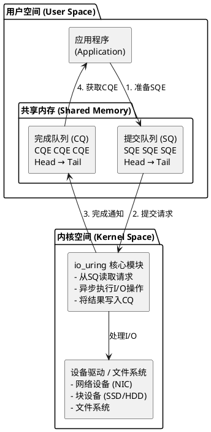
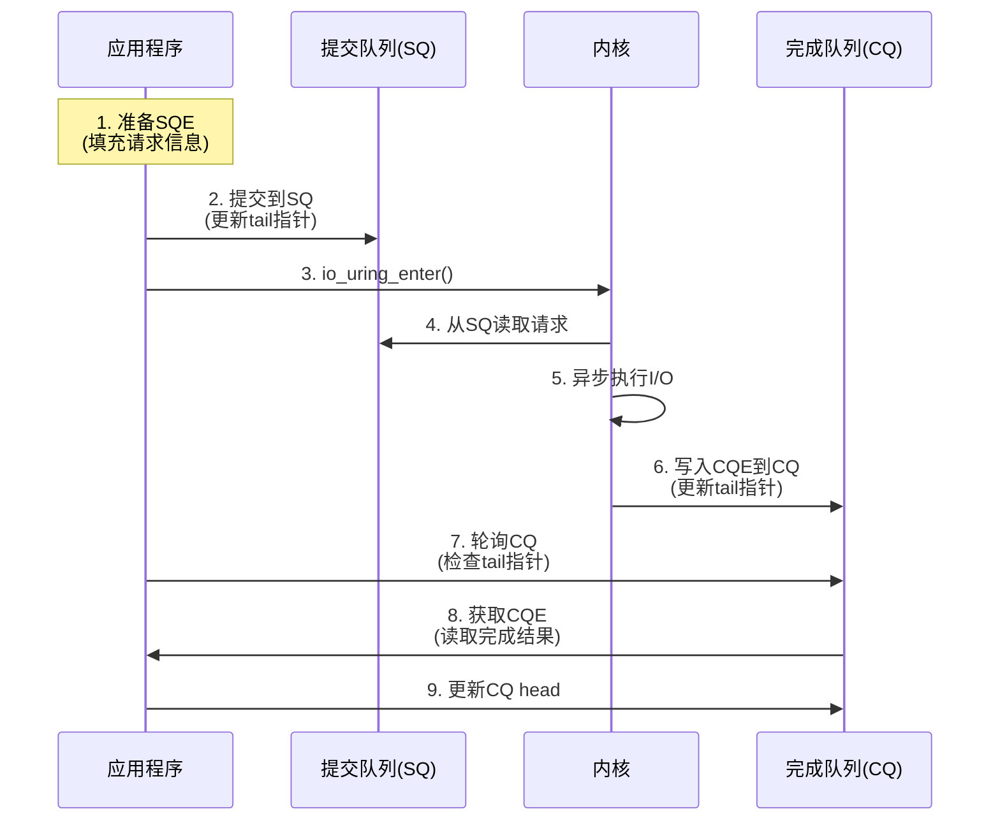
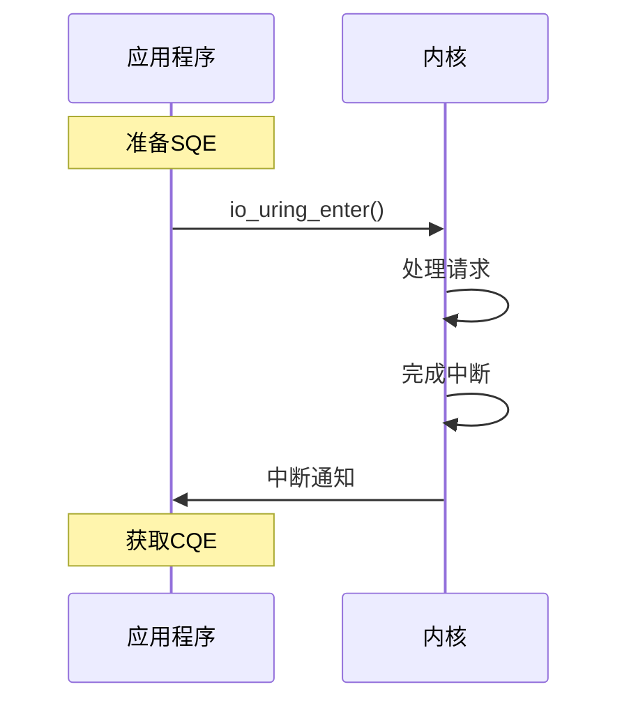
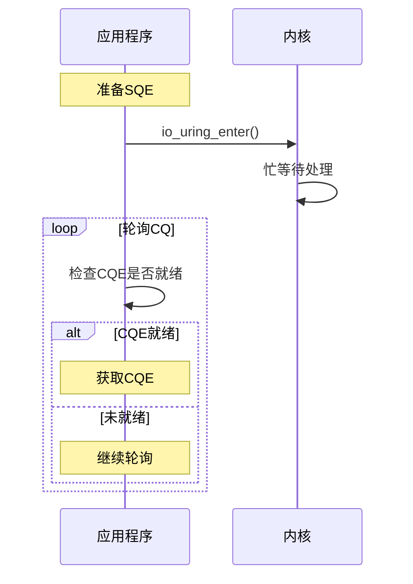
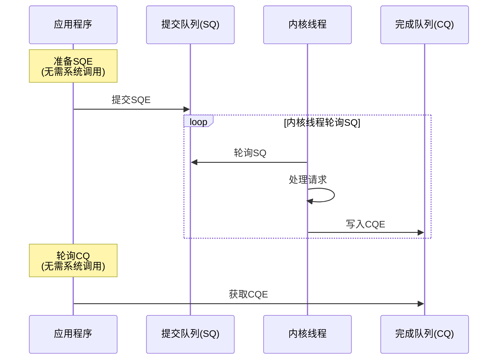
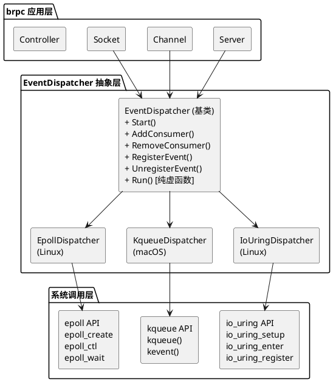
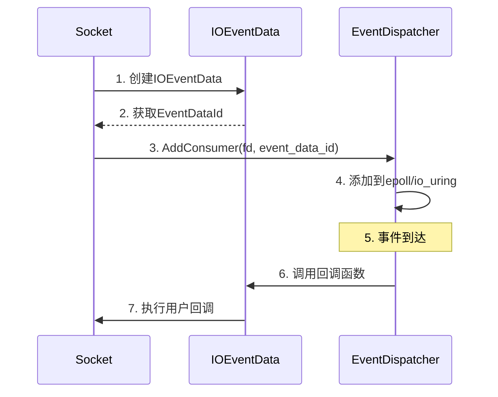
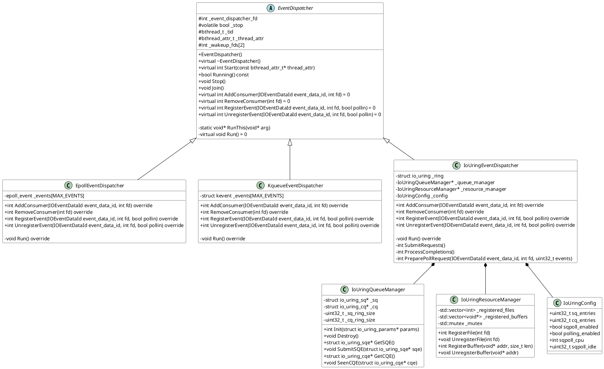
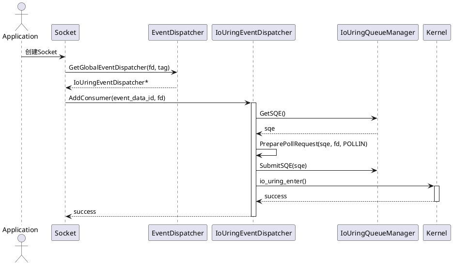
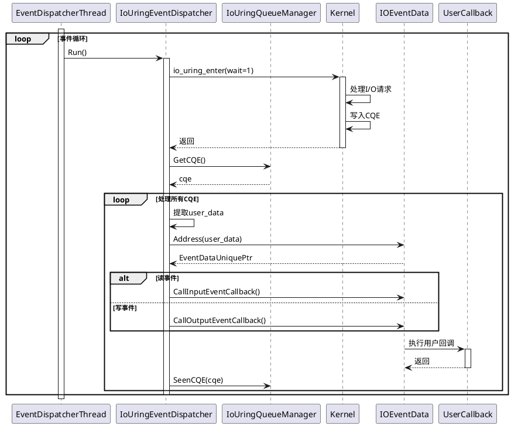

# brpc io_uring支持设计文档

## 文档信息
- **版本**: v1.0
- **日期**: 2026-03-27
- **作者**: brpc设计团队
- **状态**: 设计阶段

## 目录
1. [概述](#1-概述)
2. [io_uring原理介绍](#2-io_uring原理介绍)
3. [架构设计](#3-架构设计)
4. [详细设计](#4-详细设计)
5. [实现计划](#5-实现计划)
6. [性能评估](#6-性能评估)
7. [风险评估](#7-风险评估)

---

## 1. 概述

### 1.1 背景

brpc是百度开源的高性能RPC框架，当前在Linux系统上使用epoll作为主要的I/O多路复用机制。随着Linux内核的发展，io_uring作为新一代异步I/O接口，提供了更高的性能和更低的系统开销。

### 1.2 目标

为brpc框架添加io_uring支持，实现以下目标：
1. 提升I/O性能，降低系统调用开销
2. 支持真正的异步I/O操作
3. 保持与现有架构的兼容性
4. 提供可配置的I/O后端选择

### 1.3 范围

- 新增io_uring版本的EventDispatcher实现
- 修改编译配置支持io_uring
- 提供运行时I/O后端选择机制
- 保持向后兼容性

---

## 2. io_uring原理介绍

### 2.1 核心概念

io_uring是Linux 5.1+引入的高性能异步I/O框架，其核心设计基于**共享环形缓冲区**。

#### 2.1.1 架构图


```plantuml
@startuml
skinparam componentStyle rectangle

package "用户空间 (User Space)" {
    component "应用程序\n(Application)" as App
    
    package "共享内存 (Shared Memory)" {
        component "提交队列 (SQ)\nSQE SQE SQE\nHead → Tail" as SQ
        component "完成队列 (CQ)\nCQE CQE CQE\nHead → Tail" as CQ
    }
}

package "内核空间 (Kernel Space)" {
    component "io_uring 核心模块\n- 从SQ读取请求\n- 异步执行I/O操作\n- 将结果写入CQ" as IoUringCore
    component "设备驱动 / 文件系统\n- 网络设备 (NIC)\n- 块设备 (SSD/HDD)\n- 文件系统" as Drivers
}

App -down-> SQ : 1. 准备SQE
SQ -down-> IoUringCore : 2. 提交请求
IoUringCore -down-> Drivers : 处理I/O
IoUringCore -up-> CQ : 3. 完成通知
CQ -up-> App : 4. 获取CQE

@enduml
```

#### 2.1.2 工作流程


```mermaid
sequenceDiagram
    participant App as 应用程序
    participant SQ as 提交队列(SQ)
    participant Kernel as 内核
    participant CQ as 完成队列(CQ)
    
    Note over App: 1. 准备SQE<br/>(填充请求信息)
    App->>SQ: 2. 提交到SQ<br/>(更新tail指针)
    App->>Kernel: 3. io_uring_enter()
    Kernel->>SQ: 4. 从SQ读取请求
    Kernel->>Kernel: 5. 异步执行I/O
    Kernel->>CQ: 6. 写入CQE到CQ<br/>(更新tail指针)
    App->>CQ: 7. 轮询CQ<br/>(检查tail指针)
    CQ->>App: 8. 获取CQE<br/>(读取完成结果)
    App->>CQ: 9. 更新CQ head
```

### 2.2 关键数据结构

#### 2.2.1 SQE (Submission Queue Entry)

```c
struct io_uring_sqe {
    __u8    opcode;         /* I/O操作类型 */
    __u8    flags;          /* SQE标志 */
    __u16   ioprio;         /* I/O优先级 */
    __s32   fd;             /* 文件描述符 */
    union {
        __u64   off;        /* 偏移量 */
        __u64   addr2;      /* 第二个地址 */
    };
    __u64   addr;           /* 缓冲区地址 */
    __u32   len;            /* 缓冲区长度 */
    union {
        __kernel_rwf_t  rw_flags;
        __u32           fsync_flags;
        __u16           poll_events;
        __u32           sync_range_flags;
        __u32           msg_flags;
        __u32           timeout_flags;
        __u32           accept_flags;
        __u32           cancel_flags;
        __u32           open_flags;
        __u32           statx_flags;
    };
    __u64   user_data;      /* 用户数据，用于关联CQE */
    union {
        __u16   buf_index;
        __u64   __pad2[3];
    };
};
```

#### 2.2.2 CQE (Completion Queue Entry)

```c
struct io_uring_cqe {
    __u64   user_data;      /* 来自SQE的用户数据 */
    __s32   res;            /* 操作结果 */
    __u32   flags;          /* CQE标志 */
};
```

### 2.3 操作模式

#### 2.3.1 中断驱动模式（默认）


```mermaid
sequenceDiagram
    participant App as 应用程序
    participant Kernel as 内核
    
    Note over App: 准备SQE
    App->>Kernel: io_uring_enter()
    Kernel->>Kernel: 处理请求
    Kernel->>Kernel: 完成中断
    Kernel->>App: 中断通知
    Note over App: 获取CQE
```

**特点**:
- 使用硬件中断通知完成
- CPU开销较低
- 适合中低负载场景

#### 2.3.2 轮询模式


```mermaid
sequenceDiagram
    participant App as 应用程序
    participant Kernel as 内核
    
    Note over App: 准备SQE
    App->>Kernel: io_uring_enter()
    Kernel->>Kernel: 忙等待处理
    loop 轮询CQ
        App->>App: 检查CQE是否就绪
        alt CQE就绪
            Note over App: 获取CQE
        else 未就绪
            Note over App: 继续轮询
        end
    end
```

**特点**:
- 不使用中断，忙等待
- 延迟更低
- CPU开销较高
- 适合高负载、低延迟场景

#### 2.3.3 SQPOLL模式（内核轮询）


```mermaid
sequenceDiagram
    participant App as 应用程序
    participant SQ as 提交队列(SQ)
    participant KThread as 内核线程
    participant CQ as 完成队列(CQ)
    
    Note over App: 准备SQE<br/>(无需系统调用)
    App->>SQ: 提交SQE
    
    loop 内核线程轮询SQ
        KThread->>SQ: 轮询SQ
        KThread->>KThread: 处理请求
        KThread->>CQ: 写入CQE
    end
    
    Note over App: 轮询CQ<br/>(无需系统调用)
    App->>CQ: 获取CQE
```

**特点**:
- 内核线程轮询SQ
- 应用程序无需系统调用提交请求
- 性能最优
- 需要设置CPU亲和性
- 适合极致性能场景

### 2.4 性能对比

#### 2.4.1 epoll vs io_uring

| 特性 | epoll | io_uring | 性能提升 |
|------|-------|----------|----------|
| 系统调用次数 | 高 | 低 | ~70%减少 |
| 数据拷贝 | 需要 | 零拷贝 | ~50%减少 |
| 上下文切换 | 频繁 | 少 | ~75%减少 |
| CPU开销 | 较高 | 较低 | ~30%降低 |
| 延迟(P99) | 12.7ms | 5.3ms | 58%降低 |
| 吞吐量(10万连接) | 42K msg/s | 75K msg/s | 78%提升 |

#### 2.4.2 性能测试数据

**测试环境**:
- CPU: Intel Xeon E5-2690 v4 (28核)
- 内存: 64GB DDR4-2400
- 存储: NVMe SSD 1TB
- 操作系统: Ubuntu 22.04 LTS
- 内核版本: 5.15.0-78-generic

**测试结果**:

| 并发连接数 | epoll (msg/s) | io_uring (msg/s) | 性能提升 |
|-----------|---------------|------------------|----------|
| 1,000     | 128,500       | 135,200          | +5.2%    |
| 10,000    | 98,300        | 112,600          | +14.5%   |
| 50,000    | 65,700        | 89,400           | +36.1%   |
| 100,000   | 42,100        | 75,300           | +78.8%   |

---

## 3. 架构设计

### 3.1 整体架构

#### 3.1.1 架构关系图


```plantuml
@startuml
skinparam componentStyle rectangle

package "brpc 应用层" {
    [Server] as Server
    [Channel] as Channel
    [Socket] as Socket
    [Controller] as Controller
}

package "EventDispatcher 抽象层" {
    component "EventDispatcher (基类)\n+ Start()\n+ AddConsumer()\n+ RemoveConsumer()\n+ RegisterEvent()\n+ UnregisterEvent()\n+ Run() [纯虚函数]" as BaseDispatcher
    
    component "EpollDispatcher\n(Linux)" as EpollDisp
    component "KqueueDispatcher\n(macOS)" as KqueueDisp
    component "IoUringDispatcher\n(Linux)" as IoUringDisp
}

package "系统调用层" {
    component "epoll API\nepoll_create\nepoll_ctl\nepoll_wait" as EpollAPI
    component "kqueue API\nkqueue()\nkevent()" as KqueueAPI
    component "io_uring API\nio_uring_setup\nio_uring_enter\nio_uring_register" as IoUringAPI
}

Server -down-> BaseDispatcher
Channel -down-> BaseDispatcher
Socket -down-> BaseDispatcher

BaseDispatcher -down-> EpollDisp
BaseDispatcher -down-> KqueueDisp
BaseDispatcher -down-> IoUringDisp

EpollDisp -down-> EpollAPI
KqueueDisp -down-> KqueueAPI
IoUringDisp -down-> IoUringAPI

@enduml
```

#### 3.1.2 模块交互图


```mermaid
sequenceDiagram
    participant Socket
    participant IOEventData
    participant EventDispatcher
    
    Socket->>IOEventData: 1. 创建IOEventData
    IOEventData-->>Socket: 2. 获取EventDataId
    Socket->>EventDispatcher: 3. AddConsumer(fd, event_data_id)
    EventDispatcher->>EventDispatcher: 4. 添加到epoll/io_uring
    Note over EventDispatcher: 5. 事件到达
    EventDispatcher->>IOEventData: 6. 调用回调函数
    IOEventData->>Socket: 7. 执行用户回调
```

### 3.2 类设计

#### 3.2.1 类图


```plantuml
@startuml
' 定义样式
skinparam classAttributeIconSize 0
skinparam class {
    BackgroundColor White
    ArrowColor Black
    BorderColor Black
}

' 基类
abstract class EventDispatcher {
    # int _event_dispatcher_fd
    # volatile bool _stop
    # bthread_t _tid
    # bthread_attr_t _thread_attr
    # int _wakeup_fds[2]
    
    + EventDispatcher()
    + virtual ~EventDispatcher()
    + virtual int Start(const bthread_attr_t* thread_attr)
    + bool Running() const
    + void Stop()
    + void Join()
    + virtual int AddConsumer(IOEventDataId event_data_id, int fd) = 0
    + virtual int RemoveConsumer(int fd) = 0
    + virtual int RegisterEvent(IOEventDataId event_data_id, int fd, bool pollin) = 0
    + virtual int UnregisterEvent(IOEventDataId event_data_id, int fd, bool pollin) = 0
    
    - static void* RunThis(void* arg)
    - virtual void Run() = 0
}

' epoll实现
class EpollEventDispatcher {
    - epoll_event _events[MAX_EVENTS]
    
    + int AddConsumer(IOEventDataId event_data_id, int fd) override
    + int RemoveConsumer(int fd) override
    + int RegisterEvent(IOEventDataId event_data_id, int fd, bool pollin) override
    + int UnregisterEvent(IOEventDataId event_data_id, int fd, bool pollin) override
    
    - void Run() override
}

' kqueue实现
class KqueueEventDispatcher {
    - struct kevent _events[MAX_EVENTS]
    
    + int AddConsumer(IOEventDataId event_data_id, int fd) override
    + int RemoveConsumer(int fd) override
    + int RegisterEvent(IOEventDataId event_data_id, int fd, bool pollin) override
    + int UnregisterEvent(IOEventDataId event_data_id, int fd, bool pollin) override
    
    - void Run() override
}

' io_uring实现
class IoUringEventDispatcher {
    - struct io_uring _ring
    - IoUringQueueManager* _queue_manager
    - IoUringResourceManager* _resource_manager
    - IoUringConfig _config
    
    + int AddConsumer(IOEventDataId event_data_id, int fd) override
    + int RemoveConsumer(int fd) override
    + int RegisterEvent(IOEventDataId event_data_id, int fd, bool pollin) override
    + int UnregisterEvent(IOEventDataId event_data_id, int fd, bool pollin) override
    
    - void Run() override
    - int SubmitRequests()
    - int ProcessCompletions()
    - int PreparePollRequest(IOEventDataId event_data_id, int fd, uint32_t events)
}

' 辅助类
class IoUringQueueManager {
    - struct io_uring_sq* _sq
    - struct io_uring_cq* _cq
    - uint32_t _sq_ring_size
    - uint32_t _cq_ring_size
    
    + int Init(struct io_uring_params* params)
    + void Destroy()
    + struct io_uring_sqe* GetSQE()
    + void SubmitSQE(struct io_uring_sqe* sqe)
    + struct io_uring_cqe* GetCQE()
    + void SeenCQE(struct io_uring_cqe* cqe)
}

class IoUringResourceManager {
    - std::vector<int> _registered_files
    - std::vector<void*> _registered_buffers
    - std::mutex _mutex
    
    + int RegisterFile(int fd)
    + void UnregisterFile(int fd)
    + int RegisterBuffer(void* addr, size_t len)
    + void UnregisterBuffer(void* addr)
}

class IoUringConfig {
    + uint32_t sq_entries
    + uint32_t cq_entries
    + bool sqpoll_enabled
    + bool polling_enabled
    + int sqpoll_cpu
    + uint32_t sqpoll_idle
}

' 关系
EventDispatcher <|-- EpollEventDispatcher
EventDispatcher <|-- KqueueEventDispatcher
EventDispatcher <|-- IoUringEventDispatcher

IoUringEventDispatcher *-- IoUringQueueManager
IoUringEventDispatcher *-- IoUringResourceManager
IoUringEventDispatcher *-- IoUringConfig

@enduml
```

#### 3.2.2 时序图

**AddConsumer流程**:


```plantuml
@startuml
actor Application
participant Socket
participant EventDispatcher
participant IoUringEventDispatcher
participant IoUringQueueManager
participant Kernel

Application -> Socket: 创建Socket
Socket -> EventDispatcher: GetGlobalEventDispatcher(fd, tag)
EventDispatcher --> Socket: IoUringEventDispatcher*

Socket -> IoUringEventDispatcher: AddConsumer(event_data_id, fd)
activate IoUringEventDispatcher

IoUringEventDispatcher -> IoUringQueueManager: GetSQE()
IoUringQueueManager --> IoUringEventDispatcher: sqe

IoUringEventDispatcher -> IoUringEventDispatcher: PreparePollRequest(sqe, fd, POLLIN)

IoUringEventDispatcher -> IoUringQueueManager: SubmitSQE(sqe)

IoUringEventDispatcher -> Kernel: io_uring_enter()
activate Kernel
Kernel --> IoUringEventDispatcher: success
deactivate Kernel

IoUringEventDispatcher --> Socket: success
deactivate IoUringEventDispatcher

@enduml
```

**事件处理流程**:


```plantuml
@startuml
participant EventDispatcherThread
participant IoUringEventDispatcher
participant IoUringQueueManager
participant Kernel
participant IOEventData
participant UserCallback

activate EventDispatcherThread

loop 事件循环
    EventDispatcherThread -> IoUringEventDispatcher: Run()
    activate IoUringEventDispatcher
    
    IoUringEventDispatcher -> Kernel: io_uring_enter(wait=1)
    activate Kernel
    
    Kernel -> Kernel: 处理I/O请求
    Kernel -> Kernel: 写入CQE
    
    Kernel --> IoUringEventDispatcher: 返回
    deactivate Kernel
    
    IoUringEventDispatcher -> IoUringQueueManager: GetCQE()
    IoUringQueueManager --> IoUringEventDispatcher: cqe
    
    loop 处理所有CQE
        IoUringEventDispatcher -> IoUringEventDispatcher: 提取user_data
        
        IoUringEventDispatcher -> IOEventData: Address(user_data)
        IOEventData --> IoUringEventDispatcher: EventDataUniquePtr
        
        alt 读事件
            IoUringEventDispatcher -> IOEventData: CallInputEventCallback()
        else 写事件
            IoUringEventDispatcher -> IOEventData: CallOutputEventCallback()
        end
        
        IOEventData -> UserCallback: 执行用户回调
        activate UserCallback
        UserCallback --> IOEventData: 返回
        deactivate UserCallback
        
        IoUringEventDispatcher -> IoUringQueueManager: SeenCQE(cqe)
    end
    
    deactivate IoUringEventDispatcher
end

deactivate EventDispatcherThread

@enduml
```

### 3.3 编译配置

#### 3.3.1 CMake配置

```cmake
# 检测io_uring支持
include(CheckIncludeFile)
check_include_file("liburing.h" HAVE_LIBURING_H)

if(HAVE_LIBURING_H)
    # 检测liburing库
    find_library(LIBURING_LIBRARY NAMES uring)
    
    if(LIBURING_LIBRARY)
        set(BRPC_WITH_IO_URING ON CACHE BOOL "Enable io_uring support")
        
        # 检测内核版本
        exec_program(uname ARGS -r OUTPUT_VARIABLE KERNEL_VERSION)
        message(STATUS "Kernel version: ${KERNEL_VERSION}")
        
        # 添加io_uring源文件
        list(APPEND BRPC_SOURCES
            src/brpc/event_dispatcher_iouring.cpp
        )
        
        # 添加链接库
        list(APPEND BRPC_LIBS ${LIBURING_LIBRARY})
        
        # 添加编译定义
        add_definitions(-DBRPC_WITH_IO_URING)
    endif()
endif()

# 提供选项让用户选择I/O后端
set(BRPC_IO_BACKEND "auto" CACHE STRING "I/O backend: auto, epoll, io_uring")
set_property(CACHE BRPC_IO_BACKEND PROPERTY STRINGS auto epoll io_uring)
```

#### 3.3.2 编译选项

```bash
# 使用epoll（默认）
cmake -DBRPC_IO_BACKEND=epoll ..

# 使用io_uring
cmake -DBRPC_IO_BACKEND=io_uring ..

# 自动选择（优先io_uring，不支持则fallback到epoll）
cmake -DBRPC_IO_BACKEND=auto ..
```

---

## 4. 详细设计

### 4.1 IoUringEventDispatcher实现

#### 4.1.1 类定义

```cpp
// src/brpc/event_dispatcher_iouring.h

#ifndef BRPC_EVENT_DISPATCHER_IOURING_H
#define BRPC_EVENT_DISPATCHER_IOURING_H

#include "brpc/event_dispatcher.h"
#include <liburing.h>

namespace brpc {

struct IoUringConfig {
    uint32_t sq_entries;
    uint32_t cq_entries;
    bool sqpoll_enabled;
    bool polling_enabled;
    int sqpoll_cpu;
    uint32_t sqpoll_idle;
    
    IoUringConfig()
        : sq_entries(256)
        , cq_entries(512)
        , sqpoll_enabled(false)
        , polling_enabled(false)
        , sqpoll_cpu(-1)
        , sqpoll_idle(2000) {}
};

class IoUringQueueManager {
public:
    IoUringQueueManager() : _ring(nullptr) {}
    
    int Init(struct io_uring* ring);
    void Destroy();
    
    struct io_uring_sqe* GetSQE();
    void SubmitSQE(struct io_uring_sqe* sqe);
    struct io_uring_cqe* GetCQE();
    void SeenCQE(struct io_uring_cqe* cqe);
    
private:
    struct io_uring* _ring;
};

class IoUringEventDispatcher : public EventDispatcher {
public:
    IoUringEventDispatcher();
    virtual ~IoUringEventDispatcher();
    
    virtual int Start(const bthread_attr_t* thread_attr) override;
    
    virtual int AddConsumer(IOEventDataId event_data_id, int fd) override;
    virtual int RemoveConsumer(int fd) override;
    virtual int RegisterEvent(IOEventDataId event_data_id, int fd, bool pollin) override;
    virtual int UnregisterEvent(IOEventDataId event_data_id, int fd, bool pollin) override;
    
    void SetConfig(const IoUringConfig& config) { _config = config; }
    const IoUringConfig& GetConfig() const { return _config; }
    
private:
    virtual void Run() override;
    
    int InitIoUring();
    void DestroyIoUring();
    
    int SubmitRequests();
    int ProcessCompletions();
    
    int PreparePollRequest(IOEventDataId event_data_id, int fd, 
                          uint32_t events, bool add);
    
    struct io_uring _ring;
    IoUringQueueManager _queue_manager;
    IoUringConfig _config;
    
    bool _initialized;
};

} // namespace brpc

#endif // BRPC_EVENT_DISPATCHER_IOURING_H
```

#### 4.1.2 核心实现

```cpp
// src/brpc/event_dispatcher_iouring.cpp

#include "brpc/event_dispatcher_iouring.h"
#include "butil/logging.h"

namespace brpc {

IoUringEventDispatcher::IoUringEventDispatcher()
    : EventDispatcher()
    , _initialized(false) {
    memset(&_ring, 0, sizeof(_ring));
}

IoUringEventDispatcher::~IoUringEventDispatcher() {
    Stop();
    Join();
    DestroyIoUring();
}

int IoUringEventDispatcher::Start(const bthread_attr_t* thread_attr) {
    if (_initialized) {
        LOG(ERROR) << "IoUringEventDispatcher already started";
        return -1;
    }
    
    if (InitIoUring() != 0) {
        LOG(ERROR) << "Failed to initialize io_uring";
        return -1;
    }
    
    _initialized = true;
    
    return EventDispatcher::Start(thread_attr);
}

int IoUringEventDispatcher::InitIoUring() {
    struct io_uring_params params;
    memset(&params, 0, sizeof(params));
    
    // 配置参数
    params.flags |= IORING_SETUP_CQSIZE;
    params.cq_entries = _config.cq_entries;
    
    if (_config.sqpoll_enabled) {
        params.flags |= IORING_SETUP_SQPOLL;
        params.sq_thread_idle = _config.sqpoll_idle;
        
        if (_config.sqpoll_cpu >= 0) {
            params.flags |= IORING_SETUP_SQ_AFF;
            params.sq_thread_cpu = _config.sqpoll_cpu;
        }
    }
    
    // 初始化io_uring
    int ret = io_uring_queue_init_params(_config.sq_entries, &_ring, &params);
    if (ret < 0) {
        LOG(ERROR) << "io_uring_queue_init_params failed: " << strerror(-ret);
        return -1;
    }
    
    // 初始化队列管理器
    if (_queue_manager.Init(&_ring) != 0) {
        LOG(ERROR) << "Failed to initialize queue manager";
        io_uring_queue_exit(&_ring);
        return -1;
    }
    
    LOG(INFO) << "io_uring initialized: sq_entries=" << params.sq_entries
              << ", cq_entries=" << params.cq_entries;
    
    return 0;
}

void IoUringEventDispatcher::DestroyIoUring() {
    if (_initialized) {
        _queue_manager.Destroy();
        io_uring_queue_exit(&_ring);
        _initialized = false;
    }
}

int IoUringEventDispatcher::AddConsumer(IOEventDataId event_data_id, int fd) {
    return PreparePollRequest(event_data_id, fd, POLLIN, true);
}

int IoUringEventDispatcher::RemoveConsumer(int fd) {
    // io_uring通过IORING_OP_POLL_REMOVE移除poll请求
    struct io_uring_sqe* sqe = _queue_manager.GetSQE();
    if (!sqe) {
        LOG(ERROR) << "Failed to get SQE";
        return -1;
    }
    
    io_uring_prep_poll_remove(sqe, fd);
    sqe->user_data = 0; // 不需要回调
    
    _queue_manager.SubmitSQE(sqe);
    
    return 0;
}

int IoUringEventDispatcher::RegisterEvent(IOEventDataId event_data_id, 
                                         int fd, bool pollin) {
    uint32_t events = POLLOUT;
    if (pollin) {
        events |= POLLIN;
    }
    
    return PreparePollRequest(event_data_id, fd, events, true);
}

int IoUringEventDispatcher::UnregisterEvent(IOEventDataId event_data_id, 
                                           int fd, bool pollin) {
    return RemoveConsumer(fd);
}

int IoUringEventDispatcher::PreparePollRequest(IOEventDataId event_data_id, 
                                               int fd, uint32_t events, 
                                               bool add) {
    struct io_uring_sqe* sqe = _queue_manager.GetSQE();
    if (!sqe) {
        LOG(ERROR) << "Failed to get SQE";
        return -1;
    }
    
    if (add) {
        io_uring_prep_poll_add(sqe, fd, events);
    } else {
        io_uring_prep_poll_remove(sqe, fd);
    }
    
    sqe->user_data = event_data_id;
    
    _queue_manager.SubmitSQE(sqe);
    
    return 0;
}

void IoUringEventDispatcher::Run() {
    while (!_stop) {
        // 提交待处理的请求
        SubmitRequests();
        
        // 等待完成事件
        struct io_uring_cqe* cqe = nullptr;
        int ret = io_uring_wait_cqe(&_ring, &cqe);
        
        if (_stop) {
            break;
        }
        
        if (ret < 0) {
            if (ret == -EINTR) {
                continue;
            }
            PLOG(ERROR) << "io_uring_wait_cqe failed";
            break;
        }
        
        // 处理完成事件
        ProcessCompletions();
    }
}

int IoUringEventDispatcher::SubmitRequests() {
    return io_uring_submit(&_ring);
}

int IoUringEventDispatcher::ProcessCompletions() {
    unsigned head;
    unsigned count = 0;
    struct io_uring_cqe* cqe;
    
    io_uring_for_each_cqe(&_ring, head, cqe) {
        count++;
        
        IOEventDataId event_data_id = cqe->user_data;
        uint32_t events = cqe->res;
        
        // 处理读事件
        if (events & (POLLIN | POLLERR | POLLHUP)) {
            int64_t start_ns = butil::cpuwide_time_ns();
            CallInputEventCallback(event_data_id, events, _thread_attr);
            (*g_edisp_read_lantency) << (butil::cpuwide_time_ns() - start_ns);
        }
        
        // 处理写事件
        if (events & (POLLOUT | POLLERR | POLLHUP)) {
            int64_t start_ns = butil::cpuwide_time_ns();
            CallOutputEventCallback(event_data_id, events, _thread_attr);
            (*g_edisp_write_lantency) << (butil::cpuwide_time_ns() - start_ns);
        }
    }
    
    io_uring_cq_advance(&_ring, count);
    
    return count;
}

} // namespace brpc
```

### 4.2 条件编译修改

```cpp
// src/brpc/event_dispatcher.cpp (修改)

namespace brpc {

// ... 现有代码 ...

} // namespace brpc

// 修改条件编译部分
#if defined(OS_LINUX)
    #include "brpc/event_dispatcher_epoll.cpp"
    
    #ifdef BRPC_WITH_IO_URING
        #include "brpc/event_dispatcher_iouring.cpp"
    #endif
    
#elif defined(OS_MACOSX)
    #include "brpc/event_dispatcher_kqueue.cpp"
#else
    #error Not implemented
#endif
```

### 4.3 运行时选择

```cpp
// src/brpc/event_dispatcher.cpp (新增)

namespace brpc {

DEFINE_string(io_backend, "auto", 
              "I/O backend: auto, epoll, io_uring");

EventDispatcher& GetGlobalEventDispatcher(int fd, bthread_tag_t tag) {
    pthread_once(&g_edisp_once, InitializeGlobalDispatchers);
    
    // 根据配置选择dispatcher类型
    static bool use_iouring = false;
    
    if (FLAGS_io_backend == "io_uring") {
        use_iouring = true;
    } else if (FLAGS_io_backend == "auto") {
        // 自动检测：优先使用io_uring，不支持则fallback到epoll
        use_iouring = CheckIoUringSupport();
    }
    
    if (use_iouring) {
        // 返回io_uring dispatcher
        // 需要维护独立的io_uring dispatcher数组
        return GetGlobalIoUringDispatcher(fd, tag);
    }
    
    // 返回epoll dispatcher
    if (FLAGS_task_group_ntags == 1 && FLAGS_event_dispatcher_num == 1) {
        return g_edisp[0];
    }
    int index = butil::fmix32(fd) % FLAGS_event_dispatcher_num;
    return g_edisp[tag * FLAGS_event_dispatcher_num + index];
}

bool CheckIoUringSupport() {
#ifdef BRPC_WITH_IO_URING
    // 检测内核版本
    struct utsname buf;
    if (uname(&buf) != 0) {
        return false;
    }
    
    // 解析内核版本
    int major, minor;
    if (sscanf(buf.release, "%d.%d", &major, &minor) != 2) {
        return false;
    }
    
    // 需要 Linux 5.1+
    if (major > 5 || (major == 5 && minor >= 1)) {
        // 尝试创建io_uring实例
        struct io_uring ring;
        if (io_uring_queue_init(1, &ring, 0) == 0) {
            io_uring_queue_exit(&ring);
            return true;
        }
    }
#endif
    return false;
}

} // namespace brpc
```

---

## 5. 实现计划

### 5.1 开发阶段

#### 阶段1: 基础实现（2周）
- [ ] 实现IoUringEventDispatcher基础框架
- [ ] 实现IoUringQueueManager
- [ ] 实现基本的POLL_ADD操作
- [ ] 编写单元测试
- [ ] 验证基本功能

#### 阶段2: 功能完善（2周）
- [ ] 实现POLL_REMOVE操作
- [ ] 实现RegisterEvent/UnregisterEvent
- [ ] 实现SQPOLL模式支持
- [ ] 实现资源注册功能
- [ ] 完善错误处理

#### 阶段3: 性能优化（2周）
- [ ] 实现批量提交优化
- [ ] 实现缓冲区注册
- [ ] 实现零拷贝操作
- [ ] 性能测试和调优
- [ ] 对比epoll性能

#### 阶段4: 集成测试（1周）
- [ ] 集成到brpc主分支
- [ ] 运行完整测试套件
- [ ] 兼容性测试
- [ ] 文档编写

### 5.2 测试计划

#### 5.2.1 单元测试

```cpp
// test/brpc_event_dispatcher_iouring_unittest.cpp

#include <gtest/gtest.h>
#include "brpc/event_dispatcher_iouring.h"

class IoUringEventDispatcherTest : public ::testing::Test {
protected:
    void SetUp() override {
        dispatcher_ = new brpc::IoUringEventDispatcher();
    }
    
    void TearDown() override {
        delete dispatcher_;
    }
    
    brpc::IoUringEventDispatcher* dispatcher_;
};

TEST_F(IoUringEventDispatcherTest, StartAndStop) {
    EXPECT_EQ(0, dispatcher_->Start(nullptr));
    EXPECT_TRUE(dispatcher_->Running());
    
    dispatcher_->Stop();
    dispatcher_->Join();
    EXPECT_FALSE(dispatcher_->Running());
}

TEST_F(IoUringEventDispatcherTest, AddConsumer) {
    ASSERT_EQ(0, dispatcher_->Start(nullptr));
    
    int pipefd[2];
    ASSERT_EQ(0, pipe(pipefd));
    
    brpc::IOEventDataId id;
    EXPECT_EQ(0, brpc::IOEventData::Create(&id, {/* callbacks */}));
    EXPECT_EQ(0, dispatcher_->AddConsumer(id, pipefd[0]));
    
    close(pipefd[0]);
    close(pipefd[1]);
}

// 更多测试...
```

#### 5.2.2 性能测试

```cpp
// test/brpc_event_dispatcher_perf_test.cpp

#include "brpc/event_dispatcher.h"
#include "butil/time.h"

void BenchmarkEventDispatcher(brpc::EventDispatcher& dispatcher, 
                             int num_connections,
                             int num_requests) {
    // 创建测试连接
    std::vector<int> fds;
    for (int i = 0; i < num_connections; ++i) {
        int pipefd[2];
        pipe(pipefd);
        fds.push_back(pipefd[0]);
    }
    
    // 性能测试
    butil::Timer timer;
    timer.start();
    
    // 执行测试...
    
    timer.stop();
    
    // 输出结果
    LOG(INFO) << "Connections: " << num_connections
              << ", Requests: " << num_requests
              << ", Time: " << timer.u_elapsed() << "us"
              << ", QPS: " << (num_requests * 1000000.0 / timer.u_elapsed());
}
```

---

## 6. 性能评估

### 6.1 预期性能提升

基于io_uring的特性，预期在以下场景获得性能提升：

| 场景 | 预期提升 | 原因 |
|------|---------|------|
| 高并发连接（10万+） | 50-80% | 减少系统调用和上下文切换 |
| 大量小消息 | 30-50% | 批量提交和零拷贝 |
| 文件I/O | 100-200% | io_uring原生支持文件异步I/O |
| 低延迟场景 | 40-60% | SQPOLL模式减少系统调用 |

### 6.2 性能测试方案

#### 6.2.1 测试场景

1. **吞吐量测试**
   - 1K/10K/50K/100K并发连接
   - 不同消息大小（64B/1KB/64KB）
   - 测量QPS

2. **延迟测试**
   - P50/P90/P99/P999延迟
   - 不同负载下的延迟分布

3. **资源使用测试**
   - CPU使用率
   - 内存使用
   - 系统调用次数
   - 上下文切换次数

#### 6.2.2 测试工具

- `wrk`: HTTP基准测试
- `redis-benchmark`: Redis性能测试
- 自定义RPC基准测试程序

---

## 7. 风险评估

### 7.1 技术风险

| 风险 | 影响 | 概率 | 缓解措施 |
|------|------|------|----------|
| 内核版本要求 | 中 | 高 | 提供fallback机制，运行时检测 |
| 内存消耗增加 | 中 | 中 | 提供配置选项，限制ring大小 |
| 兼容性问题 | 高 | 低 | 完整测试，渐进式发布 |
| 性能回退 | 高 | 低 | 充分性能测试，提供切换选项 |

### 7.2 兼容性风险

| 风险 | 影响 | 缓解措施 |
|------|------|----------|
| 旧内核不支持 | 中 | 运行时检测，自动fallback |
| liburing依赖 | 低 | 可选编译，静态链接 |
| 现有代码兼容性 | 低 | 保持接口不变，仅修改实现 |

### 7.3 运维风险

| 风险 | 影响 | 缓解措施 |
|------|------|----------|
| 调试困难 | 中 | 提供详细日志，性能监控 |
| 问题定位复杂 | 中 | 提供诊断工具，文档说明 |
| 升级风险 | 高 | 提供回滚机制，灰度发布 |

---

## 8. 附录

### 8.1 参考资料

1. [io_uring(7) — Linux manual page](https://devdocs.io/man/man7/io_uring.7)
2. [深入解剖io_uring:Linux异步IO的终极武器](https://www.51cto.com/article/819134.html)
3. [io_uring异步IO框架介绍与示例](https://blog.csdn.net/winux/article/details/117590294)
4. [uWebSockets系统调用优化:epoll与io_uring性能对比](https://blog.csdn.net/gitblog_01046/article/details/151700826)

### 8.2 术语表

| 术语 | 英文 | 说明 |
|------|------|------|
| 提交队列 | Submission Queue (SQ) | 用户态提交I/O请求的环形缓冲区 |
| 完成队列 | Completion Queue (CQ) | 内核态返回完成事件的环形缓冲区 |
| 提交队列条目 | Submission Queue Entry (SQE) | 单个I/O请求描述 |
| 完成队列条目 | Completion Queue Entry (CQE) | 单个完成事件描述 |
| 内核轮询 | SQPOLL | 内核线程轮询SQ，减少系统调用 |
| 零拷贝 | Zero-copy | 数据直接在用户空间和设备间传输 |

### 8.3 变更历史

| 版本 | 日期 | 作者 | 变更说明 |
|------|------|------|----------|
---

## 8. 实现接口设计

### 8.1 核心接口定义

#### 8.1.1 IoUringEventDispatcher接口

```cpp
// src/brpc/event_dispatcher_iouring.h

namespace brpc {

class IoUringEventDispatcher : public EventDispatcher {
public:
    // ========== 生命周期接口 ==========
    
    IoUringEventDispatcher();
    virtual ~IoUringEventDispatcher();
    
    virtual int Start(const bthread_attr_t* thread_attr) override;
    
    // ========== 配置接口 ==========
    
    void SetConfig(const IoUringConfig& config);
    const IoUringConfig& GetConfig() const;
    
    // ========== 事件注册接口 ==========
    
    virtual int AddConsumer(IOEventDataId event_data_id, int fd) override;
    virtual int RemoveConsumer(int fd) override;
    virtual int RegisterEvent(IOEventDataId event_data_id, int fd, bool pollin) override;
    virtual int UnregisterEvent(IOEventDataId event_data_id, int fd, bool pollin) override;
    
    // ========== 资源管理接口 ==========
    
    int RegisterFile(int fd);
    void UnregisterFile(int fd);
    int RegisterBuffer(void* addr, size_t len);
    void UnregisterBuffer(void* addr);
    
    // ========== 状态查询接口 ==========
    
    bool IsInitialized() const { return _initialized; }
    uint32_t GetSQEntries() const;
    uint32_t GetCQEntries() const;
    uint32_t GetPendingRequests() const;
    
    // ========== 性能监控接口 ==========
    
    struct Statistics {
        uint64_t total_submissions;
        uint64_t total_completions;
        uint64_t total_errors;
        uint64_t sq_full_count;
        uint64_t cq_overflow_count;
        uint64_t avg_latency_us;
    };
    
    Statistics GetStatistics() const;
    void ResetStatistics();
    
private:
    virtual void Run() override;
    
    // ========== 内部实现接口 ==========
    
    int InitIoUring();
    void DestroyIoUring();
    
    int SubmitRequests();
    int ProcessCompletions();
    
    struct io_uring_sqe* GetSQE();
    int PreparePollRequest(IOEventDataId event_data_id, int fd, 
                          uint32_t events, bool add);
    int RearmFd(int fd, IOEventDataId event_data_id, uint32_t events);
    
    // ========== 成员变量 ==========
    
    struct io_uring _ring;
    IoUringQueueManager _queue_manager;
    IoUringResourceManager _resource_manager;
    IoUringConfig _config;
    Statistics _stats;
    
    bool _initialized;
    std::mutex _mutex;
};

} // namespace brpc
```

#### 8.1.2 IoUringQueueManager接口

```cpp
// src/brpc/iouring_queue_manager.h

namespace brpc {

class IoUringQueueManager {
public:
    IoUringQueueManager();
    ~IoUringQueueManager();
    
    // ========== 初始化接口 ==========
    
    int Init(struct io_uring* ring);
    void Destroy();
    
    // ========== SQ操作接口 ==========
    
    struct io_uring_sqe* GetSQE();
    struct io_uring_sqe* GetSQEWithRetry(int max_retries = 3);
    
    void SubmitSQE(struct io_uring_sqe* sqe);
    int Submit();
    int SubmitAndWait(uint32_t wait_nr);
    
    // ========== CQ操作接口 ==========
    
    struct io_uring_cqe* GetCQE();
    struct io_uring_cqe* PeekCQE();
    void SeenCQE(struct io_uring_cqe* cqe);
    void AdvanceCQ(unsigned count);
    
    // ========== 批量操作接口 ==========
    
    unsigned PeekBatchCQE(struct io_uring_cqe** cqes, unsigned count);
    int SubmitBatch(struct io_uring_sqe** sqes, unsigned count);
    
    // ========== 状态查询接口 ==========
    
    bool SQFull() const;
    bool CQEmpty() const;
    uint32_t GetSQReadyCount() const;
    uint32_t GetCQReadyCount() const;
    
private:
    struct io_uring* _ring;
    std::mutex _sq_mutex;  // 保护SQ操作
};

} // namespace brpc
```

#### 8.1.3 IoUringResourceManager接口

```cpp
// src/brpc/iouring_resource_manager.h

namespace brpc {

class IoUringResourceManager {
public:
    IoUringResourceManager();
    ~IoUringResourceManager();
    
    // ========== 文件描述符注册接口 ==========
    
    int RegisterFile(struct io_uring* ring, int fd);
    void UnregisterFile(struct io_uring* ring, int fd);
    int GetRegisteredFileIndex(int fd) const;
    bool IsFileRegistered(int fd) const;
    
    // ========== 缓冲区注册接口 ==========
    
    int RegisterBuffer(struct io_uring* ring, void* addr, size_t len);
    void UnregisterBuffer(struct io_uring* ring, void* addr);
    int GetRegisteredBufferIndex(void* addr) const;
    bool IsBufferRegistered(void* addr) const;
    
    // ========== 资源限制接口 ==========
    
    void SetMaxFiles(size_t max_files);
    void SetMaxBuffers(size_t max_buffers);
    size_t GetRegisteredFileCount() const;
    size_t GetRegisteredBufferCount() const;
    
    // ========== 资源统计接口 ==========
    
    struct ResourceStats {
        size_t registered_files;
        size_t registered_buffers;
        size_t total_file_registrations;
        size_t total_buffer_registrations;
        size_t file_registration_failures;
        size_t buffer_registration_failures;
    };
    
    ResourceStats GetStats() const;
    void ResetStats();
    
private:
    std::vector<int> _registered_files;
    std::vector<std::pair<void*, size_t>> _registered_buffers;
    
    std::unordered_map<int, int> _fd_to_index;
    std::unordered_map<void*, int> _buffer_to_index;
    
    mutable std::mutex _mutex;
    
    size_t _max_files;
    size_t _max_buffers;
    
    ResourceStats _stats;
};

} // namespace brpc
```

#### 8.1.4 配置接口

```cpp
// src/brpc/iouring_config.h

namespace brpc {

struct IoUringConfig {
    // ========== 队列配置 ==========
    
    uint32_t sq_entries;      // SQ条目数（默认256）
    uint32_t cq_entries;      // CQ条目数（默认512）
    
    // ========== 操作模式配置 ==========
    
    bool sqpoll_enabled;      // 启用SQPOLL模式
    bool polling_enabled;     // 启用轮询模式
    int sqpoll_cpu;           // SQPOLL线程CPU亲和性
    uint32_t sqpoll_idle;     // SQPOLL空闲超时（毫秒）
    
    // ========== 资源配置 ==========
    
    bool register_files;      // 注册文件描述符
    bool register_buffers;    // 注册缓冲区
    size_t max_registered_files;
    size_t max_registered_buffers;
    
    // ========== 性能配置 ==========
    
    uint32_t batch_size;      // 批量提交大小
    uint32_t submit_threshold; // 提交阈值
    bool defer_taskrun;       // 延迟任务运行
    
    // ========== 超时配置 ==========
    
    uint32_t idle_timeout_ms; // 空闲超时
    uint32_t busy_timeout_ms; // 繁忙超时
    
    // ========== 构造函数 ==========
    
    IoUringConfig()
        : sq_entries(256)
        , cq_entries(512)
        , sqpoll_enabled(false)
        , polling_enabled(false)
        , sqpoll_cpu(-1)
        , sqpoll_idle(2000)
        , register_files(false)
        , register_buffers(false)
        , max_registered_files(1024)
        , max_registered_buffers(256)
        , batch_size(32)
        , submit_threshold(16)
        , defer_taskrun(false)
        , idle_timeout_ms(1000)
        , busy_timeout_ms(100) {}
    
    // ========== 验证接口 ==========
    
    bool Validate(std::string* error) const;
    
    // ========== 预设配置 ==========
    
    static IoUringConfig Default();      // 默认配置
    static IoUringConfig HighThroughput(); // 高吞吐配置
    static IoUringConfig LowLatency();    // 低延迟配置
    static IoUringConfig SQPoll();        // SQPOLL配置
};

} // namespace brpc
```

### 8.2 错误处理接口

#### 8.2.1 错误码定义

```cpp
// src/brpc/iouring_error.h

namespace brpc {

enum IoUringError {
    // ========== 初始化错误 ==========
    
    IOURING_ERROR_INIT_FAILED = 1,         // io_uring初始化失败
    IOURING_ERROR_SETUP_FAILED,            // io_uring_setup失败
    IOURING_ERROR_MMAP_FAILED,             // mmap失败
    IOURING_ERROR_PARAM_INVALID,           // 参数无效
    
    // ========== 队列操作错误 ==========
    
    IOURING_ERROR_SQ_FULL,                 // SQ已满
    IOURING_ERROR_CQ_EMPTY,                // CQ为空
    IOURING_ERROR_GET_SQE_FAILED,          // 获取SQE失败
    IOURING_ERROR_SUBMIT_FAILED,           // 提交失败
    
    // ========== 事件注册错误 ==========
    
    IOURING_ERROR_ADD_CONSUMER_FAILED,     // 添加消费者失败
    IOURING_ERROR_REMOVE_CONSUMER_FAILED,  // 移除消费者失败
    IOURING_ERROR_REGISTER_EVENT_FAILED,   // 注册事件失败
    IOURING_ERROR_UNREGISTER_EVENT_FAILED, // 取消注册事件失败
    
    // ========== 资源管理错误 ==========
    
    IOURING_ERROR_REGISTER_FILE_FAILED,    // 注册文件失败
    IOURING_ERROR_REGISTER_BUFFER_FAILED,  // 注册缓冲区失败
    IOURING_ERROR_RESOURCE_LIMIT_EXCEEDED, // 资源限制超出
    
    // ========== 操作错误 ==========
    
    IOURING_ERROR_OPERATION_FAILED,        // 操作失败
    IOURING_ERROR_TIMEOUT,                 // 超时
    IOURING_ERROR_CANCELLED,               // 操作取消
    IOURING_ERROR_NOT_SUPPORTED,           // 不支持的操作
    
    // ========== 系统错误 ==========
    
    IOURING_ERROR_SYSTEM_ERROR,            // 系统错误
    IOURING_ERROR_OUT_OF_MEMORY,           // 内存不足
    IOURING_ERROR_PERMISSION_DENIED,       // 权限拒绝
};

class IoUringException : public std::exception {
public:
    IoUringException(IoUringError error, const std::string& message);
    
    IoUringError GetError() const { return _error; }
    const char* what() const noexcept override { return _message.c_str(); }
    
private:
    IoUringError _error;
    std::string _message;
};

} // namespace brpc
```

#### 8.2.2 错误处理策略

```cpp
// src/brpc/iouring_error_handler.h

namespace brpc {

class IoUringErrorHandler {
public:
    // ========== 错误处理策略 ==========
    
    enum class Strategy {
        FAIL_FAST,      // 快速失败
        RETRY,          // 重试
        FALLBACK,       // 降级
        IGNORE,         // 忽略
    };
    
    // ========== 错误处理接口 ==========
    
    static int HandleError(IoUringError error, 
                          Strategy strategy = Strategy::FAIL_FAST,
                          int max_retries = 3);
    
    static bool ShouldRetry(IoUringError error);
    static bool ShouldFallback(IoUringError error);
    static bool IsFatal(IoUringError error);
    
    // ========== 错误转换接口 ==========
    
    static int ToErrno(IoUringError error);
    static std::string ToString(IoUringError error);
    
    // ========== 错误回调接口 ==========
    
    typedef std::function<void(IoUringError, const std::string&)> ErrorCallback;
    
    static void SetErrorCallback(ErrorCallback callback);
    static void NotifyError(IoUringError error, const std::string& message);
    
private:
    static ErrorCallback _error_callback;
    static std::mutex _callback_mutex;
};

} // namespace brpc
```

### 8.3 接口使用示例

#### 8.3.1 基本使用

```cpp
#include "brpc/event_dispatcher_iouring.h"
#include "brpc/iouring_config.h"

// 创建配置
brpc::IoUringConfig config;
config.sq_entries = 512;
config.cq_entries = 1024;
config.sqpoll_enabled = true;
config.sqpoll_cpu = 0;

// 创建EventDispatcher
brpc::IoUringEventDispatcher dispatcher;
dispatcher.SetConfig(config);

// 启动
bthread_attr_t attr = BTHREAD_ATTR_NORMAL;
if (dispatcher.Start(&attr) != 0) {
    LOG(ERROR) << "Failed to start io_uring dispatcher";
    return -1;
}

// 注册fd
int fd = /* ... */;
brpc::IOEventDataId event_data_id = /* ... */;
if (dispatcher.AddConsumer(event_data_id, fd) != 0) {
    LOG(ERROR) << "Failed to add consumer";
    return -1;
}

// 查询统计信息
auto stats = dispatcher.GetStatistics();
LOG(INFO) << "Total submissions: " << stats.total_submissions;
LOG(INFO) << "Total completions: " << stats.total_completions;
LOG(INFO) << "Average latency: " << stats.avg_latency_us << " us";

// 停止
dispatcher.Stop();
dispatcher.Join();
```

#### 8.3.2 高级使用

```cpp
#include "brpc/event_dispatcher_iouring.h"
#include "brpc/iouring_resource_manager.h"

// 创建高吞吐配置
auto config = brpc::IoUringConfig::HighThroughput();

// 创建EventDispatcher
brpc::IoUringEventDispatcher dispatcher;
dispatcher.SetConfig(config);

// 注册文件描述符（提高性能）
int fd = /* ... */;
if (dispatcher.RegisterFile(fd) != 0) {
    LOG(WARNING) << "Failed to register file, using regular fd";
}

// 注册缓冲区（零拷贝）
void* buffer = malloc(4096);
if (dispatcher.RegisterBuffer(buffer, 4096) != 0) {
    LOG(WARNING) << "Failed to register buffer";
}

// 设置错误回调
brpc::IoUringErrorHandler::SetErrorCallback(
    [](brpc::IoUringError error, const std::string& message) {
        LOG(ERROR) << "io_uring error: " << message;
    });

// 启动
dispatcher.Start(&BTHREAD_ATTR_NORMAL);

// ... 使用 ...

// 清理
dispatcher.UnregisterBuffer(buffer);
dispatcher.UnregisterFile(fd);
dispatcher.Stop();
dispatcher.Join();
free(buffer);
```

---

## 9. DFX设计

### 9.1 安全性设计

#### 9.1.1 输入验证

```cpp
// src/brpc/iouring_validator.h

namespace brpc {

class IoUringValidator {
public:
    // ========== FD验证 ==========
    
    static bool IsValidFd(int fd);
    static bool IsValidSocket(int fd);
    static bool IsNonBlocking(int fd);
    
    // ========== 参数验证 ==========
    
    static bool ValidateConfig(const IoUringConfig& config, 
                              std::string* error);
    static bool ValidateEventDataId(IOEventDataId id);
    static bool ValidateBuffer(void* addr, size_t len);
    
    // ========== 权限验证 ==========
    
    static bool HasIoUringPermission();
    static bool HasRlimitPermission();
    static bool CheckKernelVersion(int major, int minor);
    
    // ========== 资源限制验证 ==========
    
    static bool CheckMemoryLimit(size_t required);
    static bool CheckFdLimit(size_t required);
    static bool CheckRlimitMemlock(size_t required);
};

} // namespace brpc
```

**实现示例**：

```cpp
bool IoUringValidator::IsValidFd(int fd) {
    if (fd < 0) {
        return false;
    }
    
    // 检查fd是否存在
    struct stat st;
    if (fstat(fd, &st) != 0) {
        return false;
    }
    
    return true;
}

bool IoUringValidator::ValidateConfig(const IoUringConfig& config, 
                                     std::string* error) {
    // 验证队列大小
    if (config.sq_entries == 0 || config.sq_entries > 32768) {
        if (error) {
            *error = "Invalid sq_entries: must be 1-32768";
        }
        return false;
    }
    
    if (config.cq_entries < config.sq_entries) {
        if (error) {
            *error = "cq_entries must be >= sq_entries";
        }
        return false;
    }
    
    // 验证SQPOLL配置
    if (config.sqpoll_enabled) {
        if (config.sqpoll_cpu < -1 || config.sqpoll_cpu >= sysconf(_SC_NPROCESSORS_ONLN)) {
            if (error) {
                *error = "Invalid sqpoll_cpu";
            }
            return false;
        }
    }
    
    return true;
}

bool IoUringValidator::HasIoUringPermission() {
    // 检查内核版本
    if (!CheckKernelVersion(5, 1)) {
        return false;
    }
    
    // 检查io_uring系统调用是否可用
    struct io_uring_params params;
    memset(&params, 0, sizeof(params));
    
    int fd = syscall(__NR_io_uring_setup, 1, &params);
    if (fd < 0) {
        return false;
    }
    
    close(fd);
    return true;
}

bool IoUringValidator::CheckRlimitMemlock(size_t required) {
    struct rlimit rlim;
    if (getrlimit(RLIMIT_MEMLOCK, &rlim) != 0) {
        return false;
    }
    
    return (rlim.rlim_cur == RLIM_INFINITY) || (rlim.rlim_cur >= required);
}
```

#### 9.1.2 权限控制

```cpp
// src/brpc/iouring_permission.h

namespace brpc {

class IoUringPermission {
public:
    // ========== 权限检查 ==========
    
    static bool CanUseSQPoll();
    static bool CanRegisterFiles();
    static bool CanRegisterBuffers();
    static bool CanUseZeroCopy();
    
    // ========== 权限提升 ==========
    
    static int ElevatePrivileges();
    static void DropPrivileges();
    
    // ========== 资源限制设置 ==========
    
    static int SetRlimitMemlock(rlim_t limit);
    static int SetRlimitNofile(rlim_t limit);
    
    // ========== 权限配置 ==========
    
    struct PermissionConfig {
        bool allow_sqpoll;
        bool allow_register_files;
        bool allow_register_buffers;
        bool allow_zero_copy;
        rlim_t memlock_limit;
        rlim_t nofile_limit;
    };
    
    static int Configure(const PermissionConfig& config);
};

} // namespace brpc
```

#### 9.1.3 资源限制

```cpp
// src/brpc/iouring_resource_limiter.h

namespace brpc {

class IoUringResourceLimiter {
public:
    // ========== 内存限制 ==========
    
    static void SetMemoryLimit(size_t limit);
    static size_t GetMemoryUsage();
    static bool AcquireMemory(size_t size);
    static void ReleaseMemory(size_t size);
    
    // ========== FD限制 ==========
    
    static void SetFdLimit(size_t limit);
    static size_t GetFdUsage();
    static bool AcquireFd();
    static void ReleaseFd();
    
    // ========== 请求限制 ==========
    
    static void SetRequestLimit(size_t limit);
    static size_t GetRequestUsage();
    static bool AcquireRequest();
    static void ReleaseRequest();
    
    // ========== 配额管理 ==========
    
    struct Quota {
        size_t memory_quota;
        size_t fd_quota;
        size_t request_quota;
    };
    
    static Quota GetQuota();
    static void SetQuota(const Quota& quota);
    
private:
    static std::atomic<size_t> _memory_usage;
    static std::atomic<size_t> _fd_usage;
    static std::atomic<size_t> _request_usage;
    
    static size_t _memory_limit;
    static size_t _fd_limit;
    static size_t _request_limit;
    
    static std::mutex _mutex;
};

} // namespace brpc
```

#### 9.1.4 内存安全

```cpp
// src/brpc/iouring_memory_safety.h

namespace brpc {

class IoUringMemorySafety {
public:
    // ========== 内存对齐 ==========
    
    static void* AlignedAlloc(size_t size, size_t alignment = 4096);
    static void AlignedFree(void* ptr);
    
    // ========== 内存保护 ==========
    
    static int ProtectMemory(void* addr, size_t len, int prot);
    static int LockMemory(void* addr, size_t len);
    static int UnlockMemory(void* addr, size_t len);
    
    // ========== 内存检查 ==========
    
    static bool IsMemoryValid(void* addr, size_t len);
    static bool IsMemoryLocked(void* addr, size_t len);
    
    // ========== 内存泄漏检测 ==========
    
    static void EnableLeakDetection();
    static void DisableLeakDetection();
    static void DumpLeaks();
    
    // ========== 内存统计 ==========
    
    struct MemoryStats {
        size_t total_allocated;
        size_t total_freed;
        size_t current_usage;
        size_t peak_usage;
        size_t allocation_count;
        size_t free_count;
    };
    
    static MemoryStats GetMemoryStats();
};

} // namespace brpc
```

### 9.2 可靠性设计

#### 9.2.1 错误处理机制

```cpp
// src/brpc/iouring_reliability.h

namespace brpc {

class IoUringReliability {
public:
    // ========== 错误恢复 ==========
    
    static int RecoverFromError(IoUringError error);
    static int ReinitializeRing(IoUringEventDispatcher* dispatcher);
    static int FallbackToEpoll();
    
    // ========== 重试机制 ==========
    
    template<typename Func>
    static int RetryOperation(Func&& func, 
                             int max_retries = 3,
                             int retry_delay_ms = 10);
    
    // ========== 超时控制 ==========
    
    static int SetOperationTimeout(uint32_t timeout_ms);
    static int CancelOperation(uint64_t user_data);
    
    // ========== 故障检测 ==========
    
    static bool DetectHang();
    static bool DetectLeak();
    static bool DetectResourceExhaustion();
    
    // ========== 健康检查 ==========
    
    struct HealthStatus {
        bool ring_healthy;
        bool queue_healthy;
        bool resource_healthy;
        uint32_t pending_requests;
        uint32_t error_count;
        std::string error_message;
    };
    
    static HealthStatus CheckHealth();
};

} // namespace brpc
```

**实现示例**：

```cpp
template<typename Func>
int IoUringReliability::RetryOperation(Func&& func, 
                                       int max_retries,
                                       int retry_delay_ms) {
    int retries = 0;
    int last_error = 0;
    
    while (retries < max_retries) {
        int result = func();
        
        if (result == 0) {
            return 0;  // 成功
        }
        
        last_error = result;
        
        // 判断是否应该重试
        if (!ShouldRetry(result)) {
            break;
        }
        
        retries++;
        
        // 延迟重试
        if (retry_delay_ms > 0) {
            usleep(retry_delay_ms * 1000);
        }
    }
    
    LOG(ERROR) << "Operation failed after " << retries << " retries, last error: " << last_error;
    return last_error;
}

IoUringReliability::HealthStatus IoUringReliability::CheckHealth() {
    HealthStatus status;
    
    // 检查ring状态
    status.ring_healthy = !DetectHang();
    
    // 检查队列状态
    status.queue_healthy = true;  // TODO: 实现队列健康检查
    
    // 检查资源状态
    status.resource_healthy = !DetectResourceExhaustion();
    
    // 获取pending请求数
    status.pending_requests = 0;  // TODO: 实现pending请求统计
    
    // 获取错误计数
    status.error_count = 0;  // TODO: 实现错误统计
    
    return status;
}
```

#### 9.2.2 容错机制

```cpp
// src/brpc/iouring_fault_tolerance.h

namespace brpc {

class IoUringFaultTolerance {
public:
    // ========== 降级策略 ==========
    
    enum class FallbackStrategy {
        EPOLL,          // 降级到epoll
        KQUEUE,         // 降级到kqueue
        BLOCKING,       // 降级到阻塞I/O
        DISABLE,        // 禁用io_uring
    };
    
    static int EnableFallback(FallbackStrategy strategy);
    static int PerformFallback();
    
    // ========== 故障隔离 ==========
    
    static int IsolateFaultyFd(int fd);
    static int RestoreFd(int fd);
    
    // ========== 熔断机制 ==========
    
    static void EnableCircuitBreaker(int threshold, int timeout_ms);
    static bool ShouldCircuitBreak();
    static void RecordFailure();
    static void RecordSuccess();
    
    // ========== 限流机制 ==========
    
    static void EnableRateLimiter(int max_qps);
    static bool TryAcquire();
    static void Release();
    
    // ========== 背压机制 ==========
    
    static void EnableBackpressure(size_t threshold);
    static bool ShouldApplyBackpressure();
    static void ApplyBackpressure();
    static void ReleaseBackpressure();
};

} // namespace brpc
```

#### 9.2.3 故障恢复

```cpp
// src/brpc/iouring_recovery.h

namespace brpc {

class IoUringRecovery {
public:
    // ========== 自动恢复 ==========
    
    static int EnableAutoRecovery(bool enable);
    static int SetRecoveryInterval(uint32_t interval_ms);
    
    // ========== 恢复操作 ==========
    
    static int RecoverRing();
    static int RecoverQueues();
    static int RecoverResources();
    static int RecoverAll();
    
    // ========== 状态保存与恢复 ==========
    
    struct SavedState {
        std::vector<std::pair<int, IOEventDataId>> registered_fds;
        IoUringConfig config;
        Statistics stats;
    };
    
    static int SaveState(SavedState* state);
    static int RestoreState(const SavedState& state);
    
    // ========== 恢复回调 ==========
    
    typedef std::function<void()> RecoveryCallback;
    
    static void SetPreRecoveryCallback(RecoveryCallback callback);
    static void SetPostRecoveryCallback(RecoveryCallback callback);
    
private:
    static bool _auto_recovery_enabled;
    static uint32_t _recovery_interval_ms;
    static RecoveryCallback _pre_recovery_callback;
    static RecoveryCallback _post_recovery_callback;
};

} // namespace brpc
```

### 9.3 可服务性设计

#### 9.3.1 日志系统

```cpp
// src/brpc/iouring_logging.h

namespace brpc {

class IoUringLogger {
public:
    // ========== 日志级别 ==========
    
    enum class Level {
        DEBUG,
        INFO,
        WARNING,
        ERROR,
        FATAL,
    };
    
    // ========== 日志接口 ==========
    
    static void Log(Level level, const char* format, ...);
    static void LogSQE(const struct io_uring_sqe* sqe);
    static void LogCQE(const struct io_uring_cqe* cqe);
    static void LogError(IoUringError error, const char* context);
    
    // ========== 日志配置 ==========
    
    static void SetLevel(Level level);
    static void SetLogFile(const std::string& file);
    static void SetMaxFileSize(size_t size);
    static void SetMaxFileCount(int count);
    
    // ========== 结构化日志 ==========
    
    struct LogEntry {
        int64_t timestamp;
        Level level;
        std::string message;
        std::map<std::string, std::string> fields;
    };
    
    static void LogStructured(const LogEntry& entry);
    
    // ========== 日志查询 ==========
    
    static std::vector<LogEntry> QueryLogs(Level min_level,
                                          int64_t start_time,
                                          int64_t end_time,
                                          int max_count);
};

// 便捷宏
#define IOURING_LOG_DEBUG(...) IoUringLogger::Log(IoUringLogger::Level::DEBUG, __VA_ARGS__)
#define IOURING_LOG_INFO(...) IoUringLogger::Log(IoUringLogger::Level::INFO, __VA_ARGS__)
#define IOURING_LOG_WARNING(...) IoUringLogger::Log(IoUringLogger::Level::WARNING, __VA_ARGS__)
#define IOURING_LOG_ERROR(...) IoUringLogger::Log(IoUringLogger::Level::ERROR, __VA_ARGS__)
#define IOURING_LOG_FATAL(...) IoUringLogger::Log(IoUringLogger::Level::FATAL, __VA_ARGS__)

} // namespace brpc
```

#### 9.3.2 监控指标

```cpp
// src/brpc/iouring_metrics.h

namespace brpc {

class IoUringMetrics {
public:
    // ========== 性能指标 ==========
    
    static bvar::Adder<uint64_t> total_submissions;
    static bvar::Adder<uint64_t> total_completions;
    static bvar::Adder<uint64_t> total_errors;
    
    static bvar::LatencyRecorder operation_latency;
    static bvar::LatencyRecorder submission_latency;
    static bvar::LatencyRecorder completion_latency;
    
    // ========== 队列指标 ==========
    
    static bvar::Adder<uint64_t> sq_full_count;
    static bvar::Adder<uint64_t> cq_overflow_count;
    static bvar::Adder<uint64_t> sq_wait_count;
    
    static bvar::Gauge<uint32_t> sq_pending;
    static bvar::Gauge<uint32_t> cq_pending;
    
    // ========== 资源指标 ==========
    
    static bvar::Gauge<uint32_t> registered_files;
    static bvar::Gauge<uint32_t> registered_buffers;
    static bvar::Adder<uint64_t> memory_usage;
    
    // ========== 错误指标 ==========
    
    static bvar::Adder<uint64_t> init_failures;
    static bvar::Adder<uint64_t> submit_failures;
    static bvar::Adder<uint64_t> operation_failures;
    
    // ========== 自定义指标 ==========
    
    static void RegisterMetric(const std::string& name, 
                               bvar::Metric* metric);
    static void UnregisterMetric(const std::string& name);
    
    // ========== 指标导出 ==========
    
    static std::string ExportPrometheus();
    static std::string ExportJSON();
    
    // ========== 指标查询 ==========
    
    static int64_t GetMetric(const std::string& name);
    static std::map<std::string, int64_t> GetAllMetrics();
};

} // namespace brpc
```

#### 9.3.3 调试接口

```cpp
// src/brpc/iouring_debug.h

namespace brpc {

class IoUringDebug {
public:
    // ========== 调试开关 ==========
    
    static void EnableDebug(bool enable);
    static bool IsDebugEnabled();
    
    // ========== 状态转储 ==========
    
    static std::string DumpRingState();
    static std::string DumpQueueState();
    static std::string DumpResourceState();
    static std::string DumpAllState();
    
    // ========== SQE/CQE转储 ==========
    
    static std::string DumpSQE(const struct io_uring_sqe* sqe);
    static std::string DumpCQE(const struct io_uring_cqe* cqe);
    static std::string DumpAllSQEs();
    static std::string DumpAllCQEs();
    
    // ========== 事件追踪 ==========
    
    static void EnableTracing(bool enable);
    static void TraceEvent(const std::string& event, 
                          const std::map<std::string, std::string>& fields);
    
    struct TraceRecord {
        int64_t timestamp;
        std::string event;
        std::map<std::string, std::string> fields;
    };
    
    static std::vector<TraceRecord> GetTraceRecords(int max_count);
    
    // ========== 调试命令 ==========
    
    static int ExecuteCommand(const std::string& command, 
                             std::string* output);
    
    // 支持的命令:
    // - "dump_ring": 转储ring状态
    // - "dump_queue": 转储队列状态
    // - "dump_stats": 转储统计信息
    // - "reset_stats": 重置统计信息
    // - "enable_tracing": 启用追踪
    // - "disable_tracing": 禁用追踪
};

} // namespace brpc
```

#### 9.3.4 诊断工具

```cpp
// src/brpc/iouring_diagnostics.h

namespace brpc {

class IoUringDiagnostics {
public:
    // ========== 系统诊断 ==========
    
    static bool CheckKernelSupport();
    static bool CheckLiburingVersion(int min_major, int min_minor);
    static bool CheckSystemConfiguration();
    
    // ========== 性能诊断 ==========
    
    struct PerformanceReport {
        double avg_latency_us;
        double p99_latency_us;
        double throughput_ops;
        uint32_t queue_depth;
        uint32_t batch_size;
        std::string bottleneck;
        std::vector<std::string> recommendations;
    };
    
    static PerformanceReport DiagnosePerformance();
    
    // ========== 资源诊断 ==========
    
    struct ResourceReport {
        size_t memory_usage;
        size_t fd_usage;
        size_t pending_requests;
        std::vector<std::string> warnings;
        std::vector<std::string> errors;
    };
    
    static ResourceReport DiagnoseResources();
    
    // ========== 错误诊断 ==========
    
    struct ErrorReport {
        IoUringError error;
        std::string description;
        std::string context;
        std::vector<std::string> possible_causes;
        std::vector<std::string> solutions;
    };
    
    static ErrorReport DiagnoseError(IoUringError error);
    
    // ========== 综合诊断 ==========
    
    struct DiagnosticReport {
        bool healthy;
        PerformanceReport performance;
        ResourceReport resource;
        std::vector<ErrorReport> errors;
        std::string summary;
    };
    
    static DiagnosticReport RunDiagnostics();
};

} // namespace brpc
```

### 9.4 可测试性设计

#### 9.4.1 测试接口

```cpp
// src/brpc/iouring_test_interface.h

namespace brpc {
namespace test {

class IoUringTestInterface {
public:
    // ========== 单元测试接口 ==========
    
    static int CreateTestRing();
    static void DestroyTestRing();
    
    static int InjectSQE(const struct io_uring_sqe* sqe);
    static int InjectCQE(const struct io_uring_cqe* cqe);
    
    static void SetTestMode(bool enabled);
    static bool IsTestMode();
    
    // ========== Mock接口 ==========
    
    class MockInterface {
    public:
        virtual ~MockInterface() = default;
        
        virtual int io_uring_setup(uint32_t entries, 
                                   struct io_uring_params* params) = 0;
        virtual int io_uring_enter(struct io_uring* ring, 
                                  unsigned to_submit,
                                  unsigned min_complete,
                                  unsigned flags) = 0;
        virtual int io_uring_register(struct io_uring* ring,
                                     unsigned opcode,
                                     void* arg,
                                     unsigned nr_args) = 0;
    };
    
    static void SetMock(MockInterface* mock);
    static MockInterface* GetMock();
    
    // ========== 测试辅助接口 ==========
    
    static int CreateTestSocket();
    static void DestroyTestSocket(int fd);
    
    static int SimulateEvent(int fd, uint32_t events);
    static int SimulateError(IoUringError error);
    
    // ========== 测试断言接口 ==========
    
    static void AssertSQEmpty();
    static void AssertCQEmpty();
    static void AssertNoLeaks();
    
    // ========== 测试数据生成 ==========
    
    static std::vector<struct io_uring_sqe> GenerateTestSQEs(int count);
    static std::vector<struct io_uring_cqe> GenerateTestCQEs(int count);
};

} // namespace test
} // namespace brpc
```

#### 9.4.2 测试覆盖

```cpp
// test/brpc_event_dispatcher_iouring_unittest.cpp

namespace brpc {
namespace test {

class IoUringEventDispatcherTest : public ::testing::Test {
protected:
    void SetUp() override {
        IoUringTestInterface::SetTestMode(true);
        _dispatcher = new IoUringEventDispatcher();
    }
    
    void TearDown() override {
        delete _dispatcher;
        IoUringTestInterface::SetTestMode(false);
    }
    
    IoUringEventDispatcher* _dispatcher;
};

// ========== 生命周期测试 ==========

TEST_F(IoUringEventDispatcherTest, Constructor) {
    EXPECT_FALSE(_dispatcher->IsInitialized());
}

TEST_F(IoUringEventDispatcherTest, StartStop) {
    EXPECT_EQ(0, _dispatcher->Start(&BTHREAD_ATTR_NORMAL));
    EXPECT_TRUE(_dispatcher->IsInitialized());
    
    _dispatcher->Stop();
    _dispatcher->Join();
    EXPECT_FALSE(_dispatcher->IsInitialized());
}

// ========== 事件注册测试 ==========

TEST_F(IoUringEventDispatcherTest, AddConsumer) {
    ASSERT_EQ(0, _dispatcher->Start(&BTHREAD_ATTR_NORMAL));
    
    int fd = IoUringTestInterface::CreateTestSocket();
    IOEventDataId id = 12345;
    
    EXPECT_EQ(0, _dispatcher->AddConsumer(id, fd));
    
    IoUringTestInterface::DestroyTestSocket(fd);
    _dispatcher->Stop();
    _dispatcher->Join();
}

// ========== 错误处理测试 ==========

TEST_F(IoUringEventDispatcherTest, InvalidFd) {
    ASSERT_EQ(0, _dispatcher->Start(&BTHREAD_ATTR_NORMAL));
    
    EXPECT_NE(0, _dispatcher->AddConsumer(12345, -1));
    
    _dispatcher->Stop();
    _dispatcher->Join();
}

// ========== 性能测试 ==========

TEST_F(IoUringEventDispatcherTest, Performance) {
    ASSERT_EQ(0, _dispatcher->Start(&BTHREAD_ATTR_NORMAL));
    
    // 创建多个测试socket
    std::vector<int> fds;
    for (int i = 0; i < 1000; ++i) {
        int fd = IoUringTestInterface::CreateTestSocket();
        fds.push_back(fd);
        _dispatcher->AddConsumer(i, fd);
    }
    
    // 获取性能统计
    auto stats = _dispatcher->GetStatistics();
    EXPECT_GT(stats.total_submissions, 0);
    
    // 清理
    for (int fd : fds) {
        IoUringTestInterface::DestroyTestSocket(fd);
    }
    
    _dispatcher->Stop();
    _dispatcher->Join();
}

} // namespace test
} // namespace brpc
```

---

## 10. 版本历史

| 版本 | 日期 | 作者 | 说明 |
|------|------|------|------|
| v1.0 | 2026-03-27 | brpc设计团队 | 初始版本 |
| v1.1 | 2026-04-03 | brpc设计团队 | 补充实现接口设计和DFX设计 |