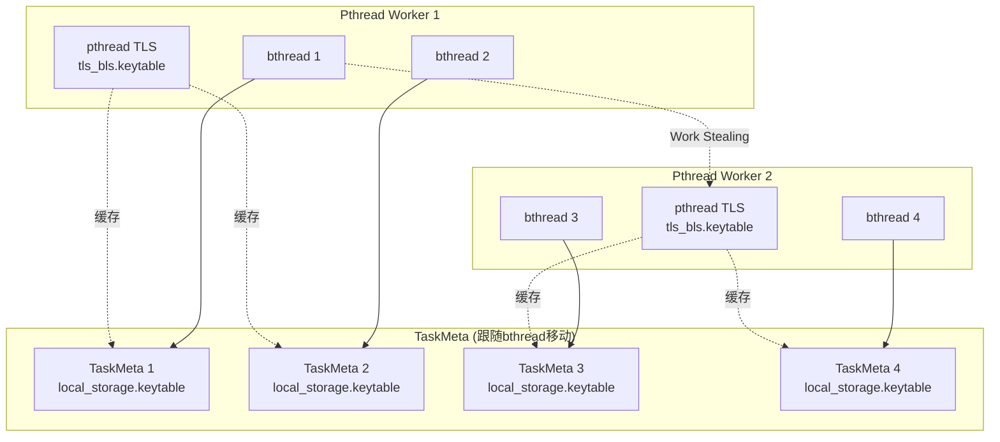

# 研究发现：bthread TLS机制与Work Stealing安全性

## 研究主题
分析brpc框架中bthread的TLS机制，理解在Work Stealing调度下如何保证TLS的安全性

## 发现记录

### 2026-04-02 初始调研

#### 核心问题
Work Stealing机制下，bthread可能被不同核心的pthread worker执行，如何保证TLS安全？

#### 待分析问题
1. Work Stealing机制的具体实现？
2. pthread TLS在Work Stealing下的风险？
3. bthread TLS如何解决这些问题？
4. TaskMeta中的local_storage如何工作？

## 代码路径追踪

### Work Stealing路径
```
TaskGroup::wait_task()
  -> steal_task()
    -> 从其他worker的队列偷取任务
```

### bthread TLS路径
```
bthread_key_create()
  -> 创建key和destructor
  
bthread_setspecific()
  -> 设置TaskMeta->local_storage.keytable
  
bthread_getspecific()
  -> 读取TaskMeta->local_storage.keytable
```

## 关键发现

### 1. Work Stealing机制实现

#### 1.1 Work Stealing代码路径
```cpp
// task_group.cpp:174
bool TaskGroup::wait_task(bthread_t* tid) {
    do {
        _pl->wait(_last_pl_state);  // 等待任务
        if (steal_task(tid)) {  // 尝试偷取任务
            return true;
        }
    } while (true);
}

// task_group.h:331
bool steal_task(bthread_t* tid) {
    if (_remote_rq.pop(tid)) {  // 先从远程队列偷取
        return true;
    }
    return _control->steal_task(tid, &_steal_seed, _steal_offset);  // 再从其他worker偷取
}
```

**关键点**：
- Work Stealing发生在pthread worker层面
- 空闲worker从其他忙碌worker的队列中偷取bthread
- **bthread本身不感知Work Stealing**，它只是被调度到不同的pthread worker上执行

### 2. pthread TLS的风险

#### 2.1 pthread TLS机制
```cpp
// 传统pthread TLS
__thread int tls_variable;  // 每个pthread有独立的副本
```

**风险场景**：
1. bthread在pthread A上创建，访问pthread A的TLS
2. bthread阻塞，被调度到pthread B
3. bthread继续执行，访问的TLS变成了pthread B的TLS
4. **数据错乱或崩溃**！

### 3. bthread TLS解决方案

#### 3.1 bthread TLS的核心设计

**关键数据结构**：
```cpp
// task_meta.h:37-40
struct LocalStorage {
    KeyTable* keytable;         // bthread级别的TLS
    void* assigned_data;
    void* rpcz_parent_span;
};

// task_meta.h:82
struct TaskMeta {
    // ...
    LocalStorage local_storage;  // 每个bthread有独立的LocalStorage
    // ...
};
```

**关键机制**：
1. **bthread TLS存储在TaskMeta中**，而不是pthread的TLS
2. **TaskMeta跟随bthread移动**，不受Work Stealing影响
3. **同步机制**：bthread切换时，同步TaskMeta->local_storage和pthread TLS缓存

#### 3.2 TLS同步机制

**关键代码**：
```cpp
// key.cpp:590-607
int bthread_setspecific(bthread_key_t key, void* data) {
    bthread::KeyTable* kt = bthread::tls_bls.keytable;  // pthread TLS缓存
    if (NULL == kt) {
        kt = new (std::nothrow) bthread::KeyTable;
        if (NULL == kt) {
            return ENOMEM;
        }
        bthread::tls_bls.keytable = kt;  // 设置pthread TLS缓存
        bthread::TaskGroup* const g = bthread::BAIDU_GET_VOLATILE_THREAD_LOCAL(tls_task_group);
        if (g) {
            g->current_task()->local_storage.keytable = kt;  // 同步到TaskMeta
        }
    }
    return kt->set_data(key, data);
}
```

**同步流程**：
1. **设置TLS**：
   - 创建或获取KeyTable
   - 设置pthread TLS缓存：`tls_bls.keytable = kt`
   - 同步到TaskMeta：`current_task()->local_storage.keytable = kt`

2. **获取TLS**：
   ```cpp
   // key.cpp:611-626
   void* bthread_getspecific(bthread_key_t key) {
       bthread::KeyTable* kt = bthread::tls_bls.keytable;  // 先从pthread TLS缓存读取
       if (kt) {
           return kt->get_data(key);
       }
       bthread::TaskGroup* const g = bthread::BAIDU_GET_VOLATILE_THREAD_LOCAL(tls_task_group);
       if (g) {
           bthread::TaskMeta* const task = g->current_task();
           kt = bthread::borrow_keytable(task->attr.keytable_pool);  // 从池中借用
           if (kt) {
               g->current_task()->local_storage.keytable = kt;  // 同步到TaskMeta
               bthread::tls_bls.keytable = kt;  // 同步到pthread TLS缓存
               return kt->get_data(key);
           }
       }
       return NULL;
   }
   ```

3. **bthread结束时清理**：
   ```cpp
   // task_group.cpp:473-484
   // Clean tls variables, must be done before changing version_butex
   LocalStorage* tls_bls_ptr = BAIDU_GET_PTR_VOLATILE_THREAD_LOCAL(tls_bls);
   KeyTable* kt = tls_bls_ptr->keytable;
   if (kt != NULL) {
       return_keytable(m->attr.keytable_pool, kt);  // 归还KeyTable
       tls_bls_ptr = BAIDU_GET_VOLATILE_THREAD_LOCAL(tls_bls);
       tls_bls_ptr->keytable = NULL;  // 清空pthread TLS缓存
       m->local_storage.keytable = NULL;  // 清空TaskMeta中的引用
   }
   ```

### 4. 双层TLS架构

#### 4.1 架构设计



#### 4.2 同步时机

| 时机 | 操作 | 说明 |
|------|------|------|
| **bthread创建** | 初始化TaskMeta->local_storage | 创建空的LocalStorage |
| **首次setspecific** | 创建KeyTable，同步到TaskMeta和pthread TLS | 双写保证一致性 |
| **bthread切换** | 从TaskMeta恢复到pthread TLS | 保证当前pthread能访问 |
| **bthread结束** | 清理KeyTable，清空pthread TLS和TaskMeta | 防止内存泄漏 |

### 5. KeyTable池化机制

#### 5.1 KeyTable池的作用

**问题**：频繁创建销毁KeyTable开销大

**解决方案**：KeyTable池化复用

```cpp
// key.cpp:288-323
KeyTable* borrow_keytable(bthread_keytable_pool_t* pool) {
    if (pool != NULL && (pool->list || pool->free_keytables)) {
        KeyTable* p;
        pthread_rwlock_rdlock(&pool->rwlock);
        auto list = (butil::ThreadLocal<bthread::KeyTableList>*)pool->list;
        if (list) {
            p = list->get()->remove_front();  // 从线程本地列表获取
            if (p) {
                pthread_rwlock_unlock(&pool->rwlock);
                return p;
            }
        }
        pthread_rwlock_unlock(&pool->rwlock);
        if (pool->free_keytables) {
            pthread_rwlock_wrlock(&pool->rwlock);
            p = (KeyTable*)pool->free_keytables;  // 从全局列表获取
            // ...
        }
    }
    return NULL;
}

void return_keytable(bthread_keytable_pool_t* pool, KeyTable* kt) {
    if (NULL == kt) {
        return;
    }
    if (pool == NULL) {
        delete kt;  // 没有池，直接删除
        return;
    }
    // 归还到池中
    pthread_rwlock_rdlock(&pool->rwlock);
    if (pool->destroyed) {
        pthread_rwlock_unlock(&pool->rwlock);
        delete kt;
        return;
    }
    auto list = (butil::ThreadLocal<bthread::KeyTableList>*)pool->list;
    list->get()->append(kt);  // 添加到线程本地列表
    // ...
}
```

**优势**：
- 减少KeyTable的创建销毁开销
- 线程本地列表减少锁竞争
- 全局列表实现跨线程复用

### 6. 原子操作和同步机制

#### 6.1 关键原子操作

| 操作 | 原子性保证 | 说明 |
|------|-----------|------|
| **KeyTable创建** | new操作 | 单线程创建，无需同步 |
| **TaskMeta->local_storage访问** | 单线程访问 | 同一时刻只有一个pthread访问 |
| **pthread TLS缓存** | __thread保证 | 每个pthread独立，无需同步 |
| **KeyTable池操作** | pthread_rwlock | 读写锁保护全局列表 |

#### 6.2 同步机制总结

1. **TaskMeta是bthread私有的**：
   - 同一时刻只有一个pthread worker访问TaskMeta
   - 不需要原子操作或锁

2. **pthread TLS缓存是pthread私有的**：
   - __thread保证线程安全
   - 不需要额外同步

3. **同步点**：
   - **setspecific时**：双写TaskMeta和pthread TLS
   - **getspecific时**：优先读pthread TLS，miss时从TaskMeta恢复
   - **bthread结束时**：清空两边的引用

### 7. 防止问题的完整机制

#### 7.1 问题场景分析

**场景1：bthread在pthread A创建，在pthread B执行**
```
1. bthread在pthread A创建，TaskMeta->local_storage初始化
2. bthread调用setspecific，创建KeyTable
3. pthread A的tls_bls.keytable = kt
4. TaskMeta->local_storage.keytable = kt
5. bthread被偷到pthread B
6. pthread B的tls_bls.keytable = NULL (初始值)
7. bthread调用getspecific
8. 发现tls_bls.keytable == NULL
9. 从TaskMeta->local_storage.keytable恢复
10. pthread B的tls_bls.keytable = kt
11. 成功访问TLS数据
```

**关键**：TaskMeta跟随bthread移动，TLS数据不丢失！

#### 7.2 防止机制总结

| 风险 | 防止机制 | 代码位置 |
|------|---------|---------|
| **TLS数据丢失** | TaskMeta存储TLS，跟随bthread移动 | task_meta.h:82 |
| **访问错误pthread TLS** | getspecific时从TaskMeta恢复 | key.cpp:611-626 |
| **内存泄漏** | bthread结束时清理KeyTable | task_group.cpp:473-484 |
| **性能开销** | pthread TLS缓存，KeyTable池化 | key.cpp:590-607, key.cpp:288-323 |
| **并发访问** | TaskMeta单线程访问，无需锁 | 设计保证 |
