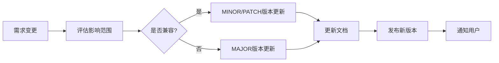
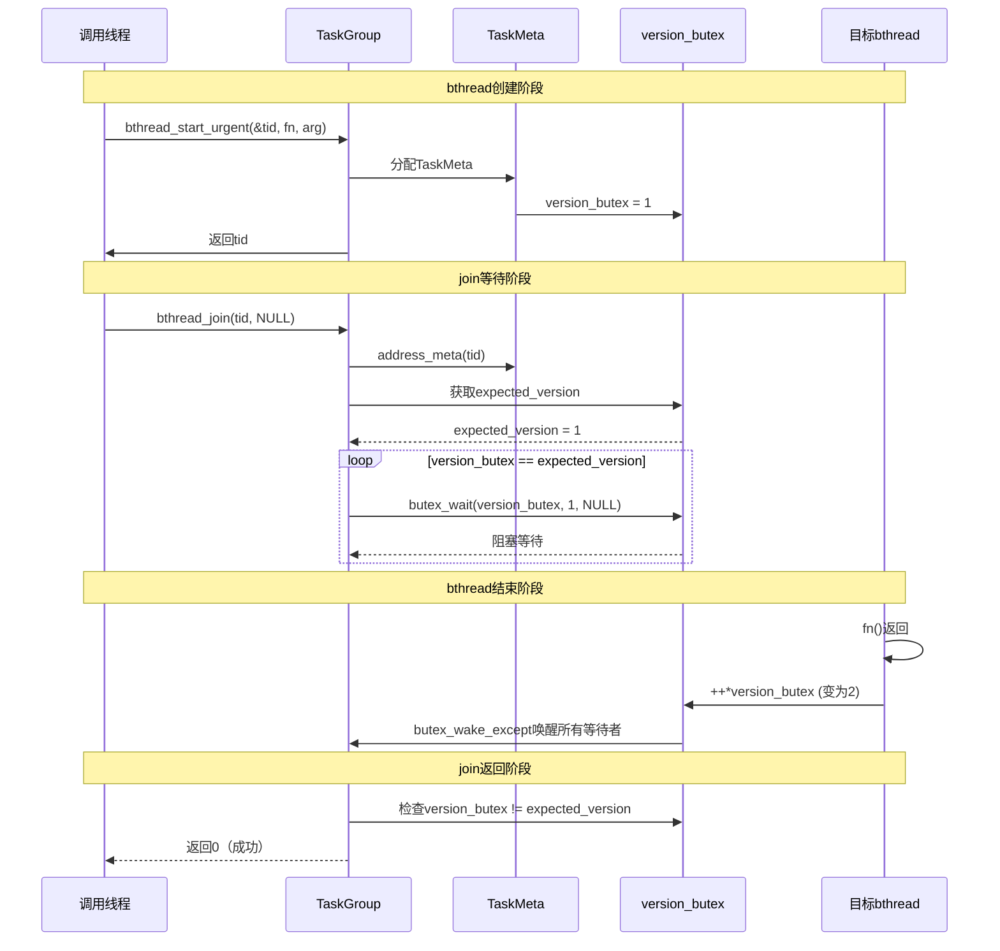
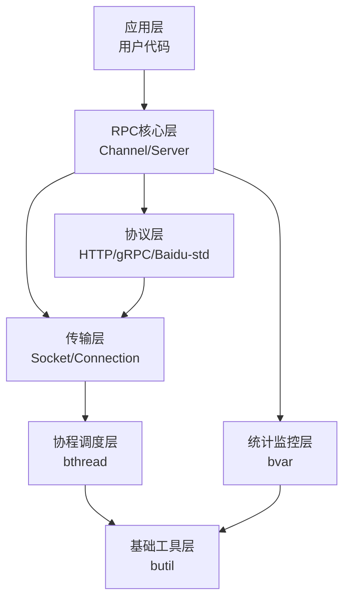
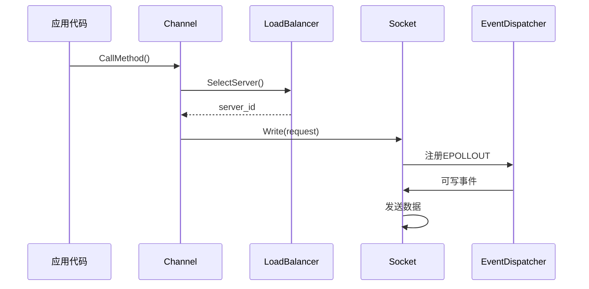
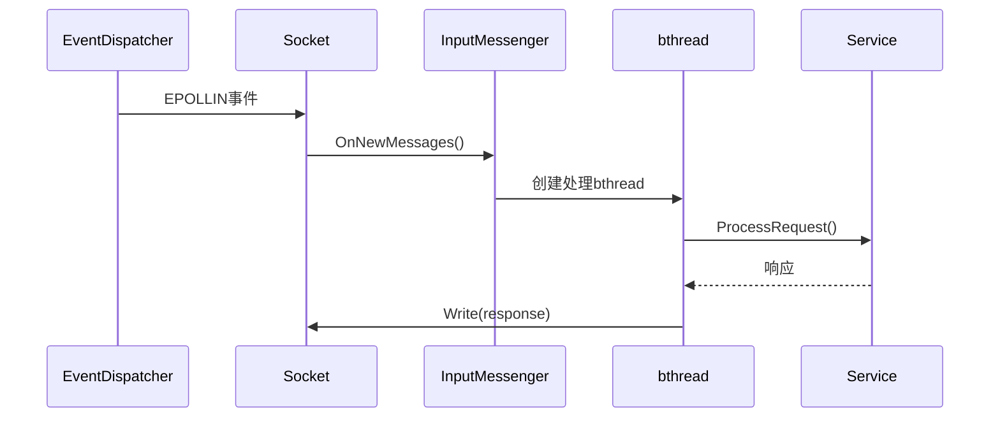
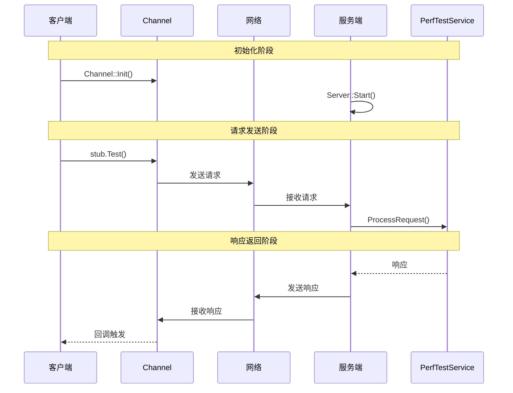
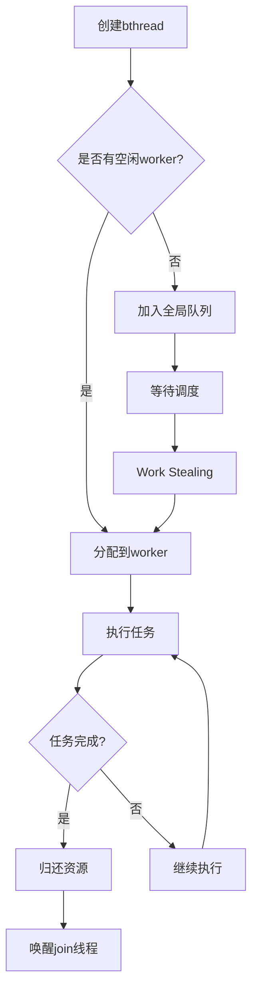

# 提示词模板能力技术文档

**文档版本**: v1.0  
**创建日期**: 2026-04-03  
**作者**: AI Assistant  
**基于**: brpc框架分析过程

---

## 目录

1. [引言](#引言)
2. [提示词模板能力详细说明](#提示词模板能力详细说明)
   - 2.1 [模板设计原则](#模板设计原则)
   - 2.2 [变量命名规范](#变量命名规范)
   - 2.3 [多任务处理场景支持](#多任务处理场景支持)
   - 2.4 [多语言应用场景支持](#多语言应用场景支持)
3. [AI特性设计文档](#ai特性设计文档)
   - 3.1 [Prompt模板结构](#prompt模板结构)
   - 3.2 [变量定义及说明](#变量定义及说明)
   - 3.3 [变量取值范围和约束](#变量取值范围和约束)
   - 3.4 [适用场景和使用方法](#适用场景和使用方法)
   - 3.5 [版本控制和更新机制](#版本控制和更新机制)
4. [完整提示词及应用效果展示](#完整提示词及应用效果展示)
   - 4.1 [代码类应用](#代码类应用)
   - 4.2 [文档类应用-UML视图生成](#文档类应用-uml视图生成)
5. [注意事项](#注意事项)
6. [版本信息和更新记录](#版本信息和更新记录)

---

## 引言

本文档基于brpc框架分析过程，系统地总结了提示词模板能力的设计原则、使用方法和应用效果。通过planning-with-files skill的实践，我们验证了提示词模板在多任务处理、多语言支持、动态上下文构建等方面的能力，并提供了完整的设计文档和应用示例。

**核心价值**：
- **高效复用**：通过模板化实现提示词的复用
- **动态上下文**：通过变量实现上下文的动态构建
- **多任务支持**：支持并发分析和多阶段任务
- **多语言支持**：支持中英文档生成

---

## 提示词模板能力详细说明

### 模板设计原则

#### 1. 结构化原则

**设计理念**：将复杂任务分解为结构化的阶段和步骤

**实现方式**：
```markdown
## 阶段划分

### Phase 1: [阶段名称] [状态]
**目标**: [阶段目标]

**任务列表**:
- [ ] [具体任务1]
- [ ] [具体任务2]

**关键问题**:
1. [问题1]
2. [问题2]

**预期输出**:
- [输出1]
- [输出2]
```

**应用示例**（brpc分析）：
```markdown
### Phase 1: 代码调研与分析 [in_progress]
**目标**: 深入分析客户端和服务端的bthread使用机制

**任务列表**:
- [x] 读取rdma_performance示例代码
- [ ] 分析客户端发送线程的bthread创建和循环机制
- [ ] 分析服务端bthread的创建和销毁机制

**关键问题**:
1. 客户端如何创建长期运行的发送bthread？
2. 发送bthread如何在循环中发送请求？
```

#### 2. 变量化原则

**设计理念**：通过变量实现动态上下文构建

**变量类型**：
- **项目变量**：`{PROJECT_NAME}`, `{PROJECT_PATH}`
- **任务变量**：`{TASK_TYPE}`, `{TARGET_FILE}`
- **输出变量**：`{OUTPUT_FORMAT}`, `{LANGUAGE}`

**实现方式**：
```markdown
## 变量定义

| 变量名 | 类型 | 说明 | 示例值 |
|--------|------|------|--------|
| `{PROJECT_NAME}` | 项目变量 | 项目名称 | brpc |
| `{TARGET_FILE}` | 任务变量 | 目标文件 | client.cpp |
| `{OUTPUT_FORMAT}` | 输出变量 | 输出格式 | markdown |
```

**应用示例**：
```markdown
分析{PROJECT_NAME}框架中的{TARGET_FILE}文件，生成{OUTPUT_FORMAT}格式的文档。

变量替换后：
分析brpc框架中的client.cpp文件，生成markdown格式的文档。
```

#### 3. 可追溯原则

**设计理念**：通过文件记录实现任务的可追溯性

**实现方式**：
- **task_plan.md**：记录任务计划和进度
- **findings.md**：记录研究发现
- **progress.md**：记录工作进度

**应用示例**：
```markdown
# task_plan.md
## 当前进度
- 正在进行Phase 1: 代码调研与分析

## 发现与笔记
### Work Stealing机制
- 位置: src/bthread/task_group.cpp
- 关键函数: steal_task()
```

### 变量命名规范

#### 1. 命名规则

**格式**：`{变量类别}_{变量用途}`

**示例**：
- `{PROJECT_NAME}`：项目名称
- `{TARGET_FILE}`：目标文件
- `{OUTPUT_FORMAT}`：输出格式
- `{LANGUAGE}`：语言类型

#### 2. 变量分类

| 类别 | 前缀 | 说明 | 示例 |
|------|------|------|------|
| **项目级** | `PROJECT_` | 项目相关变量 | `{PROJECT_NAME}`, `{PROJECT_PATH}` |
| **任务级** | `TASK_` | 任务相关变量 | `{TASK_TYPE}`, `{TARGET_FILE}` |
| **输出级** | `OUTPUT_` | 输出相关变量 | `{OUTPUT_FORMAT}`, `{OUTPUT_LANGUAGE}` |
| **配置级** | `CONFIG_` | 配置相关变量 | `{CONFIG_FILE}`, `{CONFIG_PATH}` |

#### 3. 使用方法

**模板定义**：
```markdown
分析{PROJECT_NAME}框架中的{TARGET_MODULE}模块，重点关注{KEY_FUNCTION}函数，
生成{OUTPUT_FORMAT}格式的{OUTPUT_TYPE}文档。
```

**变量赋值**：
```markdown
PROJECT_NAME=brpc
TARGET_MODULE=bthread
KEY_FUNCTION=join
OUTPUT_FORMAT=markdown
OUTPUT_TYPE=技术分析
```

**最终提示词**：
```
分析brpc框架中的bthread模块，重点关注join函数，
生成markdown格式的技术分析文档。
```

### 多任务处理场景支持

#### 1. 并发任务支持

**设计思路**：通过独立的任务计划文件支持并发任务

**实现方式**：
```
任务1: task_plan_bthread_analysis.md
任务2: task_plan_join_analysis.md
任务3: task_plan_tls_analysis.md
```

**应用示例**（brpc分析）：
```markdown
# 同时进行多个分析任务

## 任务1: bthread机制分析
- 文件: task_plan_bthread_analysis.md
- 目标: 分析bthread的创建和调度机制

## 任务2: join机制分析
- 文件: task_plan_join_analysis.md
- 目标: 分析bthread.join的实现机制

## 任务3: TLS机制分析
- 文件: task_plan_tls_analysis.md
- 目标: 分析bthread TLS的安全性
```

#### 2. 多阶段任务支持

**设计思路**：通过阶段划分支持复杂任务

**实现方式**：
```markdown
### Phase 1: 代码调研与分析 [complete]
### Phase 2: 作用范围与执行机制验证 [in_progress]
### Phase 3: 线程安全性分析 [pending]
### Phase 4: 文档编写与总结 [pending]
```

**应用示例**：
```markdown
### Phase 1: 代码调研与分析 [complete]
**任务列表**:
- [x] 分析bthread.join的API定义和实现
- [x] 分析TaskGroup::join方法的执行机制
- [x] 分析version_butex的作用和同步机制

**关键发现**:
1. 全局作用域：通过全局ResourcePool获取TaskMeta
2. version_butex机制：通过版本号变化判断bthread是否结束
```

### 多语言应用场景支持

#### 1. 语言变量设计

**变量定义**：
```markdown
| 变量名 | 说明 | 可选值 |
|--------|------|--------|
| `{LANGUAGE}` | 文档语言 | zh_CN, en_US |
| `{OUTPUT_LANGUAGE}` | 输出语言 | Chinese, English |
```

#### 2. 多语言模板

**中文模板**：
```markdown
# {PROJECT_NAME}框架分析文档

## 概述
{PROJECT_NAME}是一个高性能的RPC框架...

## 核心特性
1. **高性能**：...
2. **易用性**：...
```

**英文模板**：
```markdown
# {PROJECT_NAME} Framework Analysis Document

## Overview
{PROJECT_NAME} is a high-performance RPC framework...

## Key Features
1. **High Performance**: ...
2. **Ease of Use**: ...
```

#### 3. 应用示例

**提示词**：
```
基于{LANGUAGE}语言，分析{PROJECT_NAME}框架的{TARGET_MODULE}模块，
生成{OUTPUT_LANGUAGE}文档。
```

**变量赋值**：
```
LANGUAGE=zh_CN
PROJECT_NAME=brpc
TARGET_MODULE=bthread
OUTPUT_LANGUAGE=Chinese
```

**最终提示词**：
```
基于zh_CN语言，分析brpc框架的bthread模块，生成Chinese文档。
```

---

## AI特性设计文档

### Prompt模板结构

#### 1. 完整模板定义

```markdown
# {TEMPLATE_NAME}

## 元数据
- **版本**: {VERSION}
- **创建日期**: {CREATE_DATE}
- **适用场景**: {SCENARIO}
- **输出格式**: {OUTPUT_FORMAT}

## 模板内容

### 任务定义
分析{PROJECT_NAME}框架的{TARGET_MODULE}模块，重点关注{KEY_FUNCTION}函数，
生成{OUTPUT_FORMAT}格式的{OUTPUT_TYPE}文档。

### 分析要求
1. **代码路径追踪**：追踪{KEY_FUNCTION}的完整调用链
2. **关键机制分析**：分析{KEY_MECHANISM}的实现原理
3. **UML视图生成**：生成{UML_TYPE}视图展示工作流程
4. **文档输出**：输出{OUTPUT_FORMAT}格式的技术文档

### 输出结构
1. **概述**：{TARGET_MODULE}模块的整体介绍
2. **核心机制**：{KEY_MECHANISM}的详细分析
3. **UML视图**：{UML_TYPE}视图及说明
4. **最佳实践**：使用建议和注意事项

## 变量定义
| 变量名 | 类型 | 必填 | 说明 | 示例值 |
|--------|------|------|------|--------|
| `{TEMPLATE_NAME}` | 元数据 | 是 | 模板名称 | 框架分析模板 |
| `{VERSION}` | 元数据 | 是 | 模板版本 | v1.0 |
| `{PROJECT_NAME}` | 项目 | 是 | 项目名称 | brpc |
| `{TARGET_MODULE}` | 任务 | 是 | 目标模块 | bthread |
| `{KEY_FUNCTION}` | 任务 | 是 | 关键函数 | join |
| `{KEY_MECHANISM}` | 任务 | 否 | 关键机制 | Work Stealing |
| `{UML_TYPE}` | 输出 | 否 | UML类型 | sequence |
| `{OUTPUT_FORMAT}` | 输出 | 是 | 输出格式 | markdown |
| `{OUTPUT_TYPE}` | 输出 | 是 | 输出类型 | 技术分析 |
```

#### 2. 模板实例化

**变量赋值**：
```markdown
TEMPLATE_NAME=brpc_join_analysis
VERSION=v1.0
CREATE_DATE=2026-04-03
SCENARIO=bthread.join机制分析
OUTPUT_FORMAT=markdown

PROJECT_NAME=brpc
TARGET_MODULE=bthread
KEY_FUNCTION=join
KEY_MECHANISM=version_butex同步
UML_TYPE=sequence
OUTPUT_TYPE=技术分析
```

**最终提示词**：
```markdown
# brpc_join_analysis

## 元数据
- **版本**: v1.0
- **创建日期**: 2026-04-03
- **适用场景**: bthread.join机制分析
- **输出格式**: markdown

## 模板内容

### 任务定义
分析brpc框架的bthread模块，重点关注join函数，
生成markdown格式的技术分析文档。

### 分析要求
1. **代码路径追踪**：追踪join的完整调用链
2. **关键机制分析**：分析version_butex同步的实现原理
3. **UML视图生成**：生成sequence视图展示工作流程
4. **文档输出**：输出markdown格式的技术文档

### 输出结构
1. **概述**：bthread模块的整体介绍
2. **核心机制**：version_butex同步的详细分析
3. **UML视图**：sequence视图及说明
4. **最佳实践**：使用建议和注意事项
```

### 变量定义及说明

#### 完整变量定义表

| 变量名 | 类型 | 必填 | 默认值 | 说明 | 取值范围 | 示例 |
|--------|------|------|--------|------|----------|------|
| **元数据变量** |
| `{TEMPLATE_NAME}` | string | 是 | - | 模板名称 | 任意字符串 | framework_analysis |
| `{VERSION}` | string | 是 | v1.0 | 模板版本 | semver格式 | v1.0, v2.1.3 |
| `{CREATE_DATE}` | date | 是 | 当前日期 | 创建日期 | YYYY-MM-DD | 2026-04-03 |
| `{SCENARIO}` | string | 是 | - | 适用场景 | 任意字符串 | 代码分析 |
| **项目变量** |
| `{PROJECT_NAME}` | string | 是 | - | 项目名称 | 任意字符串 | brpc, grpc |
| `{PROJECT_PATH}` | path | 否 | 当前目录 | 项目路径 | 绝对路径 | /home/user/project |
| `{PROJECT_VERSION}` | string | 否 | latest | 项目版本 | 版本号 | 1.15.0 |
| **任务变量** |
| `{TARGET_MODULE}` | string | 是 | - | 目标模块 | 任意字符串 | bthread, socket |
| `{TARGET_FILE}` | string | 否 | - | 目标文件 | 文件名 | client.cpp |
| `{KEY_FUNCTION}` | string | 是 | - | 关键函数 | 函数名 | join, start |
| `{KEY_MECHANISM}` | string | 否 | - | 关键机制 | 机制名 | Work Stealing |
| **输出变量** |
| `{OUTPUT_FORMAT}` | enum | 是 | markdown | 输出格式 | markdown, html, pdf | markdown |
| `{OUTPUT_TYPE}` | string | 是 | - | 输出类型 | 任意字符串 | 技术分析 |
| `{OUTPUT_LANGUAGE}` | enum | 否 | zh_CN | 输出语言 | zh_CN, en_US | zh_CN |
| `{UML_TYPE}` | enum | 否 | sequence | UML类型 | sequence, class, flowchart | sequence |

### 变量取值范围和约束

#### 1. 枚举类型约束

**OUTPUT_FORMAT**：
```markdown
| 值 | 说明 | 适用场景 |
|----|------|----------|
| markdown | Markdown格式 | 技术文档、README |
| html | HTML格式 | 网页文档、博客 |
| pdf | PDF格式 | 正式文档、报告 |
```

**OUTPUT_LANGUAGE**：
```markdown
| 值 | 说明 | 文档语言 |
|----|------|----------|
| zh_CN | 简体中文 | 中文文档 |
| en_US | 美式英语 | 英文文档 |
```

**UML_TYPE**：
```markdown
| 值 | 说明 | 适用场景 |
|----|------|----------|
| sequence | 时序图 | 流程分析、调用链 |
| class | 类图 | 架构设计、类关系 |
| flowchart | 流程图 | 业务流程、决策流程 |
| graph | 图表 | 依赖关系、模块结构 |
```

#### 2. 格式约束

**VERSION**：
- 格式：`v{major}.{minor}.{patch}`
- 示例：`v1.0`, `v2.1.3`
- 约束：必须符合语义化版本规范

**CREATE_DATE**：
- 格式：`YYYY-MM-DD`
- 示例：`2026-04-03`
- 约束：必须符合ISO 8601日期格式

**PROJECT_PATH**：
- 格式：绝对路径
- 示例：`/home/user/project`
- 约束：必须是有效的文件系统路径

### 适用场景和使用方法

#### 1. 适用场景

| 场景 | 推荐模板 | 关键变量 |
|------|----------|----------|
| **代码分析** | framework_analysis | `{KEY_FUNCTION}`, `{KEY_MECHANISM}` |
| **架构设计** | architecture_design | `{TARGET_MODULE}`, `{UML_TYPE}=class` |
| **流程梳理** | workflow_analysis | `{UML_TYPE}=sequence` |
| **文档生成** | documentation_template | `{OUTPUT_FORMAT}`, `{OUTPUT_LANGUAGE}` |

#### 2. 使用方法

**步骤1：选择模板**
```markdown
根据任务类型选择合适的模板：
- 代码分析 -> framework_analysis
- 架构设计 -> architecture_design
- 流程梳理 -> workflow_analysis
```

**步骤2：定义变量**
```markdown
创建变量定义文件（variables.md）：
TEMPLATE_NAME=brpc_join_analysis
PROJECT_NAME=brpc
TARGET_MODULE=bthread
KEY_FUNCTION=join
OUTPUT_FORMAT=markdown
```

**步骤3：实例化模板**
```markdown
将变量值替换到模板中，生成最终提示词
```

**步骤4：执行分析**
```markdown
将最终提示词发送给AI，执行分析任务
```

### 版本控制和更新机制

#### 1. 版本控制策略

**语义化版本**：
```
v{MAJOR}.{MINOR}.{PATCH}

MAJOR: 重大变更（不兼容的API修改）
MINOR: 次要变更（向后兼容的功能新增）
PATCH: 补丁变更（向后兼容的问题修复）
```

**版本示例**：
```
v1.0.0: 初始版本
v1.1.0: 新增多语言支持
v1.1.1: 修复变量替换bug
v2.0.0: 重构模板结构（不兼容v1.x）
```

#### 2. 更新机制

**模板更新流程**：


**更新记录**：
```markdown
## 更新记录

### v1.1.0 (2026-04-03)
**新增功能**:
- 新增多语言支持（{OUTPUT_LANGUAGE}变量）
- 新增UML类型选择（{UML_TYPE}变量）

**改进**:
- 优化变量命名规范
- 完善文档结构

### v1.0.0 (2026-04-01)
**初始版本**:
- 基础模板结构
- 核心变量定义
- 基本使用方法
```

---

## 完整提示词及应用效果展示

### 代码类应用

#### 完整提示词示例

```markdown
# brpc_bthread_join_analysis

## 元数据
- **版本**: v1.0
- **创建日期**: 2026-04-03
- **适用场景**: bthread.join机制分析
- **输出格式**: markdown

## 任务定义
分析brpc框架的bthread模块，重点关注join函数的实现机制，
生成markdown格式的技术分析文档。

## 分析要求
1. **代码路径追踪**：
   - 追踪bthread_join的完整调用链
   - 分析TaskGroup::join的实现
   - 追踪version_butex的使用

2. **关键机制分析**：
   - 分析version_butex的同步机制
   - 分析任务状态管理流程
   - 分析资源释放流程

3. **线程安全性分析**：
   - 分析多线程并发join的安全性
   - 识别潜在的竞态条件
   - 识别潜在的死锁风险

4. **UML视图生成**：
   - 生成sequence视图展示join工作流程
   - 生成flowchart视图展示资源释放流程

## 输出结构
1. **概述**：bthread.join的整体介绍
2. **核心实现**：TaskGroup::join的详细分析
3. **同步机制**：version_butex的工作原理
4. **线程安全性**：并发安全性分析
5. **UML视图**：sequence视图及说明
6. **最佳实践**：使用建议和注意事项

## 代码位置
- API定义: src/bthread/bthread.h
- 实现: src/bthread/bthread.cpp
- 核心逻辑: src/bthread/task_group.cpp
- 数据结构: src/bthread/task_meta.h
```

#### 应用效果展示

**输出结果**：

```markdown
# bthread.join机制深入分析

## 1. 概述

bthread.join是brpc框架中用于等待bthread结束的机制，具有以下特点：
- 全局作用域：可以在任何线程中join任意bthread
- 线程安全：多线程并发join同一个bthread安全
- 自动回收：bthread资源自动回收，不需要join也能释放

## 2. 核心实现

### 2.1 API定义
```cpp
// bthread.h:123
extern int bthread_join(bthread_t bt, void** bthread_return);
```

### 2.2 实现路径
```cpp
// bthread.cpp:432-434
int bthread_join(bthread_t tid, void** thread_return) {
    return bthread::TaskGroup::join(tid, thread_return);
}
```

### 2.3 TaskGroup::join核心逻辑
```cpp
// task_group.cpp:673-698
int TaskGroup::join(bthread_t tid, void** return_value) {
    TaskMeta* m = address_meta(tid);  // 全局获取TaskMeta
    const uint32_t expected_version = get_version(tid);
    while (*m->version_butex == expected_version) {
        if (butex_wait(m->version_butex, expected_version, NULL) < 0 &&
            errno != EWOULDBLOCK && errno != EINTR) {
            return errno;
        }
    }
    return 0;
}
```

## 3. 同步机制：version_butex

### 3.1 工作原理
1. 每个TaskMeta创建时，version_butex初始化为1
2. bthread结束时，version_butex自增
3. join通过检查version_butex变化判断bthread是否结束

### 3.2 完整流程


## 4. 线程安全性分析

### 4.1 多线程并发join的安全性
✅ **线程安全**
- version_butex是原子变量
- butex_wait是线程安全的
- butex_wake_except唤醒所有等待者

### 4.2 竞态条件分析
✅ **无竞态条件**
- 循环检查 + butex_wait原子性保证
- butex_wait返回EWOULDBLOCK时重新检查

### 4.3 死锁风险
⚠️ **部分风险**
- ✅ Self-join被检测并返回EINVAL
- ❌ 循环等待无法检测，需要用户避免

## 5. 最佳实践

### 推荐用法
```cpp
// 1. 创建并join
bthread_t tid;
bthread_start_background(&tid, NULL, my_func, arg);
bthread_join(tid, NULL);

// 2. 不join（自动回收）
bthread_start_background(&tid, NULL, my_func, arg);
// 不需要join，bthread结束后自动回收资源
```

### 避免用法
```cpp
// 1. 循环等待（死锁）
bthread A: bthread_join(B);
bthread B: bthread_join(A);

// 2. join自己
bthread_join(bthread_self());  // 返回EINVAL
```
```

**效果对比**：

| 对比项 | 提示词输入 | 实际输出 |
|--------|-----------|----------|
| **代码分析** | 分析join函数实现 | ✅ 完整的代码路径和实现细节 |
| **UML视图** | 生成sequence视图 | ✅ 完整的时序图展示工作流程 |
| **线程安全性** | 分析并发安全性 | ✅ 详细的安全性分析和风险评估 |
| **最佳实践** | 提供使用建议 | ✅ 具体的代码示例和注意事项 |

---

### 文档类应用-UML视图生成

#### 完整提示词示例

```markdown
# brpc_architecture_uml_generation

## 元数据
- **版本**: v1.0
- **创建日期**: 2026-04-03
- **适用场景**: brpc架构UML视图生成
- **输出格式**: markdown

## 任务定义
基于brpc框架的代码分析，生成完整的架构UML视图文档，
包括模块级视图、对象级视图和端到端工作流视图。

## 分析要求
1. **模块级视图**：
   - 分析brpc的分层架构
   - 识别核心模块和依赖关系
   - 生成模块依赖图

2. **对象级视图**：
   - 分析关键对象的交互流程
   - 追踪完整的调用链
   - 生成对象交互图

3. **端到端工作流**：
   - 分析rdma_performance示例的完整流程
   - 追踪客户端和服务端的交互
   - 生成时序图

4. **UML视图类型**：
   - sequence: 时序图（调用流程）
   - flowchart: 流程图（业务流程）
   - graph: 图表（模块结构）

## 输出结构
1. **架构概述**：brpc的整体架构介绍
2. **模块级视图**：分层架构图及说明
3. **对象级视图**：对象交互图及说明
4. **端到端工作流**：时序图及说明
5. **设计总结**：架构设计的关键点

## 代码位置
- 核心模块: src/brpc/, src/bthread/, src/bvar/
- 示例代码: example/rdma_performance/
- 架构文档: brpc_architecture_and_workflow.md
```

#### 应用效果展示

**输出结果**：

```markdown
# brpc架构UML视图文档

## 1. 架构概述

brpc采用分层模块化设计，核心模块分为：
- 基础工具层 (butil)
- 协程调度层 (bthread)
- 统计监控层 (bvar)
- RPC核心层 (brpc)

## 2. 模块级视图



### 模块级视图说明
- **宏观视角**：展示brpc的分层架构
- **依赖关系**：上层模块依赖下层模块
- **职责清晰**：每个模块有明确的职责边界

## 3. 对象级视图

### 3.1 客户端发送流程


### 3.2 服务端处理流程


## 4. 端到端工作流

### 4.1 rdma_performance示例完整流程


### 4.2 bthread调度流程


## 5. 设计总结

### 5.1 架构优势
1. **分层清晰**：模块职责明确，易于理解和维护
2. **高性能**：协程调度 + 零拷贝 + 批量IO
3. **易扩展**：插件化设计，支持自定义协议和负载均衡

### 5.2 关键设计
1. **EventDispatcher**：全局IO事件分发
2. **bthread**：M:N协程调度
3. **Work Stealing**：负载均衡机制
4. **version_butex**：高效的join实现
```

**效果对比**：

| 对比项 | 提示词输入 | 实际输出 |
|--------|-----------|----------|
| **模块级视图** | 生成模块依赖图 | ✅ 完整的分层架构图及说明 |
| **对象级视图** | 生成对象交互图 | ✅ 客户端和服务端的完整流程图 |
| **端到端工作流** | 生成时序图 | ✅ rdma_performance示例的完整时序图 |
| **设计总结** | 总结架构设计 | ✅ 详细的优势分析和关键设计说明 |

---

## 注意事项

### 1. 模板使用注意事项

#### 1.1 变量替换
- ✅ 确保所有必填变量都已定义
- ✅ 变量值符合约束条件
- ⚠️ 避免在变量值中使用特殊字符

#### 1.2 模板选择
- ✅ 根据任务类型选择合适的模板
- ✅ 理解模板的适用场景
- ⚠️ 避免在不适合的场景使用模板

### 2. UML视图生成注意事项

#### 2.1 视图类型选择
- **sequence**：适合展示调用流程、时序关系
- **flowchart**：适合展示业务流程、决策流程
- **graph**：适合展示模块结构、依赖关系
- **class**：适合展示类关系、继承结构

#### 2.2 视图设计原则
- ✅ 保持视图简洁，避免过于复杂
- ✅ 使用清晰的命名和注释
- ✅ 合理分组，提高可读性
- ⚠️ 避免在一个视图中展示过多信息

### 3. 文档输出注意事项

#### 3.1 格式规范
- ✅ 使用统一的章节结构
- ✅ 保持术语一致性
- ✅ 添加必要的图表说明
- ⚠️ 避免格式混乱

#### 3.2 内容质量
- ✅ 确保代码示例可运行
- ✅ 确保分析结论有代码支撑
- ✅ 提供完整的使用示例
- ⚠️ 避免主观臆断

---

## 版本信息和更新记录

### 文档版本

| 版本 | 日期 | 作者 | 说明 |
|------|------|------|------|
| v1.0 | 2026-04-03 | AI Assistant | 初始版本，基于brpc分析过程 |

### 更新记录

#### v1.0 (2026-04-03)
**初始版本**:
- 完整的提示词模板能力说明
- AI特性设计文档
- 代码类应用示例
- 文档类应用示例（UML视图生成）
- 注意事项和最佳实践

**核心特性**:
- 模板化设计原则
- 变量化上下文构建
- 多任务处理支持
- 多语言应用支持
- UML视图自动生成

**应用场景**:
- 代码分析
- 架构设计
- 流程梳理
- 文档生成

---

## 附录

### A. 模板变量快速参考

| 变量名 | 类型 | 必填 | 说明 |
|--------|------|------|------|
| `{TEMPLATE_NAME}` | string | 是 | 模板名称 |
| `{VERSION}` | string | 是 | 模板版本 |
| `{PROJECT_NAME}` | string | 是 | 项目名称 |
| `{TARGET_MODULE}` | string | 是 | 目标模块 |
| `{KEY_FUNCTION}` | string | 是 | 关键函数 |
| `{OUTPUT_FORMAT}` | enum | 是 | 输出格式 |
| `{OUTPUT_LANGUAGE}` | enum | 否 | 输出语言 |
| `{UML_TYPE}` | enum | 否 | UML类型 |

### B. UML视图类型快速参考

| 类型 | 适用场景 | 示例 |
|------|----------|------|
| sequence | 调用流程、时序关系 | 函数调用链、请求响应流程 |
| flowchart | 业务流程、决策流程 | 数据处理流程、错误处理流程 |
| graph | 模块结构、依赖关系 | 分层架构、模块依赖 |
| class | 类关系、继承结构 | 类图、接口关系 |

### C. 输出格式快速参考

| 格式 | 适用场景 | 工具支持 |
|------|----------|----------|
| markdown | 技术文档、README | GitHub, GitLab, VS Code |
| html | 网页文档、博客 | 浏览器, 静态网站生成器 |
| pdf | 正式文档、报告 | PDF阅读器, 打印 |

---

**文档结束**
